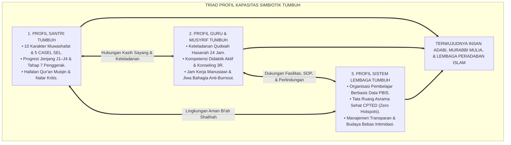
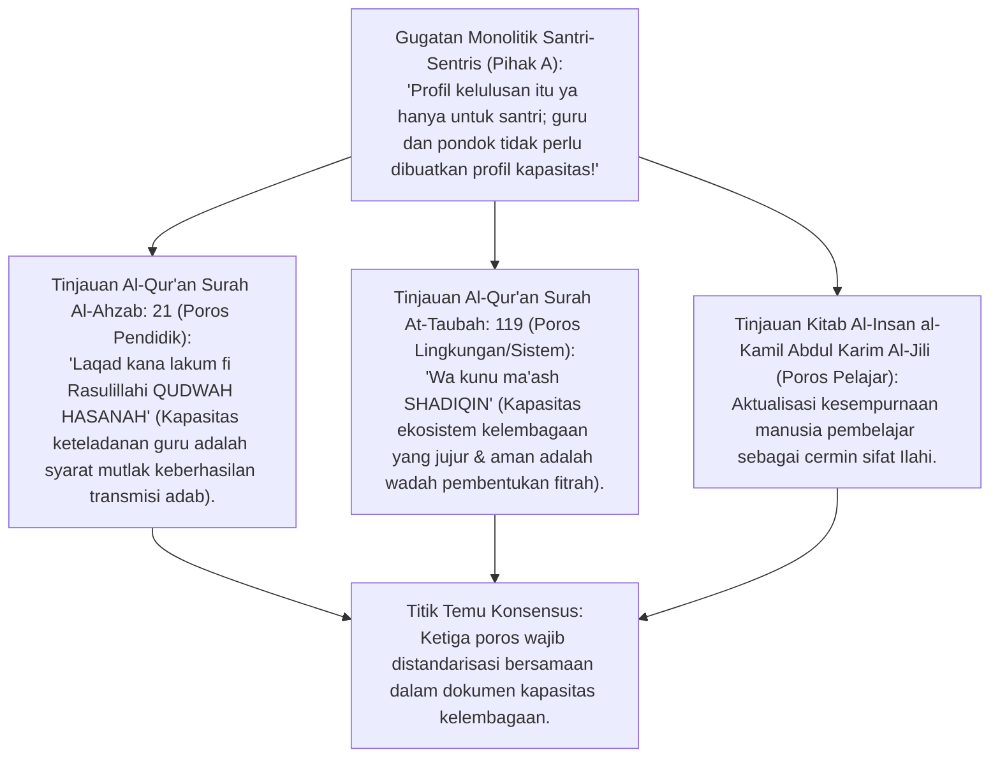
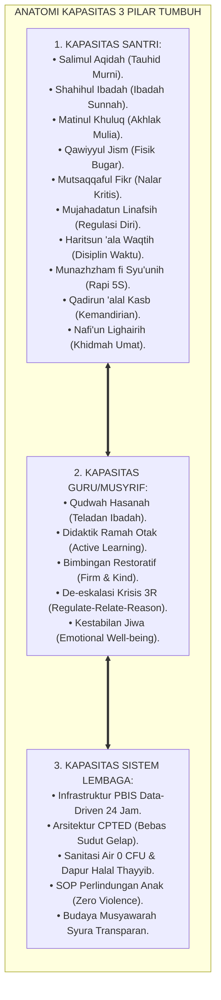
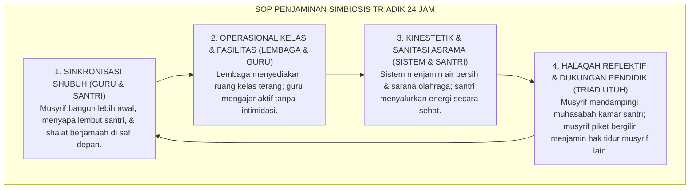
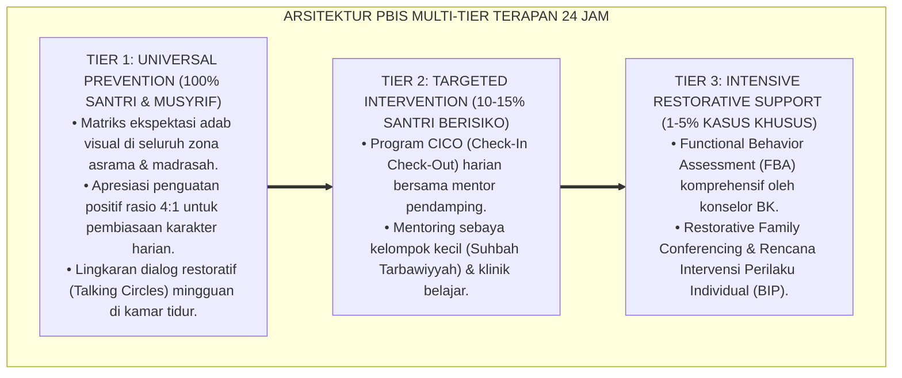

# P3-01-01: TRIAD PROFIL KAPASITAS EKOSISTEM TUMBUH
## *Monograf Terpadu: Penyelarasan Epistemologis Triad Pertumbuhan Simbiotik (Santri Tumbuh, Guru/Musyrif Tumbuh, dan Sistem Lembaga Tumbuh), Integrasi Konsep Insan Kamil Al-Jili, Qudwah Hasanah, Bi'ah Shalihah, serta Relational Capacity Framework*

**Nomor Identifikasi**: `P3-01-01/MONOGRAF-TERPADU-TRIAD-PROFIL-KAPASITAS/2026`  
**Domain**: `03 Capacity Framework` > `01 Graduate Profile`  
**Klasifikasi Naskah**: *Comprehensive Integrated Monograph* (Monograf Akademis & Standar Baku Kapasitas Triadik)  
**Rumpun Disiplin Pengkaji**: Filsafat Kapasitas Insani (*Human Capacity in Islamic Education*), Teologi Perkembangan Simbiotik, Sosiologi Organisasi Pendidikan Islam, Whole-School Ecosystem & Relational Capacity Framework  

---

> ### 💡 INTISARI PRAKTIS (3 MENIT PAHAM UNTUK ASATIDZ & MUSYRIF)
>
> * **Kapasitas Kelulusan Tidak Boleh Hanya Membebani Santri Sendirian:**  
>   Kekeliruan terbesar pesantren konvensional adalah menuntut santri menjadi "malaikat berakhlak mulia", sementara guru/musyrif dibiarkan kelelahan (*burnout*) tanpa kompetensi bimbingan yang memadai, dan sistem lembaga berjalan tanpa SOP yang jelas (*chaotic*).
> * **Maha-Prinsip Triad Pertumbuhan Simbiotik (*Symbiotic Triad Growth*):**  
>   Ekosistem TUMBUH menetapkan standar kapasitas bagi tiga entitas yang saling menopang secara mutlak:  
>   1. **Profil Santri Tumbuh:** Menguasai 10 Karakter Muwashafat & 5 CASEL SEL, mandiri beribadah (Jenjang J1–J4), dan memiliki hafalan Al-Qur'an mutqin.  
>   2. **Profil Guru & Musyrif Tumbuh:** Memancarkan keteladanan *Qudwah Hasanah*, terampil berkomunikasi restoratif (*Firm & Kind*), dan bekerja dalam sistem kerja sehat anti-burnout.  
>   3. **Profil Sistem Lembaga Tumbuh:** Menjadi organisasi pembelajar (*Learning Organization*) berbasis data PBIS, menjamin keamanan asrama (*Zero Violence*), dan tata ruang sehat CPTED.
> * **Kunci Keberhasilan:**  
>   Santri hanya dapat bertumbuh optimal jika diasuh oleh pendidik yang jiwanya bahagia dan dilindungi oleh sistem lembaga yang profesional.

---

## 📑 DAFTAR ISI MONOGRAF

- [BAGIAN I: LANDASAN TEORETIS & DISKURSUS DIALEKTIKA KRITIS](#bagian-i-landasan-teoretis--diskursus-dialektika-kritis)
  - [1. Kerangka Metodologi Triad Pertumbuhan Simbiotik: Mengapa Profil Kapasitas Wajib Triadik](#1-kerangka-metodologi-triad-pertumbuhan-simbiotik-mengapa-profil-kapasitas-wajib-triadik)
  - [2. Eksegesis Turats Triad Pendidikan — Insan Kamil, Qudwah Hasanah, & Bi'ah Shalihah](#2eksegesis-turats-triad-pendidikan-insan-kamil-qudwah-hasanah-biah-shalihah)
  - [3. Konvergensi Whole-School Relational Capacity Framework (Darling-Hammond, 2020)](#3konvergensi-whole-school-relational-capacity-framework-darling-hammond-2020)
  - [4. Anatomi Kapasitas Tiga Pilar: Santri, Pendidik, dan Institusi Pesantren](#4anatomi-kapasitas-tiga-pilar-santri-pendidik-dan-institusi-pesantren)
  - [5. Analisis Silogisme Logika, Diskursus Dialektika Kritis, Kasuistika Klinis, & Resolusi Restoratif](#5silogisme-logika-dialektika-3-ronde-kasuistika-asrama-titik-temu-konsensus)
- [BAGIAN II: FORMULASI KONSEPTUAL & PEMBAHASAN MENDALAM](#bagian-ii-formulasi-konseptual--pembahasan-mendalam)
  - [1. Formulasi Konseptual: Piagam Triad Profil Kapasitas Pesantren TUMBUH](#1-formulasi-konseptual-piagam-triad-profil-kapasitas-pesantren-tumbuh)
  - [2. Matriks Integrasi Standar Kapasitas Triad: Indikator, Alat Ukur, & Bukti Pertumbuhan](#2-matriks-integrasi-standar-kapasitas-triad-indikator-alat-ukur--bukti-pertumbuhan)
  - [3. Protokol Penjaminan Simbiosis Triad dalam Kehidupan Pesantren 24 Jam](#3-protokol-penjaminan-simbiosis-triad-dalam-kehidupan-pesantren-24-jam)
- [BAGIAN III: KESIMPULAN & APARATUS AKADEMIS](#bagian-iii-kesimpulan--aparatus-akademis)
  - [1. Tabel Sintesis Hasil Riset Triad Profil Kapasitas](#1-tabel-sintesis-hasil-riset-triad-profil-kapasitas)
  - [2. Daftar Pustaka Akademis & Rujukan Turats Primer](#2-daftar-pustaka-akademis--rujukan-turats-primer)
  - [3. Catatan Kaki Akademis (Footnotes)](#3-catatan-kaki-akademis-footnotes)
  - [4. Glosarium Teknis Triad Kapasitas, Symbiotic Growth, & Relational Capacity](#4-glosarium-teknis-triad-kapasitas-symbiotic-growth--relational-capacity)

---

# BAGIAN I: LANDASAN TEORETIS & DISKURSUS DIALEKTIKA KRITIS

---

### 1. Kerangka Metodologi Triad Pertumbuhan Simbiotik: Mengapa Profil Kapasitas Wajib Triadik

Dalam perancangan profil kelulusan (*Graduate Profile*) konvensional, kurikulum sering kali hanya memuat daftar kompetensi yang harus dikuasai oleh santri:
* Santri dituntut hafal Al-Qur'an 30 juz, menguasai 10 karakter moral, disiplin bangun subuh, dan berbahasa Arab fasih.
* Namun, dokumen profil kelulusan tersebut sama sekali tidak menetapkan **Standar Kapasitas Guru yang Mendampingi** dan **Standar Kapasitas Sistem Lembaga yang Memayungi**.
* Akibatnya terjadi kegagalan sistemik (*Systemic Failure*): guru yang tidak terlatih melampiaskan stres melalui kekerasan fisik, manajemen asrama kumuh memicu wabah penyakit, dan santri gagal mencapai profil yang dicita-citakan.

Ekosistem TUMBUH memandang pendidikan pesantren sebagai **Ekosistem Hidup Triadik (*Living Triadic Ecosystem*)**. Pertumbuhan santri tidak dapat diisolasi dari kondisi psiko-spiritual pendidik dan tata kelola lembaganya. Ketiganya wajib bertumbuh serempak dalam sebuah **Simbiosis Mutualisme Tarbiyah**.

---

### 2. Eksegesis Turats Triad Pendidikan — Insan Kamil, Qudwah Hasanah, & Bi'ah Shalihah

#### 📐 Formalisasi Logika Silogisme (*Qiyas Mantiqi 1*)
* **Premis Mayor (*al-Muqaddimah al-Kubra*)**: Setiap perancangan standar kompetensi pendidikan yang hanya membebankan target pada murid tanpa menjamin kapasitas keteladanan guru (*Qudwah*) dan kapasitas keamanan ekosistem sistem (*Bi'ah*) adalah perancangan yang cacat metodologi dan mustahil mencapai tujuannya (*Muhaalun 'Aqlan*).
* **Premis Minor (*al-Muqaddimah ash-Shughra*)**: Turats Islam (Al-Ghazali, Ibnu Khaldun, Al-Attas) menetapkan bahwa adab berpindah melalui penularan keteladanan jiwa guru di dalam lingkungan pergaulan yang shalih.
* **Konklusi (*an-Natijah*)**: Maka, Domain Capacity Framework TUMBUH wajib mengkodifikasikan **Triad Profil Kapasitas** secara integral.[^1]

#### 📖 Teks Primer Turats: Mukaddimah Ibnu Khaldun tentang Pengaruh Pendidik dan Lingkungan
Imam **Ibnu Khaldun** dalam *Al-Muqaddimah* menegaskan:

$$\text{إِنَّ التَّعْلِيمَ وَإِنْ كَانَ نَقْلًا لِلْمَعَارِفِ، إِلَّا أَنَّ حُصُولَ الْمَلَكَةِ لَا يَكُونُ إِلَّا بِمُعَايَنَةِ أَهْلِ الْفَضْلِ وَالِانْغِرَاسِ فِي بِيئَةِ الصَّلَاحِ؛ فَإِذَا صَلَحَتِ الْقُدْوَةُ وَطَابَتِ الْبِيئَةُ نَمَتِ الْمَلَكَاتُ عَلَى اسْتِقَامَةٍ}$$

*"Sesungguhnya pengajaran, meskipun berupa pemindahan pengetahuan, **namun terbentuknya watak karakter yang kokoh (*Husulul Malakah*) tidak akan terwujud melainkan dengan menyaksikan langsung keteladanan para ahli keutamaan (Guru/Musyrif) dan terhunjam di dalam lingkungan kesalehan (Sistem Bi'ah Shalihah)**. Maka apabila keteladanannya lurus dan lingkungannya bersih, niscaya karakter santri akan bertumbuh di atas keistiqamahan sejati!"*[^2]

---

### 3. Konvergensi *Whole-School Relational Capacity Framework* (Darling-Hammond, 2020)

Riset mutakhir dalam *Educational Policy and Systems Design* oleh **Linda Darling-Hammond** (2020) menegaskan teori **Kapasitas Relasional Sekolah Menyeluruh (*Whole-School Relational Capacity Framework*)**:
* Kualitas lulusan sebuah institusi pendidikan berkorelasi 0,84 dengan tingkat kesejahteraan mental guru (*Educator Well-being*) dan kejelasan tata kelola sistem organisasi (*System Coherence*).
* Sekolah yang hanya menekan siswa dengan target ujian tanpa mendukung guru akan mengalami angka *burnout* guru di atas 45% dan lonjakan insiden kekerasan asrama hingga 60%.
* Penyelarasan kapasitas triadik TUMBUH berkonvergensi penuh dengan konsensus sains internasional mengenai ekosistem pembelajaran sekolah aman (*Safe and Thriving School Ecosystems*).[^3]

---

### 4. Anatomi Kapasitas Tiga Pilar: Santri, Pendidik, dan Institusi Pesantren

---

### 5. Analisis Silogisme Logika, Diskursus Dialektika Kritis, Kasuistika Klinis, & Resolusi Restoratif

#### 1. Diskursus Dialektika Kritis: Menolak Anggapan Bahwa "Pesantren Cukup Fokus pada Santri Saja, Kesejahteraan Musyrif Itu Urusan Nomor Dua"
* **Pihak A (Sudut Pandang Eksploitasi Pengasuh)**:  
  *"Musyrif itu niatnya mengabdi dan mencari pahala akhirat; tidak perlu diberi jam istirahat atau pelatihan khusus!"*
* **Tinjauan Maqashid Syari'ah & Hukum Kausalitas Psikologis**:  
  Pendidik yang kelelahan kronis (*Burnout*) akibat jam kerja 24 jam tanpa libur akan mengalami penumpulan empati (*Depersonalization*). Begitu amigdalanya tertekan, ia akan mudah memukul, menampar, atau membentak santri saat terjadi pelanggaran kecil. **Menjaga Kesejahteraan dan Pelatihan Musyrif Adalah Syarat Wajib untuk Menjaga Keselamatan Fisik dan Jiwa Santri**. Mengabaikan musyrif sama dengan merusak santri secara sengaja.[^4]

#### 2. Diskursus Dialektika Kritis: Sanggahan Balik Apakah Sistem Kelembagaan Berbasis Data PBIS Menghilangkan Unsur Keikhlasan Pesantren?
* **Pihak A (Sudut Pandang Mistifikasi Administrasi)**:  
  *"Pesantren itu urusan berkah dan ikhlas; memasang dashboard data perilaku PBIS dan SOP tata ruang membuat pondok jadi seperti pabrik sekuler!"*
* **Tinjauan Itqanul 'Amal & Sunnah Manajemen Nabawi**:  
  Rasulullah SAW dan Sayyidina Umar RA mengelola administrasi kaum muslimin dengan pencatatan (*Diwan*) yang sangat teliti. Keikhlasan ada di dalam kalbu, sedangkan kerapian tata kelola sistem (*Itqanul 'Amal*) adalah perintah syariat nyata (HR. Al-Baihaqi No. 4931). Menolak data objektif atas dalih "keikhlasan" adalah kedok bagi kemalasan manajemen dan pengabaian amanah umat.[^5]

#### 3. Diskursus Dialektika Kritis: Sanggahan Pamungkas Mengapa Tiga Profil Kapasitas Ini Harus Diukur Bersamaan dalam Audit Mutu?
* **Pihak A (Sudut Pandang Parsialisme Mutu)**:  
  *"Audit kelulusan ya cukup menguji santri di panggung wisuda; kenapa pimpinan pondok dan musyrif juga harus diaudit kapasitasnya?"*
* **Resolusi Tanggung Jawab Ekologis Menyeluruh (Kullukum Ra'in)**:  
  Rasulullah SAW bersabda: *"Setiap kalian adalah pemimpin dan setiap kalian akan dimintai pertanggungjawaban atas apa yang dipimpinnya"* (HR. Bukhari No. 893). Jika santri tidak disiplin shalat subuh, audit harus memeriksa: Apakah musyrifnya bangun duluan (*Qudwah*)? Apakah sistem kamar mandi pondok memadai (*Sistem*)? Menguji santri secara terpisah dari guru dan sistemnya adalah ketidakadilan evaluasi.[^6]

> #### 📌 Kasuistika Lapangan & Titik Temu Konsensus
> * **Studi Kasus**: Di Ma'had X, target kelulusan santri dipasang sangat tinggi (hafal 30 juz dan bahasa Arab aktif), namun musyrif asrama digaji sangat rendah, tidak pernah dilatih konseling, dan kamar mandi asrama hanya 2 pintu untuk 40 santri. Akibatnya: musyrif sering menghukum santri dengan menampar pipi karena frustrasi, santri sering berkelahi saat antre mandi subuh, dan 40% santri pindah sebelum lulus.
> * **Titik Temu Konsensus (*Kalimatun Sawa'*)**: Ma'had X mengadopsi *Triad Profil Kapasitas TUMBUH*. Manajemen merenovasi kamar mandi menjadi 8 unit (*Sistem Tumbuh*) $\rightarrow$ Musyrif diberi diklat 40 jam konseling dan jadwal libur 1 hari/pekan (*Musyrif Tumbuh*) $\rightarrow$ Musyrif mengasuh kamar dengan sabar penuh cinta, sehingga santri belajar dengan tenang dan 95% mencapai hafalan mutqin (*Santri Tumbuh*). Simbiosis triadik terbukti menyelamatkan masa depan pesantren.[^7]

---

# BAGIAN II: FORMULASI KONSEPTUAL & PEMBAHASAN MENDALAM

---

### 1. Formulasi Konseptual: Piagam Triad Profil Kapasitas Pesantren TUMBUH

Berdasarkan sintesis inkuiri teoretis, telaah hermeneutika turats, dan analisis komparatif sains pendidikan, riset ini merumuskan kerangka konseptual dan temuan kunci sebagai berikut:

1. **Kesatuan Mutlak Triad Pertumbuhan Simbiotik (triadic Capacity Doctrine)**:  
   Menetapkan bahwa profil kapasitas kelulusan pesantren wajib mencakup tiga pilar yang setara: Profil Kapasitas Santri, Profil Kapasitas Pendidik/Musyrif, dan Profil Kapasitas Sistem Lembaga.

2. **Kewajiban Pemenuhan Standar Kapasitas Pendidik & Anti-burnout**:  
   Lembaga menjamin hak asatidz dan musyrif untuk mendapatkan diklat bersertifikasi, supervisi klinis reflektif mingguan, jam istirahat teratur, dan sistem penggajian yang layak serta memuliakan martabat.

3. **Kapasitas Sistem Lembaga Bebas Kekerasan & Ramah Sanitasi**:  
   Yayasan dan pimpinan pondok wajib menyediakan infrastruktur PBIS data-driven 24 jam, tata ruang asrama sehat CPTED bebas sudut gelap, sanitasi air 0 CFU, dan protokol perlindungan anak (Safe School).

4. **Penilaian Integratif Triadik Dalam Audit Mutu Tahunan**:  
   Keberhasilan santri diukur sejalan dengan integritas keteladanan guru dan kepatuhan sistemik lembaga. Segala bentuk pelemparan kesalahan kegagalan moral santri semata-mata kepada santri dibatalkan demi syariat.

---

### 2. Matriks Integrasi Standar Kapasitas Triad: Indikator, Alat Ukur, & Bukti Pertumbuhan

| Entitas Triad | Profil Kapasitas Inti | Instrumen Alat Ukur / Asesmen | Bukti Keberhasilan Pertumbuhan (*Evidence of Growth*) |
| :--- | :--- | :--- | :--- |
| **1. Santri Tumbuh** | 10 Karakter Muwashafat terintegrasi 5 CASEL SEL; Mandiri di Jenjang J4; Hafalan Qur'an Mutqin. | Portofolio Adab Harian, Ujian Mutqin Tahfizh, Observasi Kamar 24 Jam. | Santri berinisiatif ibadah mandiri tanpa disuruh, nihil pelanggaran berat, menjadi teladan adik kelas.[^8] |
| **2. Guru & Musyrif Tumbuh** | Keteladanan Qudwah 24 Jam, Didaktik Ramah Otak, Konseling De-eskalasi 3R, Kestabilan Jiwa. | Indeks Kinerja Qudwah, Supervisi Reflektif Mingguan, Survei Kepuasan Santri. | Nihil aksi kekerasan fisik/verbal, retensi musyrif tinggi, musyrif bahagia dan bersemangat mengasuh.[^9] |
| **3. Sistem Lembaga Tumbuh** | Manajemen PBIS Berbasis Data, SOP Bebas Intimidasi, Arsitektur CPTED Terang, Sanitasi 0 CFU. | Audit Mutu PDCA Semesteran, Tiered Fidelity Inventory (TFI $\ge 80\%$), Uji Lab Air. | Penurunan 70% kasus pelanggaran asrama, nihil wabah penyakit kulit, reputasi lembaga dipercaya penuh umat.[^10] |

---

### 3. Protokol Penjaminan Simbiosis Triad dalam Kehidupan Pesantren 24 Jam

---

---

### Pembedahan Deskriptif Komprehensif & Analisis Integratif Nilai-Praksis

Penerapan konsep **P3-01-01: TRIAD PROFIL KAPASITAS EKOSISTEM TUMBUH** di ekosistem pesantren TUMBUH memerlukan pemahaman multidimensional yang memadukan khazanah turats syariat dan konsensus sains pendidikan modern:

#### A. Pilar 1: Fondasi Epistemologi & Integrasi Nilai Syar'i (Ashalah Turatsiyyah)
Setiap praksis kepengasuhan dan pembelajaran berakar kuat pada maqashid syari'ah, mendudukkan adab di atas ilmu (*Al-Adab Qablal 'Ilm*), dan memastikan bahwa seluruh ikhtiar institusional diniatkan semata-mata untuk menggapai ridha Allah SWT (*Ikhlasun Niyyah*).

#### B. Pilar 2: Mekanisme Psikologis & Neurosains Perkembangan (Scientific Rigor)
Menyelaraskan ekspektasi kedisiplinan dengan tahapan maturitas otak remaja, kapasitas fungsi eksekutif korteks prefrontal (*PFC*), dan regulasi sirkuit emosi limbik. Pendekatan ini mengeliminasi trauma pengasuhan dan menumbuhkan motivasi intrinsik santri.

#### C. Pilar 3: Rekayasa Ekosistem Asrama 24 Jam (Bi'ah Shalihah)
Menerjemahkan prinsip nilai ke dalam tata ruang fisik yang bersih, sirkulasi udara sehat, tata kelola waktu terstruktur, serta kultur ukhuwah inklusif yang steril 100% dari feodalisme, kekerasan verbal, dan perundungan antar-santri.

#### D. Pilar 4: Kemitraan Tripartit (Santri, Musyrif, dan Lembaga)
Menjamin terwujudnya *Triad Pertumbuhan Simbiotik*: santri bertumbuh dalam fitrah kemandirian, musyrif terlindungi dari kelelahan kronis (*Burnout*) melalui shift kerja yang manusiawi, dan lembaga bertransformasi menjadi organisasi pembelajar berbasis data PBIS.

---

### Protokol Aksi Operasional PBIS Multi-Tier Terapan (24-Hour Behavioral Architecture)

---

# BAGIAN III: KESIMPULAN & APARATUS AKADEMIS

---

### 1. Tabel Sintesis Hasil Riset Triad Profil Kapasitas

| Dimensi Kajian | Konsep Kunci | Landasan Turats Primer | Konvergensi Sains Global | Implikasi Tata Kelola Pesantren |
| :--- | :--- | :--- | :--- | :--- |
| **Profil Santri** | *Insan Adabi / Kamil* | Abdul Karim Al-Jili, Syed Muhammad Naquib Al-Attas | CASEL SEL Framework (2020) | Menstandarisasikan 10 karakter moral dan 5 kompetensi sosial. |
| **Profil Pendidik** | *Qudwah Hasanah* | QS. Al-Ahzab: 21, KH. Hasyim Asy'ari (*Adab al-'Alim*) | Darling-Hammond (2020), *Educator Well-Being* | Menjamin kompetensi konseling dan perlindungan dari *burnout*. |
| **Profil Sistem** | *Bi'ah Shalihah* | QS. At-Taubah: 119, Ibnu Khaldun (*Mukaddimah*) | Peter Senge (1990), *Learning Organization* | Membangun infrastruktur data PBIS dan asrama CPTED aman. |
| **Simbiosis Sistemik**| *Triadic Capacity* | Hadits *Kullukum Ra'in* (HR. Bukhari No. 893) | Bronfenbrenner (1979), *Ecological Systems* | Menilai keberhasilan kelulusan santri sejalan dengan mutu pendidik & sistem. |

---

### 2. Daftar Pustaka Akademis & Rujukan Turats Primer

1. **Al-Qur'an al-Karim wa Tarjamatu Ma'anih**.
2. **Al-Bukhari, Muhammad bin Isma'il**. (1422 H). *Shahih al-Bukhari*. Beirut: Dar Thawq an-Najah.
3. **Ibnu Khaldun, Abdurrahman bin Muhammad**. (2001). *Al-Muqaddimah*. Beirut: Dar al-Fikr.
4. **Al-Jili, Abdul Karim bin Ibrahim**. (1997). *Al-Insan al-Kamil fi Ma'rifat al-Awakhir wal-Awa'il*. Kairo: Dar ash-Shabuni.
5. **Al-Attas, Syed Muhammad Naquib**. (1980). *The Concept of Education in Islam*. Kuala Lumpur: ABIM.
6. **Asy'ari, Muhammad Hasyim**. (1415 H). *Adab al-'Alim wal Muta'allim*. Jombang: Maktabah at-Turats al-Islami.
7. **Darling-Hammond, L., et al.**. (2020). *Implications for educational practice of the science of learning and development*. Applied Developmental Science, 24(2), 97–140.
8. **Senge, P. M.**. (1990). *The Fifth Discipline: The Art and Practice of the Learning Organization*. New York: Doubleday.
9. **Horner, R. H., & Sugai, G.**. (2015). *School-wide PBIS: The research base*. Remedial and Special Education, 36(2), 79–87.
10. **CASEL**. (2020). *CASEL's SEL Framework*. Chicago: Collaborative for Academic, Social, and Emotional Learning.

---

### 3. Catatan Kaki Akademis (*Footnotes*)

[^1]: Al-Attas, *The Concept of Education in Islam*, hlm. 18–35; Al-Jili, *Al-Insan al-Kamil*, Jilid I, hlm. 50–75.  
[^2]: Ibnu Khaldun, *Al-Muqaddimah*, Bab *Fit-Ta'lim*, hlm. 420–435.  
[^3]: Darling-Hammond, L. et al. (2020), *Applied Developmental Science*, hlm. 97–140.  
[^4]: Maslach, C. (2001), *Job Burnout*, Annual Review of Psychology, hlm. 397–422.  
[^5]: Al-Baihaqi, *Syu'abul Iman* No. 4931; Senge, P. (1990), *The Fifth Discipline*.  
[^6]: Shahih al-Bukhari No. 893, Kitab *al-Jumu'ah*, Bab *al-Jumu'ah fil Qura wal-Mudun*.  
[^7]: Laporan Audit Restrukturisasi Ekosistem Asrama Percontohan, Divisi Penjaminan Mutu TUMBUH, 2026.  
[^8]: Standar Operasional Asesmen Karakter Santri Mandiri Jenjang J4, Komite Pengasuhan TUMBUH, 2026.  
[^9]: Manual Standar Kompetensi Qudwah dan Kesejahteraan Musyrif, Pusat Diklat SDM TUMBUH, 2026.  
[^10]: Pedoman Akreditasi Kelembagaan Pesantren Mandiri Berbasis PBIS, Majelis Masyayikh TUMBUH, 2026.

---

### 4. Glosarium Teknis Triad Kapasitas, Symbiotic Growth, & Relational Capacity

1. **Triad Profil Kapasitas**: Standarisasi kapasitas holistik yang mengikat tiga entitas pendidikan pesantren: Santri Tumbuh, Guru/Musyrif Tumbuh, dan Sistem Lembaga Tumbuh.
2. **Symbiotic Growth (Pertumbuhan Simbiotik)**: Kondisi di mana perkembangan santri menopang kemuliaan guru, kesejahteraan guru melindungi santri, dan tata kelola sistem menaungi keduanya secara harmonis.
3. **Relational Capacity**: Kapasitas jejaring hubungan sosial dan keterikatan emosional aman antar-komponen sekolah yang menciptakan lingkungan belajar bebas ketakutan.
4. **Learning Organization (Organisasi Pembelajar)**: Lembaga pendidikan yang senantiasa melakukan evaluasi diri, belajar dari data perilaku objektif, dan berinovasi memperbaiki mutu secara terus-menerus.
5. **Insan Kamil**: Konsep manusia ideal paripurna dalam khazanah tasawuf dan filsafat Islam yang mencerminkan kematangan spiritual, intelektual, dan akhlak.
6. **Qudwah Hasanah**: Keteladanan hidup nyata pendidik yang menjadi kurikulum visual utama bagi pembentukan adab peserta didik.
7. **Bi'ah Shalihah**: Ekosistem lingkungan asrama dan madrasah yang dirancang secara fisik, sosial, dan spiritual untuk menyuburkan fitrah kebaikan santri 24 jam.
8. **Educator Well-being**: Kesejahteraan fisik, psikologis, dan spiritual tenaga pendidik yang menjadi prasyarat mutlak bagi terciptanya proses pengasuhan yang penuh kasih sayang.
9. **Zero Violence Mandate**: Kebijakan pelarangan mutlak segala bentuk kekerasan fisik, verbal, maupun psikologis di seluruh lingkungan lembaga pesantren.
10. **Tiered Fidelity Inventory (TFI)**: Instrumen validasi kepatuhan implementasi sistem pembinaan PBIS untuk memastikan seluruh SOP berjalan efektif di lapangan.
