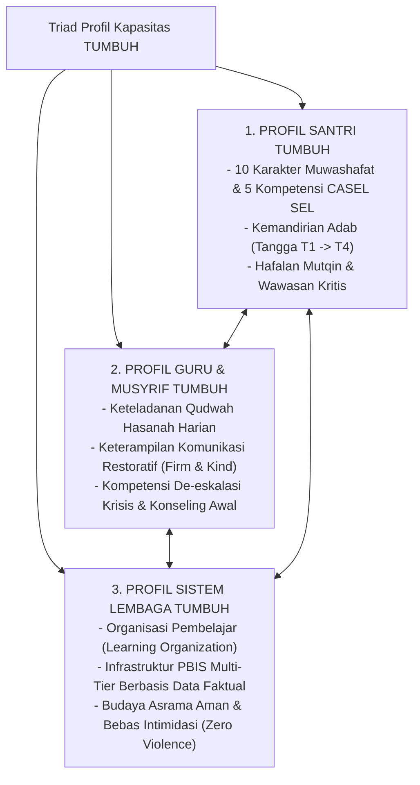

# P3-01-01-Triad-Profil-Kapasitas

## Tujuan
Merumuskan standar profil kapasitas bagi **Triad Pertumbuhan Simbiotik**: memetakan kompetensi akhir yang wajib dicapai oleh **Santri**, kompetensi profesional-ruhiyah **Guru/Musyrif**, dan kapasitas arsitektural **Sistem Lembaga**.

---

## 1. Arsitektur Triad Profil Kapasitas

---

## 2. Matriks Standar Kapasitas Triadik

| Entitas | Profil Kapasitas Inti | Alat Ukur / Asesmen | Bukti Keberhasilan (*Evidence of Growth*) |
| :--- | :--- | :--- | :--- |
| **Santri** | 10 Karakter TUMBUH + Keterampilan Sosial-Emosional (SEL). | Portofolio Adab Harian, Ujian Mutqin Tahfizh, Observasi Kamar. | Santri naik ke tangga T4 (mandiri, inisiatif ibadah, teladan adik kelas). |
| **Guru & Musyrif** | Keteladanan Qudwah, Didaktik Interaktif, Manajemen Asrama Restoratif. | Indeks Kinerja Qudwah, Supervisi Reflektif Mingguan, Feedback Santri. | Nihil aksi kekerasan fisik/verbal, kepuasan santri tinggi, musyrif bahagia (*no burnout*). |
| **Sistem Lembaga** | SOP Jelas, Manajemen Titik Rawan (*Hotspots*), Dashboard Analitik PBIS. | Audit Mutu PDCA Semesteran, Rekam Data Logbook PBIS. | Kasus pelanggaran tahunan turun 30–50%, reputasi lembaga dipercaya umat. |

---

## 3. Status Dokumen
* **Status**: 🌟 **A+ (Tervalidasi & Siap Diimplementasikan)**
* **Level**: Project 3 - `03 Capacity Framework / 01 Graduate Profile`
* **Langkah Berikutnya**: **`P3-01-02-Kompetensi-Inti-10-Karakter-Santri.md`**.
