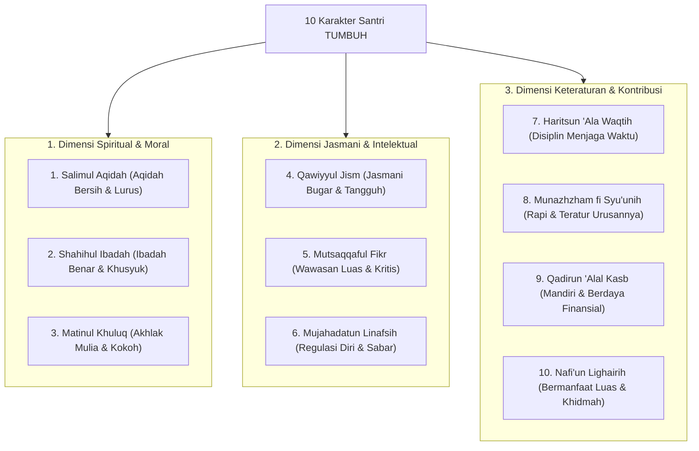

# P3-01-02-Kompetensi-Inti-10-Karakter-Santri

## Tujuan
Memetakan taksonomi **10 Karakter Santri TUMBUH** (*Muwashafat*) yang dikontekstualisasikan secara ilmiah dengan 5 Kompetensi **CASEL Social-Emotional Learning**, menghasilkan definisi operasional yang jelas, terukur, dan aplikatif dalam kehidupan pesantren 24 jam.

---

## 1. Peta Taksonomi 10 Karakter Santri TUMBUH

---

## 2. Matriks Integrasi 10 Karakter Santri & CASEL SEL

| No | Karakter Santri TUMBUH | Dimensi Utama | Integrasi Kompetensi CASEL SEL | Indikator Perilaku di Pesantren |
| :-: | :--- | :--- | :--- | :--- |
| **1** | **Salimul Aqidah** | Tauhid & Iman | *Self-Awareness (Spiritual Meaning)* | Bebas dari syirik/khurafat, menggantungkan harapan hanya pada Allah. |
| **2** | **Shahihul Ibadah** | Fiqh Ibadah | *Self-Management (Spiritual Discipline)* | Sholat fardhu berjamaah di masjid, thaharah tertib, tilawah harian. |
| **3** | **Matinul Khuluq** | Adab & Moral | *Relationship Skills & Social Awareness* | Bertutur kata santun (*Qaulan Karima*), memuliakan guru & teman. |
| **4** | **Qawiyyul Jism** | Kesehatan & Raga | *Self-Management (Physical Wellness)* | Olahraga teratur, menjaga kebersihan diri, tidur & makan seimbang. |
| **5** | **Mutsaqqaful Fikr** | Nalar & Wawasan | *Responsible Decision-Making & Inquiry* | Nalar kritis, gemar membaca buku/kitab, hafalan Al-Qur'an mutqin. |
| **6** | **Mujahadatun Linafsih** | Regulasi Hawa Nafsu | *Self-Management (Emotional Regulation)* | Mampu menahan amarah, sabar saat diuji, gigih dalam menuntut ilmu. |
| **7** | **Haritsun 'Ala Waqtih** | Manajemen Waktu | *Self-Management (Time Optimization)* | Disiplin jadwal pondok, hadir sebelum bel, tidak begadang sia-sia. |
| **8** | **Munazhzham fi Syu'unih** | Keteraturan Diri | *Responsible Decision-Making & Organization* | Loker & kasur rapi, tertib administrasi, menjaga kebersihan kamar. |
| **9** | **Qadirun 'Alal Kasb** | Kemandirian Hidup | *Self-Awareness & Problem-Solving* | Hemat mengelola uang saku, mandiri mencuci/merawat barang pribadi. |
| **10** | **Nafi'un Lighairih** | Khidmah Keumatan | *Social Awareness & Relationship Skills* | Aktif menolong sesama, mengampu adik kelas, peduli lingkungan pondok. |

---

## 3. Status Dokumen
* **Status**: 🌟 **A+ (Tervalidasi & Siap Diimplementasikan)**
* **Level**: Project 3 - `03 Capacity Framework / 01 Graduate Profile`
* **Langkah Berikutnya**: **`P3-01-03-Standar-Kompetensi-Qudwah-Musyrif.md`**.
