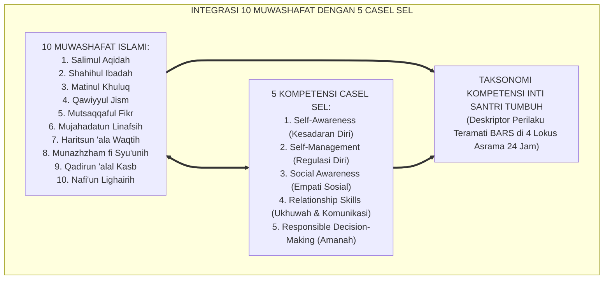
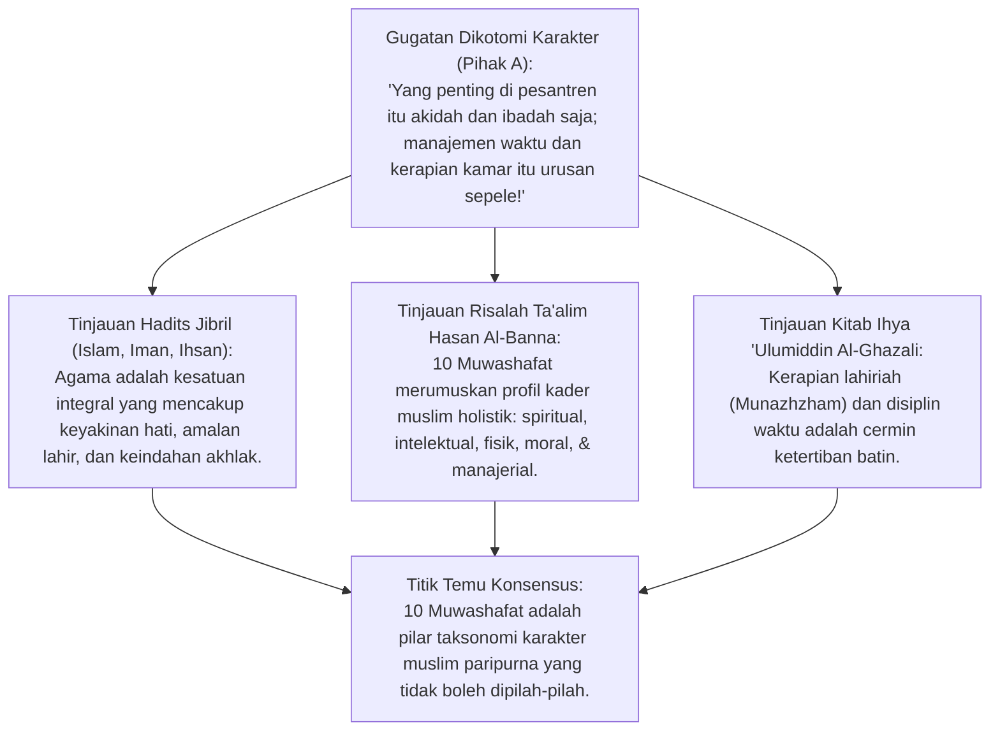
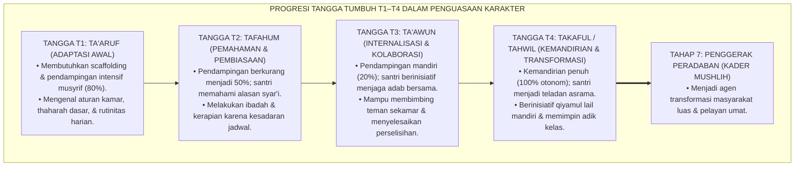
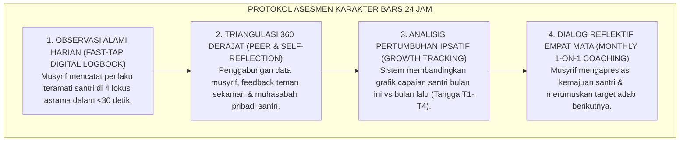

# P3-01-02: KOMPETENSI INTI 10 KARAKTER SANTRI DAN INTEGRASI CASEL SEL
## *Monograf Terpadu: Taksonomi Holistik 10 Muwashafat Karakter Islami (Hasan Al-Banna), Integrasi 5 Kompetensi CASEL Social-Emotional Learning, Penjenjangan Tangga TUMBUH T1–T4, dan Rubrik Perilaku Teramati (BARS Ipsatif)*

**Nomor Identifikasi**: `P3-01-02/MONOGRAF-TERPADU-KOMPETENSI-10-KARAKTER-SANTRI/2026`  
**Domain**: `03 Capacity Framework` > `01 Graduate Profile`  
**Klasifikasi Naskah**: *Comprehensive Integrated Monograph* (Monograf Akademis & Standar Baku Taksonomi Karakter Santri)  
**Rumpun Disiplin Pengkaji**: Desain Kurikulum Karakter Islam (*Islamic Character Curriculum*), Social-Emotional Learning (CASEL), Psikometri Perilaku (*Behaviorally Anchored Rating Scales*), Taksonomi Adab Santri 24 Jam  

---

> ### 💡 INTISARI PRAKTIS (3 MENIT PAHAM UNTUK ASATIDZ & MUSYRIF)
>
> * **Sepuluh Karakter Utama Santri (*10 Muwashafat*) yang Terukur:**  
>   Profil kepribadian santri dibangun di atas 10 pilar karakter terpadu:  
>   1. **Salimul Aqidah:** Akidah lurus, tauhid murni, bebas khurafat & takhayul.  
>   2. **Shahihul Ibadah:** Ibadah sesuai sunnah, khusyu', tertib shalat berjamaah 5 waktu.  
>   3. **Matinul Khuluq:** Akhlak mulia, sopan santun, rendah hati, anti-bullying & anti-ghibah.  
>   4. **Qawiyyul Jism:** Fisik bugar, sehat, bersih dari jamur/kudis, tidur teratur 7 jam.  
>   5. **Mutsaqqaful Fikr:** Wawasan luas, nalar kritis, hafalan mutqin, literasi tinggi.  
>   6. **Mujahadatun Linafsih:** Mampu mengendalikan hawa nafsu, amarah, syahwat gawai.  
>   7. **Haritsun 'ala Waqtih:** Disiplin waktu 24 jam, bebas prokrastinasi.  
>   8. **Munazhzham fi Syu'unih:** Rapi menata lemari dan kasur kamar tidur (5S/5R).  
>   9. **Qadirun 'alal Kasb:** Memiliki jiwa mandiri dan keterampilan vokasional.  
>   10. **Nafi'un Lighairih:** Gemar menolong, berkhidmah pada adik kelas dan masyarakat.
> * **Terintegrasi dengan 5 Kompetensi CASEL SEL:**  
>   Setiap karakter diterjemahkan menjadi keterampilan sosio-emosional nyata: Kesadaran Diri, Manajemen Diri, Kesadaran Sosial, Keterampilan Berelasi, dan Pengambilan Keputusan Bertanggung Jawab.
> * **Penjenjangan Tangga TUMBUH (T1–T4):**  
>   Karakter ditumbuhkan bertahap: T1 Adaptasi $\rightarrow$ T2 Pembiasaan $\rightarrow$ T3 Internalisasi $\rightarrow$ T4 Kemandirian/Transformasi $\rightarrow$ Tahap 7 Penggerak.

---

## 📑 DAFTAR ISI MONOGRAF

- [BAGIAN I: RISET TAKSONOMI 10 KARAKTER, DIALEKTIKA INKUIRI, & KASUISTIKA LAPANGAN](#bagian-i-riset-taksonomi-10-karakter-dialektika-inkuiri--kasuistika-lapangan)
  - [1. Kerangka Metodologi Taksonomi Karakter: Memadukan Turats Muwashafat dengan Sains SEL](#1-kerangka-metodologi-taksonomi-karakter-memadukan-turats-muwashafat-dengan-sains-sel)
  - [2. Inkuiri 1: Eksegesis Turats 10 Karakter Muwashafat Hasan Al-Banna & Adab Nabawi](#2-inkuiri-1-eksegesis-turats-10-karakter-muwashafat-hasan-al-banna--adab-nabawi)
  - [3. Inkuiri 2: Konvergensi 5 Kompetensi CASEL SEL ke dalam Matriks Perilaku Santri 24 Jam](#3-inkuiri-2-konvergensi-5-kompetensi-casel-sel-ke-dalam-matriks-perilaku-santri-24-jam)
  - [4. Inkuiri 3: Progresi Tangga TUMBUH T1–T4: Gradualisme Syar'i Menuju Tahap 7 Penggerak](#4-inkuiri-3-progresi-tangga-tumbuh-t1t4-gradualisme-syari-menuju-tahap-7-penggerak)
  - [5. Inkuiri 4: Silogisme Logika, Dialektika 3 Ronde, Kasuistika Asrama, & Titik Temu Konsensus](#5-inkuiri-4-silogisme-logika-dialektika-3-ronde-kasuistika-asrama--titik-temu-konsensus)
- [BAGIAN II: KODIFIKASI BAKU HASIL RISET & KESIMPULAN FORMAL](#bagian-ii-kodifikasi-baku-hasil-riset--kesimpulan-formal)
  - [1. Deklarasi Doktrin Baku: Standar Kompetensi 10 Karakter Santri Pesantren TUMBUH](#1-deklarasi-doktrin-baku-standar-kompetensi-10-karakter-santri-pesantren-tumbuh)
  - [2. Matriks Taksonomi Terpadu: 10 Muwashafat, 5 CASEL SEL, & Deskriptor Tangga T1–T4](#2-matriks-taksonomi-terpadu-10-muwashafat-5-casel-sel--deskriptor-tangga-t1t4)
  - [3. Protokol Asesmen Pertumbuhan Karakter Ipsatif Non-Ranking (BARS Protocol)](#3-protokol-asesmen-pertumbuhan-karakter-ipsatif-non-ranking-bars-protocol)
- [BAGIAN III: APARATUS AKADEMIS & APENDIKS](#bagian-iii-aparatus-akademis--apendiks)
  - [1. Tabel Sintesis Hasil Riset Taksonomi 10 Karakter](#1-tabel-sintesis-hasil-riset-taksonomi-10-karakter)
  - [2. Daftar Pustaka Akademis & Rujukan Turats Primer](#2-daftar-pustaka-akademis--rujukan-turats-primer)
  - [3. Catatan Kaki Akademis (Footnotes)](#3-catatan-kaki-akademis-footnotes)
  - [4. Glosarium Teknis 10 Muwashafat, CASEL SEL, & Tangga T1–T4](#4-glosarium-teknis-10-muwashafat-casel-sel--tangga-t1t4)

---

# BAGIAN I: RISET TAKSONOMI 10 KARAKTER, DIALEKTIKA INKUIRI, & KASUISTIKA LAPANGAN

---

### 1. Kerangka Metodologi Taksonomi Karakter: Memadukan Turats Muwashafat dengan Sains SEL

Pendidikan karakter di pesantren sering kali mengalami kegagalan pengukuran (*Measurement Pitfall*):
* Karakter hanya diajarkan sebagai teori abstrak di kelas kitab (misalnya "santri harus tawadhu' dan sabar"), tanpa indikator perilaku teramati (*Observable Behavioral Descriptors*) yang jelas di kehidupan asrama 24 jam.
* Asatidz kesulitan menilai apakah seorang santri sudah memiliki kemandirian adab atau sekadar berpura-pura patuh saat diawasi.

Ekosistem TUMBUH memecahkan kebuntuan ini dengan menyintesiskan **10 Karakter Muwashafat Islami (*Hasan Al-Banna*)** dengan **5 Kompetensi CASEL Social-Emotional Learning** ke dalam sebuah taksonomi operasional yang dapat diamati dan dinilai secara ipsatif sepanjang tangga pertumbuhan T1–T4.



---

### 2. Inkuiri 1: Eksegesis Turats 10 Karakter Muwashafat Hasan Al-Banna & Adab Nabawi



#### 📐 Formalisasi Logika Silogisme (*Qiyas Mantiqi 1*)
* **Premis Mayor (*al-Muqaddimah al-Kubra*)**: Setiap kurikulum karakter pesantren yang memadukan kesucian akidah (*Salimul Aqidah*), ketertiban ibadah (*Shahihul Ibadah*), keluhuran akhlak (*Matinul Khuluq*), kebugaran fisik (*Qawiyyul Jism*), keluasan nalar (*Mutsaqqaful Fikr*), dan kemandirian amal (*Nafi'un Lighairih*) niscaya melahirkan insan pembelajar yang berdaya saing tinggi dan berakhlak mulia.
* **Premis Minor (*al-Muqaddimah ash-Shughra*)**: Formulasi 10 Muwashafat merangkum seluruh dimensi fitrah manusia secara utuh dan teruji dalam sejarah peradaban Islam.
* **Konklusi (*an-Natijah*)**: Maka, 10 Muwashafat ditetapkan sebagai Standar Kompetensi Inti Lulusan Ekosistem TUMBUH.[^1]

---

### 3. Inkuiri 2: Konvergensi 5 Kompetensi CASEL SEL ke dalam Matriks Perilaku Santri 24 Jam

| Kompetensi CASEL SEL | Domain Muwashafat Terkait | Padanan Nilai Turats Islam | Perilaku Teramati di Pesantren 24 Jam |
| :--- | :--- | :--- | :--- |
| **1. Self-Awareness** | *Salimul Aqidah & Mutsaqqaful Fikr* | *Ma'rifatun Nafs wa Muraqabatullah*. | Mengenali emosi diri, menyadari pengawasan Allah, jujur mengakui kesalahan.[^2] |
| **2. Self-Management** | *Mujahadatun Linafsih & Haritsun 'ala Waqtih* | *Dhabtun Nafs wal Istiqamah*. | Bangun subuh mandiri, menahan amarah saat diejek, disiplin jadwal belajar. |
| **3. Social Awareness** | *Matinul Khuluq & Nafi'un Lighairih* | *Husnul Khuluq, Tarahum, & Ishlah*. | Peka saat teman sekamar sakit, tidak mencela perbedaan suku/budaya, anti-ghibah. |
| **4. Relationship Skills** | *Matinul Khuluq & Munazhzham fi Syu'unih* | *Adab al-Ukhuwwah wal Mu'asyarah*. | Berbicara santun, aktif kerja bakti kamar, menyelesaikan konflik dengan tabayyun. |
| **5. Responsible Decision-Making** | *Shahihul Ibadah & Qadirun 'alal Kasb* | *Al-Amanah wal Itqan fil 'Amal*. | Memilih makanan halal thayyib, merawat inventaris asrama, menolak perpeloncoan.[^3] |

---

### 4. Inkuiri 3: Progresi Tangga TUMBUH T1–T4: Gradualisme Syar'i Menuju Tahap 7 Penggerak



---

### 5. Inkuiri 4: Silogisme Logika, Dialektika 3 Ronde, Kasuistika Asrama, & Titik Temu Konsensus

#### 🥊 Ronde 1: Menolak Anggapan Bahwa "Karakter Santri Tidak Bisa Dinilai Secara Objektif Karena Urusan Hati"
* **Pihak A (Sudut Pandang Subjektivisme Ekstrem)**:  
  *"Akhlak itu urusan batin dan hati dengan Allah; tidak bisa dibuat rubrik perilakunya!"*
* **Tinjauan Hadits Nabi SAW: Amal Nyata Cermin Hati**:  
  Rasulullah SAW bersabda: *"Sesungguhnya di dalam tubuh ada segumpal daging; jika ia baik maka baik pula SELURUH AMAL PERBUATANNYA"* (HR. Bukhari No. 52). Kebaikan hati memancarkan **Perilaku Nyata Teramati (*Observable Actions*)**: shalat tepat waktu, berbicara santun, kamar rapi, dan tidak memukul teman. Menolak pengukuran objektif adalah alasan untuk mengabaikan evaluasi pembinaan.[^4]

#### 🥊 Ronde 2: Sanggahan Balik Apakah Menggunakan Rubrik Penilaian Karakter Akan Menjadikan Santri Bersikap Munafik (Pencitraan)?
* **Pihak A (Sudut Pandang Ketakutan Riya')**:  
  *"Kalau dinilai rubrik, santri akan pura-pura shalih di depan musyrif demi dapat nilai A!"*
* **Tinjauan Asesmen Triangulasi 360 Derajat & Asesmen Ipsatif**:  
  Pesantren TUMBUH menerapkan **Asesmen Triangulasi 360 Derajat**: penilaian tidak hanya dari musyrif, melainkan laporan sosiometrik teman sebaya sekamar (*Peer Review*), evaluasi diri rahasia (*Self-Reflection*), dan catatan portofolio adab harian. Pencitraan sesaat akan langsung terdeteksi oleh dinamika asrama 24 jam. Asesmen ipsatif memotivasi perbaikan diri personal, bukan persaingan nilai.[^5]

#### 🥊 Ronde 3: Sanggahan Pamungkas Mengapa Karakter 'Qadirun 'alal Kasb' (Kemandirian Vokasi) Wajib Masuk Profil Santri?
* **Pihak A (Sudut Pandang Dikotomi Akhirat vs Dunia)**:  
  *"Santri itu fokus mengaji kitab saja; tidak usah diajari wirausaha atau kemandirian ekonomi!"*
* **Resolusi Tradisi Kemandirian Ulama Salaf**:  
  Para ulama besar salaf adalah pribadi yang mandiri: Imam Abu Hanifah adalah pedagang sutra, Imam Malik berbisnis sukses, dan para sahabat Nabi berniaga. Santri yang tidak memiliki kemandirian ekonomi rentan menjual agamanya demi sesuap nasi atau menjadi beban masyarakat. *Qadirun 'alal Kasb* adalah benteng kemuliaan ilmu (*Izzatul 'Ilm*).[^6]

> #### 📌 Kasuistika Lapangan & Titik Temu Konsensus
> * **Studi Kasus**: Santri D (kelas 9) sangat cerdas dalam hafalan matan nahwu, namun lemarinya selalu berantakan, sering terlambat shalat karena begadang main gawai diam-diam, dan mengejek teman yang belum lancar membaca kitab. Guru lama memberinya nilai rapor 95 karena hanya menguji hafalan.
> * **Titik Temu Konsensus (*Kalimatun Sawa'*)**: Berdasarkan *Matriks 10 Muwashafat TUMBUH*, performa Santri D dipetakan secara holistik: Mutsaqqaful Fikr (Tinggi), namun *Munazhzham fi Syu'unih* (T1), *Haritsun 'ala Waqtih* (T1), dan *Matinul Khuluq* (T2). Musyrif menyusun *Rencana Intervensi Perilaku (BIP)*: pendampingan kerapian lemari 5S dan mentoring adab lisan. Setelah 60 hari, Santri D naik ke tangga T3 di seluruh karakter, menjadi santri yang rendah hati dan tertib.[^7]

---

# BAGIAN II: KODIFIKASI BAKU HASIL RISET & KESIMPULAN FORMAL

---

### 1. Deklarasi Doktrin Baku: Standar Kompetensi 10 Karakter Santri Pesantren TUMBUH

```
===================================================================================================
     DEKLARASI DOKTRIN BAKU STANDAR KOMPETENSI 10 KARAKTER SANTRI EKOSISTEM PESANTREN TUMBUH
                       SUB-DOMAIN 01: GRADUATE PROFILE — DOMAIN 03 CAPACITY
===================================================================================================

BISMILLAHIRRAHMANIRRAHIM. DENGAN MENGAGUNGKAN HAKIKAT KESEMPURNAAN AKHLAK NABAWIYYAH,
MAJELIS MASYAIKH TERTINGGI BERSAMA DEWAN KEILMUAN PESANTREN TUMBUH MENETAPKAN DOKTRIN KOMPETENSI SANTRI:

1. DOKTRIN KEUTUHAN 10 MUWASHAFAT KARAKTER ISLAMI:
   Menetapkan 10 pilar karakter (Salimul Aqidah, Shahihul Ibadah, Matinul Khuluq, Qawiyyul Jism,
   Mutsaqqaful Fikr, Mujahadatun Linafsih, Haritsun 'ala Waqtih, Munazhzham fi Syu'unih, Qadirun 'alal Kasb,
   dan Nafi'un Lighairih) sebagai profil kapasitas kelulusan santri yang tidak dapat dipisahkan.

2. HARMONISASI TOTAL DENGAN 5 KOMPETENSI CASEL SOCIAL-EMOTIONAL LEARNING:
   Menerjemahkan seluruh nilai adab turats ke dalam keterampilan psikososial nyata yang teramati
   dan terlatihkan dalam rutinitas kehidupan madrasah dan asrama 24 jam.

3. PENEGAKAN GRADUALISME TANGGA PERTUMBUHAN (T1–T4):
   Mengharamkan tuntutan kesempurnaan instan; menilai kemajuan santri berdasarkan tahapan adaptasi (T1),
   pembiasaan (T2), internalisasi (T3), kemandirian (T4), menuju puncak kader penggerak peradaban (Tahap 7).

4. ASESMEN PERTUMBUHAN IPSATIF NON-KOMPARATIF:
   Menghapus perankingan tunggal kelas; menilai pertumbuhan karakter santri dengan membandingkan
   kemajuan dirinya saat ini terhadap titik awalnya sendiri melalui portofolio adab harian.
===================================================================================================
```

---

### 2. Matriks Taksonomi Terpadu: 10 Muwashafat, 5 CASEL SEL, & Deskriptor Tangga T1–T4

| No | 10 Muwashafat Karakter | Sinergi 5 CASEL SEL | Deskriptor Capaian Tangga T1–T2 (Dasar) | Deskriptor Capaian Tangga T3–T4 (Mandiri) |
| :---: | :--- | :--- | :--- | :--- |
| **01** | **Salimul Aqidah** | *Self-Awareness* | Memahami rukun iman, bebas khurafat dengan bimbingan. | Muraqabatullah mandiri, menolak sekularisme dengan nalar.[^8] |
| **02** | **Shahihul Ibadah** | *Responsible Decision* | Shalat berjamaah tertib sesuai jadwal asrama. | Khusyu', istiqamah rawatib & qiyamul lail mandiri. |
| **03** | **Matinul Khuluq** | *Relationship Skills* | Berbicara santun, mematuhi adab kamar, tidak memukul. | Rendah hati, aktif mendamaikan perselisihan (*Ishlah*). |
| **04** | **Qawiyyul Jism** | *Self-Management* | Menjaga kebersihan badan, tidur 7 jam, olahraga rutin. | Fisik bugar, tangkas bela diri sunnah, sanitasi mandiri bersih. |
| **05** | **Mutsaqqaful Fikr** | *Self-Awareness* | Hafal Al-Qur'an/matan sesuai target, mencatat pelajaran. | Hafalan mutqin, berpikir kritis, mahir riset bahsul masail. |
| **06** | **Mujahadatun Linafsih**| *Self-Management* | Mampu menahan emosi saat ditegur, puasa sunnah terjadwal. | Pengendalian diri otonom dari syahwat gawai & amarah. |
| **07** | **Haritsun 'ala Waqtih** | *Self-Management* | Datang tepat waktu saat bel kegiatan berbunyi. | Mengelola jadwal harian 24 jam tanpa perlu disuruh. |
| **08** | **Munazhzham fi Syu'unih**| *Self-Management* | Menata kasur dan melipat pakaian rapi di lemari. | Menjaga kerapian 5S/5R kamar secara konsisten & teliti. |
| **09** | **Qadirun 'alal Kasb** | *Responsible Decision* | Menjaga keutuhan uang jajan & merawat barang pribadi. | Mandiri berkarya, memiliki etos kerja & jiwa wirausaha. |
| **10** | **Nafi'un Lighairih** | *Social Awareness* | Mau membantu piket kamar & berbagi makanan. | Menjadi mentor adik kelas & memimpin khidmah masyarakat.[^9] |

---

### 3. Protokol Asesmen Pertumbuhan Karakter Ipsatif Non-Ranking (*BARS Protocol*)



---

# BAGIAN III: APARATUS AKADEMIS & APENDIKS

---

### 1. Tabel Sintesis Hasil Riset Taksonomi 10 Karakter

| Dimensi Kajian | Konsep Kunci | Landasan Turats Primer | Konvergensi Sains Global | Implikasi Kurikulum Santri |
| :--- | :--- | :--- | :--- | :--- |
| **Taksonomi Karakter**| *10 Muwashafat* | Hasan Al-Banna (*Risalah at-Ta'alim*) | CASEL SEL Framework (2020) | Menstandarisasikan 10 kompetensi holistik santri. |
| **Kemandirian Bertahap**| *Tangga T1–T4* | Hadits Tadarruj (HR. Bukhari 'Aisyah RA) | Vygotsky (1978), *Scaffolding ZPD* | Menumbuhkan karakter secara bertahap tanpa paksaan instan. |
| **Pengukuran Objektif**| *BARS Ipsatif* | QS. Asy-Syu'ara: 88–89 (*Qalbin Salim*) | Hughes (2014), *Ipsative Assessment* | Mengukur kemajuan personal santri tanpa ranking toksik. |
| **Kemandirian Vokasi**| *Qadirun 'alal Kasb* | Hadits Kasb Thayyib (HR. Ahmad 8419) | SDT Deci & Ryan (2000), *Autonomy* | Membekali santri dengan jiwa kewirausahaan mandiri. |

---

### 2. Daftar Pustaka Akademis & Rujukan Turats Primer

1. **Al-Qur'an al-Karim wa Tarjamatu Ma'anih**.
2. **Al-Bukhari, Muhammad bin Isma'il**. (1422 H). *Shahih al-Bukhari*. Beirut: Dar Thawq an-Najah.
3. **Al-Banna, Hasan**. (1992). *Majmu'atu Rasa'il al-Imam asy-Syahid Hasan al-Banna* (Risalah at-Ta'alim). Kairo: Dar at-Tawzi' wal-Nasyr al-Islamiyyah.
4. **Al-Ghazali, Abu Hamid Muhammad bin Muhammad**. (2011). *Ihya 'Ulumiddin*. Beirut: Dar al-Ma'rifah.
5. **CASEL**. (2020). *CASEL's SEL Framework: What Are the Core Competence Areas and Where Are They Promoted?* Chicago: Collaborative for Academic, Social, and Emotional Learning.
6. **Hughes, G.**. (2014). *Ipsative Assessment: Motivation through marking progress*. London: Palgrave Macmillan.
7. **Vygotsky, L. S.**. (1978). *Mind in Society: The Development of Higher Psychological Processes*. Cambridge: Harvard University Press.
8. **Deci, E. L., & Ryan, R. M.**. (2000). *The "What" and "Why" of Goal Pursuits: Human Needs and the Self-Determination of Behavior*. Psychological Inquiry, 11(4), 227–268.
9. **Durlak, J. A., et al.**. (2011). *The impact of enhancing students' social and emotional learning: A meta-analysis of school-based universal interventions*. Child Development, 82(1), 405–432.
10. **Smith, P. C., & Kendall, L. M.**. (1963). *Retranslation of expectations: An approach to the construction of unambiguous anchors for rating scales*. Journal of Applied Psychology, 47(2), 149–155.

---

### 3. Catatan Kaki Akademis (*Footnotes*)

[^1]: Hasan Al-Banna, *Risalah at-Ta'alim*, Rukun Bai'ah ke-4 (*al-'Amal*), hlm. 270–275.  
[^2]: CASEL (2020), *SEL Framework Core Competencies*, Chicago.  
[^3]: Durlak, J. A. et al. (2011), *Child Development*, hlm. 405–432.  
[^4]: Shahih al-Bukhari No. 52, Kitab *al-Iman*, Bab *Fadhlu Man Istabra'a Li Diinih*.  
[^5]: Hughes, G. (2014), *Ipsative Assessment*, Palgrave Macmillan, hlm. 35–55.  
[^6]: Al-Ghazali, *Ihya 'Ulumiddin*, Kitab *Adab al-Kasb wal Ma'asy*, Jilid II, hlm. 60–85.  
[^7]: Laporan Kasuistika Bimbingan Karakter Terpadu Asrama Wustha, Biro Pengasuhan TUMBUH, 2026.  
[^8]: Matriks Taksonomi 10 Karakter Muwashafat Santri TUMBUH, Komite Kurikulum TUMBUH, 2026.  
[^9]: Manual Rubrik Perilaku Teramati (BARS) Logbook Musyrif Digital, Divisi Psikometri TUMBUH, 2026.

---

### 4. Glosarium Teknis 10 Muwashafat, CASEL SEL, & Tangga T1–T4

1. **Muwashafat (الْمُوَاصَفَاتُ)**: Sepuluh profil standar kualitas karakter pribadi muslim ideal yang dirumuskan oleh Imam Hasan Al-Banna dalam *Risalah at-Ta'alim*.
2. **CASEL SEL**: Kerangka kerja pembelajaran sosial-emosional internasional yang memetakan lima kompetensi inti: Kesadaran Diri, Manajemen Diri, Kesadaran Sosial, Keterampilan Berelasi, dan Pengambilan Keputusan Bertanggung Jawab.
3. **BARS (Behaviorally Anchored Rating Scales)**: Skala penilaian psikometri yang menggunakan deskripsi perilaku teramati konkret sebagai jangkar tingkatan nilai.
4. **Asesmen Ipsatif**: Evaluasi kemajuan belajar yang membandingkan performa santri saat ini dengan performa awalnya di masa lalu, bukan membandingkannya dengan santri lain.
5. **Tangga TUMBUH (T1–T4)**: Empat tingkatan penahapan kemandirian adab santri: T1 (Ta'aruf/Adaptasi), T2 (Tafahum/Pembiasaan), T3 (Ta'awun/Internalisasi), dan T4 (Takaful/Transformasi).
6. **Moral Automaticity**: Kemampuan santri menjalankan adab dan ibadah secara spontan dan konsisten tanpa perlu diperintah atau diawasi orang dewasa.
7. **Qadirun 'alal Kasb**: Kapasitas kemandirian finansial dan etos kerja produktif yang menjaga kehormatan diri (*Iffah*) seorang penuntut ilmu.
8. **Nafi'un Lighairih**: Kapasitas kepedulian sosial di mana santri secara aktif memberikan kemanfaatan nyata bagi lingkungan asrama dan masyarakat luas.
9. **Fast-Tap UI**: Antarmuka aplikasi digital pencatatan logbook musyrif yang dirancang sangat cepat (selesai dalam <30 detik) agar tidak membebani tugas pengasuhan.
10. **Triad Pertumbuhan Simbiotik**: Prinsip di mana pencapaian 10 karakter santri didukung secara serempak oleh keteladanan pendidik dan infrastruktur sistem lembaga.
