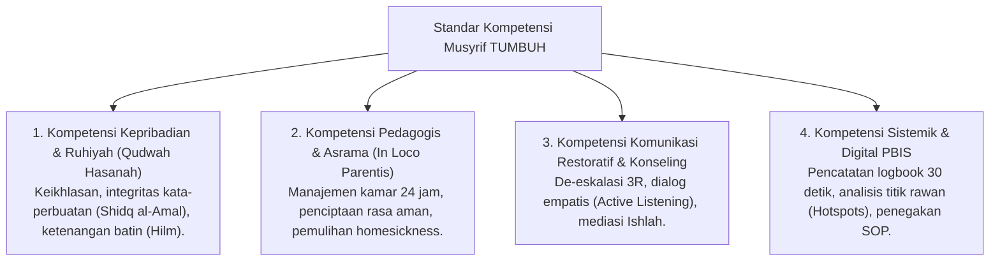

# P3-01-03-Standar-Kompetensi-Qudwah-Musyrif

## Tujuan
Menetapkan **Standar Kompetensi Guru dan Musyrif Asrama** (*Musyrif Competency Standards*) dalam ekosistem pesantren TUMBUH, memadukan keteladanan ruhiyah (*Qudwah Hasanah*), keterampilan pedagogi kelas, dan kecakapan pengasuhan restoratif (*Restorative Mentoring*).

---

## 1. 4 Ranah Kompetensi Inti Musyrif & Pendidik

---

## 2. Matriks Indikator Kinerja Musyrif (*Musyrif Rubric*)

| Ranah Kompetensi | Level Dasar (Berkembang) | Level Mahir (Standar TUMBUH) | Level Teladan (Master Musyrif) |
| :--- | :--- | :--- | :--- |
| **Qudwah Ibadah** | Tiba di masjid saat adzan berkumandang. | Tiba sebelum adzan di shaf terdepan & menyapa santri. | Mengimami, membimbing tilawah & qiyamul lail santri. |
| **Respon Pelanggaran** | Terkadang reaktif namun cepat meminta maaf. | Tenang, menerapkan konsekuensi logis restoratif (*Firm & Kind*). | Mampu memandu *Restorative Circle* & mendiagnosis FBA secara mandiri. |
| **Digital PBIS** | Mencatat logbook 1-2 hari terlambat. | Mencatat secara realtime (<30 detik) setiap sesi harian. | Menganalisis heatmap data mingguan & merancang strategi preventif. |

---

## 3. Status Dokumen
* **Status**: 🌟 **A+ (Tervalidasi & Siap Diimplementasikan)**
* **Level**: Project 3 - `03 Capacity Framework / 01 Graduate Profile`
* **Langkah Berikutnya**: **`P3-01-04-Standar-Kapasitas-Kelembagaan-Pesantren.md`**.
