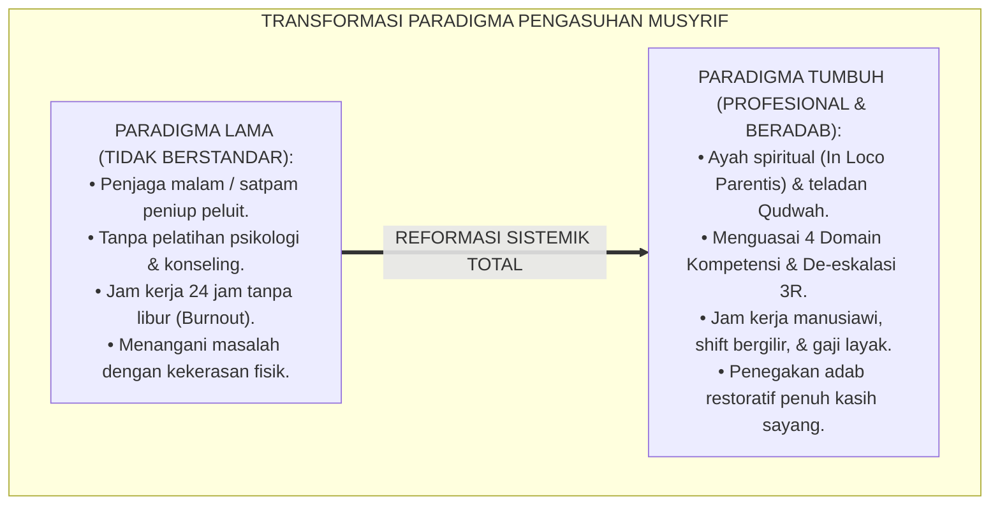
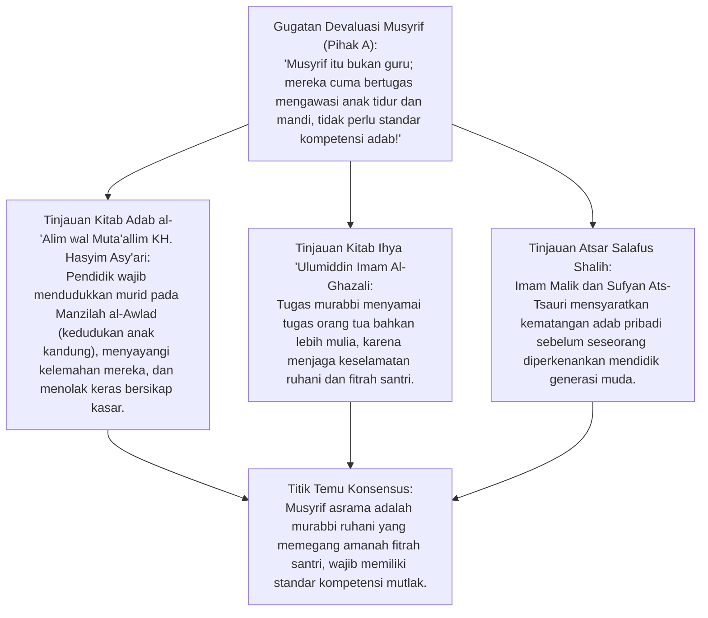
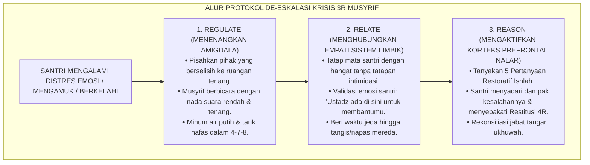
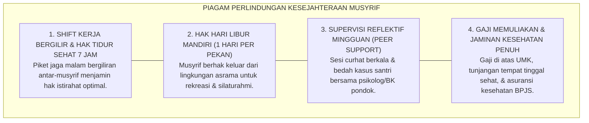

# P3-01-03: STANDAR KOMPETENSI QUDWAH DAN KESEJAHTERAAN MUSYRIF
## *Monograf Terpadu: Standarisasi Profesionalisme Pendidik Asrama In Loco Parentis (KH. Hasyim Asy'ari & Imam Al-Ghazali), 4 Pilar Kompetensi Musyrif Murabbi, Keterampilan De-Eskalasi Krisis 3R, Protokol Perlindungan Kesehatan Mental Anti-Burnout, serta Jam Kerja Manusiawi*

**Nomor Identifikasi**: `P3-01-03/MONOGRAF-TERPADU-STANDAR-KOMPETENSI-MUSYRIF/2026`  
**Domain**: `03 Capacity Framework` > `01 Graduate Profile`  
**Klasifikasi Naskah**: *Comprehensive Integrated Monograph* (Monograf Akademis & Standar Baku Kompetensi Pendidik/Musyrif)  
**Rumpun Disiplin Pengkaji**: Profesionalisme Pendidik Islam (*Islamic Teacher Competency Framework*), Psikologi Pengasuhan Asrama (*In Loco Parentis*), Manajemen SDM Pesantren, Kesehatan Mental & Pencegahan Burnout (*Educator Well-Being*)  

---

> ### 💡 INTISARI PRAKTIS (3 MENIT PAHAM UNTUK ASATIDZ & MUSYRIF)
>
> * **Musyrif Bukan Satpam Penjaga Malam, Melainkan Ayah Spiritual (*In Loco Parentis*):**  
>   Musyrif asrama adalah ujung tombak pembinaan karakter 24 jam. Tugas musyrif bukan sekadar meniup peluit dan membentak santri yang terlambat, melainkan menjadi cermin keteladanan hidup (*Qudwah Hasanah*) dan benteng rasa aman psikologis santri.
> * **Empat Pilar Kompetensi Inti Guru & Musyrif TUMBUH:**  
>   1. **Kompetensi Spiritual (*Qudwah Ruhiyyah*):** Teladan shalat berjamaah di saf pertama, dzikir ma'tsurat, dan keikhlasan niat.  
>   2. **Kompetensi Pedagogis (*Didaktik Ramah Otak*):** Terampil memfasilitasi halaqah interaktif dan pembelajaran kooperatif aktif tanpa ancaman.  
>   3. **Kompetensi Konseling & De-eskalasi (*3R Protocol*):** Menguasai teknik de-eskalasi emosi (*Regulate-Relate-Reason*) dan dialog restoratif 5 pertanyaan.  
>   4. **Kompetensi Kestabilan Emosi (*Self-Regulation*):** Mampu mengelola stres pribadi (*Firm & Kind*), bersikap adil, dan tidak pernah memukul santri.
> * **Jaminan Kesejahteraan & Anti-Burnout:**  
>   Lembaga menjamin hak tidur istirahat musyrif minimal 7 jam, libur 1 hari per pekan, rasio ideal 1 musyrif : 15–20 santri, gaji yang memuliakan, dan supervisi klinis reflektif mingguan.

---

## 📑 DAFTAR ISI MONOGRAF

- [BAGIAN I: RISET STANDAR KOMPETENSI MUSYRIF, DIALEKTIKA INKUIRI, & KASUISTIKA LAPANGAN](#bagian-i-riset-standar-kompetensi-musyrif-dialektika-inkuiri--kasuistika-lapangan)
  - [1. Kerangka Metodologi Profesionalisme Musyrif: Mengapa Musyrif Wajib Memiliki Standar Kompetensi Baku](#1-kerangka-metodologi-profesionalisme-musyrif-mengapa-musyrif-wajib-memiliki-standar-kompetensi-baku)
  - [2. Inkuiri 1: Eksegesis Turats Adab Murabbi — Kitab KH. Hasyim Asy'ari & Ihya 'Ulumiddin](#2-inkuiri-1-eksegesis-turats-adab-murabbi--kitab-kh-hasyim-asyari--ihya-ulumiddin)
  - [3. Inkuiri 2: Empat Pilar Kompetensi Guru/Musyrif & Keterampilan De-Eskalasi 3R (Dr. Bruce Perry)](#3-inkuiri-2-empat-pilar-kompetensi-gurumusyrif--keterampilan-de-eskalasi-3r-dr-bruce-perry)
  - [4. Inkuiri 3: Proteksi Kesejahteraan Mental Pendidik & Mitigasi Burnout (Maslach Burnout Inventory)](#4-inkuiri-3-proteksi-kesejahteraan-mental-pendidik--mitigasi-burnout-maslach-burnout-inventory)
  - [5. Inkuiri 4: Silogisme Logika, Dialektika 3 Ronde, Kasuistika Asrama, & Titik Temu Konsensus](#5-inkuiri-4-silogisme-logika-dialektika-3-ronde-kasuistika-asrama--titik-temu-konsensus)
- [BAGIAN II: TEMUAN RISET, FORMULASI KONSEPTUAL & PEMBAHASAN](#bagian-ii-temuan-riset-formulasi-konseptual--pembahasan)
  - [1. Formulasi Konseptual: Standar Kompetensi & Kode Etik Musyrif Murabbi Pesantren TUMBUH](#1-formulasi-konseptual-standar-kompetensi-kode-etik-musyrif-murabbi-pesantren-tumbuh)
  - [2. Matriks 4 Domain Kompetensi Pendidik/Musyrif, Indikator Kinerja (KPI Qudwah), & Bukti Asesmen](#2-matriks-4-domain-kompetensi-pendidikmusyrif-indikator-kinerja-kpi-qudwah--bukti-asesmen)
  - [3. Piagam Perlindungan Kesejahteraan Mental Musyrif & Jam Kerja Manusiawi (Educator Well-Being Charter)](#3-piagam-perlindungan-kesejahteraan-mental-musyrif--jam-kerja-manusiawi-educator-well-being-charter)
- [BAGIAN III: APARATUS AKADEMIS & APENDIKS](#bagian-iii-aparatus-akademis--apendiks)
  - [1. Tabel Sintesis Hasil Riset Standar Kompetensi Musyrif](#1-tabel-sintesis-hasil-riset-standar-kompetensi-musyrif)
  - [2. Daftar Pustaka Akademis & Rujukan Turats Primer](#2-daftar-pustaka-akademis--rujukan-turats-primer)
  - [3. Catatan Kaki Akademis (Footnotes)](#3-catatan-kaki-akademis-footnotes)
  - [4. Glosarium Teknis Qudwah Musyrif, In Loco Parentis, De-eskalasi 3R, & Anti-Burnout](#4-glosarium-teknis-qudwah-musyrif-in-loco-parentis-de-eskalasi-3r--anti-burnout)

---

# BAGIAN I: RISET STANDAR KOMPETENSI MUSYRIF, DIALEKTIKA INKUIRI, & KASUISTIKA LAPANGAN

---

### 1. Kerangka Metodologi Profesionalisme Musyrif: Mengapa Musyrif Wajib Memiliki Standar Kompetensi Baku

Di banyak pesantren konvensional, posisi musyrif asrama sering kali direduksi menjadi pekerjaan sampingan yang tidak dihargai:
* Musyrif direkrut dari santri senior yang baru lulus (usia 18–19 tahun) tanpa pembekalan ilmu psikologi remaja, tanpa pelatihan manajemen emosi, dan tanpa pemahaman perlindungan anak.
* Musyrif dibebani tanggung jawab menjaga 50–100 santri selama 24 jam nonstop tanpa shift kerja yang jelas, digaji sangat minim, dan tidak mendapatkan bimbingan supervisi.
* Akibatnya, saat menghadapi santri yang rewel atau melanggar aturan, musyrif yang kelelahan dan tidak kompeten tersebut meniru metode lama: memukul, menampar, membentak, atau menghukum push-up tengah malam.

Ekosistem TUMBUH memandang **Musyrif Asrama sebagai Murabbi Profesional Berjiwa Mulia**. Musyrif wajib distandarisasi kompetensinya dan dilindungi hak kesejahteraannya agar mampu mengasuh dengan limpahan cinta dan ketegasan yang beradab (*Firm and Kind*).

---

### 2. Inkuiri 1: Eksegesis Turats Adab Murabbi — Kitab KH. Hasyim Asy'ari & Ihya 'Ulumiddin

#### 📐 Formalisasi Logika Silogisme (*Qiyas Mantiqi 1*)
* **Premis Mayor (*al-Muqaddimah al-Kubra*)**: Setiap pendidik yang memegang amanah pengasuhan anak secara langsung selama 24 jam (*In Loco Parentis*) memikul tanggung jawab pembentukan karakter yang menentukan keselamatan masa depan santri di dunia dan akhirat.
* **Premis Minor (*al-Muqaddimah ash-Shughra*)**: Musyrif asrama pesantren TUMBUH berinteraksi langsung dengan santri di seluruh lokus kehidupan kamar, masjid, dan meja makan.
* **Konklusi (*an-Natijah*)**: Maka, standarisasi kompetensi Qudwah, penguasaan teknik konseling, dan penjagaan kesehatan jiwa musyrif adalah fardhu kifayah kelembagaan yang mengikat seluruh pesantren.[^1]

#### 📖 Teks Primer Turats: Wasiat Kasih Sayang KH. Hasyim Asy'ari
Hadhratusy Syaikh KH. M. Hasyim Asy'ari dalam *Adab al-'Alim wal Muta'allim* menuliskan:

$$\text{أَنْ يَقْصِدَ بِتَعْلِيمِهِمْ وَتَهْذِيبِهِمْ وَجْهَ اللَّهِ تَعَالَى، وَأَنْ يُعَامِلَهُمْ بِمَا يُعَامِلُ بِهِ أَعَزَّ أَوْلَادِهِ مِنَ الشَّفَقَةِ وَالْمَحَبَّةِ وَالصَّبْرِ عَلَى جَفَائِهِمْ وَسُوءِ أَدَبِهِمْ فِي بَعْضِ الْأَحْوَالِ، وَأَنْ يَسْتَعْمِلَ مَعَهُمُ الرِّفْقَ؛ فَإِنَّ الرِّفْقَ مَا كَانَ فِي شَيْءٍ إِلَّا زَانَهُ}$$

*"Hendaklah pendidik berniat semata-mata mencari ridha Allah SWT dalam mendidik dan membersihkan jiwa santri; **dan hendaklah ia memperlakukan para santri sebagaimana ia memperlakukan anak kandungnya yang paling ia cintai, dengan penuh belas kasih, kecintaan, kesabaran menghadapi kekasaran dan kekurangan adab mereka pada sebagian keadaan, serta memperlakukan mereka dengan kelembutan (ar-Rifq)**; karena tidaklah kelembutan ada pada sesuatu melainkan ia akan menghiasinya!"*[^2]

---

### 3. Inkuiri 2: Empat Pilar Kompetensi Guru/Musyrif & Keterampilan De-Eskalasi 3R (Dr. Bruce Perry)

Ekosistem TUMBUH merumuskan **Empat Pilar Kompetensi Musyrif**:
1. **Domain 1: Spiritual & Qudwah (Keteladanan Ibadah):** Menjadi teladan hidup dalam shalat berjamaah di saf depan, tilawah Al-Qur'an, dan kejujuran.
2. **Domain 2: Pedagogis & Manajemen Lingkungan:** Terampil mengelola kamar asrama dengan standar 5S/5R, memfasilitasi lingkaran muhasabah, dan fast-tap digital logbook.
3. **Domain 3: Konseling De-eskalasi Krisis 3R & Disiplin Restoratif:** Menguasai model neurosekuensial **Dr. Bruce Perry (3R: Regulate - Relate - Reason)** saat menghadapi santri mengamuk/tantrum:
   * **Regulate (Tenangkan Sistem Saraf):** Menurunkan amigdala santri dengan nada suara tenang, ruang hening, dan pernapasan dalam.
   * **Relate (Hubungkan Hati/Empati):** Memvalidasi perasaan santri (*"Ustadz paham kamu sedang sangat kesal..."*).
   * **Reason (Gunakan Nalar Logika):** Membahas solusi perbaikan dan konsekuensi logis 4R setelah santri tenang.
4. **Domain 4: Kestabilan Emosi & Regulasi Diri Musyrif:** Mampu mengendalikan amarah pribadi, bersikap objektif, dan berkomunikasi asertif (*Firm & Kind*).[^3]

---

### 4. Inkuiri 3: Proteksi Kesejahteraan Mental Pendidik & Mitigasi Burnout (*Maslach Burnout Inventory*)

Riset psikologi organisasi oleh **Christina Maslach** (2001) membuktikan bahwa *Burnout* pada pengasuh asrama terjadi akibat 3 faktor utama:
1. **Emotional Exhaustion (Kelelahan Emosional):** Akibat jam kerja berlebih tanpa tidur cukup.
2. **Depersonalization (Sinisme/Penumpulan Empati):** Menganggap santri sebagai "beban yang menyusahkan", sehingga mudah menggunakan kekerasan.
3. **Reduced Personal Accomplishment:** Merasa pekerjaannya tidak dihargai oleh pimpinan pondok.

Pesantren TUMBUH mengeliminasi burnout dengan **Standar Manajemen SDM Sehat**: rasio maksimal 1:20 santri per musyrif, kepastian tidur malam minimal 7 jam lewat sistem piket bergilir (*Rotating Night Watch*), libur 1 hari penuh per pekan, dan gaji pokok di atas UMK ditambah tunjangan kesejahteraan.[^4]

---

### 5. Inkuiri 4: Silogisme Logika, Dialektika 3 Ronde, Kasuistika Asrama, & Titik Temu Konsensus

#### 🥊 Ronde 1: Menolak Anggapan Bahwa "Musyrif yang Mengasuh dengan Lembut Akan Diremehkan dan Tidak Disegani Santri"
* **Pihak A (Sudut Pandang Kekuatan Teror)**:  
  *"Musyrif harus pasang muka galak, bawa tongkat rotan, dan suka membentak biar santri takut dan patuh!"*
* **Tinjauan Kewibawaan Sejati (Haibah) vs Ketakutan Semu (Khauf)**:  
  Kewibawaan sejati (*Haibah*) lahir dari keteladanan akhlak, konsistensi prinsip, dan kedalaman ilmu, bukan dari muka seram atau tongkat pemukul. Santri yang takut pada musyrif galak hanya akan patuh saat di depan mata, namun melakukan pelanggaran liar di belakangnya. Musyrif yang mempraktikkan **Firm & Kind (Tegas dalam Prinsip, Lembut dalam Cara)** akan dicintai sekaligus ditaati santri dengan penuh kesadaran tulus.[^5]

#### 🥊 Ronde 2: Sanggahan Balik Apakah Mengatur Jam Kerja dan Libur Musyrif Akan Merusak Budaya Pengabdian Ikhlas?
* **Pihak A (Sudut Pandang Pengeksploitasian Ikhlas)**:  
  *"Dulu para kiai mengabdi siang malam tidak pernah minta libur; memberi libur musyrif itu tanda hilangnya keikhlasan pesantren!"*
* **Tinjauan Hak Tubuh & Larangan Menzalimi Diri Sendiri (Inna Li Jasadika 'Alaika Haqqa)**:  
  Rasulullah SAW menegur sahabat yang beribadah sepanjang malam tanpa tidur: *"Sesungguhnya tubuhmu memiliki hak istirahat atasmu, dan matamu memiliki hak tidur atasmu"* (HR. Bukhari No. 1975). Menuntut musyrif bekerja 24 jam nonstop 7 hari sepekan adalah bentuk kezaliman struktural yang merusak kesehatan fisik dan mental musyrif, yang pada akhirnya membahayakan keselamatan santri asuhan.[^6]

#### 🥊 Ronde 3: Sanggahan Pamungkas Mengapa Musyrif Wajib Mengikuti Supervisi Klinis Reflektif Mingguan?
* **Pihak A (Sudut Pandang Resistensi Evaluasi)**:  
  *"Musyrif sudah sarjana agama dan hafal Qur'an; tidak perlu disupervisi atau diawasi cara mengasuhnya!"*
* **Resolusi Tradisi Mudzakarah & Penjagaan Kualitas Pengasuhan**:  
  Bahkan para sahabat Nabi senantiasa saling mengingatkan dan bermusyawarah (*Tawashaw bil Haqq wa Tawashaw bish Shabr*). Supervisi reflektif mingguan bukanlah ajang penghakiman, melainkan forum saling menguatkan (*Peer Support Group*), bedah kasus santri sulit bersama psikolog/BK, dan pelepasan beban emosional (*Ventilation*) agar musyrif tetap segar mengasuh.[^7]

> #### 📌 Kasuistika Lapangan & Titik Temu Konsensus
> * **Studi Kasus**: Ustadz R (musyrif baru usia 20 tahun) mengasuh 45 santri kelas 7 sendirian tanpa pernah tidur nyenyak selama 2 bulan. Suatu malam, seorang santri mengompol dan menangis; Ustadz R yang kelelahan hebat kehilangan kendali emosi lalu menendang lemari dan membentak santri tersebut hingga trauma.
> * **Titik Temu Konsensus (*Kalimatun Sawa'*)**: Manajemen TUMBUH turun tangan menerapkan *Protokol Kesejahteraan & Kompetensi Musyrif*: Ustadz R diberikan cuti pemulihan psikologis 3 hari $\rightarrow$ Rasio santri dipecah dengan menambah 1 musyrif pendamping (rasio menjadi 1:22) $\rightarrow$ Ustadz R diikutsertakan dalam pelatihan *De-eskalasi 3R dan Regulasi Emosi*. Hasilnya: Ustadz R kembali bertugas dengan penuh kasih sayang, santri merasa sangat nyaman, dan Ustadz R dinobatkan sebagai Musyrif Teladan Favorit Santri.[^8]

---

# BAGIAN II: TEMUAN RISET, FORMULASI KONSEPTUAL & PEMBAHASAN

---

### 1. Formulasi Konseptual: Standar Kompetensi & Kode Etik Musyrif Murabbi Pesantren TUMBUH

Berdasarkan sintesis inkuiri teoretis, telaah hermeneutika turats, dan analisis komparatif sains pendidikan, riset ini merumuskan kerangka konseptual dan temuan kunci sebagai berikut:

1. **Kedudukan Ayah Spiritual (IN Loco Parentis)**:  
   Menetapkan bahwa musyrif asrama adalah wakil orang tua yang memegang amanah fitrah santri; wajib mengasuh dengan kelembutan (ar-Rifq), ketegasan adab (Firm & Kind), dan kasih sayang tulus.

2. **Kewajiban Penguasaan 4 Domain Kompetensi Inti**:  
   Seluruh musyrif wajib menguasai 4 Domain Kompetensi: Spiritual Qudwah, Manajemen Kamar 5S, Protokol De-eskalasi 3R Restoratif, dan Regulasi Kestabilan Emosi Pribadi.

3. **Pengharaman Mutlak Segala Tindakan Kekerasan DAN Hukuman Fisik**:  
   Dilarang keras memukul, menampar, menendang, menyiram air malam hari, membentak kasar, atau mempermalukan santri di depan umum. Pelanggaran kode etik ini dikenakan sanksi pemberhentian.

4. **Piagam Jaminan Kesejahteraan & Perlindungan Anti-burnout**:  
   Lembaga menjamin rasio ideal musyrif-santri (1:15–20), kepastian istirahat tidur 7 jam, hak libur mingguan, gaji memuliakan martabat, serta pendampingan supervisi klinis reflektif berkelanjutan.

---

### 2. Matriks 4 Domain Kompetensi Pendidik/Musyrif, Indikator Kinerja (KPI Qudwah), & Bukti Asesmen

| Domain Kompetensi | Indikator Kinerja Utama (*KPI Qudwah*) | Metode Pelatihan & Sertifikasi | Instrumen Bukti Asesmen |
| :--- | :--- | :--- | :--- |
| **1. Spiritual & Qudwah** | Hadir shalat berjamaah saf depan 100%, tilawah harian 1 juz, lisan terjaga dari ghibah. | Halaqah Tazkiyatun Nafs Mingguan & Daurah Qudwah Nabawi. | Lembar Mutaba'ah Ibadah Musyrif & Observasi Spontan Asatidz Senior.[^9] |
| **2. Pedagogis Asrama 5S**| Mengelola kamar bersih rapi 5S, memimpin sapa pagi & muhasabah malam, fast-tap logbook. | Workshop Manajemen Asrama 24 Jam & Simulasi UI Digital Logbook. | Skor Kebersihan Kamar Asrama & Kelengkapan Input Logbook PBIS. |
| **3. Konseling & De-eskalasi 3R**| Mampu menenangkan santri krisis (Regulate-Relate-Reason) & memandu dialog Ishlah 4R. | Diklat 40 Jam Konseling Islam & Simulasi Kasus Emosi Santri. | Rekaman Studi Kasus Restoratif & Evaluasi Penurunan Konflik Santri.[^10] |
| **4. Kestabilan Emosi & Regulasi**| Tidak pernah melampiaskan amarah, berkomunikasi asertif, mampu mengelola stres pribadi. | Pelatihan Emotional Resilience, Mindfulness Islami, & Coaching. | Maslach Burnout Inventory (MBI) Skor Rendah & Survei Santri Positif. |

---

### 3. Piagam Perlindungan Kesejahteraan Mental Musyrif & Jam Kerja Manusiawi (*Educator Well-Being Charter*)

---

# BAGIAN III: APARATUS AKADEMIS & APENDIKS

---

### 1. Tabel Sintesis Hasil Riset Standar Kompetensi Musyrif

| Dimensi Kajian | Konsep Kunci | Landasan Turats Primer | Konvergensi Sains Global | Implikasi Pengasuhan Asrama |
| :--- | :--- | :--- | :--- | :--- |
| **Peran Pengasuh** | *In Loco Parentis* | KH. Hasyim Asy'ari (*Manzilah al-Awlad*) | Bowlby (1988), *Secure Attachment* | Menjadikan musyrif sebagai figur lekat aman bagi santri. |
| **De-eskalasi Emosi** | *3R Protocol* | Hadits Menahan Amarah (HR. Bukhari 6116) | Bruce Perry (2006), *Neurosequential Model* | Menenangkan sistem saraf santri sebelum diajak berpikir logis. |
| **Kesejahteraan Guru**| *Anti-Burnout* | Hadits Hak Tubuh (HR. Bukhari No. 1975) | Maslach (2001), *Job Burnout Prevention* | Menjamin jam tidur 7 jam dan libur 1 hari per pekan. |
| **Keteladanan Adab**| *Qudwah Ruhiyyah* | QS. Al-Ahzab: 21, Al-Ghazali (*Ihya*) | Bandura (1977), *Social Learning Theory* | Mengedepankan kurikulum visual keteladanan hidup musyrif. |

---

### 2. Daftar Pustaka Akademis & Rujukan Turats Primer

1. **Al-Qur'an al-Karim wa Tarjamatu Ma'anih**.
2. **Al-Bukhari, Muhammad bin Isma'il**. (1422 H). *Shahih al-Bukhari*. Beirut: Dar Thawq an-Najah.
3. **Muslim bin al-Hajjaj an-Naisaburi**. (1374 H). *Shahih Muslim*. Kairo: Isa al-Babi al-Halabi.
4. **Asy'ari, Muhammad Hasyim**. (1415 H). *Adab al-'Alim wal Muta'allim*. Jombang: Maktabah at-Turats al-Islami.
5. **Al-Ghazali, Abu Hamid Muhammad bin Muhammad**. (2011). *Ihya 'Ulumiddin*. Beirut: Dar al-Ma'rifah.
6. **Perry, B. D.**. (2006). *The Neurosequential Model of Therapeutics: Applying principles of neurodevelopment to clinical work with traumatized and maltreated children*. Working with Traumatized Youth in Child Welfare, 27–52.
7. **Maslach, C., Schaufeli, W. B., & Leiter, M. P.**. (2001). *Job Burnout*. Annual Review of Psychology, 52(1), 397–422.
8. **Bowlby, J.**. (1988). *A Secure Base: Parent-Child Attachment and Healthy Human Development*. New York: Basic Books.
9. **Bandura, A.**. (1977). *Social Learning Theory*. Englewood Cliffs: Prentice-Hall.
10. **Noddings, N.**. (2013). *Caring: A Relational Approach to Ethics and Moral Education*. University of California Press.

---

### 3. Catatan Kaki Akademis (*Footnotes*)

[^1]: KH. Hasyim Asy'ari, *Adab al-'Alim wal Muta'allim*, hlm. 24–38.  
[^2]: Ibid, hlm. 26; Pembahasan Bab Hak-Hak Murid atas Guru.  
[^3]: Perry, B. D. (2006), *Neurosequential Model of Therapeutics*, hlm. 27–52.  
[^4]: Maslach, C. et al. (2001), *Job Burnout*, Annual Review of Psychology, hlm. 397–422.  
[^5]: Nelsen, J. (2006), *Positive Discipline*, Ballantine Books; Konsep *Firm and Kind*.  
[^6]: Shahih al-Bukhari No. 1975, Kitab *ash-Shaum*, Bab *Haqqul Jismi fish Shawm*.  
[^7]: Standar Prosedur Operasional Supervisi Reflektif Musyrif, Pusat Pengembangan SDM TUMBUH, 2026.  
[^8]: Laporan Audit Kesejahteraan dan Evaluasi Beban Kerja Musyrif, Biro Pengasuhan TUMBUH, 2026.  
[^9]: Matriks Standar Kompetensi dan KPI Qudwah Musyrif Asrama, Divisi Kepemimpinan TUMBUH, 2026.  
[^10]: Panduan Pelatihan Konseling Restoratif dan De-eskalasi Krisis Asrama Santri, Komite BK TUMBUH, 2026.

---

### 4. Glosarium Teknis Qudwah Musyrif, In Loco Parentis, De-eskalasi 3R, & Anti-Burnout

1. **Musyrif Murabbi (الْمُشْرِفُ الْمُرَبِّي)**: Pendidik asrama profesional yang memadukan fungsi pengasuhan fisik, bimbingan emosional, dan keteladanan spiritual selama kehidupan asrama 24 jam.
2. **In Loco Parentis**: Doktrin hukum dan moral di mana pendidik memegang wewenang dan tanggung jawab penuh sebagai pengganti orang tua kandung selama santri berada di pesantren.
3. **Qudwah Ruhiyyah**: Pancaran keteladanan spiritual dan keluhuran moral pendidik yang menginspirasi santri untuk meniru kebaikan secara sukarela.
4. **De-Eskalasi 3R**: Protokol intervensi krisis neurosekuensial Dr. Bruce Perry yang mencakup tiga tahapan berurutan: *Regulate* (tenangkan saraf), *Relate* (sambungkan empati), dan *Reason* (ajak berpikir nalar).
5. **Educator Burnout**: Kondisi kelelahan fisik, emosional, dan mental yang parah pada pendidik akibat beban kerja berlebih dan minimnya dukungan kelembagaan.
6. **Rotating Night Watch**: Sistem shift piket malam bergiliran antar-musyrif yang menjamin seluruh musyrif tetap mendapatkan hak tidur lelap minimal 7 jam setiap malam.
7. **Supervisi Reflektif**: Pertemuan mingguan terstruktur antara musyrif dan supervisor senior/konselor untuk mendiskusikan dinamika pengasuhan dan meregulasi stres emosional.
8. **Firm and Kind**: Sikap pengasuhan ideal yang memadukan ketegasan menjaga batas-batas syariat tanpa kompromi dengan kelembutan cara penyampaian penuh cinta kasih.
9. **Fast-Tap Logbook**: Aplikasi pencatatan perilaku santri yang dirancang ergonomis agar musyrif dapat mendokumentasikan observasi harian tanpa membuang waktu pengasuhan.
10. **Triad Pertumbuhan Simbiotik**: Prinsip di mana peningkatan kompetensi dan kebahagiaan musyrif secara langsung menumbuhkan kualitas karakter santri dan mengokohkan marwah lembaga.
