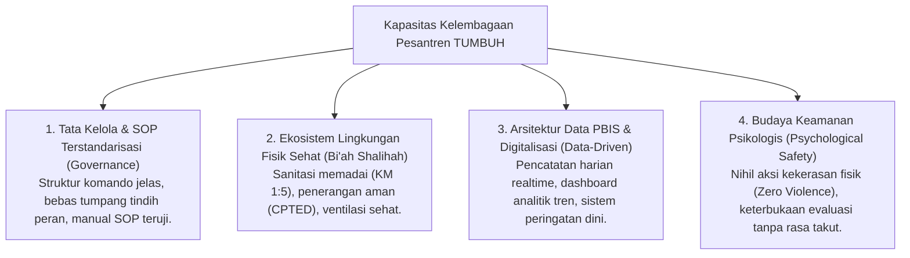

# P3-01-04-Standar-Kapasitas-Kelembagaan-Pesantren

## Tujuan
Menetapkan **Standar Kapasitas Kelembagaan Pesantren** (*Institutional Capacity Standards*) dalam ekosistem TUMBUH, mentransformasikan pondok pesantren dari sistem manajemen tradisional reaktif menjadi **Organisasi Pembelajar (*Learning Organization*)** yang berbasis data, akuntabel, dan aman (*Psychological Safety*).

---

## 1. 4 Dimensi Kapasitas Kelembagaan Pesantren TUMBUH

---

## 2. Matriks Tolok Ukur Kematangan Kelembagaan

| Level Kematangan | Tata Kelola SOP | Pengelolaan Data Perilaku | Iklim Budaya Pesantren |
| :--- | :--- | :--- | :--- |
| **Level 1 (Tradisional)** | SOP tidak tertulis, instruksi lisan bergantung individu Kyai/Ustadz. | Catatan kertas manual, insidental saat terjadi kasus besar. | Disiplin berbasis rasa takut hukuman fisik & senioritas feodal. |
| **Level 2 (Transisional)** | SOP tertulis mulai disosialisasikan, masih ada tumpang tindih peran. | Catatan spreadsheet digital, evaluasi bulanan mulai berjalan. | Hukuman fisik dilarang, namun musyrif masih sering membentak. |
| **Level 3 (TUMBUH Penuh)** | SOP ramping terstandarisasi, pembagian peran Musyrif vs BK sangat jelas. | Logbook digital realtime (<30 detik), heatmap PBIS dianalisis tiap pekan. | **Budaya Qudwah & Disiplin Restoratif murni**, rasio positif 4:1 berjalan alami. |

---

## 3. Status Dokumen
* **Status**: 🌟 **A+ (Tervalidasi & Siap Diimplementasikan)**
* **Level**: Project 3 - `03 Capacity Framework / 01 Graduate Profile`
* **Langkah Berikutnya**: **`P3-01-05-Sintesis-Graduate-Profile-TUMBUH.md`**.
