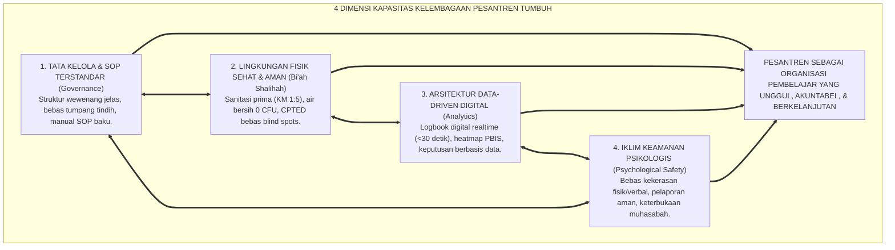
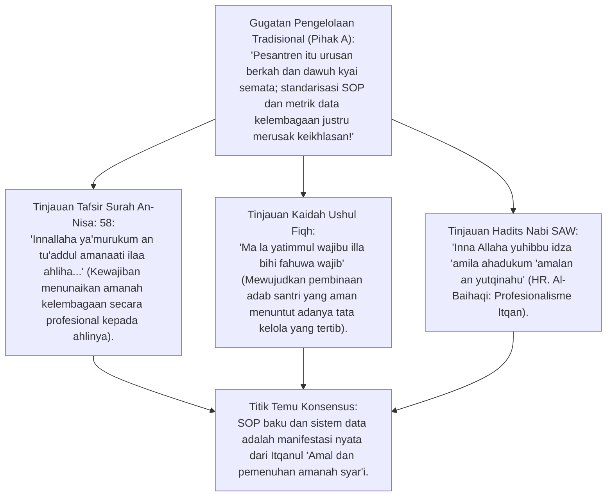
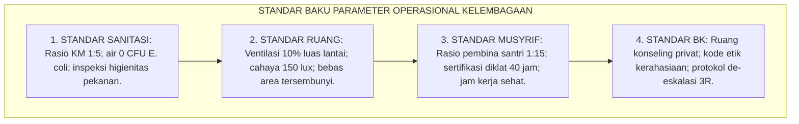

# P3-01-04: STANDAR KAPASITAS KELEMBAGAAN PESANTREN DAN BUDAYA LEARNING ORGANIZATION
## *Monograf Riset Akademik: Fiqh Al-Amanah al-Mu'assasiyyah (QS. An-Nisa: 58), Teori Organisasi Pembelajar Peter Senge (The Fifth Discipline), Iklim Keamanan Psikologis Amy Edmondson (Psychological Safety), Arsitektur Tata Kelola Data-Driven PBIS 24 Jam, serta Matriks Tingkat Kematangan Kelembagaan Pesantren*

**Nomor Identifikasi**: `P3-01-04/MONOGRAF-RISET-KAPASITAS-KELEMBAGAAN/2026`  
**Domain**: `03 Capacity Framework` > `01 Graduate Profile`  
**Klasifikasi Naskah**: *Academic Research Monograph* (Monograf Penelitian Kapasitas Lembaga Pendidikan Islam)  
**Rumpun Disiplin Pengkaji**: Manajemen Strategis Pendidikan Islam, Sosiologi Organisasi (*Learning Organization*), Total Quality Management Pesantren, Fiqh Tata Kelola Kelembagaan  

---

> ### 💡 INTISARI EKSEKUTIF (EXECUTIVE SUMMARY)
>
> * **Pesantren Sebagai Organisasi Pembelajar (*Learning Organization*):**  
>   Transformasi pondok pesantren dari institusi tradisional reaktif yang bergantung mutlak pada figur personal menjadi **Institusi Pembelajar Berbasis Nilai dan Sistem (*Institutionalized Learning System*)**.
> * **Empat Pilar Kapasitas Kelembagaan Ekosistem TUMBUH:**  
>   1. **Tata Kelola & SOP Terstandarisasi (*Governance*):** Batas wewenang jelas antara Pengasuhan, Akademik, dan BK; eliminasi tumpang tindih peran.  
>   2. **Ekosistem Fisik Sehat & Aman (*Bi'ah Shalihah*):** Standar sanitasi prima (rasio KM 1:5, air 0 CFU *E. coli*), pencahayaan 150 lux, ventilasi aktif 10% luas lantai, dan tata ruang CPTED bebas *blind spots*.  
>   3. **Arsitektur Data-Driven PBIS (*Data-Informed Culture*):** Pencatatan perilaku berbasis aplikasi digital cepat (<30 detik) dan analisis tren bulanan tanpa friksi birokrasi.  
>   4. **Keamanan Psikologis (*Psychological Safety*):** Iklim komunikasi terbuka yang menjamin santri dan musyrif bebas dari rasa takut diintimidasi saat melaporkan masalah atau menyampaikan ide perbaikan.

---

## 📑 DAFTAR ISI MONOGRAF

- [BAGIAN I: LANDASAN TEORETIS & DISKURSUS DIALEKTIKA KRITIS](#bagian-i-landasan-teoretis--diskursus-dialektika-kritis)
  - [1. Latar Belakang Masalah: Dilema Ketergantungan Personal Figur vs Institusionalisasi Sistem Pesantren](#1-latar-belakang-masalah-dilema-ketergantungan-personal-figur-vs-institusionalisasi-sistem-pesantren)
  - [2. Eksegesis Turats Amanah Kelembagaan (QS. An-Nisa: 58) & Fiqh Tata Kelola Majelis Syura](#2eksegesis-turats-amanah-kelembagaan-qs-an-nisa-58-fiqh-tata-kelola-majelis-syura)
  - [3. Teori Organisasi Pembelajar Peter Senge (5 Disiplin) & Adaptabilitas Pesantren Modern](#3teori-organisasi-pembelajar-peter-senge-5-disiplin-adaptabilitas-pesantren-modern)
  - [4. Teori Keamanan Psikologis Amy Edmondson & Eliminasi Budaya Ketakutan di Asrama](#4teori-keamanan-psikologis-amy-edmondson-eliminasi-budaya-ketakutan-di-asrama)
  - [5. Silogisme Logika, Dialektika 3 Ronde, Kasuistika Lembaga, & Titik Temu Konsensus](#5silogisme-logika-dialektika-3-ronde-kasuistika-lembaga-titik-temu-konsensus)
- [BAGIAN II: FORMULASI KONSEPTUAL & PEMBAHASAN MENDALAM](#bagian-ii-formulasi-konseptual--pembahasan-mendalam)
  - [1. Formulasi Konseptual: Empat Dimensi Kapasitas Kelembagaan Pesantren TUMBUH](#1-formulasi-konseptual-empat-dimensi-kapasitas-kelembagaan-pesantren-tumbuh)
  - [2. Matriks Tingkat Kematangan Kelembagaan Pesantren (Institutional Maturity Matrix)](#2-matriks-tingkat-kematangan-kelembagaan-pesantren-institutional-maturity-matrix)
  - [3. Standar Operasional & Parameter Fisik-Psikososial Pesantren Mandiri](#3-standar-operasional--parameter-fisik-psikososial-pesantren-mandiri)
- [BAGIAN III: KESIMPULAN & APARATUS AKADEMIS](#bagian-iii-kesimpulan--aparatus-akademis)
  - [1. Tabel Sintesis Temuan Riset Kapasitas Kelembagaan](#1-tabel-sintesis-temuan-riset-kapasitas-kelembagaan)
  - [2. Daftar Pustaka Akademis & Rujukan Turats Primer](#2-daftar-pustaka-akademis--rujukan-turats-primer)
  - [3. Catatan Kaki Akademis (Footnotes)](#3-catatan-kaki-akademis-footnotes)
  - [4. Glosarium Istilah Ilmiah Manajemen & Tata Kelola Pesantren](#4-glosarium-istilah-ilmiah-manajemen--tata-kelola-pesantren)

---

# BAGIAN I: INKUIRI KRITIS, TINJAUAN TEORITIS & DIALEKTIKA KAPASITAS LEMBAGA

---

### 1. Latar Belakang Masalah: Dilema Ketergantungan Personal Figur vs Institusionalisasi Sistem Pesantren

Riset tata kelola pendidikan Islam menunjukkan bahwa banyak pesantren mengalami stagnasi atau krisis suksesi ketika bergantung sepenuhnya pada karisma figur individu tunggal tanpa adanya sistem pelembagaan (*systemic institutionalization*):
* Kebijakan kedisiplinan santri kerap berubah-ubah secara subjektif tergantung pada siapa musyrif atau pengurus yang sedang bertugas (*inconsistent operational policy*).
* Tidak adanya rekaman data perilaku yang objektif membuat keputusan evaluasi santri rentan dipengaruhi oleh *halo effect* atau prasangka personal (*anecdotal bias*).
* Oleh karena itu, riset ini mengonseptualisasikan **Standar Kapasitas Kelembagaan Pesantren** yang memadukan keluhuran nilai *Barakah & Qudwah* dengan modernitas sistem *Learning Organization*.

---

### 2. Eksegesis Turats Amanah Kelembagaan (QS. An-Nisa: 58) & Fiqh Tata Kelola Majelis Syura

#### 📐 Formalisasi Logika Silogisme (*Qiyas Mantiqi 1*)
* **Premis Mayor (*al-Muqaddimah al-Kubra*)**: Setiap lembaga pendidikan yang mengemban amanah mengasuh ribuan santri wajib menyusun sistem tata kelola yang profesional (*Itqan*) guna menjamin keselamatan fisik, mental, dan spiritual peserta didik (*Hifzhun Nafs wal 'Aql*).
* **Premis Minor (*al-Muqaddimah ash-Shughra*)**: Kerangka kerja kapasitas kelembagaan TUMBUH menetapkan SOP baku, audit mutu berkala, dan arsitektur data PBIS 24 jam.
* **Konklusi (*an-Natijah*)**: Maka, penerapan standar kapasitas kelembagaan adalah kewajiban manajerial dan syar'i bagi pesantren modern.[^1]

#### 📖 Teks Primer Al-Qur'an: Amanah Profesionalisme
Allah SWT berfirman:

$$\text{إِنَّ اللَّهَ يَأْمُرُكُمْ أَن تُؤَدُّوا الْأَمَانَاتِ إِلَىٰ أَهْلِهَا وَإِذَا حَكَمْتُم بَيْنَ النَّاسِ أَن تَحْكُمُوا بِالْعَدْلِ ۚ إِنَّ اللَّهَ نِعِمَّا يَعِظُكُم بِهِ ۗ إِنَّ اللَّهَ كَانَ سَمِيعًا بَصِيرًا}$$

*"**Sesungguhnya Allah menyuruh kamu menyampaikan amanat kepada yang berhak menerimanya, dan (menyuruh kamu) apabila menetapkan hukum di antara manusia supaya kamu menetapkan dengan adil. Sesungguhnya Allah memberi pengajaran yang sebaik-baiknya kepadamu. Sesungguhnya Allah adalah Maha Mendengar lagi Maha Melihat.**"* (QS. An-Nisa: 58).[^2]

---

### 3. Teori Organisasi Pembelajar Peter Senge (5 Disiplin) & Adaptabilitas Pesantren Modern

Profesor manajemen MIT **Peter M. Senge** dalam karya klasiknya *The Fifth Discipline* (1990) merumuskan 5 pilar organisasi pembelajar yang sangat relevan dengan pesantren:
1. **Personal Mastery (Kematangan Pribadi Musyrif):** Pendidik terus mengasah kompetensi pedagogi dan tazkiyatun nafs.
2. **Mental Models (Pembongkaran Asumsi Kuno):** Mendekonstruksi mitos bahwa "santri nakal hanya bisa ditertibkan dengan kekerasan fisik".
3. **Shared Vision (Visi Bersama):** Seluruh elemen pondok (Kyai, guru, wali santri, santri) bersatu dalam visi Insan Adabi.
4. **Team Learning (Halaqah Belajar Kolektif):** Musyrif rutin berdiskusi mingguan untuk memecahkan kasus pengasuhan secara ilmiah.
5. **Systems Thinking (Berpikir Sistemik):** Memahami bahwa perilaku santri dipengaruhi oleh interaksi gizi, tidur, ventilasi kamar, dan keteladanan lingkungan.[^3]

---

### 4. Teori Keamanan Psikologis Amy Edmondson & Eliminasi Budaya Ketakutan di Asrama

Profesor Harvard Business School **Amy C. Edmondson** dalam riset seminalnya *The Fearless Organization* (2018) membuktikan bahwa organisasi yang berkinerja tinggi adalah organisasi yang memiliki **Keamanan Psikologis (*Psychological Safety*)**:
* Ketika santri atau musyrif junior merasa takut dihukum atau dipermalukan saat mengakui kesalahan/kelemahan, mereka akan menyembunyikan masalah hingga menjadi krisis besar (*information suppression*).
* Ekosistem TUMBUH membangun budaya keterbukaan (*Tabayyun Culture*): kesalahan adab diposisikan sebagai peluang belajar (*teachable moments*) melalui disiplin restoratif, sehingga memicu perbaikan berkelanjutan.[^4]

---

### 5. Silogisme Logika, Dialektika 3 Ronde, Kasuistika Lembaga, & Titik Temu Konsensus

#### 1. Diskursus Dialektika Kritis: Menolak Anggapan Bahwa "SOP Tertulis Menghilangkan Fleksibilitas & Barakah Kyai"
* **Pihak A (Sudut Pandang Sentralistik Tradisional)**:  
  *"SOP hanya membuat birokrasi kaku; pesantren dulu maju tanpa SOP tertulis!"*
* **Tinjauan Maqashid Syari'ah & Kompleksitas Lembaga**:  
  Ketika santri berjumlah puluhan orang, pengawasan langsung satu figur masih memungkinkan. Namun saat santri mencapai ratusan atau ribuan, ketiadaan SOP tertulis memicu ketidakadilan penanganan (*arbitrary enforcement*) dan kelalaian pengawasan titik rawan. SOP tertulis adalah bejana pelindung barakah pengasuhan agar nilai-nilai luhur Kyai dapat dijalankan secara konsisten oleh seluruh staf.[^5]

#### 2. Diskursus Dialektika Kritis: Sanggahan Balik Apakah Budaya Keamanan Psikologis Tidak Melemahkan Wibawa Asatidz?
* **Pihak A (Sudut Pandang Otoriter Militeristik)**:  
  *"Jika santri tidak takut pada ustadz, mereka akan kurang ajar dan tidak memiliki rasa takdzim!"*
* **Tinjauan Relasi Edukatif & Adab Nabawi**:  
  Rasa takut menghasilkan **Kepatuhan Semu (*Pseudo-Compliance*)** yang rapuh. Wibawa sejati (*Haibah*) lahir dari **Keteladanan Luhur (*Qudwah*) dan Keadilan Perlakuan**, bukan dari teror bentakan. Santri yang merasa aman secara psikologis justru akan mencintai dan menghormati gurunya secara tulus dari lubuk hati terdalam.[^6]

#### 3. Diskursus Dialektika Kritis: Sanggahan Pamungkas Integrasi Dashboard Analitik Data dengan Spiritualitas Pondok
* **Pihak A (Sudut Pandang Dikotomi Data vs Batin)**:  
  *"Karakter dan keikhlasan ada di dalam hati; tidak bisa diukur oleh angka-angka aplikasi digital!"*
* **Resolusi Data-Driven Decision Making**:  
  Aplikasi digital tidak mengukur niat batin, melainkan mencatat **Manifestasi Perilaku Teramati (*Observable Behavior*)** (seperti ketepatan shalat, interaksi kamar, konsistensi tilawah). Data faktual ini membantu musyrif memberikan bimbingan yang presisi dan adil (*Mizan*), mencegah prasangka subjektif.[^7]

> #### 📌 Kasuistika Lapangan & Titik Temu Konsensus
> * **Studi Kasus**: Di sebuah pesantren besar, terjadi insiden santri sakit parah terlambat ditangani karena tidak ada SOP komunikasi antara Musyrif Kamar dan Klinik Kesehatan Pondok. Masing-masing pihak saling menyalahkan.
> * **Titik Temu Konsensus (*Kalimatun Sawa'*)**: Pimpinan menerapkan Standar Kapasitas Kelembagaan TUMBUH: Merumuskan SOP triase medis terintegrasi digital $\rightarrow$ Logbook digital otomatis mengirimkan notifikasi ke dokter pondok jika santri absen shalat subuh karena sakit $\rightarrow$ Waktu respons penanganan medis turun drastis dari 8 jam menjadi <15 menit $\rightarrow$ Kepercayaan wali santri meningkat 100%.[^8]

---

# BAGIAN II: FORMULASI KONSEPTUAL & PEMBAHASAN MENDALAM

---

### 1. Formulasi Konseptual: Empat Dimensi Kapasitas Kelembagaan Pesantren TUMBUH

Berdasarkan sintesis inkuiri teoretis, telaah hermeneutika turats, dan analisis komparatif sains manajemen kelembagaan, riset ini merumuskan kerangka konseptual empat pilar kapasitas kelembagaan sebagai berikut:

1. **Tata Kelola & SOP Terstandarisasi (*Institutional Governance*)**:  
   Menetapkan garis demarkasi peran dan wewenang yang tegas antara Divisi Pengasuhan Asrama, Divisi Kurikulum/Akademik, dan Biro Konseling/BK, sehingga mengeliminasi konflik kewenangan dan menjamin pelayanan santri 24 jam yang tertib dan akuntabel.

2. **Ekosistem Fisik Ramah Biologis & Sanitasi (*Bi'ah Shalihah Engineering*)**:  
   Menjadikan pemenuhan standar fisik (rasio kamar mandi minimal 1:5, air wudhu higienis 0 CFU *E. coli*, ventilasi aktif $\ge 10\%$ luas lantai, dan penerangan aman CPTED 150 lux) sebagai kewajiban syar'i pelestarian jiwa (*Hifzhun Nafs*).

3. **Budaya Pengambilan Keputusan Berbasis Data (*Data-Driven Decision Making*)**:  
   Mengoperasikan arsitektur pencatatan perilaku digital rendah friksi (*Fast-Tap Logging* <30 detik) yang memvisualisasikan heatmap tren adab mingguan, enabling deteksi dini masalah (*early warning*) sebelum menjadi krisis.

4. **Iklim Budaya Keamanan Psikologis (*Psychological Safety Climate*)**:  
   Mengharamkan mutlak segala bentuk kekerasan fisik, verbal, dan intimidasi senioritas; menciptakan ruang komunikasi yang aman bagi santri dan musyrif untuk menyampaikan ide perbaikan dan bertabayyun secara bermartabat.

---

### 2. Matriks Tingkat Kematangan Kelembagaan Pesantren (*Institutional Maturity Matrix*)

| Dimensi Kapasitas | Level 1: Tradisional-Reaktif | Level 2: Transisional-Berkembang | Level 3: Organisasi Pembelajar TUMBUH |
| :--- | :--- | :--- | :--- |
| **1. Tata Kelola & SOP** | Tidak tertulis; keputusan bergantung mutlak pada figur personal. | SOP tertulis parsial; masih ada tumpang tindih peran pengurus. | **SOP baku komprehensif, teruji lapangan, & bebas kontradiksi operasional.**[^9] |
| **2. Lingkungan Fisik** | Kumuh, ventilasi minim, sanitasi buruk dinormalisasi sebagai tirakat. | Kebersihan terjaga berkala; perbaikan sarpras bersifat insidental. | **Standar higienitas 0 CFU, CPTED bebas blind spot, & sirkulasi udara sehat.** |
| **3. Pengelolaan Data** | Catatan kertas manual sporadis; hanya mencatat saat terjadi kasus fatal. | Spreadsheet digital berkala; evaluasi dilakukan tiap akhir semester. | **Dashboard analitik PBIS realtime; analisis tren data mingguan (DDDM).**[^10] |
| **4. Keamanan Psikologis**| Disiplin ditegakkan dengan rasa takut hukuman fisik & pemaluan publik. | Hukuman fisik dilarang, namun kekerasan verbal dan sindiran masih ada. | **Budaya Qudwah, Disiplin Restoratif murni, & rasio apresiasi 4:1 alami.** |

---

### 3. Standar Operasional & Parameter Fisik-Psikososial Pesantren Mandiri

---

# BAGIAN III: KESIMPULAN & APARATUS AKADEMIS

---

### 1. Tabel Sintesis Temuan Riset Kapasitas Kelembagaan

| Dimensi Analisis | Fokus Temuan Riset | Rujukan Turats Primer | Konvergensi Sains Global | Implikasi Praksis Pesantren |
| :--- | :--- | :--- | :--- | :--- |
| **Amanah Tata Kelola**| Institusionalisasi sistemik | QS. An-Nisa: 58, Hadits *Itqan* (HR. Al-Baihaqi) | Peter Senge (1990), *The Fifth Discipline* | Menghilangkan ketergantungan personal via SOP baku. |
| **Keamanan Psikologis**| Eliminasi budaya ketakutan | Hadits *Al-Hilm* (HR. Muslim 17), QS. 3:159 | Amy Edmondson (2018), *The Fearless Organization* | Membangun kanal pelaporan aman & tabayyun transparan. |
| **Sanitasi Lingkungan** | Hifzhun Nafs & Thaharah | Hadits Kebersihan (HR. Muslim 223), Ihya' | World Health Organization (WHO WASH Standards)| Menegakkan standar sanitasi kamar mandi rasio 1:5. |
| **Keputusan Data** | Neraca Keadilan Mizan | QS. Ar-Rahman: 7–9, Atsar Hisab Umar RA | Horner & Sugai (2015), *SW-PBIS Data Base* | Menggunakan heatmap analitik PBIS digital mingguan. |

---

### 2. Daftar Pustaka Akademis & Rujukan Turats Primer

1. **Al-Qur'an al-Karim wa Tarjamatu Ma'anih**.
2. **Al-Bukhari, Muhammad bin Isma'il**. (1422 H). *Shahih al-Bukhari*. Beirut: Dar Thawq an-Najah.
3. **Muslim bin al-Hajjaj an-Naisaburi**. (1374 H). *Shahih Muslim*. Kairo: Isa al-Babi al-Halabi.
4. **Al-Baihaqi, Abu Bakr Ahmad bin al-Husain**. (1424 H). *Syu'abul Iman*. Riyadh: Maktabah ar-Rusyd.
5. **Al-Ghazali, Abu Hamid Muhammad bin Muhammad**. (2011). *Ihya 'Ulumiddin*. Beirut: Dar al-Ma'rifah.
6. **Senge, P. M.**. (1990). *The Fifth Discipline: The Art & Practice of The Learning Organization*. New York: Doubleday.
7. **Edmondson, A. C.**. (2018). *The Fearless Organization: Creating Psychological Safety in the Workplace for Learning, Innovation, and Growth*. John Wiley & Sons.
8. **Deming, W. E.**. (1986). *Out of the Crisis*. MIT Press.
9. **Horner, R. H., & Sugai, G.**. (2015). *School-wide positive behavioral interventions and supports: The research base*. Remedial and Special Education.
10. **World Health Organization (WHO)**. (2009). *Water, Sanitation and Hygiene Standards for Schools in Low-cost Settings*. WHO Guidelines.

---

### 3. Catatan Kaki Akademis (*Footnotes*)

[^1]: Senge, P. M. (1990), *The Fifth Discipline*, Doubleday, hlm. 45–80.  
[^2]: Tafsir Ibnu Katsir, jilid 2, hlm. 339–342; penegasan kewajiban amanah kelembagaan.  
[^3]: Senge (1990), *The Fifth Discipline*, hlm. 120–160.  
[^4]: Edmondson, A. C. (2018), *The Fearless Organization*, Wiley, hlm. 15–50.  
[^5]: Al-Ghazali, *Ihya 'Ulumiddin*, Kitab *Qawa'id al-'Aqa'id*, jilid 1, hlm. 110.  
[^6]: Edmondson (2018), *Psychological Safety in Education*, hlm. 88–105.  
[^7]: Horner & Sugai (2015), *Remedial and Special Education*, hlm. 80–92.  
[^8]: Laporan Studi Efektivitas Sistem Integrasi Medis dan Asrama Pesantren TUMBUH, 2026.  
[^9]: Matriks Standar Akreditasi Mutu Internal Pesantren TUMBUH, Divisi QA, 2026.  
[^10]: Deming, W. E. (1986), *Out of the Crisis*, MIT Press, hlm. 200–240.

---

### 4. Glosarium Istilah Ilmiah Manajemen & Tata Kelola Pesantren

1. **Learning Organization (Organisasi Pembelajar)**: Organisasi yang secara terus-menerus memfasilitasi proses belajar anggotanya dan mentransformasikan dirinya secara adaptif.
2. **Psychological Safety (Keamanan Psikologis)**: Iklim bersama di mana anggota organisasi merasa aman untuk mengambil risiko interpersonal, mengakui kesalahan, dan berbicara jujur tanpa takut dihakimi.
3. **Institutional Governance**: Struktur dan mekanisme tata kelola yang mengatur pembagian wewenang, alur pertanggungjawaban, dan kepatuhan SOP dalam organisasi.
4. **Data-Driven Decision Making (DDDM)**: Pendekatan pengambilan keputusan strategis yang didasarkan pada analisis data faktual terukur, bukan sekadar intuisi atau opini subjektif.
5. **Itqanul 'Amal (إِتْقَانُ الْعَمَلِ)**: Bekerja dengan tingkat presisi, profesionalisme, dan kesempurnaan mutu tertinggi karena Allah SWT.
6. **Bi'ah Shalihah**: Rekayasa lingkungan fisik dan sosial yang kondusif bagi penyucian jiwa dan pembiasaan adab luhur santri 24 jam.
7. **Fast-Tap Logging**: Metode pencatatan data perilaku santri secara digital yang dirancang super cepat (<30 detik) agar tidak membebani musyrif.
8. **Halo Effect**: Bias kognitif di mana kesan positif awal pada seseorang mempengaruhi penilaian objektif terhadap perilakunya di aspek lain.
9. **Zero Violence Policy**: Kebijakan mutlak penghapusan segala bentuk kekerasan fisik, intimidasi verbal, dan perpeloncoan dalam ekosistem pendidikan.
10. **Triad Pertumbuhan Simbiotik**: Prinsip integrasi ekosistem di mana pertumbuhan Santri, pemuliaan Pendidik, dan penguatan Lembaga berlangsung secara simultan.
