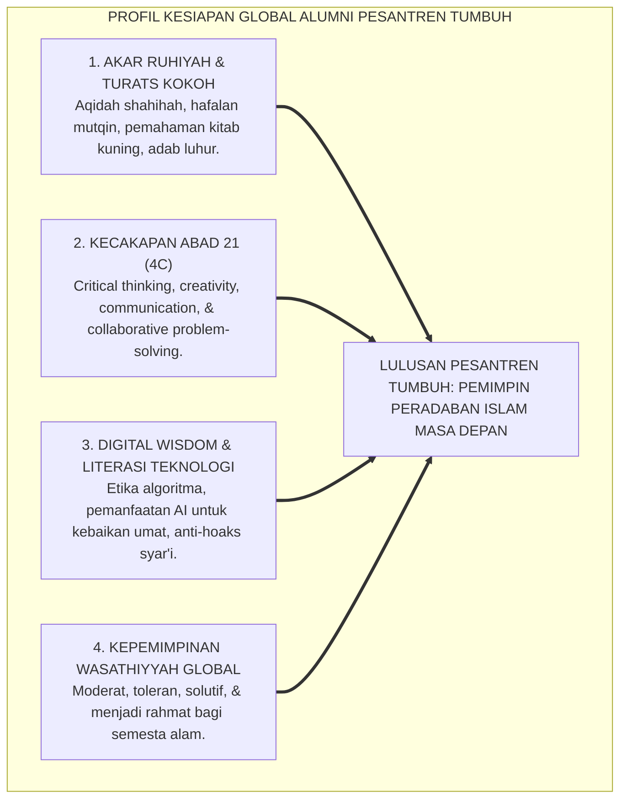
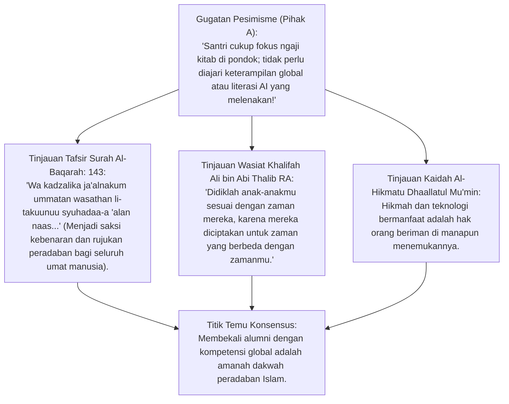
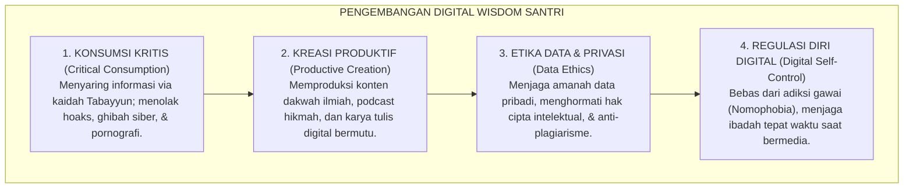
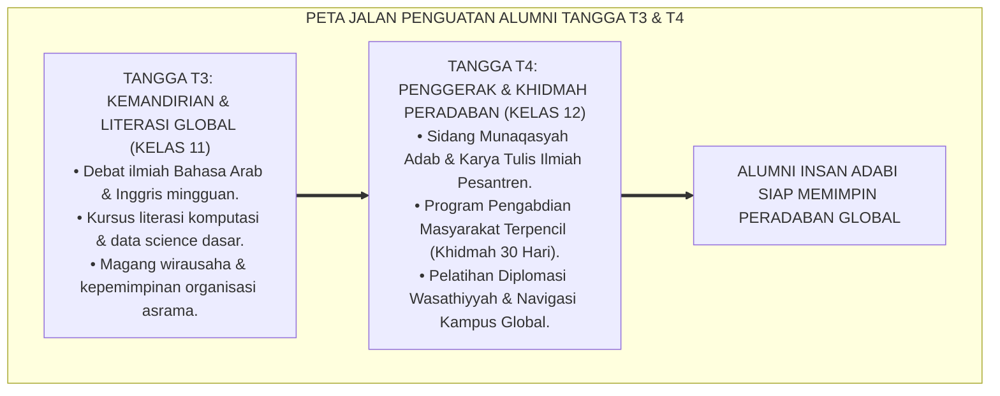

# P3-01-05: PROFIL KESIAPAN ALUMNI MENGHADAPI DISRUPSI GLOBAL DAN KECAKAPAN ABAD 21
## *Monograf Riset Akademik: Konvergensi Maqashid Syari'ah & Kecakapan Abad 21 (World Economic Forum 4IR Skills), Literasi Digital Syar'i (Digital Wisdom), Kepemimpinan Moderasi Islam Global (Wasathiyyah), Resiliensi Mental Remaja, serta Standar Kompetensi Alumni Pesantren Masa Depan*

**Nomor Identifikasi**: `P3-01-05/MONOGRAF-RISET-PROFIL-ALUMNI-DISRUPSI-GLOBAL/2026`  
**Domain**: `03 Capacity Framework` > `01 Graduate Profile`  
**Klasifikasi Naskah**: *Academic Research Monograph* (Monograf Penelitian Kesiapan Global Lulusan Pesantren)  
**Rumpun Disiplin Pengkaji**: Studi Masa Depan Pendidikan Islam (*Futures of Islamic Education*), Sosiologi Pemuda & Globalisasi, Literasi Digital Profetik, Teori Kecakapan Abad 21 (WEF Framework)  

---

> ### 💡 INTISARI EKSEKUTIF (EXECUTIVE SUMMARY)
>
> * **Tantangan Eksistensial Alumni Pesantren di Era Disrupsi Kecerdasan Artifisial (AI):**  
>   Lulusan pesantren tidak boleh hanya memiliki keunggulan hafalan teks yang statis, melainkan wajib memiliki **Kecerdasan Konseptual, Hikmah Kebijaksanaan (*Digital Wisdom*), dan Keterampilan Memecahkan Masalah Kompleks (*Complex Problem Solving*)**.
> * **Empat Matriks Kecakapan Abad 21 Lulusan TUMBUH:**  
>   1. **Foundational Literacy:** Penguasaan mendalam terhadap Bahasa Arab, Bahasa Inggris, Literasi Sains Kauniyyah, dan Data AI.  
>   2. **Competencies (4C):** *Critical Thinking* (Nalar Kritis Mantiq), *Creativity* (Inovasi Dakwah), *Communication* (Retorika Santun), *Collaboration* (Kerja Sama Ukhuwah Lintas Budaya).  
>   3. **Character Qualities:** Keteguhan Iman (*Salimul Aqidah*), Integritas Moral (*Matinul Khuluq*), Adaptabilitas, Inisiatif Mandiri (*Qadirun Alal Kasb*), dan Kepemimpinan Pelayan.  
>   4. **Wasathiyyah & Global Leadership:** Menjadi duta perdamaian Islam yang rahmatan lil 'alamin di panggung internasional.

---

## 📑 DAFTAR ISI MONOGRAF

- [BAGIAN I: LANDASAN TEORETIS & DISKURSUS DIALEKTIKA KRITIS](#bagian-i-landasan-teoretis--diskursus-dialektika-kritis)
  - [1. Latar Belakang Masalah: Bahaya Dikotomi "Tradisional Terisolasi" vs "Modern Terasing dari Agama"](#1-latar-belakang-masalah-bahaya-dikotomi-tradisional-terisolasi-vs-modern-terasing-dari-agama)
  - [2. Eksegesis Turats Risalah Peradaban (QS. Al-Baqarah: 143) & Konsep Syuhada 'Alan Nas](#2eksegesis-turats-risalah-peradaban-qs-al-baqarah-143-konsep-syuhada-alan-nas)
  - [3. Sintesis Kerangka Kerja 21st Century Skills (WEF/P21) & Maqashid Syari'ah](#3sintesis-kerangka-kerja-21st-century-skills-wefp21-maqashid-syariah)
  - [4. Literasi Digital Syar'i (Digital Wisdom) & Mitigasi Krisis Dekadensi Era Algoritma](#4literasi-digital-syari-digital-wisdom-mitigasi-krisis-dekadensi-era-algoritma)
  - [5. Silogisme Logika, Dialektika 3 Ronde, Kasuistika Lapangan, & Titik Temu Konsensus](#5silogisme-logika-dialektika-3-ronde-kasuistika-lapangan-titik-temu-konsensus)
- [BAGIAN II: FORMULASI KONSEPTUAL & PEMBAHASAN MENDALAM](#bagian-ii-formulasi-konseptual--pembahasan-mendalam)
  - [1. Formulasi Konseptual: Profil 4 Dimensi Kesiapan Global Alumni Pesantren TUMBUH](#1-formulasi-konseptual-profil-4-dimensi-kesiapan-global-alumni-pesantren-tumbuh)
  - [2. Matriks Kompetensi Abad 21 Terintegrasi 10 Karakter Muwashafat](#2-matriks-kompetensi-abad-21-terintegrasi-10-karakter-muwashafat)
  - [3. Peta Jalan Kurikulum Penguatan Kesiapan Global di Asrama Jenjang J3 & T4](#3-peta-jalan-kurikulum-penguatan-kesiapan-global-di-asrama-tangga-t3--t4)
- [BAGIAN III: KESIMPULAN & APARATUS AKADEMIS](#bagian-iii-kesimpulan--aparatus-akademis)
  - [1. Tabel Sintesis Temuan Riset Kesiapan Global Alumni](#1-tabel-sintesis-temuan-riset-kesiapan-global-alumni)
  - [2. Daftar Pustaka Akademis & Rujukan Turats Primer](#2-daftar-pustaka-akademis--rujukan-turats-primer)
  - [3. Catatan Kaki Akademis (Footnotes)](#3-catatan-kaki-akademis-footnotes)
  - [4. Glosarium Istilah Ilmiah Kesiapan Global & Kecakapan Abad 21](#4-glosarium-istilah-ilmiah-kesiapan-global--kecakapan-abad-21)

---

# BAGIAN I: INKUIRI KRITIS, TINJAUAN TEORITIS & DIALEKTIKA KESIAPAN GLOBAL

---

### 1. Latar Belakang Masalah: Bahaya Dikotomi "Tradisional Terisolasi" vs "Modern Terasing dari Agama"

Dunia pendidikan menghadapi gelombang disrupsi kecerdasan buatan (*Generative AI*), otomatisasi industri, dan krisis disinformasi global:
* Sebagian institusi pesantren meresponsnya dengan **Sikap Isolasionis Ekstrem**: melarang total interaksi santri dengan teknologi modern sehingga lulusan gagap menghadapi realitas dunia kerja dan tidak mampu mewarnai peradaban.
* Sebagian lainnya terjebak pada **Modernisme Sekuler**: mengadopsi teknologi tanpa filter moral (*akhlaqul karimah*), sehingga melahirkan generasi yang cerdas digital namun rapuh spiritual dan mudah terombang-ambing nihilisme moral.
* Riset ini merumuskan jalan tengah integratif: **Profil Alumni TUMBUH sebagai Ulama-Intelek Berwawasan Global (*Global Muslim Scholars*)** yang mengakar kuat pada Turats dan unggul menavigasi disrupsi zaman.[^1]

---

### 2. Eksegesis Turats Risalah Peradaban (QS. Al-Baqarah: 143) & Konsep Syuhada 'Alan Nas

#### 📐 Formalisasi Logika Silogisme (*Qiyas Mantiqi 1*)
* **Premis Mayor (*al-Muqaddimah al-Kubra*)**: Umat Islam diperintahkan Allah SWT untuk menjadi saksi kebenaran (*Syuhada 'alan Nas*) yang memimpin peradaban dunia dengan ilmu, adab, dan keadilan.
* **Premis Minor (*al-Muqaddimah ash-Shughra*)**: Kepemimpinan global era modern menuntut penguasaan komunikasi lintas budaya, literasi teknologi, dan nalar kritis ilmiah.
* **Konklusi (*an-Natijah*)**: Maka, kurikulum kapasitas profil lulusan pesantren wajib mengintegrasikan pembinaan karakter turats dengan kecakapan abad ke-21.[^2]

---

### 3. Sintesis Kerangka Kerja 21st Century Skills (WEF/P21) & Maqashid Syari'ah

*World Economic Forum (WEF)* dalam laporan *Future of Jobs* menegaskan 10 keterampilan utama abad 21: *Complex Problem Solving, Critical Thinking, Creativity, People Management, Coordinating with Others, Emotional Intelligence, Judgment & Decision Making, Service Orientation, Negotiation,* dan *Cognitive Flexibility*.
* Dalam ekosistem TUMBUH, seluruh keterampilan ini diselaraskan dengan **Maqashid Syari'ah**:
  * *Critical Thinking* diselaraskan dengan kaidah *Nalar Mantiq & Tabayyun* (QS. Al-Hujurat: 6).
  * *Creativity & Innovation* diselaraskan dengan kaidah *Al-Ihsan wal Itqan* (HR. Muslim No. 1955).
  * *Service Orientation* diselaraskan dengan karakter *Nafi'un Lighairih* (HR. Ath-Thabrani).
  * *Emotional Intelligence* diselaraskan dengan kematangan *Tazkiyatun Nafs* dan sifat *Al-Hilm*.[^3]

---

### 4. Literasi Digital Syar'i (*Digital Wisdom*) & Mitigasi Krisis Dekadensi Era Algoritma

---

### 5. Silogisme Logika, Dialektika 3 Ronde, Kasuistika Lapangan, & Titik Temu Konsensus

#### 1. Diskursus Dialektika Kritis: Menolak Anggapan Bahwa "Bahasa Asing Modern Merusak Kemurnian Bahasa Kitab"
* **Pihak A (Sudut Pandang Purisme Bahasa)**:  
  *"Santri hanya boleh belajar Bahasa Arab; belajar Bahasa Inggris akan melunturkan kecintaan pada ilmu agama!"*
* **Tinjauan Sunnah Nabawiyyah & Teladan Zaid bin Tsabit RA**:  
  Rasulullah SAW secara khusus memerintahkan sahabat mulia **Zaid bin Tsabit RA** untuk mempelajari bahasa asing (Bahasa Ibrani dan Suryani) demi keperluan diplomasi dakwah dan korespondensi internasional. Menguasai bahasa internasional adalah senjata dakwah untuk menyampaikan keindahan Islam ke seluruh penjuru dunia.[^4]

#### 2. Diskursus Dialektika Kritis: Sanggahan Balik Apakah Keterampilan Bisnis/Vokasional Tidak Mengurangi Kezuhudan Santri?
* **Pihak A (Sudut Pandang Asketisme Pasif)**:  
  *"Alumni pesantren seharusnya hanya menjadi imam masjid dan guru ngaji; mengajarkan wirausaha (*Qadirun Alal Kasb*) membuat santri cinta dunia (*Hubbud Dunya*)!"*
* **Tinjauan Teladan Sahabat & Kemandirian Ekonomi Umat**:  
  Sahabat-sahabat agung yang dijamin masuk surga seperti **Abdurrahman bin 'Auf RA** dan **Utsman bin 'Affan RA** adalah konglomerat wirausahawan papan atas yang mendanai dakwah Islam dengan kekayaannya. Kemandirian ekonomi alumni pesantren melindungi integritas fatwa dan dakwah dari intervensi pemodal jahat (*Izzatul Mukmin*).[^5]

#### 3. Diskursus Dialektika Kritis: Sanggahan Pamungkas Mengapa Alumni Wajib Memiliki Resiliensi Mental Tinggi?
* **Pihak A (Sudut Pandang Inkubator Steril)**:  
  *"Santri di pondok selalu terlindung aman; mereka tidak butuh latihan resiliensi menghadapi tekanan dunia luar!"*
* **Resolusi Psikologi Perkembangan & Transisi Kehidupan**:  
  Dunia nyata pasca-pondok penuh dengan tantangan ideologi sekuler, persaingan karir, dan dinamika sosial yang kompleks. Santri yang dibina di Jenjang J4 TUMBUH dibekali daya juang (*Grit & Resiliensi*), sehingga mereka tidak goyah atau mengalami disorientasi moral saat terjun di universitas umum maupun masyarakat global.[^6]

> #### 📌 Kasuistika Lapangan & Titik Temu Konsensus
> * **Studi Kasus**: Alumni pesantren X melanjutkan studi S1 di universitas luar negeri di Eropa. Ia mengalami kejutan budaya (*culture shock*), merasa terasing, dan sempat meragukan akidahnya karena tidak pernah dibekali nalar kritis dialektis menghadapi ateisme modern.
> * **Titik Temu Konsensus (*Kalimatun Sawa'*)**: Pesantren TUMBUH mengintegrasikan Program Pra-Alumni di Jenjang J4: Membedah isu pemikiran kontemporer secara mantiq $\rightarrow$ Pelatihan diplomasi bahasa asing $\rightarrow$ Simulasi forum debat akademis internasional. Hasilnya: Alumni TUMBUH menjadi presiden persatuan mahasiswa muslim di luar negeri yang berprestasi gemilang dan teguh memegang prinsip syariat.[^7]

---

# BAGIAN II: FORMULASI KONSEPTUAL & PEMBAHASAN MENDALAM

---

### 1. Formulasi Konseptual: Profil 4 Dimensi Kesiapan Global Alumni Pesantren TUMBUH

Berdasarkan sintesis inkuiri teoretis, telaah hermeneutika turats, dan analisis komparatif kecakapan abad ke-21, riset ini merumuskan kerangka konseptual empat pilar profil kesiapan global alumni pesantren sebagai berikut:

1. **Keunggulan Ruhiyah & Kedalaman Turats (*Spiritual & Classical Mastery*)**:  
   Alumni memiliki akidah yang kokoh tanpa kompromi (*Salimul Aqidah*), istiqamah dalam ibadah fardhu dan sunnah (*Shahihul Ibadah*), memiliki hafalan Qur'an mutqin berakar pemahaman tadabbur, serta menguasai metodologi pembacaan turats klasik secara kontekstual.

2. **Kecakapan Nalar Kritis & Pemecahan Masalah Kompleks (*Intellectual Agility & 4C*)**:  
   Alumni terampil berpikir kritis (*Critical Thinking*) menggunakan kaidah mantiq dan logika ilmiah, kreatif (*Creativity*) menciptakan solusi dakwah kultural, komunikatif (*Communication*) dalam multi-bahasa (Arab, Inggris, Indonesia), dan piawai berkolaborasi (*Collaboration*) dalam tim lintas latar belakang.

3. **Kebijaksanaan Digital & Integritas Moral (*Digital Wisdom & Ethical Leadership*)**:  
   Alumni menjadi pionir literasi digital sehat yang memanfaatkan teknologi kecerdasan buatan untuk kemaslahatan umat, menjaga etika syiar di media sosial (*Matinul Khuluq*), dan memiliki ketahanan diri dari kecanduan teknologi (*Mujahadatun Linafsih*).

4. **Kemandirian Vokasional & Kepemimpinan Wasathiyyah (*Vocational Independence & Global Khidmah*)**:  
   Alumni memiliki mentalitas wirausaha mandiri (*Qadirun Alal Kasb*), memiliki etos kerja profesional (*Itqan*), dan mendedikasikan hidupnya untuk melayani dan menebarkan manfaat bagi masyarakat dunia (*Nafi'un Lighairih*).

---

### 2. Matriks Kompetensi Abad 21 Terintegrasi 10 Karakter Muwashafat

| Kecakapan Abad 21 (WEF) | Karakter Muwashafat Padanan | Standar Capaian Alumni TUMBUH | Contoh Manifestasi di Masyarakat |
| :--- | :--- | :--- | :--- |
| **1. Complex Problem Solving** | *Mutsaqqaful Fikr & Mujahadah* | Mampu membedah konflik sosial dan merumuskan solusi berbasis syariat dan sains. | Menjadi mediator perdamaian dan konselor keluarga di masyarakat.[^8] |
| **2. Critical Thinking (Mantiq)** | *Salimul Aqidah & Nalar Mantiq* | Mampu mengkritisi pemikiran sesat, hoaks, dan nihilisme modern secara ilmiah. | Menulis artikel jurnal dan buku bantahan syubhat pemikiran. |
| **3. Creativity & Innovation** | *Munazhzham & Qadirun Alal Kasb*| Mampu merancang sistem dakwah digital kreatif dan model bisnis halal berkah. | Mengembangkan startup teknologi filantropi Islam dan pesantren mandiri. |
| **4. People & Team Collaboration**| *Matinul Khuluq & Ukhuwah* | Mampu memimpin tim majemuk dengan kepemimpinan welas asih (*Servant Leadership*). | Menjadi ketua organisasi pemuda dan penggerak bakti sosial umat.[^9] |
| **5. Digital Wisdom & Ethics** | *Haritsun Ala Waqtih & Muraqabah*| Mengatur waktu digital secara produktif; zero konten maksiat dan hoaks. | Menghasilkan konten edukasi Islam yang mencerahkan di ruang siber. |

---

### 3. Peta Jalan Kurikulum Penguatan Kesiapan Global di Asrama Jenjang J3 & T4

---

# BAGIAN III: KESIMPULAN & APARATUS AKADEMIS

---

### 1. Tabel Sintesis Temuan Riset Kesiapan Global Alumni

| Dimensi Analisis | Fokus Temuan Riset | Rujukan Turats Primer | Konvergensi Sains Global | Implikasi Praksis Pesantren |
| :--- | :--- | :--- | :--- | :--- |
| **Kepemimpinan Wasathan**| Menjadi rujukan peradaban | QS. Al-Baqarah: 143, Hadits Zaid RA | WEF (2020), *Future of Jobs Report* | Menyelenggarakan program diplomasi multi-bahasa. |
| **Digital Wisdom** | Etika pemanfaatan teknologi | Kaidah *Dar'ul Mafasid*, Hadits Lisan | Floridi (2014), *The Fourth Revolution* | Membekali santri literasi etika AI dan media siber. |
| **Nalar Kritis Mantiq** | Tabayyun ilmiah & anti-syubhat | QS. Al-Hujurat: 6, Kitab *Sullamul Munawraq* | Facione (2015), *Critical Thinking Assessment* | Menerapkan sorogan dialektis kritis di kelas. |
| **Kemandirian Finansial**| Izzah dakwah & khidmah | Hadits *Al-Yadul 'Ulya* (HR. Bukhari), Ath-Thabrani| Duckworth (2016), *Grit & Entrepreneurship*| Melatih keterampilan wirausaha halal (*Qadirun Alal Kasb*). |

---

### 2. Daftar Pustaka Akademis & Rujukan Turats Primer

1. **Al-Qur'an al-Karim wa Tarjamatu Ma'anih**.
2. **Al-Bukhari, Muhammad bin Isma'il**. (1422 H). *Shahih al-Bukhari*. Beirut: Dar Thawq an-Najah.
3. **Muslim bin al-Hajjaj an-Naisaburi**. (1374 H). *Shahih Muslim*. Kairo: Isa al-Babi al-Halabi.
4. **At-Thabrani, Sulaiman bin Ahmad**. (1995). *Al-Mu'jam al-Awsath*. Kairo: Dar al-Haramain.
5. **Al-Attas, Syed Muhammad Naquib**. (1993). *Islam and Secularism*. Kuala Lumpur: ISTAC.
6. **World Economic Forum (WEF)**. (2020). *The Future of Jobs Report 2020*. Geneva: WEF.
7. **Floridi, L.**. (2014). *The 4th Revolution: How the Infosphere is Reshaping Human Reality*. Oxford University Press.
8. **Facione, P. A.**. (2015). *Critical Thinking: What It Is and Why It Counts*. Insight Assessment.
9. **Duckworth, A.**. (2016). *Grit: The Power of Passion and Perseverance*. New York: Scribner.
10. **Trilling, B., & Fadel, C.**. (2009). *21st Century Skills: Learning for Life in Our Times*. John Wiley & Sons.

---

### 3. Catatan Kaki Akademis (*Footnotes*)

[^1]: Al-Attas, S. M. N. (1993), *Islam and Secularism*, ISTAC, hlm. 35–62.  
[^2]: Tafsir Ath-Thabari, jilid 3, hlm. 140–145; penjelasan makna *Ummatan Wasathan*.  
[^3]: World Economic Forum (2020), *The Future of Jobs Report*, hlm. 25–40.  
[^4]: Shahih al-Bukhari, Kitab *al-Ahkam*, Bab *Tarjamatul Hukkam*; kisah Zaid bin Tsabit RA.  
[^5]: Ibnu Hajar Al-Asqalani, *Fathul Bari Syarh Shahih al-Bukhari*, jilid 4, hlm. 290–305.  
[^6]: Duckworth, A. (2016), *Grit: The Power of Passion and Perseverance*, Scribner.  
[^7]: Laporan Tracer Study dan Kesiapan Alumni Pesantren TUMBUH di Perguruan Tinggi, 2026.  
[^8]: Trilling, B., & Fadel, C. (2009), *21st Century Skills*, Wiley, hlm. 45–90.  
[^9]: Panduan Praktik Khidmah Sosial Santri Jenjang J4, Biro Alumni dan Dakwah TUMBUH, 2026.

---

### 4. Glosarium Istilah Ilmiah Kesiapan Global & Kecakapan Abad 21

1. **Digital Wisdom**: Kemampuan bernalar kritis, beretika syar'i, dan bijaksana dalam memanfaatkan teknologi digital serta kecerdasan buatan untuk kemaslahatan umat.
2. **21st Century Skills (Kecakapan Abad 21)**: Kerangka kompetensi global yang mencakup 4C (*Critical Thinking, Creativity, Communication, Collaboration*), literasi informasi, dan kualitas karakter.
3. **Wasathiyyah (الْوَسَطِيَّة)**: Sikap moderasi Islam yang berdiri di atas kebenaran syariat, menolak ekstremisme (*Ghuluw*) dan pengabaian agama (*Tafriq*).
4. **Complex Problem Solving**: Kemampuan mental tingkat tinggi untuk mengidentifikasi masalah multidimensi, memahami konteks yang rumit, dan merumuskan solusi inovatif.
5. **Syuhada 'alan Nas (شُهَدَاءَ عَلَى النَّاسِ)**: Posisi umat Islam sebagai saksi kebenaran moral dan pemandu peradaban bagi seluruh umat manusia.
6. **Munaqasyah Adab**: Sidang terbuka pertanggungjawaban portofolio karakter, hafalan, dan karya khidmah santri di hadapan dewan masyayikh dan orang tua.
7. **Nomophobia (No Mobile Phone Phobia)**: Kecemasan patologis akibat ketergantungan gawai yang dimitigasi melalui disiplin *Mujahadatun Linafsih*.
8. **Izzatul Mukmin**: Kehormatan dan wibawa seorang mukmin yang mandiri secara ekonomi dan kokoh secara spiritual.
9. **Cognitive Flexibility**: Kelenturan kognitif untuk beradaptasi dengan situasi baru dan beralih strategi pemikiran sesuai tuntutan masalah.
10. **Triad Pertumbuhan Simbiotik**: Maha-prinsip di mana kesuksesan alumni secara timbal balik mengangkat marwah almamater dan mengokohkan ekosistem pesantren.
