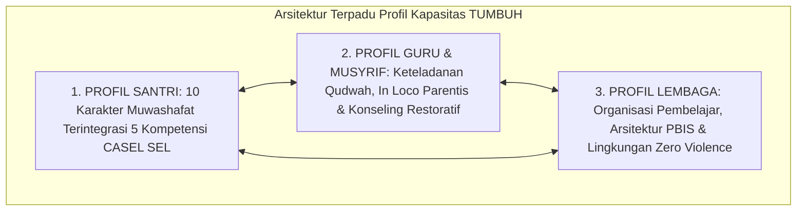

# P3-01-05-Sintesis-Graduate-Profile-TUMBUH

## Tujuan
Menyintesiskan seluruh profil kelulusan dan standar kapasitas (*Graduate Profile*)—mencakup Profil Santri 10 Karakter & SEL, Profil Guru/Musyrif Qudwah, dan Profil Lembaga Pembelajar—ke dalam satu arsitektur kompetensi holistik ekosistem TUMBUH.

---

## 1. Arsitektur Sintesis Profil Kapasitas TUMBUH

---

## 2. Matriks Uji Keterhubungan Triad Kapasitas

| Profil Santri yang Ingin Dicapai | Tuntutan Kompetensi Guru/Musyrif | Tuntutan Kapasitas Sistem Lembaga |
| :--- | :--- | :--- |
| **Santri Berakhlak Mulia & Disiplin Mandiri** | Musyrif menjadi teladan sholat tepat waktu & bertutur kata santun (*Qudwah*). | Sistem menyediakan SOP jadwal asrama yang konsisten & rasio kamar mandi memadai. |
| **Santri Kuat Regulasi Emosi & Bebas Bullying** | Musyrif menguasai teknik de-eskalasi krisis 3R & dialog restoratif (*Firm & Kind*). | Sistem mengeliminasi titik buta (*Blind Spots*) & menganalisis heatmap PBIS. |
| **Santri Mandiri & Berjiwa Khidmah** | Musyrif memberdayakan peran kepengurusan santri sebagai *Peer Mentor*. | Sistem menyediakan wadah organisasi santri yang bebas dari tradisi perpeloncoan. |

---

## 3. Status Dokumen
* **Status**: ✅ **SELESAI (Status Mutu: A+)**
* **Level**: Subproject Induk
* **Project**: `03 Capacity Framework`
* **Subproject**: `01 Graduate Profile`
* **Langkah Berikutnya**: Melanjutkan ke sub-domain berikutnya: **`02 Character Architecture`**.
