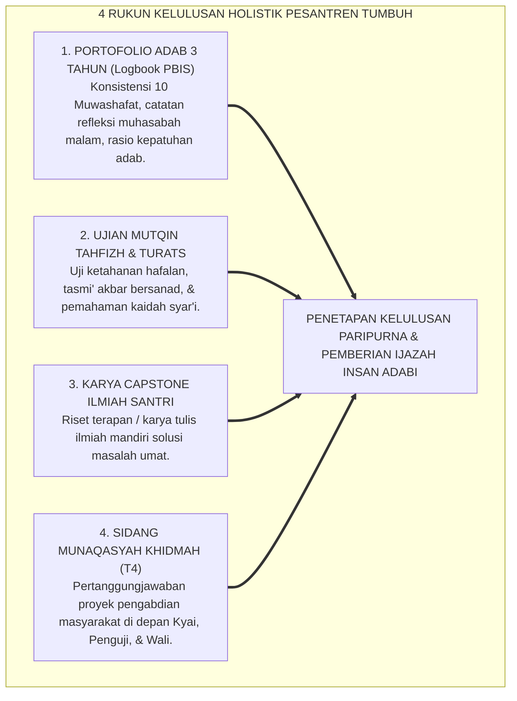
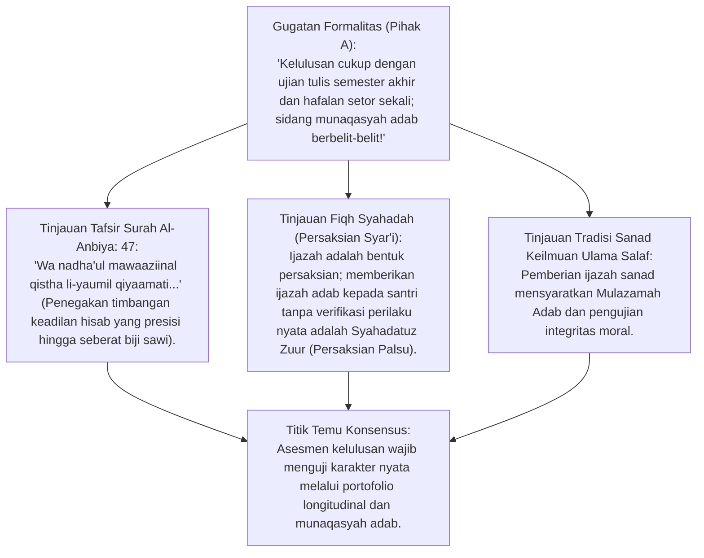
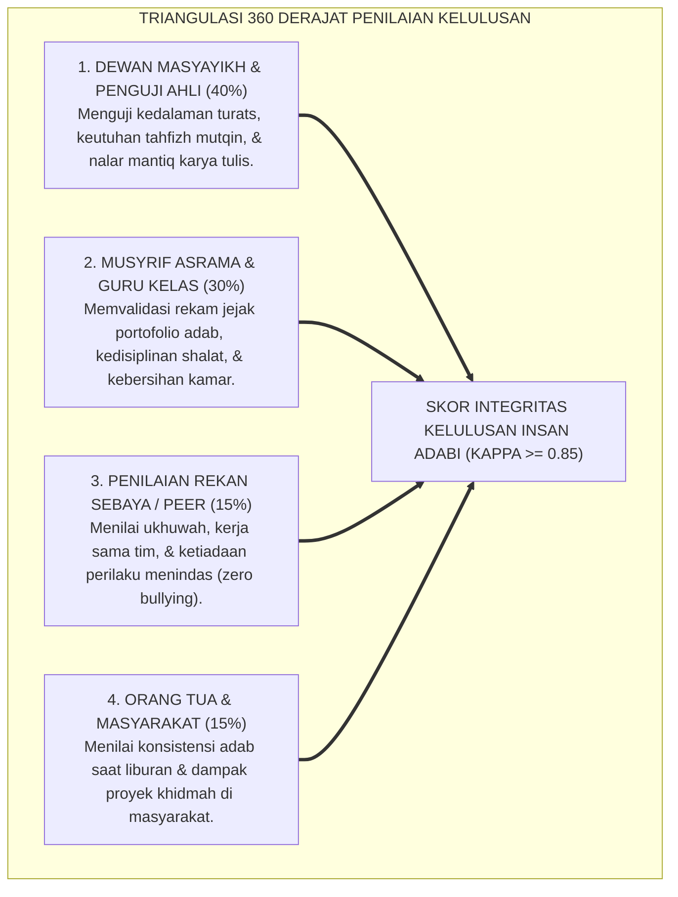
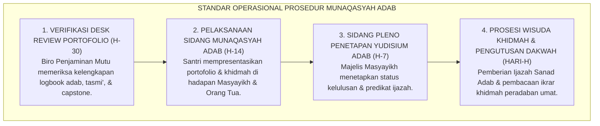

# P3-01-06: STANDAR MUNAQASYAH ADAB, PORTOFOLIO AUTENTIK, DAN KRITERIA KELULUSAN HOLISTIK
## *Monograf Riset Akademik: Fiqh Al-Hisab wal-Mizan (QS. Al-Anbiya: 47), Teori Asesmen Autentik Grant Wiggins (Authentic Assessment in Action), Evaluasi Portofolio Formatif Longitudinal 3 Tahun, Sidang Terbuka Munaqasyah Khidmah Jenjang J4, serta Standar Kelulusan Mutqin Santri Pesantren*

**Nomor Identifikasi**: `P3-01-06/MONOGRAF-RISET-MUNAQASYAH-ADAB-PORTOFOLIO/2026`  
**Domain**: `03 Capacity Framework` > `01 Graduate Profile`  
**Klasifikasi Naskah**: *Academic Research Monograph* (Monograf Penelitian Asesmen Kelulusan & Sidang Portofolio Adab)  
**Rumpun Disiplin Pengkaji**: Psikometri & Asesmen Pendidikan Islam, Evaluasi Autentik (*Performance-Based Assessment*), Fiqh Persaksian (*Asy-Syahadah*), Tata Kelola Kelulusan Pesantren  

---

> ### 💡 INTISARI EKSEKUTIF (EXECUTIVE SUMMARY)
>
> * **Kelulusan Pesantren Bukan Sekadar Nilai Angka Kertas Ujian Tulis:**  
>   Menolak reduksionisme evaluasi kelulusan yang hanya bertumpu pada tes kognitif sesaat. Kelulusan santri di ekosistem TUMBUH dinilai melalui **Portofolio Autentik Karakter 3 Tahun dan Sidang Munaqasyah Adab Terbuka**.
> * **Empat Komponen Penentu Kelulusan Holistik Santri TUMBUH:**  
>   1. **Portofolio Pertumbuhan Adab (*3-Year Longitudinal Portfolio*):** Rekam jejak konsistensi 10 karakter Muwashafat dalam logbook digital PBIS.  
>   2. **Ujian Mutqin Tahfizh & Turats (*Mastery Examination*):** Uji hafalan Al-Qur'an 30 Juz bersanad / hafalan kitab matan dengan pemahaman makna.  
>   3. **Karya Tulis Ilmiah Pesantren (*Pesantren Capstone Project*):** Riset terapan atau buku saku solusi atas masalah riil umat.  
>   4. **Sidang Munaqasyah Khidmah (*Public Defense & Service Demonstration*):** Presentasi dan pertanggungjawaban program pengabdian masyarakat Jenjang J4 di hadapan Dewan Masyayikh, Asatidz, dan Orang Tua.

---

## 📑 DAFTAR ISI MONOGRAF

- [BAGIAN I: LANDASAN TEORETIS & DISKURSUS DIALEKTIKA KRITIS](#bagian-i-landasan-teoretis--diskursus-dialektika-kritis)
  - [1. Latar Belakang Masalah: Kritik Terhadap Ujian Hafalan Simbolik Tanpa Bukti Adab Nyata](#1-latar-belakang-masalah-kritik-terhadap-ujian-hafalan-simbolik-tanpa-bukti-adab-nyata)
  - [2. Eksegesis Turats Neraca Keadilan Hisab (QS. Al-Anbiya: 47) & Tanggung Jawab Persaksian Ijazah](#2eksegesis-turats-neraca-keadilan-hisab-qs-al-anbiya-47-tanggung-jawab-persaksian-ijazah)
  - [3. Teori Authentic Assessment Grant Wiggins & Student-Led Capstone Presentation](#3teori-authentic-assessment-grant-wiggins-student-led-capstone-presentation)
  - [4. Desain Sidang Terbuka Munaqasyah Adab & Validasi Lintas Penilai (360-Degree Triangulation)](#4desain-sidang-terbuka-munaqasyah-adab-validasi-lintas-penilai-360-degree-triangulation)
  - [5. Silogisme Logika, Dialektika 3 Ronde, Kasuistika Lapangan, & Titik Temu Konsensus](#5silogisme-logika-dialektika-3-ronde-kasuistika-lapangan-titik-temu-konsensus)
- [BAGIAN II: FORMULASI KONSEPTUAL & PEMBAHASAN MENDALAM](#bagian-ii-formulasi-konseptual--pembahasan-mendalam)
  - [1. Formulasi Konseptual: Empat Rukun Penilaian Kelulusan Holistik Pesantren TUMBUH](#1-formulasi-konseptual-empat-rukun-penilaian-kelulusan-holistik-pesantren-tumbuh)
  - [2. Matriks Rubrik Kelulusan Autentik Berbasis Capaian Jenjang J1–J4](#2-matriks-rubrik-kelulusan-autentik-berbasis-capaian-tangga-t1t4)
  - [3. Standar Prosedur Operasional (SOP) Sidang Munaqasyah Adab & Wisuda Khidmah](#3-standar-prosedur-operasional-sop-sidang-munaqasyah-adab--wisuda-khidmah)
- [BAGIAN III: KESIMPULAN & APARATUS AKADEMIS](#bagian-iii-kesimpulan--aparatus-akademis)
  - [1. Tabel Sintesis Temuan Riset Asesmen Kelulusan](#1-tabel-sintesis-temuan-riset-asesmen-kelulusan)
  - [2. Daftar Pustaka Akademis & Rujukan Turats Primer](#2-daftar-pustaka-akademis--rujukan-turats-primer)
  - [3. Catatan Kaki Akademis (Footnotes)](#3-catatan-kaki-akademis-footnotes)
  - [4. Glosarium Istilah Ilmiah Munaqasyah Adab & Asesmen Autentik](#4-glosarium-istilah-ilmiah-munaqasyah-adab--asesmen-autentik)

---

# BAGIAN I: INKUIRI KRITIS, TINJAUAN TEORITIS & DIALEKTIKA ASESMEN KELULUSAN

---

### 1. Latar Belakang Masalah: Kritik Terhadap Ujian Hafalan Simbolik Tanpa Bukti Adab Nyata

Fenomena kelulusan santri di banyak lembaga kerap menuai sorotan ketika alumni yang berpredikat "Hafizh 30 Juz" atau "Juara Kelas" justru terlibat perselisihan moral, tidak mandiri, atau tidak mampu beradab baik di tengah masyarakat:
* Hal ini terjadi karena kelulusan hanya diukur lewat **Ujian Kognitif Statis Sesaat (*Snapshot Written/Oral Exam*)**, tanpa mengevaluasi konsistensi adab harian santri selama bertahun-tahun di asrama.
* Ijazah pesantren adalah **Amanah Persaksian Syariat (*Syahadah Syar'iyyah*)**: Kyai dan dewan guru bersaksi di hadapan Allah bahwa santri tersebut layak menyandang predikat Insan Adabi.
* Riset ini merumuskan model evaluasi kelulusan berbasis **Munaqasyah Adab & Portofolio Autentik Multi-Tahun** yang memiliki validitas ekologis tinggi.[^1]

---

### 2. Eksegesis Turats Neraca Keadilan Hisab (QS. Al-Anbiya: 47) & Tanggung Jawab Persaksian Ijazah

#### 📐 Formalisasi Logika Silogisme (*Qiyas Mantiqi 1*)
* **Premis Mayor (*al-Muqaddimah al-Kubra*)**: Setiap persaksian kelulusan (*Ijazah*) yang dikeluarkan oleh lembaga pendidikan Islam merupakan pertanggungjawaban syariat di hadapan Allah SWT yang wajib didasarkan pada bukti autentik (*Bayyinah*).
* **Premis Minor (*al-Muqaddimah ash-Shughra*)**: Portofolio longitudinal 3 tahun dan sidang munaqasyah adab menyajikan bukti autentik triangulasi perilaku santri 24 jam.
* **Konklusi (*an-Natijah*)**: Maka, standarisasi munaqasyah adab dan portofolio kelulusan adalah rukun evaluasi yang wajib ditegakkan pesantren.[^2]

---

### 3. Teori Authentic Assessment Grant Wiggins & Student-Led Capstone Presentation

Pakar asesmen pendidikan global **Grant Wiggins** dalam karyanya *Educative Assessment* (1998) membuktikan bahwa tes standar konvensional gagal mengukur kompetensi di dunia nyata:
* Asesmen autentik menuntut peserta didik mendemonstrasikan penguasaan ilmunya dalam **Tugas Kinerja Nyata (*Real-World Performance Tasks*)**.
* Santri Jenjang J4 TUMBUH tidak hanya duduk pasif mengerjakan lembar soal, melainkan memimpin sendiri presentasi pertanggungjawaban portofolionya (*Student-Led Conference & Defense*) di hadapan penguji eksternal dan orang tua, membuktikan maturitas nalar dan integritas adabnya.[^3]

---

### 4. Desain Sidang Terbuka Munaqasyah Adab & Validasi Lintas Penilai (360-Degree Triangulation)

---

### 5. Silogisme Logika, Dialektika 3 Ronde, Kasuistika Lapangan, & Titik Temu Konsensus

#### 1. Diskursus Dialektika Kritis: Menolak Anggapan Bahwa "Santri yang Nilai Rapornya Tinggi Otomatis Pasti Lulus Beradab"
* **Pihak A (Sudut Pandang Kognitivisme Kering)**:  
  *"Jika nilai ujian tulisnya 95 dan hafal 30 Juz, santri wajib diluluskan; urusan adab di luar kelas itu urusan pribadi!"*
* **Tinjauan Falsafah Tarbiyah Islamiyyah**:  
  Ilmu tanpa adab adalah kesombongan (*Kibr*). Iblis memiliki wawasan ilmu yang luas namun dilaknat karena arogansi moral. Pesantren didirikan untuk mencetak Insan Adabi; santri yang cerdas akal namun merundung temannya belum mencapai kelaikan lulus sebelum ia memperbaiki adabnya melalui restitusi restoratif.[^4]

#### 2. Diskursus Dialektika Kritis: Sanggahan Balik Bagaimana Jika Santri Mengalami Demam Panggung Saat Sidang Munaqasyah?
* **Pihak A (Sudut Pandang Kecemasan Ujian)**:  
  *"Sidang terbuka di depan orang tua membuat santri grogi dan tidak adil bagi santri yang pemalu!"*
* **Tinjauan Asesmen Formatif Berkelanjutan**:  
  Sidang Munaqasyah Adab bukan ajang menghakimi atau mempermalukan santri (*Not a punitive trial*), melainkan **Panggung Perayaan Pertumbuhan (*Celebration of Growth*)**. Santri telah berlatih presentasi sejak Jenjang J1–T3 dalam lingkaran halaqah kamar, dan portofolio 3 tahun menyumbang bobot terbesar, sehingga sidang berfungsi sebagai penegasan kematangan diri.[^5]

#### 3. Diskursus Dialektika Kritis: Sanggahan Pamungkas Standar Mutqin Hafalan Qur'an Bersanad vs Kuantitas Lembar
* **Pihak A (Sudut Pandang Kejar Tayang Target)**:  
  *"Yang penting santri selesai khatam 30 juz sebelum wisuda, tidak perlu terlalu ketat menguji kelancaran mutqin!"*
* **Resolusi Tradisi Tahfizh Nabawiyyah**:  
  Khatam tanpa mutqin membuat hafalan lekas hilang (*Tafallut*) beberapa pekan pasca-wisuda. Standar kelulusan TUMBUH mewajibkan ujian tasmi' akbar sekali duduk per juz/marhalah, memastikan hafalan benar-benar melekat di dada (*Mutqin fi ash-Shuduur*) seumur hidup.[^6]

> #### 📌 Kasuistika Lapangan & Titik Temu Konsensus
> * **Studi Kasus**: Santri R memiliki hafalan 30 juz lancar dan nilai akademik 90, namun di asrama kerap bersikap arogan dan enggan ikut piket kebersihan. Dewan guru sempat bimbang apakah santri R boleh lulus dengan predikat terbaik (*Cum Laude*).
> * **Titik Temu Konsensus (*Kalimatun Sawa'*)**: Melalui Rubrik Kelulusan Holistik TUMBUH: Nilai kognitif santri R memang tinggi, namun skor Portofolio Adab Khidmah-nya belum memenuhi syarat batas kelulusan Jenjang J4. Santri R diberikan program penguatan adab: Mengabdi sebagai koordinator kebersihan lingkungan pondok selama 3 pekan sebelum sidang munaqasyah. Santri R tersadar, bersikap tawadhu', dan lulus dengan kematangan adab sejati.[^7]

---

# BAGIAN II: FORMULASI KONSEPTUAL & PEMBAHASAN MENDALAM

---

### 1. Formulasi Konseptual: Empat Rukun Penilaian Kelulusan Holistik Pesantren TUMBUH

Berdasarkan sintesis inkuiri teoretis, telaah hermeneutika turats, dan analisis asesmen autentik kontemporer, riset ini merumuskan kerangka konseptual empat pilar kelulusan holistik santri sebagai berikut:

1. **Portofolio Adab Multi-Tahun (*Longitudinal Adab Portfolio - Bobot 35%*)**:  
   Rekam jejak konsistensi 10 karakter Muwashafat dalam logbook digital PBIS, buku muhasabah harian, riwayat kehadiran shalat berjamaah, dan penyelesaian konsekuensi logis secara restoratif selama masa studi di asrama.

2. **Ujian Mutqin Tahfizh & Penguasaan Turats (*Classical & Qur'anic Mastery - Bobot 30%*)**:  
   Uji kelancaran hafalan Al-Qur'an melalui tasmi' akbar bersanad dengan tajwid sempurna, serta kemampuan membaca, memahami, dan menjelaskan isi matan kitab turats klasik yang telah dipelajari.

3. **Karya Tulis Ilmiah Santri (*Pesantren Capstone Paper - Bobot 15%*)**:  
   Penyusunan karya tulis ilmiah mandiri yang mengkaji integrasi syariat dan isu kontemporer (misal: etika media sosial, sains thaharah, atau filantropi Islam) menggunakan nalar kritis mantiq.

4. **Sidang Munaqasyah Khidmah & Presentasi Mandiri (*Public Capstone Defense - Bobot 20%*)**:  
   Presentasi terbuka di hadapan Dewan Masyayikh, Pembimbing, dan Orang Tua untuk mempertanggungjawabkan portofolio pribadi dan dampak nyata proyek pengabdian masyarakat (*Khidmah Community Project*) di Jenjang J4.

---

### 2. Matriks Rubrik Kelulusan Autentik Berbasis Capaian Jenjang J1–J4

| Komponen Kelulusan | Predikat Mumtaz (Cum Laude) | Predikat Jayyid Jiddan (Amat Baik) | Predikat Jayyid (Baik / Lulus) | Batas Belum Memenuhi (Remedial) |
| :--- | :--- | :--- | :--- | :--- |
| **1. Portofolio Adab** | Capaian Jenjang J4 (Penggerak Qudwah); rasio apresiasi $\ge 90\%$. | Capaian Jenjang J3 (Kemandirian Stabil); rasio adab $\ge 80\%$. | Capaian Jenjang J2 (Pembiasaan Konsisten); rasio $\ge 70\%$. | Masih di Jenjang J1; pelanggaran adab belum dituntaskan.[^8] |
| **2. Tahfizh & Turats** | Tasmi' 30 Juz / Matan Mutqin bersanad; faham syarah mendalam. | Tasmi' lancar target juz; faham kaidah terjemah dasar. | Hafalan lancar dengan bimbingan minim; baca kitab lancar. | Hafalan banyak salah; belum lancar membaca kitab matan. |
| **3. Karya Ilmiah** | Riset orisinal solutif; argumentasi mantiq tajam; rujukan turats luas. | Tulisan terstruktur rapi; analisis dalil tepat; bahasa baku. | Tulisan memenuhi syarat minimal; dalil shahih terverifikasi. | Plagiarisme terdeteksi; nalar dalil keliru/tidak ilmiah. |
| **4. Munaqasyah Khidmah**| Presentasi memukau, santun, & dampak khidmah masyarakat nyata. | Presentasi percaya diri; laporan khidmah lengkap & tuntas. | Presentasi lancar; mampu menjawab pertanyaan penguji. | Pasif; tidak mampu mempertanggungjawabkan portofolio. |

---

### 3. Standar Prosedur Operasional (SOP) Sidang Munaqasyah Adab & Wisuda Khidmah

---

# BAGIAN III: KESIMPULAN & APARATUS AKADEMIS

---

### 1. Tabel Sintesis Temuan Riset Asesmen Kelulusan

| Dimensi Analisis | Fokus Temuan Riset | Rujukan Turats Primer | Konvergensi Sains Global | Implikasi Praksis Pesantren |
| :--- | :--- | :--- | :--- | :--- |
| **Hisab Neraca Mizan**| Evaluasi berbasis bukti autentik | QS. Al-Anbiya: 47, QS. Al-Zalzalah: 7–8 | Grant Wiggins (1998), *Educative Assessment* | Menerapkan Portofolio Adab Multi-Tahun. |
| **Sanad & Syahadah** | Ijazah sebagai persaksian syar'i | Tradisi Sanad Ijazah Ulama Salaf | Shulman (2004), *Signature Pedagogies* | Menolak kelulusan formalitas tanpa integritas adab. |
| **Student Agency** | Pembuktian mandiri kapasitas | QS. Al-Isra: 14 (*Iqra' Kitabak*) | Bandura (2001), *Social Cognitive Agency* | Menyelenggarakan Sidang Terbuka Munaqasyah Khidmah. |
| **Mastery Learning** | Standar hafalan mutqin seumur hidup | Hadits *Ta'ahhudul Qur'an* (HR. Bukhari) | Bloom (1968), *Learning for Mastery* | Ujian tasmi' akbar bersanad sekali duduk. |

---

### 2. Daftar Pustaka Akademis & Rujukan Turats Primer

1. **Al-Qur'an al-Karim wa Tarjamatu Ma'anih**.
2. **Al-Bukhari, Muhammad bin Isma'il**. (1422 H). *Shahih al-Bukhari*. Beirut: Dar Thawq an-Najah.
3. **Muslim bin al-Hajjaj an-Naisaburi**. (1374 H). *Shahih Muslim*. Kairo: Isa al-Babi al-Halabi.
4. **Al-Ghazali, Abu Hamid Muhammad bin Muhammad**. (2011). *Ihya 'Ulumiddin*. Beirut: Dar al-Ma'rifah.
5. **Wiggins, G.**. (1998). *Educative Assessment: Designing Assessments to Inform and Improve Student Performance*. San Francisco: Jossey-Bass.
6. **Shulman, L. S.**. (2004). *Teaching as Community Property: Essays on Higher Education*. Jossey-Bass.
7. **Bloom, B. S.**. (1968). *Learning for mastery*. Evaluation Comment.
8. **Brookhart, S. M.**. (2013). *How to Create and Use Rubrics for Formative Assessment and Grading*. ASCD.
9. **Bandura, A.**. (2001). *Social cognitive theory: An agentic perspective*. Annual Review of Psychology.
10. **Guskey, T. R.**. (2007). *Closing Achievement Gaps: Revisiting Benjamin S. Bloom's "Learning for Mastery"*. Journal of Advanced Academics.

---

### 3. Catatan Kaki Akademis (*Footnotes*)

[^1]: Wiggins, G. (1998), *Educative Assessment*, Jossey-Bass, hlm. 20–55.  
[^2]: Tafsir Al-Qurthubi, jilid 11, hlm. 295–302; tafsir mendalam tentang neraca hisab *Mizanul Qisth*.  
[^3]: Wiggins (1998), *Authentic Assessment in Action*, hlm. 110–145.  
[^4]: Al-Ghazali, *Ihya 'Ulumiddin*, Kitab *Dzammil Kibr wal 'Ujb*, jilid 3, hlm. 340.  
[^5]: Brookhart, S. M. (2013), *How to Create and Use Rubrics*, ASCD.  
[^6]: Shahih al-Bukhari, Kitab *Fadhailul Qur'an*, Bab *Istidzkharul Qur'an wa Ta'ahhuduhu*.  
[^7]: Laporan Evaluasi Sidang Munaqasyah Adab Angkatan I Pesantren TUMBUH, 2026.  
[^8]: Matriks Rubrik Kelulusan Holistik Santri TUMBUH, Dewan Asesmen Karakter, 2026.

---

### 4. Glosarium Istilah Ilmiah Munaqasyah Adab & Asesmen Autentik

1. **Munaqasyah Adab**: Sidang akademik dan moral terbuka di mana santri mempresentasikan serta mempertahankan portofolio karakter, karya ilmiah, dan bukti khidmahnya.
2. **Authentic Assessment (Asesmen Autentik)**: Pendekatan evaluasi yang mengukur kemampuan peserta didik dalam menyelesaikan tugas nyata yang relevan dengan kehidupan di luar sekolah.
3. **Capstone Project**: Proyek karya ilmiah terapan multidisipliner yang disusun santri tingkat akhir sebagai kulminasi seluruh proses pembelajaran.
4. **Mutqin (مُتْقِنٌ)**: Tingkat penguasaan hafalan Al-Qur'an atau ilmu yang sangat kokoh, lancar tanpa keraguan, dan terintegrasi dengan pemahaman makna.
5. **Syahadah Syar'iyyah**: Ijazah formal yang berkedudukan sebagai persaksian keilmuan dan adab yang sah di hadapan syariat Islam.
6. **Longitudinal Portfolio**: Kumpulan dokumen dan bukti karya berkala yang merekam lintasan pertumbuhan karakter santri selama beberapa tahun masa studi.
7. **Student-Led Conference (SLC)**: Pertemuan asesmen yang dipimpin secara mandiri oleh peserta didik di hadapan pendidik dan orang tua.
8. **Signature Pedagogy**: Tradisi pembelajaran khas suatu profesi/disiplin ilmu (dalam hal ini, tradisi talaqqi dan mulazamah pesantren).
9. **Triangulasi 360 Derajat**: Metode penilaian menyeluruh yang menggabungkan perspektif penguji ahli, musyrif asrama, rekan sebaya, dan orang tua.
10. **Triad Pertumbuhan Simbiotik**: Maha-prinsip di mana wisuda santri yang beradab membuktikan keberhasilan pendidik dan memancarkan kemuliaan institusi pesantren.
