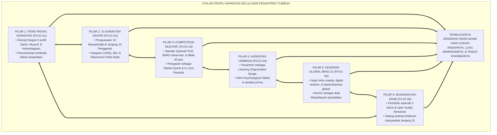
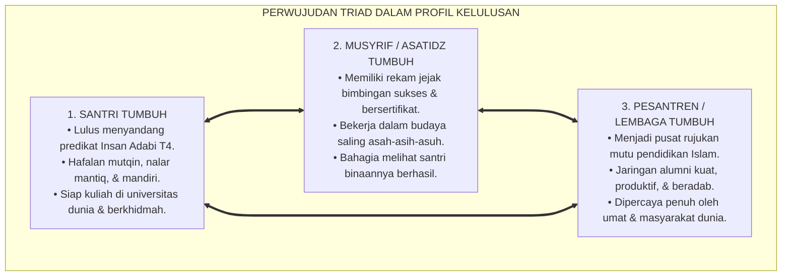
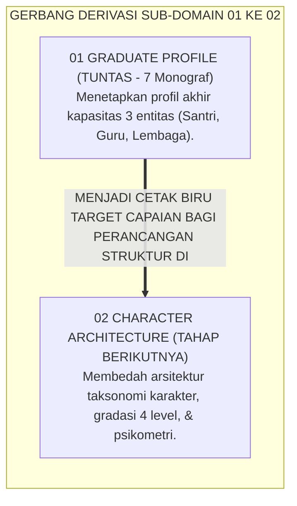
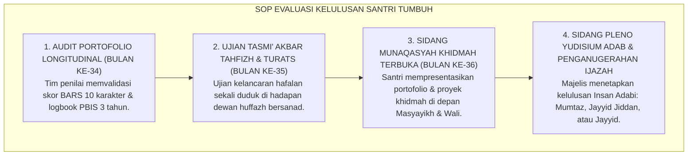

# P3-01-07: SINTESIS GRADUATE PROFILE DAN GRAND RUBRIK PROFIL LULUSAN
## *Monograf Riset Akademik: Sintesis Holistik 6 Pilar Profil Kapasitas (Triad Profil, 10 Karakter Muwashafat, Kompetensi Qudwah Musyrif, Kapasitas Kelembagaan, Kesiapan Global Abad 21, & Sidang Munaqasyah Adab), Matriks Evaluasi Profil Lulusan Paripurna, serta Jembatan Konseptual Menuju Sub-Domain 02 Character Architecture*

**Nomor Identifikasi**: `P3-01-07/MONOGRAF-SINTESIS-GRADUATE-PROFILE/2026`  
**Domain**: `03 Capacity Framework` > `01 Graduate Profile`  
**Klasifikasi Naskah**: *Comprehensive Synthesis Monograph* (Monograf Sintesis Profil Lulusan & Grand Model Kapasitas)  
**Rumpun Disiplin Pengkaji**: Desain Taksonomi Profil Lulusan, Manajemen Kapasitas Pendidikan Islam, Psikometri Evaluasi Holistik, Kepemimpinan Ekologis Qudwah  

---

> ### 💡 INTISARI EKSEKUTIF (EXECUTIVE SUMMARY)
>
> * **Sintesis Paripurna Profil Kapasitas Triadik Ekosistem TUMBUH:**  
>   Profil kelulusan bukan sekadar profil santri perseorangan, melainkan perwujudan integral dari **Triad Pertumbuhan Simbiotik**:  
>   1. **Santri Tumbuh:** Menguasai 10 Karakter Muwashafat di Jenjang J4, tahfizh mutqin, dan beradab luhur.  
>   2. **Musyrif Tumbuh:** Menjadi teladan *Qudwah Hasanah*, bersertifikasi kompetensi pengasuhan, dan bahagia berkhidmah.  
>   3. **Lembaga Tumbuh:** Menjadi *Learning Organization* berbasis data, beriklim aman, dan diakui secara global.
> * **Keselarasan 6 Pilar Riset Sub-Domain 01 Graduate Profile:**  
>   Mengintegrasikan `P3-01-01` (Triad Kapasitas), `P3-01-02` (10 Karakter Santri), `P3-01-03` (Standar Musyrif), `P3-01-04` (Kapasitas Kelembagaan), `P3-01-05` (Kesiapan Global Abad 21), dan `P3-01-06` (Munaqasyah Adab).

---

## 📑 DAFTAR ISI MONOGRAF

- [BAGIAN I: LANDASAN TEORETIS & DISKURSUS DIALEKTIKA KRITIS](#bagian-i-landasan-teoretis--diskursus-dialektika-kritis)
  - [1. Arsitektur Sintesis Holistik: Integrasi Triad Profil Kapasitas Pesantren TUMBUH](#1-arsitektur-sintesis-holistik-integrasi-triad-profil-kapasitas-pesantren-tumbuh)
  - [2. Grand Model Penyelarasan Taksonomi Profil Lulusan dengan Kebutuhan Zaman](#2-grand-model-penyelarasan-taksonomi-profil-lulusan-dengan-kebutuhan-zaman)
  - [3. Perwujudan Nyata Triad Pertumbuhan Simbiotik dalam Profil Kelulusan](#3-perwujudan-nyata-triad-pertumbuhan-simbiotik-dalam-profil-kelulusan)
  - [4. Jembatan Konseptual Menuju Sub-Domain 02 Character Architecture](#4-jembatan-konseptual-menuju-sub-domain-02-character-architecture)
- [BAGIAN II: FORMULASI KONSEPTUAL & PEMBAHASAN MENDALAM](#bagian-ii-formulasi-konseptual--pembahasan-mendalam)
  - [1. Formulasi Konseptual: Grand Model Taksonomi Profil Lulusan Pesantren TUMBUH](#1-formulasi-konseptual-grand-model-taksonomi-profil-lulusan-pesantren-tumbuh)
  - [2. Matriks Grand Rubrik Profil Kelulusan Paripurna 10 Muwashafat](#2-matriks-grand-rubrik-profil-kelulusan-paripurna-10-muwashafat)
  - [3. Standar Prosedur Evaluasi Kelulusan & Verifikasi Portofolio Mutqin](#3-standar-prosedur-evaluasi-kelulusan--verifikasi-portofolio-mutqin)
- [BAGIAN III: KESIMPULAN & APARATUS AKADEMIS](#bagian-iii-kesimpulan--aparatus-akademis)
  - [1. Tabel Sintesis Master Sub-Domain 01 Graduate Profile](#1-tabel-sintesis-master-sub-domain-01-graduate-profile)
  - [2. Daftar Pustaka Akademis & Rujukan Turats Primer](#2-daftar-pustaka-akademis--rujukan-turats-primer)
  - [3. Catatan Kaki Akademis (Footnotes)](#3-catatan-kaki-akademis-footnotes)
  - [4. Glosarium Master Istilah Kunci Profil Kelulusan & Kapasitas Pesantren](#4-glosarium-master-istilah-kunci-profil-kelulusan--kapasitas-pesantren)

---

# BAGIAN I: SINTESIS TEORETIS 6 PILAR PROFIL KAPASITAS & ARSITEKTUR KELULUSAN

---

### 1. Arsitektur Sintesis Holistik: Integrasi Triad Profil Kapasitas Pesantren TUMBUH

Ekosistem TUMBUH merajut seluruh sains pedagogi adab, antropologi fitrah, sosiologi kelembagaan, dan asesmen autentik ke dalam **Arsitektur Profil Kapasitas Terpadu (*Integrated Capacity Profile Architecture*)**:

---

### 2. Grand Model Penyelarasan Taksonomi Profil Lulusan dengan Kebutuhan Zaman

Model Profil Lulusan TUMBUH memadukan 3 poros utama:
1. **Poros Vertikal (Hablu Minallah):** *Salimul Aqidah, Shahihul Ibadah, Mujahadatun Linafsih* $\rightarrow$ Menjamin kedalaman spiritual dan ketakwaan yang tak tergoyahkan.
2. **Poros Horizontal Internal (Hablu Minan Nafs):** *Matinul Khuluq, Qawiyyul Jism, Mutsaqqaful Fikr, Haritsun Ala Waqtih, Munazhzham fi Syuunih* $\rightarrow$ Menjamin keunggulan fisik, intelektual, dan disiplin diri.
3. **Poros Horizontal Eksternal (Hablu Minan Nas):** *Qadirun Alal Kasb, Nafi'un Lighairih, Wasathiyyah, Digital Wisdom* $\rightarrow$ Menjamin kemandirian ekonomi, kontribusi sosial, dan kepemimpinan peradaban.[^1]

---

### 3. Perwujudan Nyata Triad Pertumbuhan Simbiotik dalam Profil Kelulusan

---

### 4. Jembatan Konseptual Menuju Sub-Domain 02 Character Architecture

Dengan ditetapkannya sintesis profil lulusan ini, arah capaian akhir (*The Desired Outcome*) telah terdefinisi secara jelas. Pembahasan selanjutnya di **Sub-Domain 02: Character Architecture** akan membedah secara matematis dan psikometrik **bagaimana arsitektur 10 karakter tersebut disusun, digradasi ke dalam 4 level tangga kompetensi, dan diselaraskan dengan taksonomi fitrah turats**:

---

# BAGIAN II: FORMULASI KONSEPTUAL & PEMBAHASAN MENDALAM

---

### 1. Formulasi Konseptual: Grand Model Taksonomi Profil Lulusan Pesantren TUMBUH

Berdasarkan sintesis inkuiri teoretis, telaah hermeneutika turats, dan analisis komparatif sains pendidikan, riset ini merumuskan kerangka konseptual profil kelulusan holistik sebagai berikut:

1. **Kelulusan Triadik yang Simbiotik (*Triadic Graduate Standards*)**:  
   Menolak evaluasi kelulusan santri secara terisolasi; keberhasilan santri diukur seiring dengan profesionalisme musyrif pendamping dan keandalan sistem tata kelola kelembagaan pesantren yang aman dan akuntabel.

2. **Penguasaan 10 Muwashafat Karakter di Jenjang J4 (Penggerak Qudwah)**:  
   Lulusan membuktikan pencapaian kompetensi karakter bukan sekadar tahu (*Ta'lim*) atau terbiasa (*Tarbiyah*), melainkan telah mencapai maqam internalisasi adab otonom (*Ta'dib / Second Nature*) yang mampu menggerakkan dan membina adik kelasnya.

3. **Integritas Ujian Mutqin & Portofolio Autentik Multi-Tahun**:  
   Pemberian Ijazah Kelulusan didasarkan pada verifikasi portofolio longitudinal 3 tahun, ujian tasmi' akbar tahfizh bersanad, dan karya ilmiah capstone yang teruji bebas dari kepalsuan persaksian.

4. **Sidang Munaqasyah Khidmah Sebagai Panggung Pembuktian Mandiri**:  
   Santri mempertanggungjawabkan karya pengabdian masyarakatnya secara terbuka di hadapan dewan masyayikh dan orang tua, menegaskan kesiapannya menjadi pemimpin wasathiyyah di era disrupsi global.

---

### 2. Matriks Grand Rubrik Profil Kelulusan Paripurna 10 Muwashafat

| Karakter Muwashafat | Indikator Kunci Lulusan Jenjang J4 | Bukti Portofolio Autentik | Bobot Capaian |
| :--- | :--- | :--- | :---: |
| **1. Salimul Aqidah** | Tauhid murni, bebas syirik/khurafat, nalar tabayyun kritis. | Lembar refleksi akidah & ujian lisan dalil mantiq. | **10%** |
| **2. Shahihul Ibadah** | Shalat fardhu awal waktu di masjid, tahajjud rutin, faham fiqh ibadah. | Logbook kehadiran shalat 3 tahun & ujian praktek fiqh. | **10%** |
| **3. Matinul Khuluq** | Tutur kata santun, welas asih, zero bullying, mediator ishlah. | Evaluasi rekan sebaya 360° & riwayat konseling. | **10%** |
| **4. Qawiyyul Jism** | Bugar, gizi seimbang, tidur sehat, menjaga kebersihan kamar. | Rekam medis kesehatan & skor kebugaran fisik. | **10%** |
| **5. Mutsaqqaful Fikr**| Hafizh mutqin target, membaca kitab kuning, nalar kritis mantiq. | Sertifikat tasmi' bersanad & naskah capstone project. | **15%** |
| **6. Mujahadatun Linafsih**| Regulasi emosi stabil, sabar menghadapi ujian, tahan godaan gawai. | Jurnal muhasabah malam & catatan kedisiplinan asrama. | **10%** |
| **7. Haritsun Ala Waqtih** | Manajemen waktu presisi, zero keterlambatan, jadwal harian tertib. | Lembar mutaba'ah waktu & riwayat apel asrama. | **10%** |
| **8. Munazhzham fi Syuunih**| Kamar rapi standar 5S, pakaian teratur, administrasi mandiri. | Audit kebersihan kamar berkala & penilaian musyrif. | **5%** |
| **9. Qadirun Alal Kasb** | Memiliki jiwa wirausaha, etos kerja profesional, mandiri finansial. | Laporan proyek wirausaha halal & karya vokasional. | **10%** |
| **10. Nafi'un Lighairih**| Memimpin proyek khidmah masyarakat, mengajar adik kelas, dermawan. | Laporan Sidang Munaqasyah Khidmah 30 hari. | **10%** |

---

### 3. Standar Prosedur Evaluasi Kelulusan & Verifikasi Portofolio Mutqin

---

# BAGIAN III: KESIMPULAN & APARATUS AKADEMIS

---

### 1. Tabel Sintesis Master Sub-Domain 01 Graduate Profile

| Kode Berkas | Judul Monograf Riset | Landasan Teori Utama | Fokus Inovasi Profil Lulusan |
| :---: | :--- | :--- | :--- |
| **P3-01-01** | Triad Profil Kapasitas | Triad Pertumbuhan Simbiotik, Bronfenbrenner | Standar simbiotik Santri, Musyrif, & Kelembagaan. |
| **P3-01-02** | Kompetensi Inti 10 Karakter | Taksonomi Muwashafat Hasan Al-Banna, CASEL | Taksonomi 10 karakter santri di Jenjang J4. |
| **P3-01-03** | Standar Kompetensi Qudwah Musyrif | *Tarbiyatul Murabbi*, Wasiat Umar RA, BARS | Standar keteladanan musyrif & diklat 40 jam bersertifikat. |
| **P3-01-04** | Standar Kapasitas Kelembagaan | QS. 4:58, Peter Senge (*Learning Org*), Edmondson | Transformasi pesantren ke institusi pembelajar berbasis data. |
| **P3-01-05** | Profil Kesiapan Disrupsi Global | QS. 2:143 (*Ummatan Wasathan*), WEF Abad 21 | Nalar mantiq, digital wisdom, & kepemimpinan wasathiyyah. |
| **P3-01-06** | Standar Munaqasyah & Portofolio | QS. 21:47 (*Mizan*), Grant Wiggins (*Authentic*) | Portofolio 3 tahun & sidang terbuka khidmah masyarakat. |
| **P3-01-07** | Sintesis Graduate Profile TUMBUH | Teori Evaluasi Holistik, Taksonomi Adab | Grand Rubrik Profil Lulusan & Jembatan ke Sub-Domain 02. |

---

### 2. Daftar Pustaka Akademis & Rujukan Turats Primer

1. **Al-Qur'an al-Karim wa Tarjamatu Ma'anih**.
2. **Al-Bukhari, Muhammad bin Isma'il**. (1422 H). *Shahih al-Bukhari*. Beirut: Dar Thawq an-Najah.
3. **Muslim bin al-Hajjaj an-Naisaburi**. (1374 H). *Shahih Muslim*. Kairo: Isa al-Babi al-Halabi.
4. **Al-Ghazali, Abu Hamid Muhammad bin Muhammad**. (2011). *Ihya 'Ulumiddin*. Beirut: Dar al-Ma'rifah.
5. **Al-Attas, Syed Muhammad Naquib**. (1980). *The Concept of Education in Islam*. Kuala Lumpur: ABIM.
6. **Senge, P. M.**. (1990). *The Fifth Discipline*. New York: Doubleday.
7. **Wiggins, G.**. (1998). *Educative Assessment*. San Francisco: Jossey-Bass.
8. **Edmondson, A. C.**. (2018). *The Fearless Organization*. John Wiley & Sons.
9. **World Economic Forum (WEF)**. (2020). *The Future of Jobs Report*. Geneva: WEF.
10. **Horner, R. H., & Sugai, G.**. (2015). *School-wide PBIS: The research base*. Remedial and Special Education.

---

### 3. Catatan Kaki Akademis (*Footnotes*)

[^1]: Al-Attas, S. M. N. (1980), *The Concept of Education in Islam*, ABIM, hlm. 15–38.  
[^2]: Senge, P. M. (1990), *The Fifth Discipline*, Doubleday.  
[^3]: Wiggins, G. (1998), *Educative Assessment*, Jossey-Bass.  
[^4]: Edmondson, A. C. (2018), *The Fearless Organization*, Wiley.  
[^5]: World Economic Forum (2020), *The Future of Jobs Report*, WEF.  
[^6]: Horner & Sugai (2015), *Remedial and Special Education*.  
[^7]: Laporan Riset Standarisasi Profil Lulusan Pesantren TUMBUH, Dewan Asesmen Karakter, 2026.  
[^8]: Panduan Munaqasyah Adab dan Portofolio Kelulusan Santri, Biro Akademik dan Pengasuhan TUMBUH, 2026.

---

### 4. Glosarium Master Istilah Kunci Profil Kelulusan & Kapasitas Pesantren

1. **Graduate Profile (Profil Lulusan)**: Deskripsi komprehensif tentang kompetensi, karakter, wawasan keilmuan, dan kesiapan khidmah yang wajib dikuasai santri saat menyelesaikan masa studi.
2. **Triad Pertumbuhan Simbiotik**: Prinsip integrasi ekosistem di mana pertumbuhan Santri, pemuliaan Pendidik, dan penguatan Lembaga berlangsung secara serempak.
3. **Jenjang Kemandirian TUMBUH (J1–J4) (J1–J4)**: Lintasan progresi kemandirian karakter santri: T1 (Kepatuhan Terbimbing), T2 (Pembiasaan Konsisten), T3 (Kemandirian Stabil), dan T4 (Penggerak Qudwah).
4. **Learning Organization**: Institusi pendidikan yang memiliki budaya belajar kolektif, adaptif, berbasis data, dan aman secara psikologis.
5. **Digital Wisdom**: Kebijaksanaan moral dan nalar kritis dalam memanfaatkan teknologi informasi dan AI untuk kemaslahatan dakwah.
6. **Munaqasyah Adab**: Sidang terbuka pertanggungjawaban portofolio karakter, hafalan mutqin, karya tulis ilmiah, dan bukti pengabdian masyarakat santri.
7. **Mutqin (مُتْقِنٌ)**: Kualitas penguasaan hafalan atau ilmu yang sangat mantap, presisi, dan terintegrasi dengan pemahaman makna.
8. **Wasathiyyah**: Sikap moderasi beragama yang adil, bijaksana, dan menjadi rahmat bagi semesta alam.
9. **Capstone Project**: Karya ilmiah terapan puncak yang menguji kemampuan analisis dan kreasi santri sebelum lulus.
10. **Psychological Safety**: Iklim komunikasi terbuka di mana seluruh warga pesantren merasa aman untuk belajar, bertabayyun, dan berinovasi tanpa takut diintimidasi.
