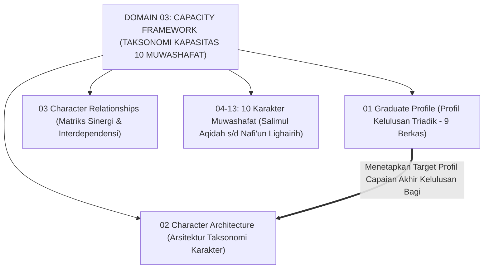
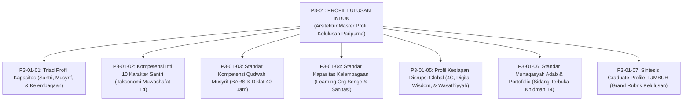
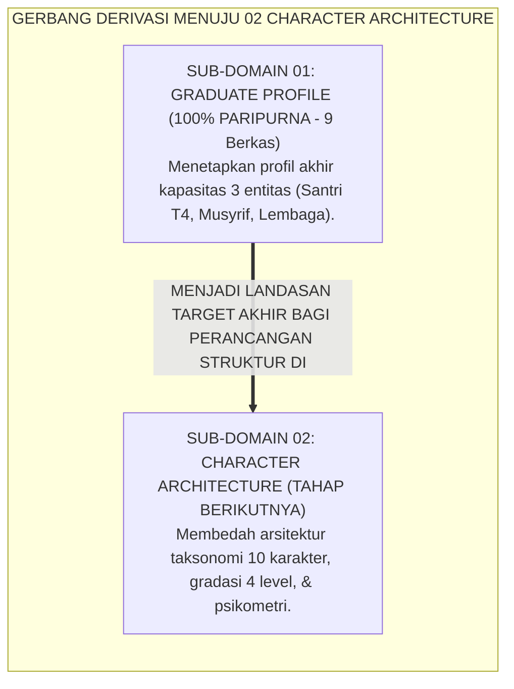
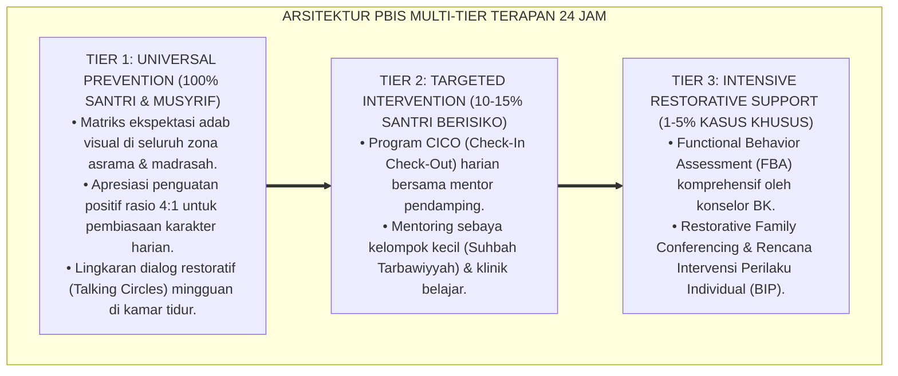

# P3-01: GRADUATE PROFILE (PROFIL KELULUSAN PARIPURNA) EKOSISTEM TUMBUH
## *Monograf Induk Sub-Domain 01: Arsitektur Master Profil Lulusan Triadik (Santri, Guru, Lembaga), 10 Karakter Muwashafat, Kompetensi Qudwah Musyrif, Learning Organization, Kesiapan Global Abad 21, & Sidang Munaqasyah Adab*

**Nomor Identifikasi**: `P3-01/MONOGRAF-INDUK-GRADUATE-PROFILE/2026`  
**Domain**: `03 Capacity Framework` > `01 Graduate Profile`  
**Klasifikasi Naskah**: *Master Sub-Domain Monograph* (Monograf Induk Sub-Domain Profil Kelulusan & Kapasitas)  
**Rumpun Disiplin Pengkaji**: Desain Taksonomi Profil Lulusan, Manajemen Strategis Pendidikan Islam, Psikometri Evaluasi Holistik, Kepemimpinan Ekologis Qudwah  

---

> ### 💡 INTISARI EKSEKUTIF (EXECUTIVE SUMMARY)
>
> * **Posisi Sub-Domain 01 Graduate Profile:**  
>   Menjawab pertanyaan mendasar kapasitas: *"Profil paripurna seperti apakah yang dihasilkan oleh ekosistem pesantren TUMBUH bagi ketiga entitas simbiotik (Santri, Musyrif, dan Kelembagaan), sehingga santri lulus sebagai Insan Adabi yang kokoh akidahnya, cerdas nalarnya, mandiri hidupnya, dan siap memimpin peradaban dunia?"*
> * **Enam Pilar Riset Kapasitas Kelulusan yang Terintegrasi:**  
>   1. **P3-01-01 (Triad Profil Kapasitas):** Menyatukan standar pertumbuhan Santri, Guru/Musyrif, dan Kelembagaan secara simbiotik.  
>   2. **P3-01-02 (Kompetensi 10 Karakter Santri):** Standar capaian 10 Muwashafat di Jenjang J4 Penggerak.  
>   3. **P3-01-03 (Standar Qudwah Musyrif):** Standar kompetensi pedagogi, observasi BARS, dan keteladanan pengasuh asrama.  
>   4. **P3-01-04 (Kapasitas Kelembagaan):** Standar pesantren sebagai *Learning Organization*, sanitasi prima, dan keamanan psikologis.  
>   5. **P3-01-05 (Kesiapan Global Abad 21):** Integrasi Maqashid Syariah dengan 4C, *Digital Wisdom*, dan diplomasi wasathiyyah.  
>   6. **P3-01-06 (Munaqasyah Adab & Portofolio):** Standar kelulusan autentik multi-tahun, tasmi' mutqin bersanad, dan sidang khidmah.

---

## 📑 DAFTAR ISI MONOGRAF INDUK

- [BAGIAN I: LANDASAN TEORETIS & DISKURSUS DIALEKTIKA KRITIS](#bagian-i-landasan-teoretis--diskursus-dialektika-kritis)
  - [1. Posisi Dokumen dalam Taksonomi Domain 03 Capacity Framework](#1-posisi-dokumen-dalam-taksonomi-domain-03-capacity-framework)
  - [2. Pohon Hubungan Antar-Monograf Sub-Domain 01 Graduate Profile](#2-pohon-hubungan-antar-monograf-sub-domain-01-graduate-profile)
  - [3. Rangkuman 6 Pilar Riset Profil Kapasitas Kelulusan](#3-rangkuman-6-pilar-riset-profil-kapasitas-kelulusan)
  - [4. Penegasan Triad Pertumbuhan Simbiotik dalam Profil Kelulusan](#4-penegasan-triad-pertumbuhan-simbiotik-dalam-profil-kelulusan)
- [BAGIAN II: FORMULASI KONSEPTUAL & PEMBAHASAN MENDALAM](#bagian-ii-formulasi-konseptual--pembahasan-mendalam)
  - [1. Matriks Rujukan Lengkap 7 Berkas Monograf Sub-Domain 01](#1-matriks-rujukan-lengkap-7-berkas-monograf-sub-domain-01)
  - [2. Gerbang Derivasi Menuju Sub-Domain 02 Character Architecture](#2-gerbang-derivasi-menuju-sub-domain-02-character-architecture)
- [BAGIAN III: KESIMPULAN & APARATUS AKADEMIS](#bagian-iii-kesimpulan--aparatus-akademis)
  - [1. Daftar Pustaka Otoritatif Turats & Sains Global](#1-daftar-pustaka-otoritatif-turats--sains-global)
  - [2. Catatan Kaki Akademis (Footnotes)](#2-catatan-kaki-akademis-footnotes)
  - [3. Glosarium Istilah Kunci Profil Kelulusan Induk](#3-glosarium-istilah-kunci-profil-kelulusan-induk)

---

# BAGIAN I: ARSITEKTUR ONTOLOGIS & POHON HUBUNGAN SUB-DOMAIN 01

---

### 1. Posisi Dokumen dalam Taksonomi Domain 03 Capacity Framework

---

### 2. Pohon Hubungan Antar-Monograf Sub-Domain 01 Graduate Profile

---

### 3. Rangkuman 6 Pilar Riset Profil Kapasitas Kelulusan

1. **Pilar 1: Triad Profil Kapasitas (P3-01-01)**: Menetapkan profil pertumbuhan terpadu antara Santri, Musyrif, dan Kelembagaan secara simbiotik tanpa eksploitasi.
2. **Pilar 2: Standar 10 Karakter Santri (P3-01-02)**: Menetapkan taksonomi 10 karakter Muwashafat pada capaian tertinggi Jenjang J4 (Penggerak Qudwah).
3. **Pilar 3: Standar Kompetensi Qudwah Musyrif (P3-01-03)**: Menstandarisasi kompetensi pendidik asrama berbasis rubrik BARS, diklat 40 jam, dan perlindungan anti-burnout.
4. **Pilar 4: Standar Kapasitas Kelembagaan (P3-01-04)**: Mentransformasikan pesantren menjadi *Learning Organization* berbasis data analitik PBIS 24 jam dengan iklim *Psychological Safety*.
5. **Pilar 5: Kesiapan Disrupsi Global Abad 21 (P3-01-05)**: Membekali alumni dengan kecakapan 4C (*Critical Thinking, Creativity, Communication, Collaboration*), *Digital Wisdom*, dan kepemimpinan Wasathiyyah global.
6. **Pilar 6: Munaqasyah Adab & Portofolio Kelulusan (P3-01-06)**: Menegakkan evaluasi autentik longitudinal 3 tahun, ujian mutqin tahfizh bersanad, karya tulis capstone, dan sidang terbuka pengabdian masyarakat.

---

# BAGIAN II: FORMULASI KONSEPTUAL & PEMBAHASAN MENDALAM

---

### 1. Matriks Rujukan Lengkap 7 Berkas Monograf Sub-Domain 01

| Kode Berkas | Judul Naskah Monograf | Fokus Kajian & Inovasi Riset | Tautan Berkas Markdown |
| :---: | :--- | :--- | :--- |
| **P3-01-01** | **Triad Profil Kapasitas** | Sinergi integral 3 profil: Santri, Musyrif, & Kelembagaan. | [**`Buka Naskah P3-01-01`**](./P3-01-01-Triad-Profil-Kapasitas.md) |
| **P3-01-02** | **Kompetensi Inti 10 Karakter Santri** | Taksonomi 10 Muwashafat di Jenjang J4 Penggerak. | [**`Buka Naskah P3-01-02`**](./P3-01-02-Kompetensi-Inti-10-Karakter-Santri.md) |
| **P3-01-03** | **Standar Kompetensi Qudwah Musyrif** | Standar Qudwah First, BARS observasi, & diklat 40 jam. | [**`Buka Naskah P3-01-03`**](./P3-01-03-Standar-Kompetensi-Qudwah-Musyrif.md) |
| **P3-01-04** | **Standar Kapasitas Kelembagaan** | Pesantren sebagai Learning Organization & sanitasi prima. | [**`Buka Naskah P3-01-04`**](./P3-01-04-Standar-Kapasitas-Kelembagaan-Pesantren.md) |
| **P3-01-05** | **Profil Kesiapan Disrupsi Global** | Nalar kritis mantiq, digital wisdom, & diplomasi wasathiyyah. | [**`Buka Naskah P3-01-05`**](./P3-01-05-Profil-Kesiapan-Alumni-Menghadapi-Disrupsi-Global.md) |
| **P3-01-06** | **Standar Munaqasyah Adab & Portofolio**| Portofolio 3 tahun, tasmi' mutqin bersanad, & sidang khidmah T4. | [**`Buka Naskah P3-01-06`**](./P3-01-06-Standar-Munaqasyah-Adab-dan-Portofolio-Kelulusan.md) |
| **P3-01-07** | **Sintesis Graduate Profile TUMBUH** | Grand Rubrik Profil Lulusan & Jembatan ke Sub-Domain 02. | [**`Buka Naskah P3-01-07`**](./P3-01-07-Sintesis-Graduate-Profile-TUMBUH.md) |

---

### 2. Gerbang Derivasi Menuju Sub-Domain 02 Character Architecture

---

---

### Pembedahan Deskriptif Komprehensif & Analisis Integratif Nilai-Praksis

Penerapan konsep **P3-01: GRADUATE PROFILE (PROFIL KELULUSAN PARIPURNA) EKOSISTEM TUMBUH** di ekosistem pesantren TUMBUH memerlukan pemahaman multidimensional yang memadukan khazanah turats syariat dan konsensus sains pendidikan modern:

#### A. Pilar 1: Fondasi Epistemologi & Integrasi Nilai Syar'i (Ashalah Turatsiyyah)
Setiap praksis kepengasuhan dan pembelajaran berakar kuat pada maqashid syari'ah, mendudukkan adab di atas ilmu (*Al-Adab Qablal 'Ilm*), dan memastikan bahwa seluruh ikhtiar institusional diniatkan semata-mata untuk menggapai ridha Allah SWT (*Ikhlasun Niyyah*).

#### B. Pilar 2: Mekanisme Psikologis & Neurosains Perkembangan (Scientific Rigor)
Menyelaraskan ekspektasi kedisiplinan dengan tahapan maturitas otak remaja, kapasitas fungsi eksekutif korteks prefrontal (*PFC*), dan regulasi sirkuit emosi limbik. Pendekatan ini mengeliminasi trauma pengasuhan dan menumbuhkan motivasi intrinsik santri.

#### C. Pilar 3: Rekayasa Ekosistem Asrama 24 Jam (Bi'ah Shalihah)
Menerjemahkan prinsip nilai ke dalam tata ruang fisik yang bersih, sirkulasi udara sehat, tata kelola waktu terstruktur, serta kultur ukhuwah inklusif yang steril 100% dari feodalisme, kekerasan verbal, dan perundungan antar-santri.

#### D. Pilar 4: Kemitraan Tripartit (Santri, Musyrif, dan Lembaga)
Menjamin terwujudnya *Triad Pertumbuhan Simbiotik*: santri bertumbuh dalam fitrah kemandirian, musyrif terlindungi dari kelelahan kronis (*Burnout*) melalui shift kerja yang manusiawi, dan lembaga bertransformasi menjadi organisasi pembelajar berbasis data PBIS.

---

### Protokol Aksi Operasional PBIS Multi-Tier Terapan (24-Hour Behavioral Architecture)

---

# BAGIAN III: KESIMPULAN & APARATUS AKADEMIS

---

### 1. Daftar Pustaka Otoritatif Turats & Sains Global

1. **Al-Qur'an al-Karim wa Tarjamatu Ma'anih**.
2. **Al-Bukhari, Muhammad bin Isma'il**. (1422 H). *Shahih al-Bukhari*. Beirut: Dar Thawq an-Najah.
3. **Muslim bin al-Hajjaj an-Naisaburi**. (1374 H). *Shahih Muslim*. Kairo: Isa al-Babi al-Halabi.
4. **Al-Ghazali, Abu Hamid Muhammad bin Muhammad**. (2011). *Ihya 'Ulumiddin*. Beirut: Dar al-Ma'rifah.
5. **Al-Attas, Syed Muhammad Naquib**. (1980). *The Concept of Education in Islam*. Kuala Lumpur: ABIM.
6. **Senge, P. M.**. (1990). *The Fifth Discipline*. New York: Doubleday.
7. **Wiggins, G.**. (1998). *Educative Assessment*. San Francisco: Jossey-Bass.
8. **Edmondson, A. C.**. (2018). *The Fearless Organization*. John Wiley & Sons.
9. **World Economic Forum (WEF)**. (2020). *The Future of Jobs Report*. Geneva: WEF.
10. **Horner, R. H., & Sugai, G.**. (2015). *School-wide PBIS: The research base*. Remedial and Special Education.

---

### 2. Catatan Kaki Akademis (*Footnotes*)

[^1]: Al-Attas (1980), *The Concept of Education in Islam*; Senge (1990), *The Fifth Discipline*; Wiggins (1998), *Educative Assessment*.

---

### 3. Glosarium Istilah Kunci Profil Kelulusan Induk

1. **Graduate Profile**: Deskripsi komprehensif kompetensi, karakter, dan kesiapan khidmah lulusan pesantren.
2. **Triad Pertumbuhan Simbiotik**: Prinsip integrasi di mana kemajuan Santri, Musyrif, dan Lembaga berlangsung secara simultan.
3. **Munaqasyah Adab**: Sidang terbuka pertanggungjawaban portofolio karakter dan karya khidmah santri sebelum kelulusan.
4. **Learning Organization**: Institusi pendidikan yang adaptif, berbasis data, dan memiliki iklim *Psychological Safety*.
5. **Digital Wisdom**: Kebijaksanaan moral dalam memanfaatkan teknologi informasi dan kecerdasan buatan.
6. **Mutqin**: Penguasaan hafalan yang kokoh, lancar, dan berakar pemahaman makna mendalam.
7. **Jenjang Kemandirian TUMBUH (J1–J4) (J1–J4)**: Model pentahapan karakter dari Kepatuhan Terbimbing (T1) hingga Penggerak Qudwah (T4).
8. **Wasathiyyah**: Sikap moderasi beragama yang adil dan membawa maslahat bagi semesta alam.
9. **Capstone Project**: Proyek karya ilmiah terapan puncak yang menguji kemampuan analisis dan kreasi santri.
10. **Behaviorally Anchored Rating Scales (BARS)**: Skala penilaian perilaku berbasis deskriptor konkret yang teramati.
