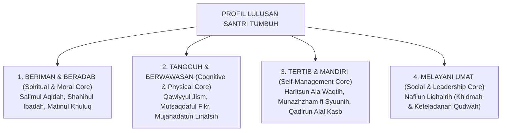

# P3-01-Profil-Lulusan-Santri-TUMBUH (Graduate Profile Induk)

## Tujuan
Menetapkan deklarasi **Profil Lulusan Santri Paripurna** (*Graduate Profile*) di ekosistem pesantren TUMBUH: melahirkan insan yang memiliki aqidah lurus, ibadah benar, berakhlak mulia, sehat jasmani, berwawasan luas, kuat regulasi diri, tertib, mandiri, dan berjiwa khidmah melayani umat (*Nafi'un Lighairih*).

---

## 1. Visi Profil Santri TUMBUH

---

## 2. 4 Dimensi Profil Santri Paripurna

### 1. Fondasi Spiritual & Moral (*Spiritual & Moral Excellence*)
* Memiliki aqidah yang bersih dari syirik dan takhayul (*Salimul Aqidah*).
* Menegakkan sholat fardhu berjamaah dan ibadah sunnah dengan khusyuk (*Shahihul Ibadah*).
* Berakhlak karimah, santun dalam tutur kata, dan menjunjung tinggi adab persaudaraan (*Matinul Khuluq*).

### 2. Ketangguhan Kognitif & Jasmani (*Cognitive & Physical Mastery*)
* Memiliki tubuh yang sehat, bugar, berenergi, dan menjaga kebersihan (*Qawiyyul Jism*).
* Memiliki nalar kritis, wawasan keilmuan Islam dan sains yang luas (*Mutsaqqaful Fikr*).
* Mampu mengendalikan dorongan hawa nafsu, sabar, dan gigih berjuang (*Mujahadatun Linafsih*).

### 3. Manajemen Diri & Kemandirian (*Self-Management & Life Skills*)
* Disiplin menghargai waktu dan menjauhi kesia-siaan (*Haritsun 'Ala Waqtih*).
* Rapi dan teratur dalam mengelola barang, kamar, dan jadwal belajar (*Munazhzham fi Syu'unih*).
* Memiliki keterampilan praktis, berjiwa wirausaha, dan mandiri (*Qadirun 'Alal Kasb*).

### 4. Keberdayaan Sosial & Kepemimpinan (*Social Contribution & Qudwah*)
* Aktif berkontribusi memberikan maslahat nyata bagi sesama manusia, peduli kaum lemah, dan menjadi pelayan kebaikan bagi umat (*Nafi'un Lighairih*).

---

## 3. Status Dokumen
* **Status**: 🌟 **A+ (Dokumen Induk Graduate Profile)**
* **Level**: Project 3 - `03 Capacity Framework / 01 Graduate Profile`
* **Langkah Berikutnya**: **`P3-01-01-Triad-Profil-Kapasitas.md`**.
