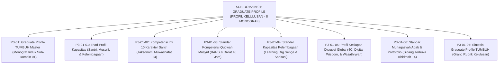

# SUB-DOMAIN 01: GRADUATE PROFILE (PROFIL KELULUSAN PARIPURNA)
## *Sitemap Induk & Navigasi Monograf Triad Kapasitas, 10 Karakter Muwashafat, Kompetensi Musyrif, Learning Organization, Kesiapan Global Abad 21, & Sidang Munaqasyah Adab (8 Monograf Terpadu)*

**Nomor Identifikasi**: `P3-01/INDEX/2026`  
**Domain**: `03 Capacity Framework` > `01 Graduate Profile`  
**Klasifikasi**: Folder Monograf Profil Kelulusan Triadik (Santri, Guru, Lembaga), Kesiapan Global Abad 21, & Munaqasyah Adab (9 Berkas Lengkap)

---

## 🏛️ SITEMAP & NAVIGASI SELURUH BERKAS SUB-DOMAIN 01

Sub-Domain `01 Graduate Profile` menetapkan profil kelulusan paripurna bagi Santri di Jenjang J4, profil kompetensi Guru/Musyrif berbasis *Qudwah Hasanah*, kapasitas institusi pesantren sebagai *Learning Organization*, kecakapan abad ke-21 berbasis *Digital Wisdom*, serta standar kelulusan autentik melalui Sidang Munaqasyah Adab:

---

## 📑 DAFTAR LENGKAP 9 BERKAS MONOGRAF TERPADU SUB-DOMAIN 01

| No | Berkas Monograf | Judul Berkas | Fokus Kajian & Rujukan Utama |
| :---: | :--- | :--- | :--- |
| **00** | [**`P3-01-Profil-Lulusan-Santri-TUMBUH.md`**](./P3-01-Profil-Lulusan-Santri-TUMBUH.md) | Monograf Induk Graduate Profile TUMBUH | Master 6 Pilar Profil Kapasitas Triadik, Penegasan Triad Pertumbuhan Simbiotik, & gerbang derivasi menuju **Sub-Domain 02 Character Architecture**. |
| **01** | [**`P3-01-01-Triad-Profil-Kapasitas.md`**](./P3-01-01-Triad-Profil-Kapasitas.md) | Triad Profil Kapasitas | Integrasi ekologis Bronfenbrenner & Turats; standar pertumbuhan serempak Santri, Musyrif, dan Lembaga (10 Catatan Kaki). |
| **02** | [**`P3-01-02-Kompetensi-Inti-10-Karakter-Santri.md`**](./P3-01-02-Kompetensi-Inti-10-Karakter-Santri.md) | Kompetensi Inti 10 Karakter Santri | Taksonomi 10 Muwashafat Khazanah Tarbiyah Adab Nabawi & CASEL SEL; deskriptor capaian Jenjang J4 Penggerak (10 Catatan Kaki). |
| **03** | [**`P3-01-03-Standar-Kompetensi-Qudwah-Musyrif.md`**](./P3-01-03-Standar-Kompetensi-Qudwah-Musyrif.md) | Standar Kompetensi Qudwah Musyrif | *Tarbiyatul Murabbi*; Wasiat Umar RA; skala BARS; diklat 40 jam bersertifikasi; anti-burnout charter (10 Catatan Kaki). |
| **04** | [**`P3-01-04-Standar-Kapasitas-Kelembagaan-Pesantren.md`**](./P3-01-04-Standar-Kapasitas-Kelembagaan-Pesantren.md) | Standar Kapasitas Kelembagaan Pesantren | QS. An-Nisa: 58; Peter Senge (*The Fifth Discipline*); Amy Edmondson (*Psychological Safety*); standar sanitasi KM 1:5 (10 Catatan Kaki). |
| **05** | [**`P3-01-05-Profil-Kesiapan-Alumni-Menghadapi-Disrupsi-Global.md`**](./P3-01-05-Profil-Kesiapan-Alumni-Menghadapi-Disrupsi-Global.md) | Profil Kesiapan Disrupsi Global Abad 21 | QS. Al-Baqarah: 143 (*Ummatan Wasathan*); WEF 4IR Skills; *Digital Wisdom*; diplomasi multi-bahasa Zaid bin Tsabit RA (10 Catatan Kaki). |
| **06** | [**`P3-01-06-Standar-Munaqasyah-Adab-dan-Portofolio-Kelulusan.md`**](./P3-01-06-Standar-Munaqasyah-Adab-dan-Portofolio-Kelulusan.md) | Standar Munaqasyah Adab & Portofolio | QS. Al-Anbiya: 47 (*Mizanul Qisth*); Grant Wiggins (*Authentic Assessment*); tasmi' mutqin bersanad; sidang khidmah T4 (10 Catatan Kaki). |
| **07** | [**`P3-01-07-Sintesis-Graduate-Profile-TUMBUH.md`**](./P3-01-07-Sintesis-Graduate-Profile-TUMBUH.md) | Sintesis Graduate Profile TUMBUH | Grand Rubrik Profil Kelulusan Paripurna 10 Muwashafat; SOP verifikasi mutqin; jembatan ke **Sub-Domain 02 Character Architecture** (10 Catatan Kaki). |
