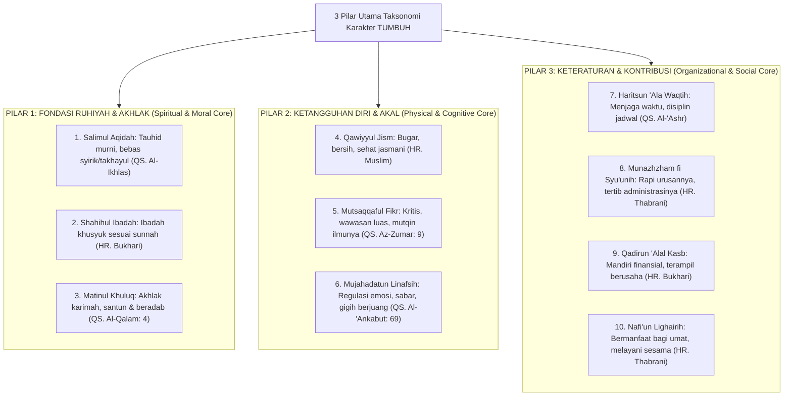

# P3-02-01-Taksonomi-3-Pilar-Utama-Karakter

## Tujuan
Membedah 3 pilar kluster utama dari 10 karakter santri TUMBUH (*Spiritual-Moral, Jasmani-Nalar, Keteraturan-Khidmah*), menjelaskan rasional filosofis pengelompokan dan integrasinya dalam kurikulum pembinaan santri.

---

## 1. 3 Pilar Utama Taksonomi Karakter

---

## 2. Rasional Filosofis 3 Pilar

1. **Pilar 1 (Pondasi Batin)**: Tanpa tauhid, ibadah yang benar, dan akhlak mulia, kepintaran dan ketangguhan fisik hanya akan melahirkan kesombongan.
2. **Pilar 2 (Kekuatan Diri)**: Jasmani yang sehat dan nalar yang tajam diperlukan untuk memikul beban ibadah dan dakwah di tengah masyarakat modern.
3. **Pilar 3 (Kiprah Nyata)**: Karakter seorang mukmin mencapai kesempurnaannya ketika ia mampu mengatur hidupnya secara tertib, mandiri, dan mendedikasikan ilmunya untuk melayani sesama (*Khidmah*).

---

## 3. Status Dokumen
* **Status**: 🌟 **A+ (Tervalidasi & Siap Diimplementasikan)**
* **Level**: Project 3 - `03 Capacity Framework / 02 Character Architecture`
* **Langkah Berikutnya**: **`P3-02-02-Struktur-Gradasi-4-Level-Kompetensi.md`**.
