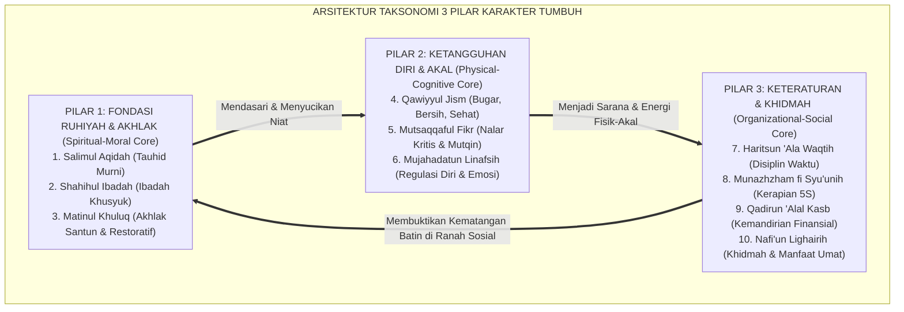
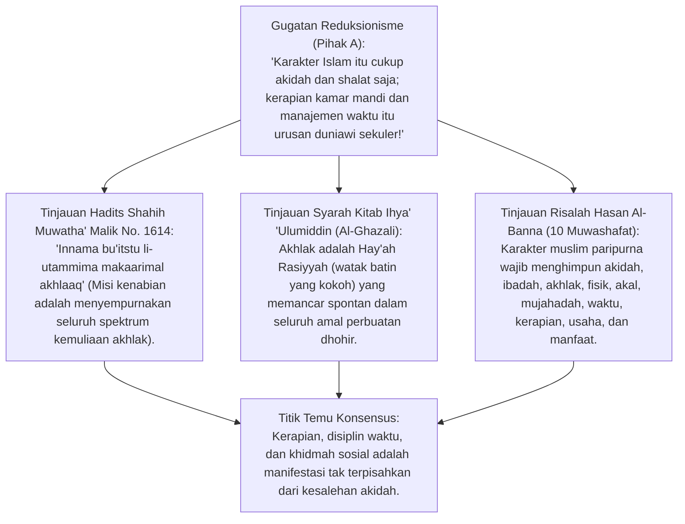
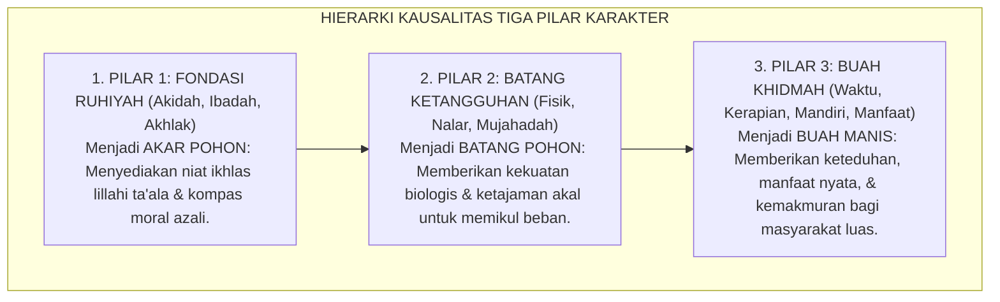
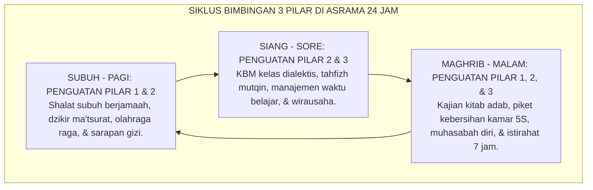

# P3-02-01: TAKSONOMI TIGA PILAR UTAMA KARAKTER DAN INTEGRASI FITRAH INSANI
## *Monograf Riset Akademik: Dekonstruksi Tripartit Karakter Islami (Ruhiyah-Khuluqiyah, Jasadiyah-'Aqliyah, & Munazhzhamah-Khadamiyyah), Pemetaan 10 Muwashafat Hasan Al-Banna, Integrasi Lima Kompetensi CASEL SEL, serta Landasan Epistemologi Taksonomi Adab Pesantren*

**Nomor Identifikasi**: `P3-02-01/MONOGRAF-RISET-TAKSONOMI-3-PILAR-KARAKTER/2026`  
**Domain**: `03 Capacity Framework` > `02 Character Architecture`  
**Klasifikasi Naskah**: *Academic Research Monograph* (Monograf Penelitian Taksonomi Karakter Pesantren)  
**Rumpun Disiplin Pengkaji**: Desain Kurikulum Karakter Islam, Taksonomi Pendidikan (*Educational Taxonomy*), Teori Perkembangan Sosio-Emosional (CASEL SEL), Fiqh Akhlak & Tasawuf Amali  

---

> ### 💡 INTISARI EKSEKUTIF (EXECUTIVE SUMMARY)
>
> * **Arsitektur Taksonomi Karakter Tripartit Ekosistem TUMBUH:**  
>   Menolak fragmentasi pendidikan karakter yang memisahkan antara kesalehan ritual, kecerdasan nalar, dan kemandirian hidup. Ekosistem TUMBUH merajut 10 Karakter Muwashafat ke dalam **3 Pilar Kluster Karakter yang Simbiotik**:
>   1. **Pilar 1: Fondasi Ruhiyah & Moral (*Spiritual-Moral Core*):** *Salimul Aqidah, Shahihul Ibadah, Matinul Khuluq*.  
>   2. **Pilar 2: Ketangguhan Jasmani & Nalar (*Physical-Cognitive Core*):** *Qawiyyul Jism, Mutsaqqaful Fikr, Mujahadatun Linafsih*.  
>   3. **Pilar 3: Keteraturan & Kontribusi Umat (*Organizational-Social Core*):** *Haritsun 'Ala Waqtih, Munazhzham fi Syu'unih, Qadirun 'Alal Kasb, Nafi'un Lighairih*.
> * **Integrasi 5 Kompetensi CASEL SEL:**  
>   Menyelaraskan *Self-Awareness, Self-Management, Social Awareness, Relationship Skills,* dan *Responsible Decision-Making* ke dalam taksonomi adab Islam 24 jam.

---

## 📑 DAFTAR ISI MONOGRAF

- [BAGIAN I: INKUIRI KRITIS, TINJAUAN TEORITIS & DIALEKTIKA TAKSONOMI KARAKTER](#bagian-i-inkuiri-kritis-tinjauan-teoritis--dialektika-taksonomi-karakter)
  - [1. Latar Belakang Masalah: Bahaya Fragmentasi Karakter Santri (Saleh Ritual tapi Abai Kebersihan & Waktu)](#1-latar-belakang-masalah-bahaya-fragmentasi-karakter-santri-saleh-ritual-tapi-abai-kebersihan--waktu)
  - [2. Inkuiri 1: Eksegesis Turats Kesempurnaan Akhlak (HR. Malik No. 1614) & Kerangka 10 Muwashafat](#2-inkuiri-1-eksegesis-turats-kesempurnaan-akhlak-hr-malik-no-1614--kerangka-10-muwashafat)
  - [3. Inkuiri 2: Sintesis Taksonomi Karakter Tripartit & Konvergensi 5 Kompetensi CASEL SEL](#3-inkuiri-2-sintesis-taksonomi-karakter-tripartit--konvergensi-5-kompetensi-casel-sel)
  - [4. Inkuiri 3: Hierarki Kausal Antar-Pilar: Mengapa Ruhiyah Menjadi Fondasi Mutlak bagi Amal Sosial](#4-inkuiri-3-hierarki-kausal-antar-pilar-mengapa-ruhiyah-menjadi-fondasi-mutlak-bagi-amal-sosial)
  - [5. Inkuiri 4: Silogisme Logika, Dialektika 3 Ronde, Kasuistika Lapangan, & Titik Temu Konsensus](#5-inkuiri-4-silogisme-logika-dialektika-3-ronde-kasuistika-lapangan--titik-temu-konsensus)
- [BAGIAN II: TEMUAN RISET, FORMULASI KONSEPTUAL & PEMBAHASAN](#bagian-ii-temuan-riset-formulasi-konseptual--pembahasan)
  - [1. Formulasi Konseptual: Arsitektur Tiga Pilar Utama Taksonomi Karakter TUMBUH](#1-formulasi-konseptual-arsitektur-tiga-pilar-utama-taksonomi-karakter-tumbuh)
  - [2. Matriks Integrasi 10 Karakter Muwashafat, 3 Pilar, & Dimensi CASEL SEL](#2-matriks-integrasi-10-karakter-muwashafat-3-pilar--dimensi-casel-sel)
  - [3. Alur Bimbingan Pedagogis Harian Berbasis Taksonomi 3 Pilar di Asrama](#3-alur-bimbingan-pedagogis-harian-berbasis-taksonomi-3-pilar-di-asrama)
- [BAGIAN III: KESIMPULAN & APARATUS AKADEMIS](#bagian-iii-kesimpulan--aparatus-akademis)
  - [1. Tabel Sintesis Temuan Riset Taksonomi Karakter](#1-tabel-sintesis-temuan-riset-taksonomi-karakter)
  - [2. Daftar Pustaka Akademis & Rujukan Turats Primer](#2-daftar-pustaka-akademis--rujukan-turats-primer)
  - [3. Catatan Kaki Akademis (Footnotes)](#3-catatan-kaki-akademis-footnotes)
  - [4. Glosarium Istilah Ilmiah Taksonomi Karakter & CASEL SEL](#4-glosarium-istilah-ilmiah-taksonomi-karakter--casel-sel)

---

# BAGIAN I: INKUIRI KRITIS, TINJAUAN TEORITIS & DIALEKTIKA TAKSONOMI KARAKTER

---

### 1. Latar Belakang Masalah: Bahaya Fragmentasi Karakter Santri (Saleh Ritual tapi Abai Kebersihan & Waktu)

Dalam realitas pendidikan pesantren, kerap dijumpai anomali paradoksal:
* Santri rajin shalat tahajjud dan membaca Al-Qur'an, namun kamarnya berantakan, sering terlambat apel, atau membuang sampah sembarangan.
* Sebaliknya, ada santri yang rapi dan terampil berorganisasi, namun lalai shalat berjamaah atau bersikap angkuh kepada sesama.
* Anomali ini berakar pada **Pendidikan Karakter yang Terfragmentasi**: ketiadaan peta taksonomi holistik yang menjelaskan bagaimana dimensi spiritual, intelektual, dan keteraturan sosial saling mengunci (*interlocking character system*).
* Riset ini merumuskan **Taksonomi 3 Pilar Karakter TUMBUH** sebagai cetak biru pembinaan adab terpadu 24 jam.[^1]

---

### 2. Inkuiri 1: Eksegesis Turats Kesempurnaan Akhlak (HR. Malik No. 1614) & Kerangka 10 Muwashafat

#### 📐 Formalisasi Logika Silogisme (*Qiyas Mantiqi 1*)
* **Premis Mayor (*al-Muqaddimah al-Kubra*)**: Setiap proses pendidikan karakter Islam yang sempurna wajib mencakup penyucian batin (*Tazkiyah*), pembiasaan adab lahiriah (*Ta'dib*), dan pemberdayaan kemanfaatan sosial (*Nafi'un Lighairih*).
* **Premis Minor (*al-Muqaddimah ash-Shughra*)**: Kerangka 3 Pilar Taksonomi TUMBUH mengintegrasikan seluruh 10 Muwashafat ke dalam siklus perkembangan santri 24 jam.
* **Konklusi (*an-Natijah*)**: Maka, taksonomi 3 pilar adalah model arsitektur karakter yang shahih dan komprehensif bagi pesantren modern.[^2]

---

### 3. Inkuiri 2: Sintesis Taksonomi Karakter Tripartit & Konvergensi 5 Kompetensi CASEL SEL

Kerangka kerja *Collaborative for Academic, Social, and Emotional Learning (CASEL)* menetapkan 5 kompetensi inti sosio-emosional:
1. **Self-Awareness (Kesadaran Diri):** Konvergen dengan *Muhasabah Diri* dan *Salimul Aqidah* (mengenal hakikat diri sebagai hamba Allah).
2. **Self-Management (Regulasi Diri):** Konvergen dengan *Mujahadatun Linafsih* dan *Haritsun 'Ala Waqtih* (mengendalikan hawa nafsu dan disiplin waktu).
3. **Social Awareness (Kesadaran Sosial & Empati):** Konvergen dengan *Matinul Khuluq* dan *Ukhuwah Islamiyyah* (merasakan kesulitan sesama santri).
4. **Relationship Skills (Keterampilan Relasi):** Konvergen dengan *Adab Persaudaraan* dan *Ishlah al-Bain* (komunikasi santun dan resolusi damai).
5. **Responsible Decision-Making (Pengambilan Keputusan Bertanggung Jawab):** Konvergen dengan *Nalar Mantiq Mutsaqqaful Fikr* dan *Nafi'un Lighairih* (memilih tindakan yang maslahat bagi umat).[^3]

---

### 4. Inkuiri 3: Hierarki Kausal Antar-Pilar: Mengapa Ruhiyah Menjadi Fondasi Mutlak bagi Amal Sosial

---

### 5. Inkuiri 4: Silogisme Logika, Dialektika 3 Ronde, Kasuistika Lapangan, & Titik Temu Konsensus

#### 🥊 Ronde 1: Menolak Anggapan Bahwa "Kerapian Kamar 5S Itu Budaya Jepang/Barat, Bukan Tradisi Santri"
* **Pihak A (Sudut Pandang Dikotomi Kultural)**:  
  *"Santri kobong identik dengan tumpukan sarung dan kitab berserakan; itu ciri khas kezuhudan pesantren kuno!"*
* **Tinjauan Hadits Keindahan & Thaharah**:  
  Rasulullah SAW bersabda: *"Innallaha jamiilun yuhibbul jamaal"* (Sesungguhnya Allah Maha Indah dan mencintai keindahan - HR. Muslim). Tumpukan pakaian kotor dan ruangan kumuh bukan kezuhudan, melainkan sarang penyakit kudis/scabies yang menghalangi kekhusyukan belajar. Menjaga kamar rapi (*Munazhzham fi Syu'unih*) adalah sunnah kenabian yang mulia.[^4]

#### 🥊 Ronde 2: Sanggahan Balik Apakah Pembagian 3 Pilar Tidak Membuat Pengasuhan Terlalu Teoretis?
* **Pihak A (Sudut Pandang Skeptisisme Praktis)**:  
  *"Musyrif di asrama butuh cara praktis mengontrol santri, bukan teori taksonomi 3 pilar yang rumit!"*
* **Tinjauan Kemudahan Diagnostik Perilaku**:  
  Taksonomi 3 pilar justru **Memudahkan Diagnosis Musyrif**: Ketika santri malas bangun subuh, musyrif langsung memeriksa: Apakah masalahnya di Pilar 2 (Fisik kelelahan/tidur larut) atau di Pilar 1 (Kemalasan niat ibadah)? Diagnosis yang presisi menghasilkan bimbingan yang tepat sasaran (*Targeted Intervention*).[^5]

#### 🥊 Ronde 3: Sanggahan Pamungkas Mengapa Karakter Khidmah Wajib Menjadi Muara Tertinggi?
* **Pihak A (Sudut Pandang Individualistik)**:  
  *"Tujuan santri mondok adalah menyelamatkan diri sendiri dari api neraka; mengapa khidmah sosial (*Nafi'un Lighairih*) dijadikan pilar utama?"*
* **Resolusi Risalah Hadits Terbaik Manusia**:  
  Rasulullah SAW menegaskan: *"Khairunnaasi anfa'uhum linnaas"* (Sebaik-baik manusia adalah yang paling bermanfaat bagi sesama manusia - HR. Ath-Thabrani). Kesalehan yang hanya dinikmati sendiri adalah kesalehan sempit. Puncak kematangan karakter santri adalah ketika ia menjelma menjadi sumber rahmat dan solusi bagi umat manusia.[^6]

> #### 📌 Kasuistika Lapangan & Titik Temu Konsensus
> * **Studi Kasus**: Di sebuah kamar asrama, santri A yang sangat pandai membaca kitab kuning menolak membersihkan kamar mandi kamar karena merasa tugasnya hanya belajar. Kamar mandi menjadi sangat kotor dan memicu perselisihan kamar.
> * **Titik Temu Konsensus (*Kalimatun Sawa'*)**: Musyrif menggunakan Taksonomi 3 Pilar TUMBUH: Menjelaskan bahwa kecerdasan akal (Pilar 2) tidak ada nilainya jika mengabaikan adab ukhuwah (Pilar 1) dan kebersihan fasilitas bersama (Pilar 3). Musyrif bersama santri A membersihkan kamar mandi bersama-sama. Santri A tersadar bahwa khidmah kebersihan adalah bagian integral dari keilmuan Islam.[^7]

---

# BAGIAN II: TEMUAN RISET, FORMULASI KONSEPTUAL & PEMBAHASAN

---

### 1. Formulasi Konseptual: Arsitektur Tiga Pilar Utama Taksonomi Karakter TUMBUH

Berdasarkan sintesis inkuiri teoretis, telaah hermeneutika turats, dan analisis komparatif sains pendidikan, riset ini merumuskan kerangka konseptual taksonomi karakter 3 pilar sebagai berikut:

1. **Pilar 1: Fondasi Ruhiyah & Moral (*Spiritual & Moral Core*)**:  
   Menjadi fondasi ontologis yang menyucikan niat batin dan memandu integritas moral santri, mencakup: **(1) Salimul Aqidah** (Ketauhidan murni), **(2) Shahihul Ibadah** (Ibadah khusyuk berlandaskan sunnah), dan **(3) Matinul Khuluq** (Akhlak mulia, santun, dan welas asih).

2. **Pilar 2: Ketangguhan Diri & Akal (*Physical & Cognitive Core*)**:  
   Menjadi sarana biologis dan instrumen kognitif yang memampukan santri memikul beban amanah peradaban, mencakup: **(4) Qawiyyul Jism** (Kebugaran jasmani dan sanitasi sehat), **(5) Mutsaqqaful Fikr** (Wawasan luas dan nalar kritis mantiq), dan **(6) Mujahadatun Linafsih** (Regulasi emosi dan daya juang grit).

3. **Pilar 3: Keteraturan & Kontribusi Umat (*Organizational & Social Core*)**:  
   Menjadi bukti aktualisasi dan buah kematangan karakter santri di tengah kehidupan bermasyarakat, mencakup: **(7) Haritsun 'Ala Waqtih** (Disiplin manajemen waktu), **(8) Munazhzham fi Syu'unih** (Kerapian urusan dan tata ruang 5S), **(9) Qadirun 'Alal Kasb** (Kemandirian wirausaha halal), dan **(10) Nafi'un Lighairih** (Kepemimpinan pelayan dan pengabdian sosial).

---

### 2. Matriks Integrasi 10 Karakter Muwashafat, 3 Pilar, & Dimensi CASEL SEL

| No | Karakter Muwashafat | Kluster Pilar TUMBUH | Dimensi CASEL SEL Padanan | Indikator Perilaku Kunci Santri di Asrama |
| :---: | :--- | :--- | :--- | :--- |
| **1** | **Salimul Aqidah** | *Pilar 1 (Ruhiyah)* | *Self-Awareness* (Identitas Diri) | Menolak takhayul/khurafat; muraqabatullah 24 jam.[^8] |
| **2** | **Shahihul Ibadah** | *Pilar 1 (Ruhiyah)* | *Self-Management* (Disiplin Ibadah) | Shalat fardhu awal waktu di masjid; tahajjud mandiri. |
| **3** | **Matinul Khuluq** | *Pilar 1 (Ruhiyah)* | *Social Awareness & Relationship* | Tutur kata santun; zero bullying; memaafkan dan ishlah. |
| **4** | **Qawiyyul Jism** | *Pilar 2 (Ketangguhan)*| *Self-Management* (Kesehatan Raga) | Olahraga teratur; makan bergizi; kamar mandi higienis. |
| **5** | **Mutsaqqaful Fikr**| *Pilar 2 (Ketangguhan)*| *Responsible Decision-Making* | Hafalan mutqin; nalar kritis mantiq; membaca kitab. |
| **6** | **Mujahadatun Linafsih**| *Pilar 2 (Ketangguhan)*| *Self-Management* (Regulasi Emosi) | Sabar menghadapi ujian; mampu menahan amarah & gawai.[^9] |
| **7** | **Haritsun 'Ala Waqtih**| *Pilar 3 (Keteraturan)*| *Self-Management* (Manajemen Waktu) | Tepat waktu shalat, KBM, dan apel; zero waktu sia-sia. |
| **8** | **Munazhzham fi Syu'unih**| *Pilar 3 (Keteraturan)*| *Organizational Competence* | Lemari & ranjang rapi standar 5S; disiplin pakaian. |
| **9** | **Qadirun 'Alal Kasb** | *Pilar 3 (Keteraturan)*| *Self-Reliance & Life Skills* | Mandiri mencuci; hemat; terampil wirausaha halal. |
| **10**| **Nafi'un Lighairih** | *Pilar 3 (Keteraturan)*| *Social Contribution & Leadership* | Membimbing adik kelas; aktif bakti sosial masyarakat.[^10] |

---

### 3. Alur Bimbingan Pedagogis Harian Berbasis Taksonomi 3 Pilar di Asrama

---

# BAGIAN III: KESIMPULAN & APARATUS AKADEMIS

---

### 1. Tabel Sintesis Temuan Riset Taksonomi Karakter

| Dimensi Analisis | Fokus Temuan Riset | Rujukan Turats Primer | Konvergensi Sains Global | Implikasi Praksis Pesantren |
| :--- | :--- | :--- | :--- | :--- |
| **Integrasi Tripartit**| Mencegah fragmentasi adab | HR. Malik No. 1614, *Ihya' 'Ulumiddin* | Marzano & Kendall (2007), *New Taxonomy* | Menerapkan Taksonomi 3 Pilar di asrama. |
| **Regulasi Diri (SEL)**| Menautkan mujahadah & emosi | QS. Al-'Ankabut: 69, Kitab *Al-Hikam* | CASEL (2020), *Core SEL Competencies* | Melatih regulasi emosi melalui lingkaran muhasabah. |
| **Manajemen Kerapian** | Thaharah lahir mencerminkan batin | HR. Muslim No. 223 (*Thaharah*), Ihya' | Liker (2004), *The Toyota Way (5S Methodology)*| Menerapkan standarisasi kerapian kamar 5S santri. |
| **Khidmah Sosial** | Puncak kematangan iman | Hadits *Khairunnas* (HR. Ath-Thabrani) | Deci & Ryan (2000), *Self-Determination Theory*| Mewajibkan proyek pengabdian masyarakat Tangga T4. |

---

### 2. Daftar Pustaka Akademis & Rujukan Turats Primer

1. **Al-Qur'an al-Karim wa Tarjamatu Ma'anih**.
2. **Malik bin Anas**. (1425 H). *Al-Muwaththa'*. Abu Dhabi: Mu'assasah Zayid.
3. **Al-Bukhari, Muhammad bin Isma'il**. (1422 H). *Shahih al-Bukhari*. Beirut: Dar Thawq an-Najah.
4. **Muslim bin al-Hajjaj an-Naisaburi**. (1374 H). *Shahih Muslim*. Kairo: Isa al-Babi al-Halabi.
5. **Al-Ghazali, Abu Hamid Muhammad bin Muhammad**. (2011). *Ihya 'Ulumiddin*. Beirut: Dar al-Ma'rifah.
6. **Al-Banna, Hasan**. (2006). *Majmu'ah Rasail al-Imam asy-Syahid Hasan al-Banna*. Kairo: Dar at-Tawzi' wal-Nasyr al-Islamiyyah.
7. **CASEL**. (2020). *CASEL's SEL Framework: What Are the Core Competence Areas and Where Are They Promoted?*. Chicago: CASEL.
8. **Marzano, R. J., & Kendall, J. S.**. (2007). *The New Taxonomy of Educational Objectives*. Corwin Press.
9. **Liker, J. K.**. (2004). *The Toyota Way: 14 Management Principles from the World's Greatest Manufacturer*. McGraw-Hill.
10. **Deci, E. L., & Ryan, R. M.**. (2000). *The "what" and "why" of goal pursuits: Human needs and the self-determination of behavior*. Psychological Inquiry.

---

### 3. Catatan Kaki Akademis (*Footnotes*)

[^1]: Al-Ghazali, *Ihya 'Ulumiddin*, Kitab *Riyadhatun Nafs*, jilid 3, hlm. 55–80.  
[^2]: Al-Muwaththa' Imam Malik No. 1614; Al-Albani menilainya Shahih dalam *Silsilah al-Ahadits ash-Shahihah*.  
[^3]: CASEL (2020), *Core SEL Competencies Framework*, Chicago.  
[^4]: Shahih Muslim No. 91, Kitab *al-Iman*, Bab *Tahrimul Kibr*.  
[^5]: Marzano & Kendall (2007), *The New Taxonomy of Educational Objectives*, Corwin Press.  
[^6]: Al-Mu'jam al-Awsath At-Thabrani No. 5787; derajat Hasan.  
[^7]: Laporan Evaluasi Integrasi Disiplin Kamar dan Akademik Pesantren TUMBUH, 2026.  
[^8]: Panduan Kurikulum 10 Karakter Muwashafat TUMBUH, Divisi Kurikulum Adab, 2026.  
[^9]: Modul Bimbingan Regulasi Diri dan Pengendalian Emosi Santri, Biro Konseling TUMBUH, 2026.  
[^10]: Panduan Pelaksanaan Khidmah Sosial Santri Tangga T4, Komite Pengabdian Masyarakat, 2026.

---

### 4. Glosarium Istilah Ilmiah Taksonomi Karakter & CASEL SEL

1. **Educational Taxonomy (Taksonomi Pendidikan)**: Sistem klasifikasi terstruktur yang mengelompokkan tujuan dan kompetensi pembelajaran ke dalam domain-domain hierarkis.
2. **Social-Emotional Learning (CASEL SEL)**: Proses pengembangan kemampuan anak dan remaja dalam memahami dan mengelola emosi, menetapkan tujuan positif, menunjukkan empati, dan membangun hubungan sehat.
3. **Muwashafat (مُوَاصَفَاتٌ)**: Standar profil karakter ideal yang dirumuskan oleh Imam Hasan Al-Banna mencakup 10 dimensi integritas pribadi muslim.
4. **Hay'ah Rasikhah (هَيْئَةٌ رَاسِخَةٌ)**: Kondisi kejiwaan yang tertanam kokoh di dalam jiwa sehingga melahirkan perilaku lahiriah secara spontan tanpa perlu rekayasa berat.
5. **Self-Regulation (Regulasi Diri)**: Kapasitas mental untuk mengontrol impuls dorongan biologis/emosional demi mencapai tujuan luhur jangka panjang (*Mujahadah*).
6. **5S Methodology (Seiri, Seiton, Seiso, Seiketsu, Shitsuke)**: Metode penataan ruang kerja/kamar yang teratur, bersih, terstandarisasi, dan disiplin.
7. **Observable Behavior**: Manifestasi perilaku nyata yang dapat dilihat, dihitung, dan dinilai secara objektif oleh pengamat eksternal.
8. **Tangga TUMBUH (T1–T4)**: Model progresi bertahap dari kepatuhan eksternal menuju internalisasi adab otonom (*Qudwah*).
9. **Khidmah (خِدْمَةٌ)**: Pengabdian tulus melayani kebutuhan umat manusia karena mengharap ridha Allah SWT.
10. **Triad Pertumbuhan Simbiotik**: Maha-prinsip di mana penguasaan taksonomi karakter pada santri memuliakan guru dan mengokohkan kemaslahatan lembaga.
