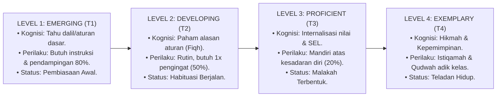

# P3-02-02-Struktur-Gradasi-4-Level-Kompetensi

## Tujuan
Menetapkan arsitektur standar **Gradasi 4 Level Kematangan Kompetensi** (*The 4-Tier Behavioral Progression*) untuk seluruh 10 karakter santri TUMBUH, memberikan panduan asesmen yang berjenjang dari tahap adaptasi hingga kemandirian teladan.

---

## 1. Matriks Karakteristik 4 Level Kematangan

---

## 2. Definisi Baku 4 Level dalam Ekosistem TUMBUH

1. **Level 1 — Emerging (*Al-Bidayah / T1*)**:
   - Santri mengenali konsep adab secara kognitif, namun dalam tindakan sehari-hari masih membutuhkan bimbingan intensif dan pengawasan langsung dari musyrif.
2. **Level 2 — Developing (*At-Tadrib / T2*)**:
   - Santri mampu menjalankan rutinitas adab secara konsisten dalam kondisi normal, namun sesekali masih membutuhkan pengingat jika menghadapi distraksi.
3. **Level 3 — Proficient (*Al-Tamassuk / T3*)**:
   - Nilai karakter telah terinternalisasi menjadi kesadaran batin (*Self-Awareness*). Santri berinisiatif menjalankan adab tanpa perlu diperintah atau diawasi.
4. **Level 4 — Exemplary (*Al-Qudwah / T4*)**:
   - Karakter telah menjadi watak spontan (*Malakah*). Santri tidak hanya mandiri, melainkan secara aktif menjadi model teladan hidup (*Qudwah*) dan membimbing adik kelasnya dengan kasih sayang.

---

## 3. Status Dokumen
* **Status**: 🌟 **A+ (Tervalidasi & Siap Diimplementasikan)**
* **Level**: Project 3 - `03 Capacity Framework / 02 Character Architecture`
* **Langkah Berikutnya**: **`P3-02-03-Penyelarasan-Taksonomi-Bloom-dan-Fitrah.md`**.
