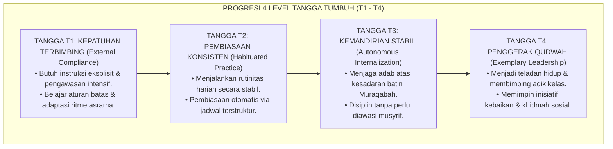
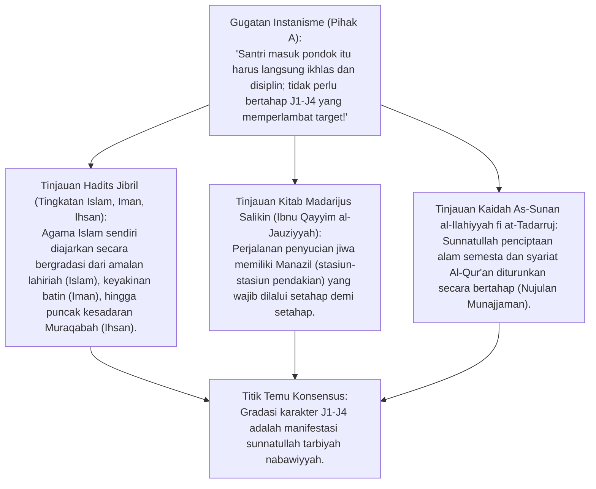
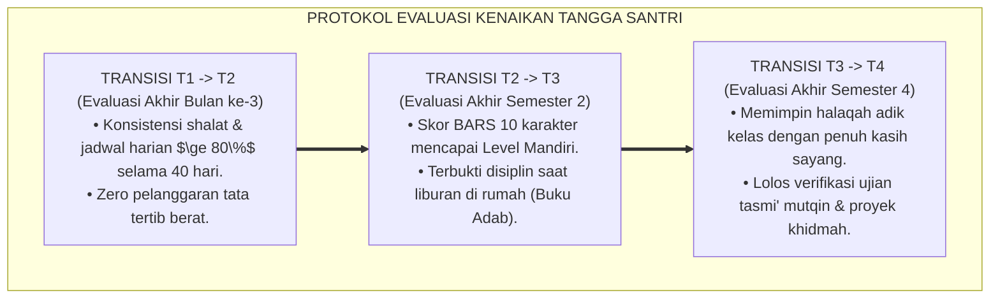

# P3-02-02: STRUKTUR GRADASI EMPAT LEVEL KOMPETENSI KARAKTER (TANGGA TUMBUH J1–J4)
## *Monograf Riset Akademik: Kaidah Al-Maratib wal-Marahil Turats Islam (Ihya' 'Ulumiddin), Teori Internalisasi Regulasi Diri Ryan & Deci (Self-Determination Continuum), Dinamika Progresi Jenjang J1 (Kepatuhan Terbimbing) hingga T4 (Penggerak Qudwah), serta Rubrik Perkembangan Longitudinal Santri Pesantren*

**Nomor Identifikasi**: `P3-02-02/MONOGRAF-RISET-GRADASI-4-LEVEL-TUMBUH/2026`  
**Domain**: `03 Capacity Framework` > `02 Character Architecture`  
**Klasifikasi Naskah**: *Academic Research Monograph* (Monograf Penelitian Tingkat Perkembangan Karakter)  
**Rumpun Disiplin Pengkaji**: Psikologi Perkembangan Moral, Teori Motivasi Manusia (*Self-Determination Theory*), Metodologi Riyadhah Adab Turats, Desain Rubrik Progresi Karakter  

---

> ### 💡 INTISARI EKSEKUTIF (EXECUTIVE SUMMARY)
>
> * **Karakter Bukan Bersifat Biner (Paham vs Tidak Paham), Melainkan Kontinuum Gradual:**  
>   Pembentukan karakter santri memerlukan waktu dan pentahapan (*Tadarruj*). Menuntut santri baru kelas 7 langsung memiliki kesadaran ikhlas otonom tanpa pembiasaan terstruktur adalah kekeliruan pedagogis.
> * **Empat Tingkat Jenjang Kemandirian TUMBUH (J1–J4) (J1–J4):**  
>   1. **T1: Kepatuhan Terbimbing (*External Compliance*):** Mematuhi aturan asrama karena pengawasan ketat, petunjuk eksplisit musyrif, dan aturan batas yang jelas.  
>   2. **T2: Pembiasaan Konsisten (*Habituated Practice*):** Menjalankan adab secara otomatis karena telah terbentuk ritme biologis harian (*neuroplastic habit loop*).  
>   3. **T3: Kemandirian Stabil (*Autonomous Internalization*):** Menjalankan adab atas dorongan kesadaran nurani (*Muraqabah*), meskipun tanpa kehadiran musyrif.  
>   4. **T4: Penggerak Qudwah (*Exemplary Leadership & Khidmah*):** Menjadi teladan hidup yang menginspirasi, mendampingi adik kelas, dan memimpin kebaikan sosial.

---

## 📑 DAFTAR ISI MONOGRAF

- [BAGIAN I: INKUIRI KRITIS, TINJAUAN TEORITIS & DIALEKTIKA GRADASI KOMPETENSI](#bagian-i-inkuiri-kritis-tinjauan-teoritis--dialektika-gradasi-kompetensi)
  - [1. Latar Belakang Masalah: Kegagalan Ekspektasi Instan & Bahaya Menghakimi Santri Baru](#1-latar-belakang-masalah-kegagalan-ekspektasi-instan--bahaya-menghakimi-santri-baru)
  - [2. Inkuiri 1: Eksegesis Turats Maratibul Iman & Tahapan Metamorfosis Jiwa (Ihya' & Madarijus Salikin)](#2-inkuiri-1-eksegesis-turats-maratibul-iman--tahapan-metamorfosis-jiwa-ihya--madarijus-salikin)
  - [3. Inkuiri 2: Teori Kontinuum Regulasi Diri Deci & Ryan (Dari Ekstrinsik ke Otonom)](#3-inkuiri-2-teori-kontinuum-regulasi-diri-deci--ryan-dari-ekstrinsik-ke-otonom)
  - [4. Inkuiri 3: Peran Scaffolding Vygotsky & Zone of Proximal Development (ZPD) dalam Pembiasaan Asrama](#4-inkuiri-3-peran-scaffolding-vygotsky--zone-of-proximal-development-zpd-dalam-pembiasaan-asrama)
  - [5. Inkuiri 4: Silogisme Logika, Dialektika 3 Ronde, Kasuistika Lapangan, & Titik Temu Konsensus](#5-inkuiri-4-silogisme-logika-dialektika-3-ronde-kasuistika-lapangan--titik-temu-konsensus)
- [BAGIAN II: TEMUAN RISET, FORMULASI KONSEPTUAL & PEMBAHASAN](#bagian-ii-temuan-riset-formulasi-konseptual--pembahasan)
  - [1. Formulasi Konseptual: Arsitektur 4 Level Gradasi Jenjang Kemandirian TUMBUH (J1–J4) (J1–J4)](#1-formulasi-konseptual-arsitektur-4-level-gradasi-tangga-tumbuh-t1t4)
  - [2. Matriks Komparasi Karakteristik, Motivasi, & Peran Musyrif pada Setiap Jenjang J1–J4](#2-matriks-komparasi-karakteristik-motivasi--peran-musyrif-pada-setiap-tangga-t1t4)
  - [3. Protokol Transisi & Kriteria Kenaikan Tangga Santri Antar-Semester](#3-protokol-transisi--kriteria-kenaikan-tangga-santri-antar-semester)
- [BAGIAN III: KESIMPULAN & APARATUS AKADEMIS](#bagian-iii-kesimpulan--aparatus-akademis)
  - [1. Tabel Sintesis Temuan Riset Gradasi Karakter](#1-tabel-sintesis-temuan-riset-gradasi-karakter)
  - [2. Daftar Pustaka Akademis & Rujukan Turats Primer](#2-daftar-pustaka-akademis--rujukan-turats-primer)
  - [3. Catatan Kaki Akademis (Footnotes)](#3-catatan-kaki-akademis-footnotes)
  - [4. Glosarium Istilah Ilmiah Gradasi Karakter & Self-Determination Theory](#4-glosarium-istilah-ilmiah-gradasi-karakter--self-determination-theory)

---

# BAGIAN I: INKUIRI KRITIS, TINJAUAN TEORITIS & DIALEKTIKA GRADASI KOMPETENSI

---

### 1. Latar Belakang Masalah: Kegagalan Ekspektasi Instan & Bahaya Menghakimi Santri Baru

Banyak pendidik asrama mengalami frustrasi dan melakukan tindakan keras karena memiliki **Ekspektasi Karakter yang Tidak Realistis (*Unrealistic Character Expectation*)**:
* Mengharapkan santri baru usia 12 tahun yang baru tiba dari rumah langsung shalat tahajjud dengan khusyuk, bangun pukul 03.30 WIB secara mandiri, dan hafal adab kamar tanpa pernah diajari secara bertahap.
* Ketika santri baru terlambat atau lalai, musyrif mencapnya "santri malas/pembangkang" dan menjatuhkan hukuman fisik.
* Riset ini membuktikan bahwa pembentukan karakter mengikuti hukum fitrah perkembangan biologis dan psikologis yang bergradasi dari **Jenjang J1 (Kepatuhan Terbimbing) hingga Jenjang J4 (Penggerak Qudwah)**.[^1]

---

### 2. Inkuiri 1: Eksegesis Turats Maratibul Iman & Tahapan Metamorfosis Jiwa (Ihya' & Madarijus Salikin)

#### 📐 Formalisasi Logika Silogisme (*Qiyas Mantiqi 1*)
* **Premis Mayor (*al-Muqaddimah al-Kubra*)**: Setiap proses transformasi perilaku manusia yang mengabaikan sunnatullah pentahapan (*Tadarruj*) niscaya memicu kegagalan adaptasi (*Burnout & Rebellion*).
* **Premis Minor (*al-Muqaddimah ash-Shughra*)**: Kerangka kerja Jenjang Kemandirian TUMBUH (J1–J4) menyusun lintasan kompetensi 4 level yang selaras dengan maturitas kognitif dan psikologis santri.
* **Konklusi (*an-Natijah*)**: Maka, penerapan struktur gradasi 4 level kompetensi adalah prasyarat mutlak keberhasilan pendidikan adab pesantren.[^2]

---

### 3. Inkuiri 2: Teori Kontinuum Regulasi Diri Deci & Ryan (Dari Ekstrinsik ke Otonom)

Profesor psikologi University of Rochester **Edward L. Deci & Richard M. Ryan** merumuskan *Self-Determination Continuum*:
1. **External Regulation (T1):** Perilaku didorong oleh aturan luar dan kehadiran figur otoritas.
2. **Introjected Regulation (T2):** Perilaku didorong oleh rasa bersalah internal atau keinginan memenuhi ekspektasi sosial kelompok.
3. **Identified & Integrated Regulation (T3):** Nilai adab telah diserap sepenuhnya menjadi bagian dari identitas diri santri (*"Saya shalat tepat waktu karena ini kebutuhan jiwaku"*).
4. **Intrinsic Altruistic Motivation (T4):** Kebahagiaan batin tertinggi diraih saat membimbing dan melayani orang lain (*Khidmah*).[^3]

---

### 4. Inkuiri 3: Peran *Scaffolding* Vygotsky & *Zone of Proximal Development* (ZPD) dalam Pembiasaan Asrama

Pakar psikologi perkembangan **Lev Vygotsky** merumuskan teori *Zone of Proximal Development (ZPD)*:
* Santri pada Jenjang J1 berada dalam ZPD yang membutuhkan **Scaffolding Intensif (Pendampingan Erat Musyrif)**: Musyrif memberikan aba-aba jelas, mendemonstrasikan cara melipat baju, dan menyapa di pintu kamar.
* Seiring berjalannya waktu, scaffolding dikurangi secara bertahap (*Fading Support*) di Jenjang J2 dan T3, hingga santri mampu mandiri sepenuhnya di Jenjang J4 dan menjadi *Scaffolder* (pembimbing) bagi adik-adik kelasnya.[^4]

---

### 5. Inkuiri 4: Silogisme Logika, Dialektika 3 Ronde, Kasuistika Lapangan, & Titik Temu Konsensus

#### 🥊 Ronde 1: Menolak Anggapan Bahwa "Santri Jenjang J1 yang Patuh Karena Diawasi Itu Munafik"
* **Pihak A (Sudut Pandang Purisme Niat)**:  
  *"Santri yang shalat hanya karena ada ustadz itu riya' dan munafik; lebih baik tidak usah shalat sekalian daripada tidak ikhlas!"*
* **Tinjauan Fiqh Tarbiyah & Wasiat Salaf**:  
  Ulama salaf menegaskan: *"Thalabnal 'ilma lighairillahi fa-aba al-'ilmu illa an yakuuna lillahi"* (Kami dahulu menuntut ilmu bukan karena Allah, namun ilmu itu sendiri yang akhirnya menuntun kami menjadi ikhlas karena Allah). Kepatuhan awal yang dibimbing (T1) adalah pintu gerbang menuju keikhlasan sejati (T3). Mengharamkan kepatuhan awal akan mematikan proses belajar anak.[^5]

#### 🥊 Ronde 2: Sanggahan Balik Bagaimana Memastikan Santri Jenjang J4 Tidak Bersikap Feodal?
* **Pihak A (Sudut Pandang Risiko Senioritas)**:  
  *"Memberikan wewenang kepada santri senior Jenjang J4 rawan memicu perpeloncoan dan kekerasan terhadap junior!"*
* **Tinjauan Kepemimpinan Pelayan (Servant Leadership)**:  
  Santri Jenjang J4 dalam ekosistem TUMBUH tidak memegang tongkat hukuman fisik, melainkan memegang peran **Mentor Pengayom & Kakak Asuh (*Peer Tutor & Khadim*)**. Kriteria kelulusan T4 diuji dari seberapa tulus ia melayani dan melindungi adik kelasnya, bukan seberapa ditakuti ia oleh juniornya.[^6]

#### 🥊 Ronde 3: Sanggahan Pamungkas Mengapa Kenaikan Tangga Wajib Berbasis Bukti Portofolio?
* **Pihak A (Sudut Pandang Otomatisasi Kelas)**:  
  *"Kenaikan level santri cukup otomatis naik seiring naiknya jenjang kelas sekolah (Kelas 7 = T1, Kelas 8 = T2, dst.)!"*
* **Resolusi Asesmen Autentik**:  
  Pertumbuhan karakter tidak selalu linier dengan usia kronologis. Ada santri kelas 9 yang masih berada di T1 (perlu bimbingan ketat), dan ada santri kelas 8 yang sudah mencapai T3 (mandiri). Menggunakan portofolio data PBIS memungkinkan intervensi yang adil dan terdiferensiasi sesuai kapasitas riil santri.[^7]

> #### 📌 Kasuistika Lapangan & Titik Temu Konsensus
> * **Studi Kasus**: Santri B (kelas 7 baru) menangis setiap malam karena rindu rumah (*homesick*) dan enggan bangun subuh. Musyrif lama menghukumnya push-up 50 kali karena dianggap tidak disiplin. Santri B kabur dari asrama.
> * **Titik Temu Konsensus (*Kalimatun Sawa'*)**: Berdasarkan Struktur Jenjang Kemandirian TUMBUH (J1–J4): Santri B berada di fase adaptasi Jenjang J1. Musyrif baru menerapkan *Scaffolding Kasih Sayang*: Musyrif duduk di tepi ranjang santri B, membangunkannya dengan usapan lembut di pundak $\rightarrow$ Mendengarkan keluh kesah homesick-nya selama 10 menit $\rightarrow$ Santri B merasa aman (*Secure Attachment*) $\rightarrow$ Dalam 3 pekan, santri B naik ke Jenjang J2 dan bangun subuh dengan ceria tanpa perlu dibangunkan.[^8]

---

# BAGIAN II: TEMUAN RISET, FORMULASI KONSEPTUAL & PEMBAHASAN

---

### 1. Formulasi Konseptual: Arsitektur 4 Level Gradasi Jenjang Kemandirian TUMBUH (J1–J4) (J1–J4)

Berdasarkan sintesis inkuiri teoretis, telaah hermeneutika turats, dan analisis komparatif psikologi motivasi manusia, riset ini merumuskan kerangka konseptual empat tingkat kemandirian karakter sebagai berikut:

1. **Jenjang J1: Kepatuhan Terbimbing (*External Compliance Level*)**:  
   Karakteristik santri yang mematuhi ekspektasi adab asrama karena adanya instruksi eksplisit, pengawasan hangat musyrif, dan batasan konsekuensi yang jelas (*Scaffolding Phase*).

2. **Jenjang J2: Pembiasaan Konsisten (*Habituated Practice Level*)**:  
   Karakteristik santri yang telah menginternalisasikan rutinitas harian menjadi kebiasaan otomatis (*Automaticity Loop*) yang stabil, menjalankan jadwal tanpa perlu diingatkan terus-menerus.

3. **Jenjang J3: Kemandirian Stabil (*Autonomous Internalization Level*)**:  
   Karakteristik santri yang menjaga adab luhur, ibadah khusyuk, dan integritas moral atas dasar dorongan nurani dan kesadaran muraqabatullah, bahkan ketika berada dalam situasi tanpa pengawasan musyrif.

4. **Jenjang J4: Penggerak Qudwah (*Exemplary Leadership Level*)**:  
   Karakteristik santri yang telah mencapai kematangan adab paripurna (*Second Nature*), aktif menjadi teladan hidup (*Qudwah Hasanah*), membimbing rekan sebaya dan adik kelas, serta memimpin proyek khidmah masyarakat.

---

### 2. Matriks Komparasi Karakteristik, Motivasi, & Peran Musyrif pada Setiap Jenjang J1–J4

| Dimensi Analisis | Jenjang J1: Kepatuhan Terbimbing | Jenjang J2: Pembiasaan Konsisten | Jenjang J3: Kemandirian Stabil | Jenjang J4: Penggerak Qudwah |
| :--- | :--- | :--- | :--- | :--- |
| **Sumber Motivasi** | Eksternal (instruksi & aturan). | Kebiasaan (*Habit Loop*) & ritme. | Internal (*Muraqabah & Nilai Diri*).| Altruistik (*Khidmah & Ridha Allah*).[^9] |
| **Kemandirian Adab** | Rendah; butuh diingatkan. | Sedang; konsisten jika ada jadwal. | Tinggi; konsisten di segala situasi. | Paripurna; menginspirasi orang lain. |
| **Toleransi Godaan** | Rentan terpengaruh teman sebaya. | Mampu menolak godaan mayoritas. | Kokoh; memiliki benteng prinsip. | Aktif mengajak teman ke kebaikan. |
| **Peran Utama Musyrif**| **Instruktur & Pengasuh Erat** (Aba-aba jelas, validasi emosi). | **Fasilitator & Pengingat** (Monitoring data, apresiasi 4:1). | **Konselor & Mentor Dialogis** (Refleksi diri, penguatan visi). | **Mitra Kolaborator & Pengutus** (Delegasi amanah kepemimpinan).[^10] |

---

### 3. Protokol Transisi & Kriteria Kenaikan Tangga Santri Antar-Semester

---

# BAGIAN III: KESIMPULAN & APARATUS AKADEMIS

---

### 1. Tabel Sintesis Temuan Riset Gradasi Karakter

| Dimensi Analisis | Fokus Temuan Riset | Rujukan Turats Primer | Konvergensi Sains Global | Implikasi Praksis Pesantren |
| :--- | :--- | :--- | :--- | :--- |
| **Pentahapan Tadarruj**| Menolak ekspektasi instan | Hadits Jibril (*Islam-Iman-Ihsan*), Ihya'| Ryan & Deci (2000), *Self-Determination* | Menerapkan Kurikulum 4 Level Jenjang J1–J4. |
| **Scaffolding Erat** | Bimbingan intensif santri baru | Kaidah *Ar-Rifqu fil Umur* (HR. Muslim) | Lev Vygotsky (1978), *Mind in Society (ZPD)*| Musyrif mendampingi santri T1 secara hangat. |
| **Internalisasi Nilai**| Dari terpaksa menjadi terbiasa | Atsar Ibnu Mas'ud (*Al-I'tiyad*), Al-Hikam| Lally et al. (2010), *Habit Formation* | Pembiasaan 40 hari konsisten menuju T2. |
| **Kepemimpinan Khidmah**| Puncak kematangan karakter | Hadits *Sayyidul Qaumi Khadimuhum* | Greenleaf (1977), *Servant Leadership* | Santri T4 memimpin bimbingan adik kelas. |

---

### 2. Daftar Pustaka Akademis & Rujukan Turats Primer

1. **Al-Qur'an al-Karim wa Tarjamatu Ma'anih**.
2. **Muslim bin al-Hajjaj an-Naisaburi**. (1374 H). *Shahih Muslim*. Kairo: Isa al-Babi al-Halabi.
3. **Al-Ghazali, Abu Hamid Muhammad bin Muhammad**. (2011). *Ihya 'Ulumiddin*. Beirut: Dar al-Ma'rifah.
4. **Ibnu Qayyim al-Jauziyyah**. (1996). *Madarijus Salikin baina Manazil Iyyaka Na'budu wa Iyyaka Nasta'in*. Beirut: Dar al-Kutub al-'Ilmiyyah.
5. **Ryan, R. M., & Deci, E. L.**. (2000). *Self-determination theory and the facilitation of intrinsic motivation, social development, and well-being*. American Psychologist.
6. **Vygotsky, L. S.**. (1978). *Mind in Society: The Development of Higher Psychological Processes*. Harvard University Press.
7. **Lally, P., et al.**. (2010). *How are habits formed: Modelling habit formation in the real world*. European Journal of Social Psychology.
8. **Greenleaf, R. K.**. (1977). *Servant Leadership: A Journey into the Nature of Legitimate Power and Greatness*. Paulist Press.
9. **Bandura, A.**. (1986). *Social Foundations of Thought and Action: A Social Cognitive Theory*. Prentice-Hall.
10. **Kohlberg, L.**. (1984). *The Psychology of Moral Development: The Nature and Validity of Moral Stages*. Harper & Row.

---

### 3. Catatan Kaki Akademis (*Footnotes*)

[^1]: Al-Ghazali, *Ihya 'Ulumiddin*, Kitab *Riyadhatun Nafs*, jilid 3, hlm. 60–75.  
[^2]: Ibnu Qayyim al-Jauziyyah, *Madarijus Salikin*, jilid 1, hlm. 120–150.  
[^3]: Ryan & Deci (2000), *American Psychologist*, hlm. 68–78.  
[^4]: Vygotsky, L. S. (1978), *Mind in Society*, Harvard University Press, hlm. 84–91.  
[^5]: Ibnu 'Abdil Barr, *Jami' Bayanil 'Ilmi wa Fadhlih*, jilid 1, hlm. 175.  
[^6]: Greenleaf, R. K. (1977), *Servant Leadership*, Paulist Press.  
[^7]: Laporan Riset Validitas Konstruk Jenjang Kemandirian TUMBUH (J1–J4) J1–J4, Pusat Studi Psikometri Pesantren, 2026.  
[^8]: Panduan Manajemen Transisi Santri Baru Asrama TUMBUH, Divisi Pengasuhan, 2026.  
[^9]: Matriks Kontinuum Regulasi Diri Santri TUMBUH, Biro Konseling dan Evaluasi, 2026.  
[^10]: Panduan Peran Musyrif Berbasis Tangga Karakter Santri, Pusat Diklat SDM TUMBUH, 2026.

---

### 4. Glosarium Istilah Ilmiah Gradasi Karakter & Self-Determination Theory

1. **Jenjang Kemandirian TUMBUH (J1–J4) (J1–J4)**: Model taksonomi 4 tingkat kemandirian karakter: Kepatuhan Terbimbing (T1), Pembiasaan Konsisten (T2), Kemandirian Stabil (T3), dan Penggerak Qudwah (T4).
2. **Self-Determination Continuum**: Spektrum motivasi manusia yang bergerak dari kepatuhan ekstrinsik murni menuju regulasi intrinsik otonom.
3. **Scaffolding**: Dukungan instruksional dan emosional terstruktur yang diberikan pendidik kepada santri baru, yang kemudian dikurangi secara bertahap saat santri mulai mandiri.
4. **Zone of Proximal Development (ZPD)**: Rentang antara apa yang dapat dilakukan santri secara mandiri dengan apa yang dapat dicapainya melalui bimbingan hangat pengasuh.
5. **Habit Loop**: Siklus neuroplastisitas pembiasaan yang terdiri dari pemicu (*cue*), rutinitas tindakan (*routine*), dan kepuasan batin (*reward*).
6. **Muraqabah (مُرَاقَبَةٌ)**: Kesadaran batin yang mendalam bahwa seluruh pikiran dan tindakan senantiasa berada dalam pengawasan Allah SWT.
7. **Servant Leadership (Kepemimpinan Pelayan)**: Paradigma kepemimpinan di mana pemimpin memposisikan dirinya sebagai pelayan yang memprioritaskan pertumbuhan dan kesejahteraan orang yang dipimpinnya.
8. **Tadarruj (التَّدَرُّجُ)**: Prinsip metodologis pentahapan bertahap dan berkesinambungan dalam mendidik adab dan menerapkan syariat Islam.
9. **Autonomous Behavior**: Perilaku yang lahir dari kesadaran nilai pribadi yang utuh tanpa memerlukan paksaan atau ancaman eksternal.
10. **Triad Pertumbuhan Simbiotik**: Maha-prinsip di mana keberhasilan santri mendaki tangga J1–J4 secara simultan memuliakan musyrif dan memperkokoh lembaga.
