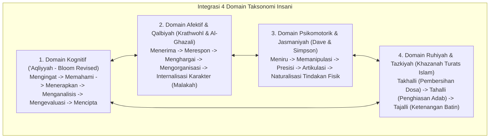

# P3-02-03-Penyelarasan-Taksonomi-Bloom-dan-Fitrah

## Tujuan
Menyelaraskan **Taksonomi Bloom (Revisi Anderson & Krathwohl)** dengan **Taksonomi Fitrah & Tazkiyatun Nafs Islam**, menyatukan domain Kognitif (*Akal*), Afektif (*Hati/Qalb*), Psikomotorik (*Jasad*), dan Spiritual (*Ruh*) ke dalam taksonomi kompetensi santri yang utuh.

---

## 1. Matriks Penyelarasan Taksonomi Bloom & Khazanah Islam

---

## 2. Tabel Perbandingan Capaian Kompetensi

| Domain | Tingkat Rendah (T1 - Awal) | Tingkat Menengah (T2-T3) | Tingkat Tinggi (T4 - Paripurna) |
| :--- | :--- | :--- | :--- |
| **Kognitif ('Aql)** | Menghafal matan kaidah Fiqh / ayat Al-Qur'an. | Memahami korelasi illat hukum & konteks kaidah. | Menganalisis fatwa kontemporer & merumuskan solusi masalah (*Ijtihad/Hikmah*). |
| **Afektif (Qalb)** | Mengikuti sholat jamaah karena ikut-ikutan teman. | Menikmati kekhusyukan ibadah & empati persaudaraan. | Ikhlas beramal semata karena Allah (*Mahabbah & Muraqabatullah*). |
| **Psikomotorik (Jasad)** | Gerakan wudhu & sholat masih kaku, butuh dibimbing. | Gerakan sholat presisi, tertib, dan tuma'ninah. | Seluruh adab fisik (makan, jalan, kebersihan) berjalan otomatis tanpa beban. |
| **Ruhiyah (Tazkiyah)** | Melepaskan umpatan kasar & kebiasaan buruk (*Takhalli*). | Menghiasi diri dengan dzikir & tilawah rutin (*Tahalli*). | Jiwa yang tenang dan bercahaya (*Nafs Muthmainnah / Tajalli*). |

---

## 3. Status Dokumen
* **Status**: 🌟 **A+ (Tervalidasi & Siap Diimplementasikan)**
* **Level**: Project 3 - `03 Capacity Framework / 02 Character Architecture`
* **Langkah Berikutnya**: **`P3-02-04-Skema-Rubrik-dan-Indikator-Perilaku.md`**.
