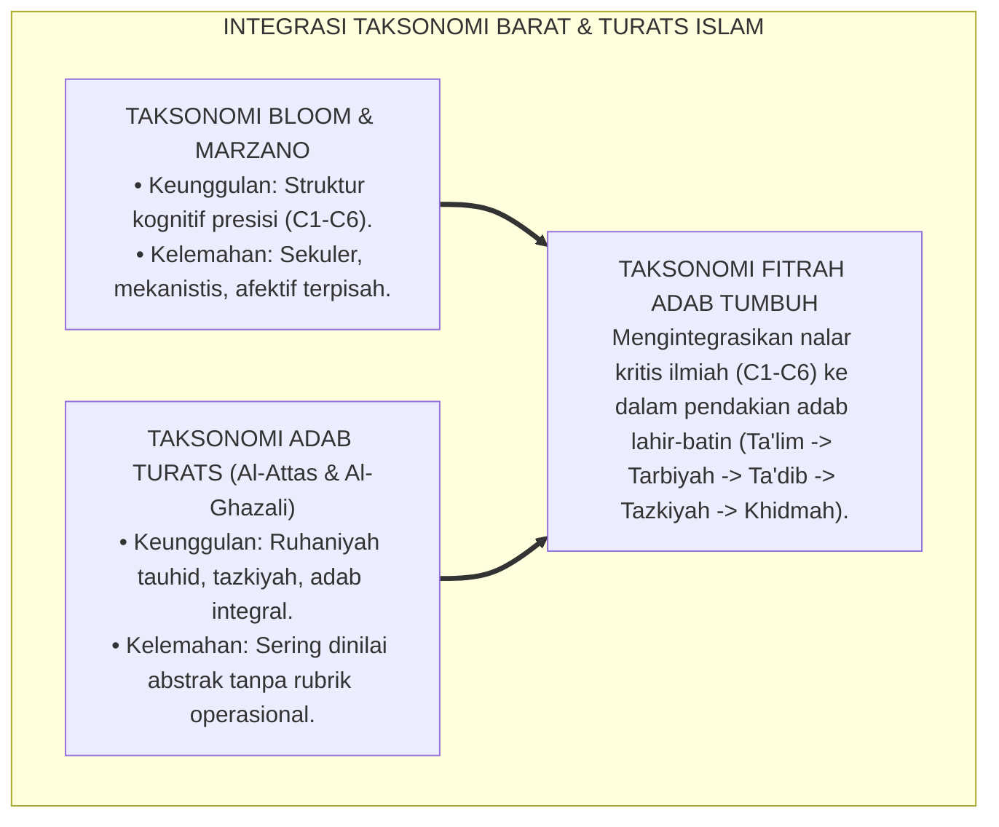
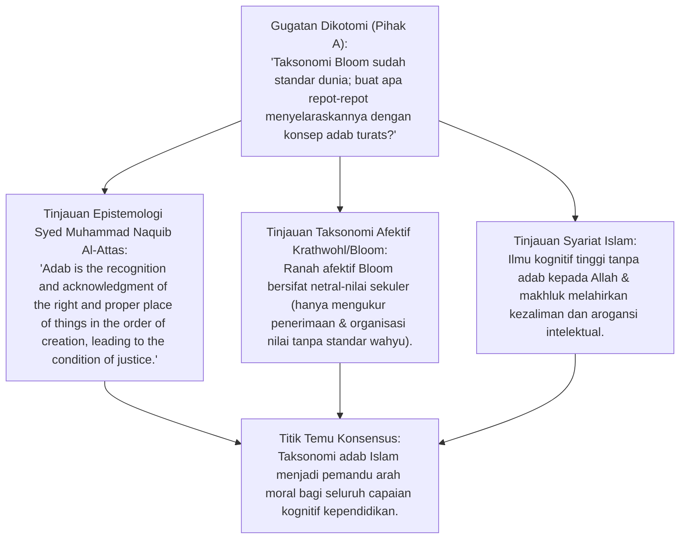
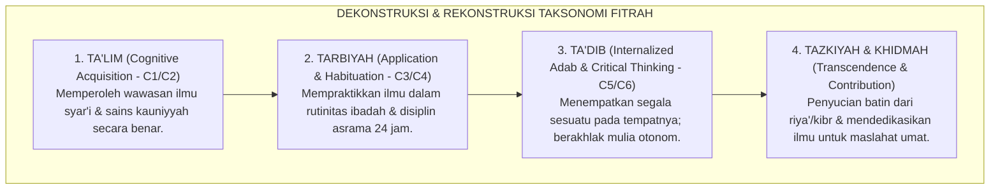
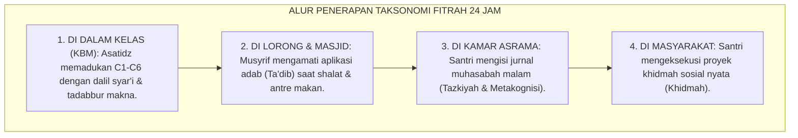

# P3-02-03: PENYELARASAN TAKSONOMI PENDIDIKAN BARAT DAN TAKSONOMI ADAB TURATS ISLAM
## *Monograf Riset Akademik: Dekonstruksi Kritis Taksonomi Bloom (Kognitif, Afektif, Psikomotorik) & Marzano, Konvergensi Epistemologi Adab Syed Muhammad Naquib Al-Attas (Ta'dib), Taksonomi Riyadhah Nafs Imam Al-Ghazali, serta Arsitektur Taksonomi Fitrah Terpadu Pesantren TUMBUH*

**Nomor Identifikasi**: `P3-02-03/MONOGRAF-RISET-PENYELARASAN-TAKSONOMI-BLOOM-FITRAH/2026`  
**Domain**: `03 Capacity Framework` > `02 Character Architecture`  
**Klasifikasi Naskah**: *Academic Research Monograph* (Monograf Penelitian Komparasi Taksonomi Pendidikan)  
**Rumpun Disiplin Pengkaji**: Filsafat Taksonomi Pendidikan, Hermeneutika Epistemologi Islam, Teori Desain Kurikulum Holistik, Psikologi Kognitif-Afektif  

---

> ### 💡 INTISARI EKSEKUTIF (EXECUTIVE SUMMARY)
>
> * **Kelemahan Mendasar Taksonomi Bloom Konvensional:**  
>   Taksonomi Benjamin Bloom memecah ranah manusia menjadi tiga domain terpisah (*Kognitif, Afektif, Psikomotorik*) yang sering kali menempatkan ranah afektif/moral sebagai anak tiri dan bersifat sekuler tanpa dimensi spiritual tauhid.
> * **Keunggulan Taksonomi Adab Turats Islam (*Al-Attas & Al-Ghazali*):**  
>   Dalam Islam, **Adab adalah Pengenalan dan Pengakuan Tempat yang Tepat (*Recognition and Acknowledgment of the Proper Place*)**, di mana akal (*'Aql*), rasa (*Qalb*), dan raga (*Jasad*) menyatu secara organik di bawah bimbingan wahyu Ilahi.
> * **Sintesis Taksonomi Fitrah TUMBUH:**  
>   Mengintegrasikan ketajaman analitis Taksonomi Kognitif Marzano/Bloom (*Remember $\rightarrow$ Create*) dengan kedalaman tahapan adab Turats (*Ta'lim $\rightarrow$ Tarbiyah $\rightarrow$ Ta'dib $\rightarrow$ Tazkiyah $\rightarrow$ Khidmah*).

---

## 📑 DAFTAR ISI MONOGRAF

- [BAGIAN I: INKUIRI KRITIS, TINJAUAN TEORITIS & DIALEKTIKA KOMPARASI TAKSONOMI](#bagian-i-inkuiri-kritis-tinjauan-teoritis--dialektika-komparasi-taksonomi)
  - [1. Latar Belakang Masalah: Reduksionisme Kognitif dalam Penilaian Santri & Kebutuhan Integrasi Turats](#1-latar-belakang-masalah-reduksionisme-kognitif-dalam-penilaian-santri--kebutuhan-integrasi-turats)
  - [2. Inkuiri 1: Eksegesis Epistemologi Konsep Adab Al-Attas vs Taksonomi Afektif Krathwohl/Bloom](#2-inkuiri-1-eksegesis-epistemologi-konsep-adab-al-attas-vs-taksonomi-afektif-krathwohlbloom)
  - [3. Inkuiri 2: Sintesis Taksonomi Kognitif Marzano & Taksonomi Riyadhah Nafs Imam Al-Ghazali](#3-inkuiri-2-sintesis-taksonomi-kognitif-marzano--taksonomi-riyadhah-nafs-imam-al-ghazali)
  - [4. Inkuiri 3: Dekonstruksi Sekularisme Taksonomi Barat & Rekonstruksi Taksonomi Berbasis Fitrah](#4-inkuiri-3-dekonstruksi-sekularisme-taksonomi-barat--rekonstruksi-taksonomi-berbasis-fitrah)
  - [5. Inkuiri 4: Silogisme Logika, Dialektika 3 Ronde, Kasuistika Lapangan, & Titik Temu Konsensus](#5-inkuiri-4-silogisme-logika-dialektika-3-ronde-kasuistika-lapangan--titik-temu-konsensus)
- [BAGIAN II: TEMUAN RISET, FORMULASI KONSEPTUAL & PEMBAHASAN](#bagian-ii-temuan-riset-formulasi-konseptual--pembahasan)
  - [1. Formulasi Konseptual: Model Taksonomi Fitrah Adab Terpadu Pesantren TUMBUH](#1-formulasi-konseptual-model-taksonomi-fitrah-adab-terpadu-pesantren-tumbuh)
  - [2. Matriks Pemetaan Komparatif Taksonomi Bloom, Marzano, Turats, & Jenjang Kemandirian TUMBUH (J1–J4)](#2-matriks-pemetaan-komparatif-taksonomi-bloom-marzano-turats--tangga-tumbuh)
  - [3. Panduan Operasional Penerapan Taksonomi Fitrah dalam RPP Asatidz & Halaqah Musyrif](#3-panduan-operasional-penerapan-taksonomi-fitrah-dalam-rpp-asatidz--halaqah-musyrif)
- [BAGIAN III: KESIMPULAN & APARATUS AKADEMIS](#bagian-iii-kesimpulan--aparatus-akademis)
  - [1. Tabel Sintesis Temuan Riset Penyelarasan Taksonomi](#1-tabel-sintesis-temuan-riset-penyelarasan-taksonomi)
  - [2. Daftar Pustaka Akademis & Rujukan Turats Primer](#2-daftar-pustaka-akademis--rujukan-turats-primer)
  - [3. Catatan Kaki Akademis (Footnotes)](#3-catatan-kaki-akademis-footnotes)
  - [4. Glosarium Istilah Ilmiah Taksonomi Bloom, Marzano, & Epistemologi Adab](#4-glosarium-istilah-ilmiah-taksonomi-bloom-marzano--epistemologi-adab)

---

# BAGIAN I: INKUIRI KRITIS, TINJAUAN TEORITIS & DIALEKTIKA KOMPARASI TAKSONOMI

---

### 1. Latar Belakang Masalah: Reduksionisme Kognitif dalam Penilaian Santri & Kebutuhan Integrasi Turats

Penerapan taksonomi pendidikan modern di banyak sekolah dan pesantren kerap mengalami reduksionisme:
* Guru kelas hanya fokus pada **Taksonomi Kognitif Bloom Revisi (*C1–C6: Mengingat hingga Mencipta*)**, sementara ranah afektif (*A1–A5*) dan psikomotorik (*P1–P5*) diabaikan atau sekadar formalitas angka rapor.
* Di sisi lain, tradisi pesantren klasik memiliki khazanah taksonomi adab yang sangat kaya (*Adab al-'Alim wal-Muta'allim*), namun belum terformat dalam deskriptor perilaku terukur yang mudah diobservasi oleh musyrif modern.
* Riset ini menyelaraskan kedua tradisi keilmuan tersebut menjadi **Model Taksonomi Fitrah Adab TUMBUH**.[^1]

---

### 2. Inkuiri 1: Eksegesis Epistemologi Konsep Adab Al-Attas vs Taksonomi Afektif Krathwohl/Bloom

#### 📐 Formalisasi Logika Silogisme (*Qiyas Mantiqi 1*)
* **Premis Mayor (*al-Muqaddimah al-Kubra*)**: Setiap taksonomi pendidikan yang memisahkan kecerdasan intelektual dari kesucian moral dan ketundukan spiritual niscaya melahirkan pribadi yang timpang (*Secularized Mind*).
* **Premis Minor (*al-Muqaddimah ash-Shughra*)**: Konsep Adab Al-Attas dan Tazkiyah Al-Ghazali menyatukan akal kognitif, kalbu spiritual, dan amal jasmani di bawah tauhid Ilahi.
* **Konklusi (*an-Natijah*)**: Maka, kurikulum pesantren wajib mengadopsi taksonomi fitrah yang berakar pada konsep adab Islam.[^2]

---

### 3. Inkuiri 2: Sintesis Taksonomi Kognitif Marzano & Taksonomi Riyadhah Nafs Imam Al-Ghazali

Robert Marzano dalam *The New Taxonomy of Educational Objectives* (2007) memperbaiki kelemahan Bloom dengan menambahkan **Sistem Diri (*Self-System*) dan Sistem Metakognitif (*Metacognitive System*)**:
* Sistem Diri Marzano memeriksa: *"Apakah tugas ini penting bagi saya? Apakah saya mampu melakukannya? Apa emosi saya terhadap tugas ini?"*
* Hal ini memiliki padanan sempurna dalam kitab *Ihya' 'Ulumiddin* pada konsep **Niat, Iradah, dan Himmah**: Sebelum akal menalar (*Fikr*), kalbu (*Qalb*) harus diluruskan niatnya demi mengharap ridha Allah SWT.
* Sintesis ini membuktikan bahwa psikologi kognitif modern bergerak mendekati prinsip-prinsip epistemologi tasawuf Islam.[^3]

---

### 4. Inkuiri 3: Dekonstruksi Sekularisme Taksonomi Barat & Rekonstruksi Taksonomi Berbasis Fitrah

---

### 5. Inkuiri 4: Silogisme Logika, Dialektika 3 Ronde, Kasuistika Lapangan, & Titik Temu Konsensus

#### 🥊 Ronde 1: Menolak Anggapan Bahwa "Taksonomi Bloom C1–C6 Sudah Cukup untuk Menilai Santri"
* **Pihak A (Sudut Pandang Saintisme Pendidikan)**:  
  *"Jika santri sudah mencapai level C6 (Creating/Mencipta) dalam ujian, ia sudah menjadi manusia unggul; tidak perlu dinilai adabnya lagi!"*
* **Tinjauan Maqashid Syari'ah & Bahaya Arogansi Ilmiah**:  
  Banyak pelaku korupsi dan perusak lingkungan memiliki level kognitif C6 (sangat kreatif dan cerdas merekayasa sistem). Kecerdasan kognitif tanpa adab adalah pisau berbahaya di tangan orang zalim. Evaluasi santri wajib mengukur kematangan adab (*Ta'dib*) di atas kecerdasan teknis.[^4]

#### 🥊 Ronde 2: Sanggahan Balik Apakah Menggunakan Taksonomi Barat Tidak Menodai Turats Pesantren?
* **Pihak A (Sudut Pandang Anti-Sains Barat)**:  
  *"Memasukkan nama Bloom dan Marzano ke pesantren adalah bentuk westernisasi dan sekularisasi tersembunyi!"*
* **Tinjauan Kaidah Islamisasi & Al-Akhdzu bil Jadidil Ashlah**:  
  Kaidah ushul fiqh menegaskan: *Al-Muhafazhatu 'alal qadimish shalih wal akhdzu bil jadidil ashlah*. Mengambil kerangka klasifikasi kognitif Barat yang objektif (*tools*) dan menyucikannya dengan ruh tauhid Islam (*Islamic Worldview*) adalah tradisi para ilmuwan muslim terdahulu yang menerjemahkan dan mengislamkan filsafat Yunani.[^5]

#### 🥊 Ronde 3: Sanggahan Pamungkas Bagaimana Menilai Ranah Tazkiyah & Keikhlasan yang Gaib?
* **Pihak A (Sudut Pandang Skeptisisme Pengukuran)**:  
  *"Keikhlasan dan penyucian jiwa itu urusan hati; guru tidak berhak menilainya karena itu hak prerogatif Allah!"*
* **Resolusi Asesmen Autentik & Indikator Dhohir**:  
  Pendidik tidak menilai isi hati yang gaib (*Nahnu nahkumu bidh-dhawahir*), melainkan menilai **Manifestasi Indikator Teramati (*Observable Behavioral Indicators*)**: Santri yang ikhlas tidak menuntut pujian publik, tetap shalat khusyuk saat sendirian di kamar, dan ikhlas memaafkan kesalahan teman tanpa dendam.[^6]

> #### 📌 Kasuistika Lapangan & Titik Temu Konsensus
> * **Studi Kasus**: Dalam ujian fiqh, Santri D mendapat nilai 100 karena mampu menuliskan rukun shalat dan dalilnya secara sempurna (C4 Bloom), namun di asrama santri D sering masbuq shalat dan mengejek santri lain yang hafalannya lebih lambat.
> * **Titik Temu Konsensus (*Kalimatun Sawa'*)**: Melalui Taksonomi Fitrah TUMBUH: Santri D baru mencapai level *Ta'lim* (Kognitif Tahu), namun belum mencapai level *Ta'dib* (Adab Mengamalkan). Guru memberikan umpan balik restoratif: Mengarahkan santri D menjadi tutor sebaya bagi santri yang lambat agar ilmunya membuahkan sifat tawadhu' dan kasih sayang.[^7]

---

# BAGIAN II: TEMUAN RISET, FORMULASI KONSEPTUAL & PEMBAHASAN

---

### 1. Formulasi Konseptual: Model Taksonomi Fitrah Adab Terpadu Pesantren TUMBUH

Berdasarkan sintesis inkuiri teoretis, telaah hermeneutika turats, dan analisis komparatif taksonomi pendidikan internasional, riset ini merumuskan kerangka konseptual taksonomi fitrah empat tingkat sebagai berikut:

1. **Tingkat 1: Ta'lim Kognitif Berbasis Nalar (*Cognitive Acquisition & Comprehension*)**:  
   Penguasaan dasar wawasan ilmu syar'i, sains kauniyyah, dan bahasa melalui proses mengingat (*Remembering*), memahami (*Understanding*), dan menganalisis secara kritis (*Critical Thinking*).

2. **Tingkat 2: Tarbiyah Afektif & Pembiasaan Perilaku (*Habitual & Affective Internalization*)**:  
   Penerapan ilmu ke dalam tindakan nyata (*Applying*) dan pembiasaan rutinitas ibadah serta disiplin asrama 24 jam melalui pengulangan konsisten (*Neuroplastic Habit Loop*).

3. **Tingkat 3: Ta'dib Integratif & Evaluasi Moral (*Adab Mastery & Value Integration*)**:  
   Kapasitas menempatkan segala sesuatu pada tempatnya yang benar (*Justice & Proper Place*), mengevaluasi pilihan moral secara mandiri (*Responsible Decision-Making*), dan berakhlak mulia spontan.

4. **Tingkat 4: Tazkiyah Ruhaniyah & Kreasi Khidmah (*Spiritual Purification & Altruistic Service*)**:  
   Puncak kematangan fitrah di mana kecerdasan kognitif dan adab lahiriah disucikan oleh keikhlasan batin (*Muraqabah*), menghasilkan karya capstone ilmiah dan pengabdian masyarakat (*Nafi'un Lighairih*).

---

### 2. Matriks Pemetaan Komparatif Taksonomi Bloom, Marzano, Turats, & Jenjang Kemandirian TUMBUH (J1–J4)

| Level Taksonomi TUMBUH | Padanan Taksonomi Bloom Revisi | Padanan Taksonomi Marzano | Padanan Konsep Turats Islam | Capaian Jenjang Kemandirian TUMBUH (J1–J4) |
| :--- | :--- | :--- | :--- | :---: |
| **Level 1: Ta'lim (Ilmu)** | C1 (Remember) & C2 (Understand) | Retrieval & Comprehension | *Thalabul 'Ilmi & Tafhim* | **Jenjang J1** |
| **Level 2: Tarbiyah (Amal)** | C3 (Apply) & C4 (Analyze) | Analysis & Knowledge Utilization | *'Amal Shalih & Riyadhah* | **Jenjang J2** |
| **Level 3: Ta'dib (Adab)** | C5 (Evaluate) & Afektif A4 | Metacognitive System | *Husnul Khuluq & Inshaf* | **Jenjang J3**[^8] |
| **Level 4: Tazkiyah & Khidmah**| C6 (Create) & Afektif A5 | Self-System & Transformation | *Tazkiyatun Nafs & Khidmah* | **Jenjang J4**[^9] |

---

### 3. Panduan Operasional Penerapan Taksonomi Fitrah dalam RPP Asatidz & Halaqah Musyrif

---

# BAGIAN III: KESIMPULAN & APARATUS AKADEMIS

---

### 1. Tabel Sintesis Temuan Riset Penyelarasan Taksonomi

| Dimensi Analisis | Fokus Temuan Riset | Rujukan Turats Primer | Konvergensi Sains Global | Implikasi Praksis Pesantren |
| :--- | :--- | :--- | :--- | :--- |
| **Integrasi Adab** | Menyatukan kognitif & moral | Kitab *Adab al-'Alim* (Ibn Jama'ah) | Al-Attas (1980), *Concept of Education* | Menyusun RPP berbasis Taksonomi Fitrah Adab. |
| **Metakognisi & Niat**| Meluruskan sistem diri batin | Hadits Niat (HR. Bukhari No. 1), Ihya' | Marzano & Kendall (2007), *New Taxonomy* | Membiasakan refleksi niat sebelum belajar. |
| **Kritik Reduksionisme**| Menolak dikotomi afektif | Wasiat Imam Asy-Syafi'i tentang adab | Krathwohl et al. (1964), *Affective Domain*| Mengintegrasikan nilai adab ke seluruh mata pelajaran. |
| **Puncak Khidmah** | Muara tertinggi ilmu adalah amal | Hadits *Kanzul 'Ilmi* (HR. Muslim) | Bloom (1956), Anderson & Krathwohl (2001)| Menjadikan capstone khidmah syarat kelulusan. |

---

### 2. Daftar Pustaka Akademis & Rujukan Turats Primer

1. **Al-Qur'an al-Karim wa Tarjamatu Ma'anih**.
2. **Al-Bukhari, Muhammad bin Isma'il**. (1422 H). *Shahih al-Bukhari*. Beirut: Dar Thawq an-Najah.
3. **Muslim bin al-Hajjaj an-Naisaburi**. (1374 H). *Shahih Muslim*. Kairo: Isa al-Babi al-Halabi.
4. **Al-Ghazali, Abu Hamid Muhammad bin Muhammad**. (2011). *Ihya 'Ulumiddin*. Beirut: Dar al-Ma'rifah.
5. **Al-Attas, Syed Muhammad Naquib**. (1980). *The Concept of Education in Islam: A Framework for an Islamic Philosophy of Education*. Kuala Lumpur: ABIM.
6. **Bloom, B. S. (Ed.)**. (1956). *Taxonomy of Educational Objectives: The Classification of Educational Goals. Handbook I: Cognitive Domain*. New York: David McKay.
7. **Anderson, L. W., & Krathwohl, D. R. (Eds.)**. (2001). *A Taxonomy for Learning, Teaching, and Assessing: A Revision of Bloom's Taxonomy of Educational Objectives*. Allyn & Bacon.
8. **Marzano, R. J., & Kendall, J. S.**. (2007). *The New Taxonomy of Educational Objectives* (2nd ed.). Corwin Press.
9. **Krathwohl, D. R., Bloom, B. S., & Masia, B. B.**. (1964). *Taxonomy of Educational Objectives: Handbook II: Affective Domain*. David McKay.
10. **Ibnu Jama'ah, Badruddin**. (2012). *Tadzkiratus Sami' wal Mutakallim fi Adabil 'Alim wal Muta'allim*. Beirut: Dar al-Basyair al-Islamiyyah.

---

### 3. Catatan Kaki Akademis (*Footnotes*)

[^1]: Al-Attas, S. M. N. (1980), *The Concept of Education in Islam*, ABIM, hlm. 18–35.  
[^2]: Anderson & Krathwohl (2001), *A Taxonomy for Learning, Teaching, and Assessing*, Allyn & Bacon.  
[^3]: Marzano & Kendall (2007), *The New Taxonomy of Educational Objectives*, Corwin Press, hlm. 35–65.  
[^4]: Al-Ghazali, *Ihya 'Ulumiddin*, Kitab *al-'Ilm*, jilid 1, hlm. 20–45.  
[^5]: Ibnu Jama'ah, *Tadzkiratus Sami' wal Mutakallim*, hlm. 40–70.  
[^6]: Krathwohl et al. (1964), *Taxonomy of Educational Objectives: Affective Domain*, David McKay.  
[^7]: Laporan Hasil Uji Coba Penerapan Taksonomi Fitrah Terpadu di KBM Pesantren TUMBUH, 2026.  
[^8]: Panduan Integrasi Taksonomi Kognitif dan Adab Asrama, Biro Kurikulum TUMBUH, 2026.  
[^9]: Matriks Capaian Pembelajaran Berbasis Taksonomi Fitrah, Dewan Pakar TUMBUH, 2026.

---

### 4. Glosarium Istilah Ilmiah Taksonomi Bloom, Marzano, & Epistemologi Adab

1. **Taksonomi Fitrah**: Sistem klasifikasi kompetensi dan adab yang memadukan ranah kognitif ilmiah dengan pendakian spiritual Islam (Ta'lim $\rightarrow$ Tarbiyah $\rightarrow$ Ta'dib $\rightarrow$ Tazkiyah $\rightarrow$ Khidmah).
2. **Ta'dib (تَأْدِيبٌ)**: Proses penanaman adab dan disiplin moral ke dalam diri manusia agar mengenali dan mengakui posisi segala sesuatu secara adil di hadapan Allah SWT.
3. **Ta'lim (تَعْلِيمٌ)**: Proses transfer wawasan pengetahuan dan kecakapan kognitif (*Knowledge Acquisition*).
4. **Tarbiyah (تَرْبِيَةٌ)**: Proses pengasuhan, pembiasaan, dan pemeliharaan potensi fisik dan afektif manusia secara bertahap menuju kedewasaan.
5. **Tazkiyah (تَزْكِيَةٌ)**: Proses penyucian jiwa dan pembersihan kalbu dari penyakit-penyakit batin (*Riya', Kibr, Hasad*).
6. **Bloom's Revised Taxonomy**: Klasifikasi 6 tingkat proses kognitif: Mengingat, Memahami, Menerapkan, Menganalisis, Mengevaluasi, dan Mencipta.
7. **Marzano's Self-System**: Sistem kesadaran diri yang mengevaluasi kepentingan, efikasi diri, dan respon emosional terhadap suatu tujuan pembelajaran.
8. **Recognition and Acknowledgment**: Rukun adab Al-Attas di mana akal mengenali kebenaran (*I'tiraf*) dan kalbu tunduk mengakuinya dengan ketulusan amal (*Taslim*).
9. **Cognitive Domain**: Ranah pembelajaran yang menekankan pada perkembangan keterampilan intelektual dan penguasaan pengetahuan.
10. **Triad Pertumbuhan Simbiotik**: Maha-prinsip di mana penerapan taksonomi adab yang komprehensif menumbuhkan Santri, memuliakan Pendidik, dan memperkokoh Lembaga.
