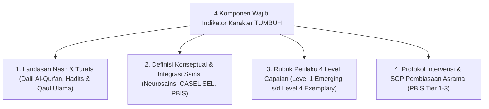

# P3-02-04-Skema-Rubrik-dan-Indikator-Perilaku

## Tujuan
Menetapkan arsitektur dan kaidah baku penyusunan **Rubrik Indikator Perilaku** (*Behavioral Indicators Schema*) untuk seluruh 10 karakter santri TUMBUH, memastikan setiap indikator memenuhi kaidah **SMART (Specific, Measurable, Achievable, Relevant, Time-Bound)** dan selaras dengan instrumen PBIS harian.

---

## 1. 4 Komponen Wajib Setiap Indikator Karakter

Setiap dokumen karakter di bab berikutnya (`04 Salimul Aqidah` s/d `13 Nafi'un Lighairih`) wajib memuat 4 komponen terstruktur:

---

## 2. Standar Redaksional Indikator Observabel

1. **Menggunakan Kata Kerja Operasional Teramati (*Action Verbs*)**:
   - ❌ *Buruk (Abstrak)*: "Santri mencintai kebersihan."
   - ✅ *Baku (TUMBUH)*: "Santri melipat selimut dan meletakkan pakaian kotor ke dalam keranjang cucian tertutup maksimal 15 menit setelah bangun tidur."
2. **Menetapkan Batasan Konteks & Frekuensi**:
   - Memuat informasi *kapan*, *di mana*, dan *seberapa sering* perilaku tersebut dilakukan.
3. **Kesesuaian dengan Input Cepat 30 Detik Logbook Digital**:
   - Indikator dapat dipetakan langsung menjadi pilihan cepat (*tagging*) di aplikasi asrama musyrif.

---

## 3. Status Dokumen
* **Status**: 🌟 **A+ (Tervalidasi & Siap Diimplementasikan)**
* **Level**: Project 3 - `03 Capacity Framework / 02 Character Architecture`
* **Langkah Berikutnya**: **`P3-02-05-Sintesis-Character-Architecture-TUMBUH.md`**.
