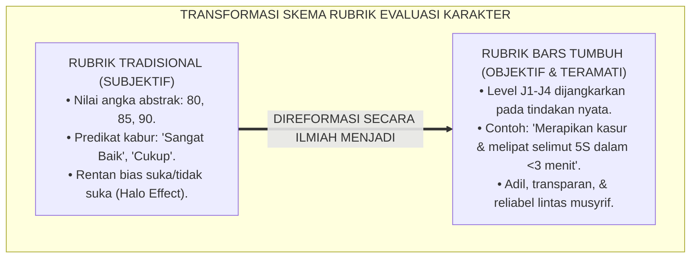
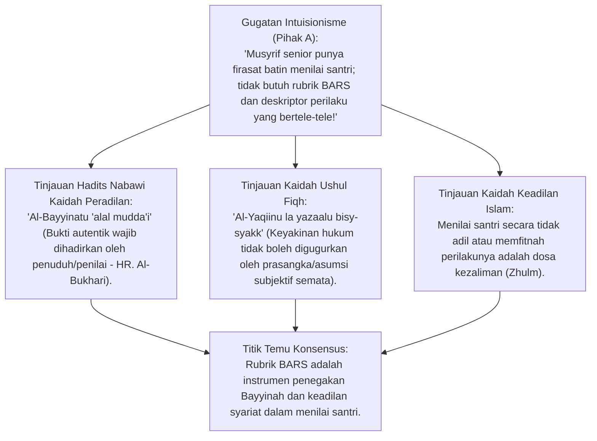
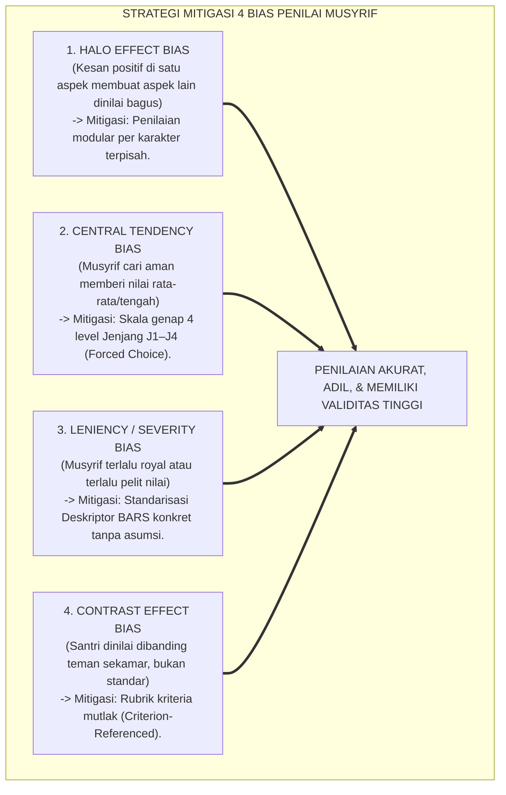
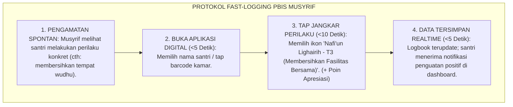
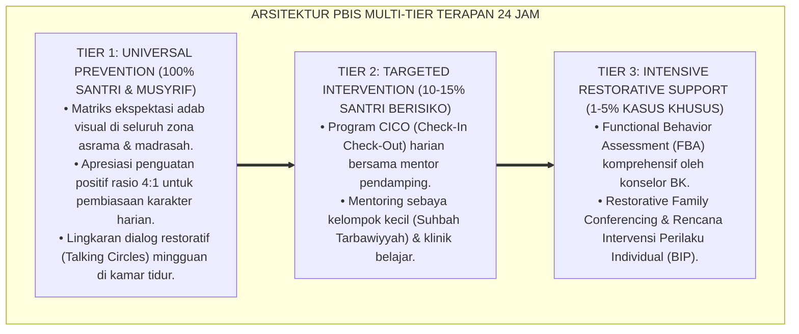

# P3-02-04: SKEMA RUBRIK OBSERVASI DAN DESKRIPTOR PERILAKU TERAMATI (OBSERVABLE BEHAVIORAL DESCRIPTORS)
## *Monograf Riset Akademik: Metodologi Behaviorally Anchored Rating Scales (BARS), Protokol Observasi Terstruktur 24 Jam di Pesantren, Eliminasi Bias Subjektivitas Penilai (Halo Effect & Severity Bias), serta Format Deskriptor Perilaku Teramati Sepuluh Karakter Muwashafat*

**Nomor Identifikasi**: `P3-02-04/MONOGRAF-RISET-SKEMA-RUBRIK-BARS/2026`  
**Domain**: `03 Capacity Framework` > `02 Character Architecture`  
**Klasifikasi Naskah**: *Academic Research Monograph* (Monograf Penelitian Desain Rubrik Observasi Karakter)  
**Rumpun Disiplin Pengkaji**: Psikometri Pengukuran Perilaku (*Behavioral Measurement*), Evaluasi Kinerja Pengasuhan, Fiqh Bayyinah & Pembuktian Obyektif, Desain Rubrik BARS  

---

> ### 💡 INTISARI EKSEKUTIF (EXECUTIVE SUMMARY)
>
> * **Kelemahan Penilaian Karakter Tradisional di Rapor Pesantren:**  
>   Banyak rapor kepribadian hanya memberikan label angka abstrak (misal: "Akhlak: 85" atau "Adab: B") tanpa deskriptor perilaku konkret, sehingga memicu bias subjektivitas (*Like/Dislike Asatidz*) dan tidak memberikan panduan perbaikan bagi santri.
> * **Inovasi Rubrik BARS (*Behaviorally Anchored Rating Scales*):**  
>   Setiap level pada Jenjang Kemandirian TUMBUH (J1–J4) (J1–J4) dijangkarkan pada **Deskriptor Tindakan Konkret Teramati (*Observable Behavioral Anchors*)**, misalnya: *"Merajut tali sepatu dan menata ranjang rapi standar 5S dalam waktu <3 menit tanpa diingatkan"* (T3).
> * **Protokol Observasi Rendah Friksi (*Low-Friction Observation*):**  
>   Pencatatan dilakukan secara *realtime* (<30 detik) melalui tombol cepat aplikasi PBIS, menjamin reliabilitas data tanpa membebani musyrif.

---

## 📑 DAFTAR ISI MONOGRAF

- [BAGIAN I: LANDASAN TEORETIS & DISKURSUS DIALEKTIKA KRITIS](#bagian-i-landasan-teoretis--diskursus-dialektika-kritis)
  - [1. Latar Belakang Masalah: Bahaya Bias Subjektivitas Penilai & Nilai Rapor Kepribadian Palsu](#1-latar-belakang-masalah-bahaya-bias-subjektivitas-penilai--nilai-rapor-kepribadian-palsu)
  - [2. Eksegesis Turats Kaidah Bayyinah (HR. Al-Bukhari) & Keadilan Penilaian Faktual](#2eksegesis-turats-kaidah-bayyinah-hr-al-bukhari-keadilan-penilaian-faktual)
  - [3. Teori Behaviorally Anchored Rating Scales (Smith & Kendall 1963) & Presisi Pengamatan](#3teori-behaviorally-anchored-rating-scales-smith-kendall-1963-presisi-pengamatan)
  - [4. Mitigasi Empat Bias Psikometrik Penilai (Halo, Central Tendency, Leniency, & Contrast Effect)](#4mitigasi-empat-bias-psikometrik-penilai-halo-central-tendency-leniency-contrast-effect)
  - [5. Silogisme Logika, Dialektika 3 Ronde, Kasuistika Lapangan, & Titik Temu Konsensus](#5silogisme-logika-dialektika-3-ronde-kasuistika-lapangan-titik-temu-konsensus)
- [BAGIAN II: FORMULASI KONSEPTUAL & PEMBAHASAN MENDALAM](#bagian-ii-formulasi-konseptual--pembahasan-mendalam)
  - [1. Formulasi Konseptual: Arsitektur Rubrik BARS Karakter Terpadu Pesantren TUMBUH](#1-formulasi-konseptual-arsitektur-rubrik-bars-karakter-terpadu-pesantren-tumbuh)
  - [2. Matriks Indikator & Deskriptor Perilaku Teramati (Observable Anchors) 10 Muwashafat](#2-matriks-indikator--deskriptor-perilaku-teramati-observable-anchors-10-muwashafat)
  - [3. Protokol Operasional Pengamatan Cepat Musyrif (<30 Detik Fast-Logging)](#3-protokol-operasional-pengamatan-cepat-musyrif-30-detik-fast-logging)
- [BAGIAN III: KESIMPULAN & APARATUS AKADEMIS](#bagian-iii-kesimpulan--aparatus-akademis)
  - [1. Tabel Sintesis Temuan Riset Desain Rubrik BARS](#1-tabel-sintesis-temuan-riset-desain-rubrik-bars)
  - [2. Daftar Pustaka Akademis & Rujukan Turats Primer](#2-daftar-pustaka-akademis--rujukan-turats-primer)
  - [3. Catatan Kaki Akademis (Footnotes)](#3-catatan-kaki-akademis-footnotes)
  - [4. Glosarium Istilah Ilmiah Rubrik BARS & Psikometri Perilaku](#4-glosarium-istilah-ilmiah-rubrik-bars--psikometri-perilaku)

---

# BAGIAN I: INKUIRI KRITIS, TINJAUAN TEORITIS & DIALEKTIKA PENGUKURAN PERILAKU

---

### 1. Latar Belakang Masalah: Bahaya Bias Subjektivitas Penilai & Nilai Rapor Kepribadian Palsu

Praktek evaluasi karakter di dunia pendidikan pesantren kerap dihantui oleh bias evaluatif:
* Santri yang pendiam atau berpenampilan rapi sering otomatis diberi nilai adab "A" (*Leniency / Halo Bias*), meskipun di kamar asrama ia sering mengabaikan tugas piket kebersihan.
* Sebaliknya, santri yang aktif dan kritis kerap dicap "kurang ajar" dan diberi nilai "C" (*Severity Bias*), tanpa bukti pelanggaran adab yang terukur.
* Riset ini membuktikan bahwa **Rubrik BARS (*Behaviorally Anchored Rating Scales*)** adalah solusi ilmiah untuk menegakkan keadilan penilaian syar'i berbasis bukti faktual teramati (*Evidence-Based Character Assessment*).[^1]

---

### 2. Eksegesis Turats Kaidah Bayyinah (HR. Al-Bukhari) & Keadilan Penilaian Faktual

#### 📐 Formalisasi Logika Silogisme (*Qiyas Mantiqi 1*)
* **Premis Mayor (*al-Muqaddimah al-Kubra*)**: Setiap keputusan evaluasi dan penetapan hukuman/penghargaan dalam Islam wajib ditegakkan di atas bukti faktual yang nyata dan adil (*Bayyinah & 'Adl*).
* **Premis Minor (*al-Muqaddimah ash-Shughra*)**: Rubrik BARS mentransformasikan konsep karakter abstrak menjadi bukti perilaku konkret yang dapat diverifikasi secara objektif.
* **Konklusi (*an-Natijah*)**: Maka, perancangan rubrik BARS adalah kewajiban metodologis dalam sistem evaluasi adab santri.[^2]

---

### 3. Teori Behaviorally Anchored Rating Scales (Smith & Kendall 1963) & Presisi Pengamatan

Patricia Cain Smith & Lorne Kendall (1963) menciptakan BARS untuk mengatasi kelemahan skala Likert tradisional:
* Dalam BARS, setiap titik skala (1, 2, 3, 4) memiliki **Deskripsi Perilaku Kritis (*Critical Incident Behaviors*)** yang eksplisit.
* Dua musyrif yang berbeda ketika mengamati santri yang sama akan memberikan skor yang konsisten (*High Inter-Rater Agreement*), karena keduanya menggunakan jangkar perilaku yang sama persis, bukan persepsi pribadi.[^3]

---

### 4. Mitigasi Empat Bias Psikometrik Penilai (Halo, Central Tendency, Leniency, & Contrast Effect)

---

### 5. Silogisme Logika, Dialektika 3 Ronde, Kasuistika Lapangan, & Titik Temu Konsensus

#### 1. Diskursus Dialektika Kritis: Menolak Anggapan Bahwa "Mengisi Rubrik BARS Membuat Musyrif Menjadi Robot Administrasi"
* **Pihak A (Sudut Pandang Beban Kerja Musyrif)**:  
  *"Musyrif sudah lelah mengawasi santri 24 jam; jika disuruh mengisi rubrik panjang, musyrif akan burnout!"*
* **Tinjauan Desain Ergonomi Rendah Friksi (<30 Detik)**:  
  Rubrik BARS TUMBUH dirancang dalam format **Aplikasi Digital Mobile Fast-Tap**: Musyrif tidak menulis esai narasi panjang, melainkan cukup menekan ikon perilaku spesifik dalam hitungan detik saat berkeliling asrama. Sistem otomatis mengagregasi data ke logbook santri.[^4]

#### 2. Diskursus Dialektika Kritis: Sanggahan Balik Apakah Deskriptor Fisik Mampu Menilai Karakter Batiniah?
* **Pihak A (Sudut Pandang Esoterisme Ekstrem)**:  
  *"Karakter seperti khusyuk dan ikhlas tidak bisa dibuatkan deskriptor perilaku teramati!"*
* **Tinjauan Indikator Khusyuk dalam Fiqh & Psikologi**:  
  Ulama fiqh sendiri merumuskan indikator khusyuk: *tidak menoleh saat shalat, tuma'ninah dalam ruku'/sujud minimal seukuran bacaan tasbih, dan tidak memainkan pakaian/jari*. Semua ini adalah deskriptor teramati. BARS tidak mengklaim membelah dada, melainkan mengukur disiplin fisik yang menjadi bejana bagi kekhusyukan batin.[^5]

#### 3. Diskursus Dialektika Kritis: Sanggahan Pamungkas Mengapa Umpan Balik BARS Wajib Transparan bagi Santri?
* **Pihak A (Sudut Pandang Kerahasiaan Otoriter)**:  
  *"Catatan nilai adab harus dirahasiakan oleh asatidz agar santri tidak banyak protes!"*
* **Resolusi Asesmen Formatif Edukatif**:  
  Tujuan utama asesmen adalah pertumbuhan (*Assessment for Learning*). Ketika santri mengetahui deskriptor apa yang perlu ia capai untuk naik dari Jenjang J2 ke T3, santri memiliki peta jalan yang jelas (*Self-Correction*) untuk memperbaiki dirinya secara mandiri.[^6]

> #### 📌 Kasuistika Lapangan & Titik Temu Konsensus
> * **Studi Kasus**: Musyrif X dan Musyrif Y berselisih mengenai Santri E. Musyrif X menganggap Santri E "anak nakal" karena sering berbicara lantang saat diskusi kamar, sedangkan Musyrif Y menganggap Santri E "anak cerdas dan kritis".
> * **Titik Temu Konsensus (*Kalimatun Sawa'*)**: Keduanya membuka Rubrik BARS Karakter *Matinul Khuluq* dan *Mutsaqqaful Fikr*: Terbukti Santri E memiliki nalar kritis mantiq (T3), namun adab intonasi bicaranya masih berada di Jenjang J1 (perlu bimbingan volume suara). Musyrif X dan Y sepakat membimbing santri E menurunkan nada suara tanpa mematikan nalar kritisnya.[^7]

---

# BAGIAN II: FORMULASI KONSEPTUAL & PEMBAHASAN MENDALAM

---

### 1. Formulasi Konseptual: Arsitektur Rubrik BARS Karakter Terpadu Pesantren TUMBUH

Berdasarkan sintesis inkuiri teoretis, telaah hermeneutika turats, dan analisis psikometri BARS, riset ini merumuskan kerangka konseptual rubrik observasi adab terstruktur sebagai berikut:

1. **Jangkar Perilaku Teramati (*Behavioral Anchors*)**:  
   Setiap indikator karakter dijabarkan menjadi perilaku fisik konkret yang dapat diverifikasi indera (mata/telinga pengamat) tanpa tafsir ganda.

2. **Gradasi 4 Level Berbasis Jenjang Kemandirian TUMBUH (J1–J4) (J1–J4)**:  
   Tingkat 1 (Kepatuhan Terbimbing / Perlu Bimbingan Erat), Tingkat 2 (Pembiasaan Konsisten / Mandiri Bersyarat), Tingkat 3 (Kemandirian Stabil / Muraqabah Otonom), dan Tingkat 4 (Penggerak Qudwah / Teladan & Pembimbing Sebaya).

3. **Format Skala Paksa Genap (*Forced-Choice 4-Point Scale*)**:  
   Mengeliminasi titik netral (skala ganjil 3 atau 5) guna mencegah *Central Tendency Bias* pada musyrif penilai.

4. **Keterbukaan Umpan Balik Formatif (*Transparent Feedback Loop*)**:  
   Hasil observasi dapat diakses langsung oleh santri melalui buku mutaba'ah atau dashboard santri, menumbuhkan kesadaran evaluasi diri (*Self-Regulated Metacognition*).

---

### 2. Matriks Indikator & Deskriptor Perilaku Teramati (Observable Anchors) 10 Muwashafat

| Karakter Muwashafat | Jenjang J1: Kepatuhan Terbimbing | Jenjang J2: Pembiasaan Konsisten | Jenjang J3: Kemandirian Stabil | Jenjang J4: Penggerak Qudwah |
| :--- | :--- | :--- | :--- | :--- |
| **1. Salimul Aqidah** | Menghafal dalil tauhid; butuh diingatkan tidak percaya takhayul. | Berdoa harian sesuai sunnah; konsisten dzikir pagi/petang terjadwal. | Menolak syubhat & hoaks secara mandiri; muraqabah saat sendirian. | Mampu membantah syubhat pemikiran & membimbing adik kelas bertabayyun.[^8] |
| **2. Shahihul Ibadah** | Shalat tepat waktu saat diawasi musyrif; wudhu masih tergesa-gesa. | Datang ke masjid sebelum adzan; shalat sunnah rawatib konsisten. | Shalat khusyuk di shaf awal; tahajjud mandiri tanpa dibangunkan. | Menjadi imam rawatib; mengajari adik kelas thaharah dan tajwid mutqin. |
| **3. Matinul Khuluq** | Menahan diri dari memaki saat ditegur; butuh mediasi musyrif. | Tutur kata santun; menyapa salam & tersenyum kepada sesama warga pondok. | Memaafkan kesalahan teman; zero perundungan; mendamaikan perselisihan. | Menjadi mediator konflik asrama (*Ishlah*); teladan santun disegani. |
| **4. Qawiyyul Jism** | Mengikuti senam/olahraga karena wajib; makan sayur saat diawasi. | Olahraga rutin; menjaga porsi gizi seimbang; tidur tepat waktu 22.00. | Mandiri menjaga kebugaran raga; menjaga kebersihan sanitasi kamar mandi. | Mengorganisir turnamen olahraga asrama; merawat teman sekamar yang sakit. |
| **5. Mutsaqqaful Fikr**| Menyetor hafalan sesuai target minimal; belajar saat ada ujian. | Mengulang hafalan (*Muroja'ah*) harian 1 juz; membaca buku di perpustakaan. | Hafalan mutqin; aktif berdiskusi mantiq; menulis artikel ilmiah mandiri. | Menulis karya capstone solutif; menjadi tutor sebaya tahfizh dan kitab kuning.[^9] |
| **6. Mujahadatun Linafsih**| Mampu meredakan tangis/marah setelah ditenangkan musyrif. | Mengendalikan amarah saat diejek; mematuhi batas penggunaan gawai. | Sabar menghadapi ujian berat; puasa sunnah mandiri; muhasabah malam. | Menjadi penenang rekan yang panik; pembimbing ketabahan adik asrama. |
| **7. Haritsun 'Ala Waqtih**| Hadir di apel/kelas tepat waktu karena lari saat bel berbunyi. | Hadir 5 menit sebelum bel; memiliki jadwal kegiatan harian tertulis. | Mengatur waktu belajar dan istirahat secara presisi; zero menit sia-sia. | Mengingatkan asrama saat waktu transisi; teladan ketepatan waktu organisasi. |
| **8. Munazhzham fi Syuunih**| Merapikan ranjang setelah ditegur musyrif kamar. | Ranjang dan lemari rapi standar 5S setiap inspeksi pagi. | Seluruh pakaian terlipat rapi; administrasi dan alat belajar tertata sempurna. | Mengaudit kebersihan kamar; memimpin renovasi estetika lingkungan asrama. |
| **9. Qadirun 'Alal Kasb** | Menjaga uang saku agar tidak habis dalam 3 hari; mencuci dibimbing. | Mandiri mencuci dan menyetrika baju; hemat mencatat pengeluaran uang saku. | Memiliki tabungan mandiri; memproduksi karya wirausaha halal kreatif. | Memimpin unit usaha koperasi santri; melatih adik kelas keterampilan vokasional. |
| **10. Nafi'un Lighairih**| Membantu piket bersama jika diajak teman sekamar. | Rutin membantu membersihkan fasilitas umum pondok; bersedekah jumat. | Menjadi relawan bakti sosial; sigap menolong warga pondok yang butuh bantuan. | Memimpin proyek khidmah masyarakat 30 hari; menginisiasi gerakan filantropi.[^10] |

---

### 3. Protokol Operasional Pengamatan Cepat Musyrif (<30 Detik Fast-Logging)

---

---

### Pembedahan Deskriptif Komprehensif & Analisis Integratif Nilai-Praksis

Penerapan konsep **P3-02-04: SKEMA RUBRIK OBSERVASI DAN DESKRIPTOR PERILAKU TERAMATI (OBSERVABLE BEHAVIORAL DESCRIPTORS)** di ekosistem pesantren TUMBUH memerlukan pemahaman multidimensional yang memadukan khazanah turats syariat dan konsensus sains pendidikan modern:

#### A. Pilar 1: Fondasi Epistemologi & Integrasi Nilai Syar'i (Ashalah Turatsiyyah)
Setiap praksis kepengasuhan dan pembelajaran berakar kuat pada maqashid syari'ah, mendudukkan adab di atas ilmu (*Al-Adab Qablal 'Ilm*), dan memastikan bahwa seluruh ikhtiar institusional diniatkan semata-mata untuk menggapai ridha Allah SWT (*Ikhlasun Niyyah*).

#### B. Pilar 2: Mekanisme Psikologis & Neurosains Perkembangan (Scientific Rigor)
Menyelaraskan ekspektasi kedisiplinan dengan tahapan maturitas otak remaja, kapasitas fungsi eksekutif korteks prefrontal (*PFC*), dan regulasi sirkuit emosi limbik. Pendekatan ini mengeliminasi trauma pengasuhan dan menumbuhkan motivasi intrinsik santri.

#### C. Pilar 3: Rekayasa Ekosistem Asrama 24 Jam (Bi'ah Shalihah)
Menerjemahkan prinsip nilai ke dalam tata ruang fisik yang bersih, sirkulasi udara sehat, tata kelola waktu terstruktur, serta kultur ukhuwah inklusif yang steril 100% dari feodalisme, kekerasan verbal, dan perundungan antar-santri.

#### D. Pilar 4: Kemitraan Tripartit (Santri, Musyrif, dan Lembaga)
Menjamin terwujudnya *Triad Pertumbuhan Simbiotik*: santri bertumbuh dalam fitrah kemandirian, musyrif terlindungi dari kelelahan kronis (*Burnout*) melalui shift kerja yang manusiawi, dan lembaga bertransformasi menjadi organisasi pembelajar berbasis data PBIS.

---

### Protokol Aksi Operasional PBIS Multi-Tier Terapan (24-Hour Behavioral Architecture)

---

# BAGIAN III: KESIMPULAN & APARATUS AKADEMIS

---

### 1. Tabel Sintesis Temuan Riset Desain Rubrik BARS

| Dimensi Analisis | Fokus Temuan Riset | Rujukan Turats Primer | Konvergensi Sains Global | Implikasi Praksis Pesantren |
| :--- | :--- | :--- | :--- | :--- |
| **Keadilan Bayyinah** | Penilaian berbasis bukti nyata | HR. Al-Bukhari (*Kaidah Bayyinah*), QS. 17:36 | Smith & Kendall (1963), *BARS Methodology* | Mengganti nilai angka abstrak dengan rubrik BARS. |
| **Mitigasi 4 Bias** | Menghilangkan subjektivitas | Kaidah *La Dharara wa La Dhirar*, Ihya' | Thorndike (1920), *A Constant Error in Ratings*| Menggunakan skala genap 4 level Jenjang J1–J4. |
| **Ergonomi Pencatatan**| Fast-logging tanpa beban musyrif | Kaidah *Yassiruu wa la Tu'assiruu* | Nielsen (1994), *Usability Engineering* | Desain antarmuka mobile PBIS selesai dalam <30 detik. |
| **Umpan Balik Formatif**| Transparansi perbaikan diri | Atsar Umar RA (*Koreksi Diri Muhasabah*)| Hattie & Timperley (2007), *The Power of Feedback*| Dashboard santri menampilkan grafik capaian harian. |

---

### 2. Daftar Pustaka Akademis & Rujukan Turats Primer

1. **Al-Qur'an al-Karim wa Tarjamatu Ma'anih**.
2. **Al-Bukhari, Muhammad bin Isma'il**. (1422 H). *Shahih al-Bukhari*. Beirut: Dar Thawq an-Najah.
3. **Muslim bin al-Hajjaj an-Naisaburi**. (1374 H). *Shahih Muslim*. Kairo: Isa al-Babi al-Halabi.
4. **Al-Ghazali, Abu Hamid Muhammad bin Muhammad**. (2011). *Ihya 'Ulumiddin*. Beirut: Dar al-Ma'rifah.
5. **Smith, P. C., & Kendall, L. M.**. (1963). *Retranslation of expectations: An approach to the construction of unambiguous anchors for rating scales*. Journal of Applied Psychology.
6. **Thorndike, E. L.**. (1920). *A constant error in psychological ratings*. Journal of Applied Psychology.
7. **Hattie, J., & Timperley, H.**. (2007). *The power of feedback*. Review of Educational Research.
8. **Brookhart, S. M.**. (2018). *Appropriate Criteria: Key to Effective Rubrics*. Frontiers in Education.
9. **Horner, R. H., & Sugai, G.**. (2015). *School-wide PBIS: The research base*. Remedial and Special Education.
10. **Nielsen, J.**. (1994). *Usability Engineering*. Morgan Kaufmann.

---

### 3. Catatan Kaki Akademis (*Footnotes*)

[^1]: Smith, P. C., & Kendall, L. M. (1963), *Journal of Applied Psychology*, hlm. 149–155.  
[^2]: Shahih al-Bukhari, Kitab *ar-Rahn*, Bab *Idza Ikhtalafa ar-Rahin wal Murtahin*.  
[^3]: Thorndike, E. L. (1920), *Journal of Applied Psychology*, hlm. 25–29.  
[^4]: Nielsen, J. (1994), *Usability Engineering*, Morgan Kaufmann.  
[^5]: Al-Ghazali, *Ihya 'Ulumiddin*, Kitab *Asrar ash-Shalah*, jilid 1, hlm. 140–165.  
[^6]: Hattie & Timperley (2007), *Review of Educational Research*, hlm. 81–112.  
[^7]: Laporan Uji Coba Reliabilitas Antar-Penilai Rubrik BARS Pesantren TUMBUH, 2026.  
[^8]: Panduan Rubrik BARS 10 Karakter Muwashafat Santri TUMBUH, Divisi Psikometri, 2026.  
[^9]: Matriks Deskriptor Perilaku Teramati Jenjang J1–J4, Pusat Asesmen Pesantren, 2026.  
[^10]: Standar Operasional Fast-Logging PBIS Musyrif Asrama, Biro Digitalisasi TUMBUH, 2026.

---

### 4. Glosarium Istilah Ilmiah Rubrik BARS & Psikometri Perilaku

1. **Behaviorally Anchored Rating Scales (BARS)**: Skala penilaian kinerja yang menggunakan deskripsi perilaku konkret yang teramati sebagai jangkar pada setiap tingkat skala penilaian.
2. **Observable Behavior (Perilaku Teramati)**: Tindakan fisik lahiriah yang dapat dilihat, didengar, dihitung durasinya, dan dicatat secara empiris oleh pengamat eksternal.
3. **Halo Effect**: Bias kognitif di mana penilaian positif pada satu aspek (misal: wajah ramah) membuat penilai secara keliru menganggap aspek lain (misal: kerapian kamar) juga baik.
4. **Severity / Leniency Bias**: Kecenderungan penilai untuk secara sistematis memberikan penilaian yang terlalu keras atau terlalu longgar kepada seluruh peserta didik.
5. **Central Tendency Bias**: Kecenderungan penilai untuk selalu memilih opsi nilai tengah guna menghindari konflik atau tanggung jawab evaluasi ekstrem.
6. **Fast-Logging**: Metode penginputan data perilaku secara digital yang dirancang ergonomis sehingga selesai dalam waktu kurang dari 30 detik.
7. **Bayyinah (بَيِّنَةٌ)**: Bukti nyata yang terang dan adil dalam hukum Islam yang digunakan untuk menetapkan suatu perkara atau evaluasi.
8. **Criterion-Referenced Assessment**: Penilaian yang membandingkan performa peserta didik dengan standar kriteria mutlak, bukan membandingkannya dengan teman sekelas.
9. **Jenjang Kemandirian TUMBUH (J1–J4) (J1–J4)**: Lintasan 4 tingkat kemandirian karakter yang menjadi jangkar penskalaan rubrik BARS.
10. **Triad Pertumbuhan Simbiotik**: Maha-prinsip di mana keadilan rubrik BARS melindungi santri dari fitnah, mempermudah kerja musyrif, dan menjaga akuntabilitas lembaga.
