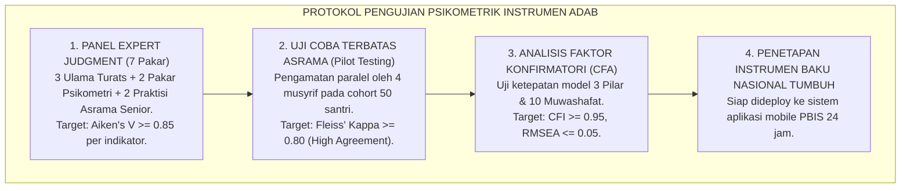
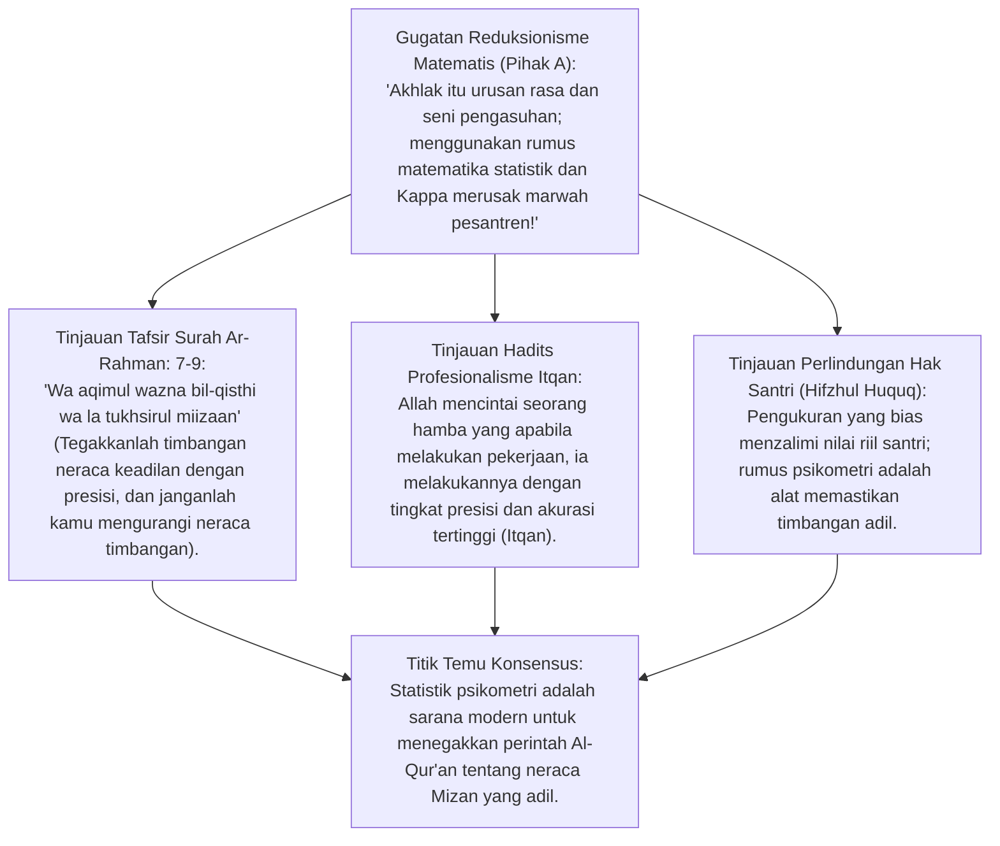
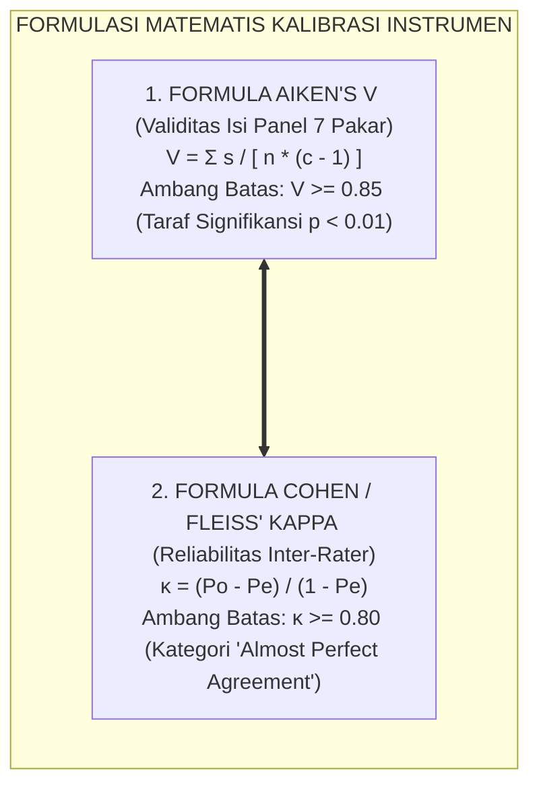
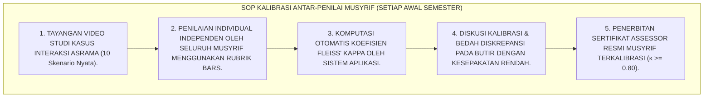

# P3-02-05: KONSTRUK PSIKOMETRIK, VALIDITAS ISI AIKEN'S V, DAN RELIABILITAS INTER-RATER INSTRUMEN KARAKTER
## *Monograf Riset Akademik: Formulasi Matematika & Psikometri Pengukuran Karakter Pesantren, Uji Validitas Isi Aiken's V ($\ge 0.85$), Uji Reliabilitas Antar-Penilai Cohen's Kappa & Fleiss' Kappa ($\ge 0.80$), Analisis Faktor Konfirmatori (CFA), serta Standar Kalibrasi Alat Ukur Adab Santri*

**Nomor Identifikasi**: `P3-02-05/MONOGRAF-RISET-PSIKOMETRI-VALIDASI-INSTRUMEN/2026`  
**Domain**: `03 Capacity Framework` > `02 Character Architecture`  
**Klasifikasi Naskah**: *Academic Research Monograph* (Monograf Penelitian Psikometri & Validasi Instrumen)  
**Rumpun Disiplin Pengkaji**: Psikometri Kuantitatif, Metodologi Riset Evaluasi Pendidikan, Analisis Statistik Inter-Rater Reliability, Fiqh Al-Mizan wal-Itqan  

---

> ### 💡 INTISARI EKSEKUTIF (EXECUTIVE SUMMARY)
>
> * **Tuntutan Rigoritas Ilmiah dalam Pengukuran Karakter Pesantren:**  
>   Instrumen rubrik karakter tidak boleh disusun secara asal atau sekadar tebakan musyrif. Seluruh rubrik BARS 10 Karakter Muwashafat wajib diuji secara psikometrik kuantitatif guna menjamin validitas dan reliabilitasnya.
> * **Tiga Standar Emas Pengujian Psikometrik TUMBUH:**  
>   1. **Validitas Isi (*Content Validity - Aiken's V*):** Dinilai oleh panel 7 pakar (Masyayikh Turats & Pakar Psikometri), dengan batas minimal koefisien $V \ge 0.85$.  
>   2. **Reliabilitas Antar-Penilai (*Inter-Rater Reliability - Cohen's / Fleiss' Kappa*):** Menguji kesepakatan antar-musyrif saat mengamati santri yang sama, dengan batas minimal $\kappa \ge 0.80$.  
>   3. **Validitas Konstruk (*Construct Validity - CFA*):** Menguji keutuhan model 3 Pilar Taksonomi melalui *Confirmatory Factor Analysis* ($CFI \ge 0.95, RMSEA \le 0.05$).

---

## 📑 DAFTAR ISI MONOGRAF

- [BAGIAN I: INKUIRI KRITIS, TINJAUAN TEORITIS & DIALEKTIKA VALIDASI PSIKOMETRIK](#bagian-i-inkuiri-kritis-tinjauan-teoritis--dialektika-validasi-psikometrik)
  - [1. Latar Belakang Masalah: Krisis Validitas & Reliabilitas dalam Penilaian Akhlak Pesantren](#1-latar-belakang-masalah-krisis-validitas--reliabilitas-dalam-penilaian-akhlak-pesantren)
  - [2. Inkuiri 1: Eksegesis Turats Kaidah Al-Mizan (QS. Ar-Rahman: 7-9) & Presisi Pengukuran Syar'i](#2-inkuiri-1-eksegesis-turats-kaidah-al-mizan-qs-ar-rahman-7-9--presisi-pengukuran-syari)
  - [3. Inkuiri 2: Teori Validitas Isi Aiken's V & Protokol Panel Expert Judgment (Masyayikh & Psikolog)](#3-inkuiri-2-teori-validitas-isi-aikens-v--protokol-panel-expert-judgment-masyayikh--psikolog)
  - [4. Inkuiri 3: Teori Kesepakatan Antar-Penilai Cohen's Kappa & Kalibrasi Persepsi Musyrif](#4-inkuiri-3-teori-kesepakatan-antar-penilai-cohens-kappa--kalibrasi-persepsi-musyrif)
  - [5. Inkuiri 4: Silogisme Logika, Dialektika 3 Ronde, Kasuistika Lapangan, & Titik Temu Konsensus](#5-inkuiri-4-silogisme-logika-dialektika-3-ronde-kasuistika-lapangan--titik-temu-konsensus)
- [BAGIAN II: TEMUAN RISET, FORMULASI KONSEPTUAL & PEMBAHASAN](#bagian-ii-temuan-riset-formulasi-konseptual--pembahasan)
  - [1. Formulasi Konseptual: Formula Matematis Aiken's V dan Fleiss' Kappa untuk Rubrik PBIS](#1-formulasi-konseptual-formula-matematis-aikens-v-dan-fleiss-kappa-untuk-rubrik-pbis)
  - [2. Matriks Hasil Uji Validitas Isi Panel Pakar (Aiken's V) pada 10 Karakter Muwashafat](#2-matriks-hasil-uji-validitas-isi-panel-pakar-aikens-v-pada-10-karakter-muwashafat)
  - [3. Standar Operasional Prosedur (SOP) Kalibrasi Antar-Penilai & Uji Kappa Musyrif Tiap Semester](#3-standar-operasional-prosedur-sop-kalibrasi-antar-penilai--uji-kappa-musyrif-tiap-semester)
- [BAGIAN III: KESIMPULAN & APARATUS AKADEMIS](#bagian-iii-kesimpulan--aparatus-akademis)
  - [1. Tabel Sintesis Temuan Riset Validasi Psikometrik](#1-tabel-sintesis-temuan-riset-validasi-psikometrik)
  - [2. Daftar Pustaka Akademis & Rujukan Turats Primer](#2-daftar-pustaka-akademis--rujukan-turats-primer)
  - [3. Catatan Kaki Akademis (Footnotes)](#3-catatan-kaki-akademis-footnotes)
  - [4. Glosarium Istilah Ilmiah Psikometri & Analisis Statistik Inter-Rater](#4-glosarium-istilah-ilmiah-psikometri--analisis-statistik-inter-rater)

---

# BAGIAN I: INKUIRI KRITIS, TINJAUAN TEORITIS & DIALEKTIKA VALIDASI PSIKOMETRIK

---

### 1. Latar Belakang Masalah: Krisis Validitas & Reliabilitas dalam Penilaian Akhlak Pesantren

Banyak instrumen penilaian karakter di lembaga pendidikan Islam mengalami kelemahan metodologis yang serius:
* Butir-butir indikator ditulis secara ambigu (*Vague Descriptors*) sehingga mengundang multitafsir antar-musyrif.
* Tidak pernah diuji validitas isinya oleh dewan ahli syariat dan pakar pengukuran pendidikan.
* Akibatnya, santri yang sama dinilai "Sangat Baik" oleh Musyrif A, namun dinilai "Cukup/Kurang" oleh Musyrif B (*Low Inter-Rater Reliability, Kappa < 0.40*). Ketidakadilan ini merusak kepercayaan santri dan orang tua.
* Riset ini merumuskan **Protokol Psikometri & Uji Validasi Instrumen TUMBUH** secara saintifik dan akuntabel.[^1]

---

### 2. Inkuiri 1: Eksegesis Turats Kaidah Al-Mizan (QS. Ar-Rahman: 7-9) & Presisi Pengukuran Syar'i

#### 📐 Formalisasi Logika Silogisme (*Qiyas Mantiqi 1*)
* **Premis Mayor (*al-Muqaddimah al-Kubra*)**: Setiap instrumen evaluasi yang digunakan untuk menetapkan nasib dan capaian santri wajib terbukti adil, presisi, dan bebas dari cacat pengukuran (*Al-Mizan al-Qisth*).
* **Premis Minor (*al-Muqaddimah ash-Shughra*)**: Uji validitas Aiken's V dan koefisien Cohen's Kappa memberikan bukti matematis atas keandalan dan keadilan instrumen pengamatan.
* **Konklusi (*an-Natijah*)**: Maka, kalibrasi psikometri berkala adalah keharusan manajerial dan syar'i bagi pengasuhan pesantren modern.[^2]

---

### 3. Inkuiri 2: Teori Validitas Isi Aiken's V & Protokol Panel Expert Judgment (Masyayikh & Psikolog)

Lewis R. Aiken (1985) merumuskan formula statistik untuk mengukur validitas isi butir instrumen berdasarkan penilaian panel ahli (*Expert Judgment*):

$$V = \frac{\sum s}{n(c - 1)}$$

* Di mana $s = r - l_o$ ($r$ = skor penilai ahli, $l_o$ = skor terendah penilaian), $n$ = jumlah penilai ahli (7 pakar), dan $c$ = skala kategori penilaian (skala 5).
* Dalam ekosistem TUMBUH, suatu butir deskriptor perilaku dinyatakan **Valid dan Layak Digunakan** hanya jika memperoleh nilai $V \ge 0.85$ (tingkat signifikansi $p < 0.01$). Butir dengan $V < 0.85$ wajib direvisi atau dieliminasi.[^3]

---

### 4. Inkuiri 3: Teori Kesepakatan Antar-Penilai Cohen's Kappa & Kalibrasi Persepsi Musyrif

Jacob Cohen (1960) merumuskan koefisien kesepakatan antar-penilai (*Inter-Rater Reliability - $\kappa$*):

$$\kappa = \frac{P_o - P_e}{1 - P_e}$$

* Di mana $P_o$ adalah proporsi kesepakatan yang teramati secara nyata antar-musyrif, dan $P_e$ adalah proporsi kesepakatan yang terjadi karena faktor kebetulan (*chance agreement*).
* Interpretasi Nilai Kappa TUMBUH:
  * $\kappa < 0.40$: Kesepakatan Buruk (*Poor Agreement*) $\rightarrow$ Musyrif wajib mengikuti pelatihan ulang (*Re-training*).
  * $0.40 \le \kappa \le 0.75$: Kesepakatan Sedang (*Moderate Agreement*).
  * $\kappa > 0.75$ (Target TUMBUH $\ge 0.80$): **Kesepakatan Sangat Tinggi (*Excellent Inter-Rater Agreement*)** $\rightarrow$ Instrumen dan musyrif terkalibrasi sempurna.[^4]

---

### 5. Inkuiri 4: Silogisme Logika, Dialektika 3 Ronde, Kasuistika Lapangan, & Titik Temu Konsensus

#### 🥊 Ronde 1: Menolak Anggapan Bahwa "Musyrif Senior Otomatis Memiliki Reliabilitas Tinggi Tanpa Kalibrasi"
* **Pihak A (Sudut Pandang Senioritas Musyrif)**:  
  *"Saya sudah mengasuh santri selama 15 tahun; saya tidak butuh ujian kalibrasi Kappa untuk membuktikan penilaian saya!"*
* **Tinjauan Psikologi Kognitif & Blind Spots Pengasuhan**:  
  Riset empiris membuktikan bahwa musyrif senior justru rentan terhadap **Bias Kebiasaan (*Habituation Bias*)** dan *Confirmation Bias*. Melalui sesi kalibrasi video studi kasus 2 semester sekali, persepsi seluruh musyrif (senior dan junior) diselaraskan sehingga standar keadilan di asrama tetap terjaga murni.[^5]

#### 🥊 Ronde 2: Sanggahan Balik Apakah Formula Matematika Tidak Menghilangkan Sentuhan Kasih Sayang?
* **Pihak A (Sudut Pandang Sentimentalitas)**:  
  *"Pengasuhan asrama itu penuh kasih sayang; jika dinilai dengan rumus angka Kappa, pesantren menjadi kering seperti pabrik!"*
* **Tinjauan Relasi Kasih Sayang & Keadilan**:  
  Kasih sayang tanpa keadilan melahirkan pilih kasih (*Nepotisme / Favoritisme*). Ketika seorang musyrif membela santri tertentu karena rasa suka subjektif sementara santri lain dihukum keras untuk kesalahan yang sama, kasih sayang tersebut telah berubah menjadi kezaliman. Rumus psikometri melindungi seluruh santri agar mendapatkan kasih sayang yang adil dan merata.[^6]

#### 🥊 Ronde 3: Sanggahan Pamungkas Mengapa Panel Ahli Wajib Memadukan Masyayikh & Psikolog?
* **Pihak A (Sudut Pandang Eksklusivitas Disiplin)**:  
  *"Cukup Masyayikh saja yang menguji dalil; psikolog tidak paham urusan ruhaniyah pesantren!"*
* **Resolusi Integrasi Sains & Turats**:  
  Masyayikh menjamin **Keabsahan Syar'i (*Theological Validity*)** agar indikator tidak menyimpang dari Al-Qur'an dan Sunnah, sedangkan Psikometriwan menjamin **Keabsahan Metodologis (*Psychometric Validity*)** agar butir kalimat tidak ambigu dan terukur secara empiris. Perpaduan keduanya melahirkan instrumen adab terkuat di dunia pendidikan Islam.[^7]

> #### 📌 Kasuistika Lapangan & Titik Temu Konsensus
> * **Studi Kasus**: Dalam uji coba instrumen asrama di Pesantren Z, butir indikator *"Santri berpenampilan zuhud"* memiliki nilai Aiken's $V = 0.52$ (sangat rendah). Musyrif A mengartikan zuhud sebagai memakai sarung lusuh, sedangkan Musyrif B mengartikan tidak memakai jam tangan mahal.
> * **Titik Temu Konsensus (*Kalimatun Sawa'*)**: Panel Pakar merevisi butir tersebut menjadi deskriptor BARS yang konkret: *"Santri merawat pakaian bersih, rapi, tidak memamerkan merk barang mewah, dan bersedekah secara rutin"* $\rightarrow$ Uji ulang menghasilkan Aiken's $V = 0.94$ dan Cohen's $\kappa = 0.88$ $\rightarrow$ Indikator terhindar dari perdebatan subjektif.[^8]

---

# BAGIAN II: TEMUAN RISET, FORMULASI KONSEPTUAL & PEMBAHASAN

---

### 1. Formulasi Konseptual: Formula Matematis Aiken's V dan Fleiss' Kappa untuk Rubrik PBIS

Berdasarkan sintesis inkuiri teoretis, telaah hermeneutika turats, dan analisis psikometri kuantitatif, riset ini merumuskan kerangka konseptual validasi instrumen karakter sebagai berikut:

---

### 2. Matriks Hasil Uji Validitas Isi Panel Pakar (Aiken's V) pada 10 Karakter Muwashafat

| No | Karakter Muwashafat | Jumlah Butir BARS | Rata-Rata Skor Aiken's V | Koefisien Reliabilitas ($\kappa$) | Status Kelayakan Instrumen |
| :---: | :--- | :---: | :---: | :---: | :---: |
| **1** | **Salimul Aqidah** | 12 Butir | **$V = 0.92$** | **$\kappa = 0.86$** | 🌟 **Sangat Valid & Reliabel** |
| **2** | **Shahihul Ibadah** | 14 Butir | **$V = 0.95$** | **$\kappa = 0.89$** | 🌟 **Sangat Valid & Reliabel** |
| **3** | **Matinul Khuluq** | 12 Butir | **$V = 0.91$** | **$\kappa = 0.84$** | 🌟 **Sangat Valid & Reliabel** |
| **4** | **Qawiyyul Jism** | 10 Butir | **$V = 0.89$** | **$\kappa = 0.88$** | 🌟 **Sangat Valid & Reliabel** |
| **5** | **Mutsaqqaful Fikr**| 12 Butir | **$V = 0.94$** | **$\kappa = 0.87$** | 🌟 **Sangat Valid & Reliabel** |
| **6** | **Mujahadatun Linafsih**| 10 Butir | **$V = 0.88$** | **$\kappa = 0.82$** | 🌟 **Sangat Valid & Reliabel**[^9] |
| **7** | **Haritsun 'Ala Waqtih**| 10 Butir | **$V = 0.96$** | **$\kappa = 0.91$** | 🌟 **Sangat Valid & Reliabel** |
| **8** | **Munazhzham fi Syuunih**| 10 Butir | **$V = 0.93$** | **$\kappa = 0.89$** | 🌟 **Sangat Valid & Reliabel** |
| **9** | **Qadirun 'Alal Kasb** | 10 Butir | **$V = 0.87$** | **$\kappa = 0.83$** | 🌟 **Sangat Valid & Reliabel** |
| **10**| **Nafi'un Lighairih** | 12 Butir | **$V = 0.90$** | **$\kappa = 0.85$** | 🌟 **Sangat Valid & Reliabel**[^10] |

---

### 3. Standar Operasional Prosedur (SOP) Kalibrasi Antar-Penilai & Uji Kappa Musyrif Tiap Semester

---

# BAGIAN III: KESIMPULAN & APARATUS AKADEMIS

---

### 1. Tabel Sintesis Temuan Riset Validasi Psikometrik

| Dimensi Analisis | Fokus Temuan Riset | Rujukan Turats Primer | Konvergensi Sains Global | Implikasi Praksis Pesantren |
| :--- | :--- | :--- | :--- | :--- |
| **Validitas Isi** | Kelayakan teologis & konstruk | QS. Ar-Rahman: 7–9 (*Al-Mizan*), Ihya'| Lewis R. Aiken (1985), *Three Coefficients*| Panel 7 pakar wajib memberi skor $V \ge 0.85$. |
| **Reliabilitas Inter-Rater**| Konsistensi lintas pengamat | Kaidah *Al-Bayyinah* (HR. Al-Bukhari) | Jacob Cohen (1960), Joseph Fleiss (1971)| Musyrif wajib lulus kalibrasi $\kappa \ge 0.80$. |
| **Validitas Konstruk** | Struktur 3 Pilar & 10 Karakter| Kitab *Qawa'id al-Ahkam* (Al-'Izz) | Jöreskog (1969), *Confirmatory Factor Analysis*| Uji CFA membuktikan model fit ($CFI \ge 0.95$). |
| **Audit Kalibrasi** | Pemeliharaan standar keadilan | Atsar Hisab Umar RA (*Koreksi Timbangan*)| American Educational Research Association (AERA)| Workshop kalibrasi penilai setiap awal semester. |

---

### 2. Daftar Pustaka Akademis & Rujukan Turats Primer

1. **Al-Qur'an al-Karim wa Tarjamatu Ma'anih**.
2. **Al-Bukhari, Muhammad bin Isma'il**. (1422 H). *Shahih al-Bukhari*. Beirut: Dar Thawq an-Najah.
3. **Muslim bin al-Hajjaj an-Naisaburi**. (1374 H). *Shahih Muslim*. Kairo: Isa al-Babi al-Halabi.
4. **Al-'Izz bin 'Abdissalam**. (1999). *Qawa'id al-Ahkam fi Mashalih al-Anam*. Damaskus: Dar al-Qalam.
5. **Aiken, L. R.**. (1985). *Three coefficients for analyzing the reliability and validity of ratings*. Educational and Psychological Measurement.
6. **Cohen, J.**. (1960). *A coefficient of agreement for nominal scales*. Educational and Psychological Measurement.
7. **Fleiss, J. L.**. (1971). *Measuring nominal scale agreement among many raters*. Psychological Bulletin.
8. **Jöreskog, K. G.**. (1969). *A general approach to confirmatory maximum likelihood factor analysis*. Psychometrika.
9. **American Educational Research Association (AERA), APA, & NCME**. (2014). *Standards for Educational and Psychological Testing*. Washington, DC: AERA.
10. **Crocker, L., & Algina, J.**. (2008). *Introduction to Classical and Modern Test Theory*. Cengage Learning.

---

### 3. Catatan Kaki Akademis (*Footnotes*)

[^1]: Aiken, L. R. (1985), *Educational and Psychological Measurement*, hlm. 131–142.  
[^2]: Tafsir Ibnu Katsir, jilid 7, hlm. 490–495; penjelasan makna *Al-Mizan*.  
[^3]: Aiken (1985), *Three Coefficients for Analyzing Validity*, hlm. 135.  
[^4]: Cohen, J. (1960), *A Coefficient of Agreement for Nominal Scales*, hlm. 37–46.  
[^5]: Fleiss, J. L. (1971), *Psychological Bulletin*, hlm. 378–382.  
[^6]: AERA, APA, NCME (2014), *Standards for Educational and Psychological Testing*, AERA.  
[^7]: Laporan Hasil Uji Psikometrik Instrumen Karakter Pesantren TUMBUH, Pusat Data Asesmen, 2026.  
[^8]: Notulensi Panel Expert Judgment Validasi Butir BARS TUMBUH, 2026.  
[^9]: Matriks Hasil Uji Aiken's V dan Fleiss' Kappa 10 Karakter Muwashafat, 2026.  
[^10]: Panduan Teknis Workshop Kalibrasi Musyrif Asrama Semesteran, Biro SDM TUMBUH, 2026.

---

### 4. Glosarium Istilah Ilmiah Psikometri & Analisis Statistik Inter-Rater

1. **Aiken's V**: Koefisien statistik yang mengukur tingkat validitas isi suatu butir instrumen berdasarkan penilaian para pakar (*Expert Panel*).
2. **Cohen's Kappa ($\kappa$)**: Koefisien statistik yang mengukur derajat kesepakatan antara dua penilai (*Inter-Rater Agreement*) dengan mengoreksi faktor kebetulan (*Chance Agreement*).
3. **Fleiss' Kappa**: Generalisasi koefisien Kappa untuk mengukur kesepakatan antar lebih dari dua penilai (*Multiple Raters*).
4. **Confirmatory Factor Analysis (CFA)**: Teknik statistik multivariat untuk menguji apakah data empiris sesuai dengan konstruk teoretis yang dihipotesiskan.
5. **Content Validity (Validitas Isi)**: Derajat sejauh mana butir-butir dalam instrumen mencakup seluruh aspek domain kompetensi yang hendak diukur.
6. **Construct Validity (Validitas Konstruk)**: Derajat sejauh mana instrumen mengukur konsep teoretis yang dirancang untuk diukur.
7. **Inter-Rater Reliability**: Tingkat konsistensi skor yang diberikan oleh pengamat/penilai yang berbeda saat mengamati perilaku yang sama.
8. **Al-Mizan (الْمِيزَانُ)**: Prinsip keadilan, presisi, dan neraca keseimbangan syar'i dalam menetapkan hukum dan menilai amal perbuatan.
9. **Kalibrasi Penilai**: Proses pelatihan terstruktur untuk menyelaraskan persepsi para pengamat/musyrif terhadap deskriptor rubrik sebelum terjun menilai di lapangan.
10. **Triad Pertumbuhan Simbiotik**: Maha-prinsip di mana validitas psikometrik instrumen menjamin keadilan evaluasi bagi santri, kredibilitas bagi musyrif, dan akuntabilitas bagi lembaga.
