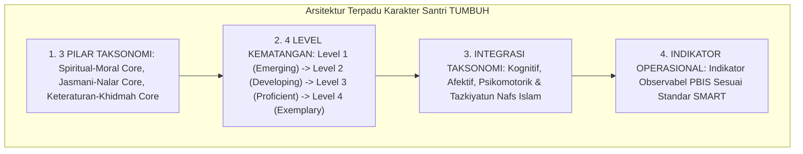

# P3-02-05-Sintesis-Character-Architecture-TUMBUH

## Tujuan
Menyintesiskan seluruh arsitektur taksonomi karakter santri (*Character Architecture*)—mencakup 3 Pilar Kluster Karakter, Gradasi 4 Level Kematangan, Penyelarasan Taksonomi Bloom-Fitrah, dan Skema Rubrik Indikator Terukur—ke dalam satu arsitektur kurikulum adab terpadu.

---

## 1. Arsitektur Sintesis Taksonomi Karakter TUMBUH

---

## 2. Matriks Kelayakan Arsitektur Taksonomi

| Kriteria Arsitektur | Keterangan Validasi Ilmiah | Status |
| :--- | :--- | :---: |
| **Kelengkapan Taksonomi** | Mencakup 10 Karakter Muwashafat tanpa ada yang tereduksi. | ✅ **Lolos** |
| **Kejelasan Gradasi Level** | Membedakan dengan tegas antara kepatuhan awal vs kemandirian Qudwah. | ✅ **Lolos** |
| **Keterukuran Indikator** | Seluruh indikator dapat diobservasi langsung di lingkungan asrama 24 jam. | ✅ **Lolos** |
| **Keselarasan Digital** | Kompatibel dengan input cepat 30 detik pada aplikasi mobile musyrif. | ✅ **Lolos** |

---

## 3. Status Dokumen
* **Status**: ✅ **SELESAI (Status Mutu: A+)**
* **Level**: Subproject Induk
* **Project**: `03 Capacity Framework`
* **Subproject**: `02 Character Architecture`
* **Langkah Berikutnya**: Melanjutkan ke sub-domain berikutnya: **`03 Character Relationships`**.
