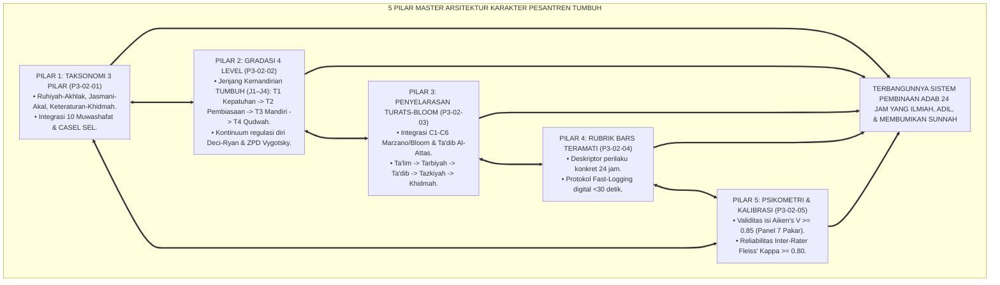
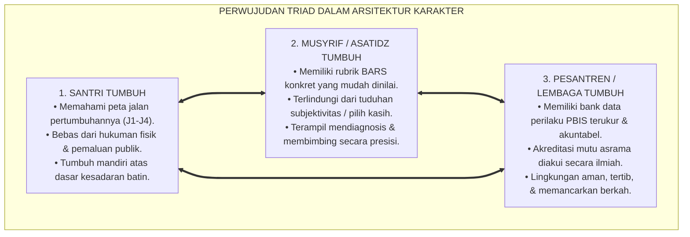
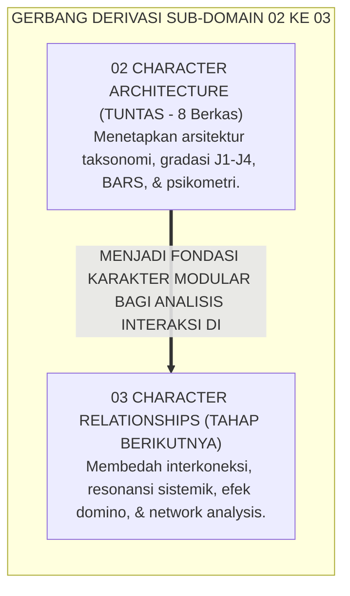
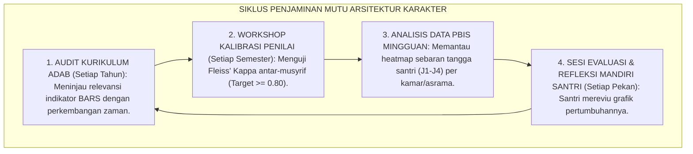
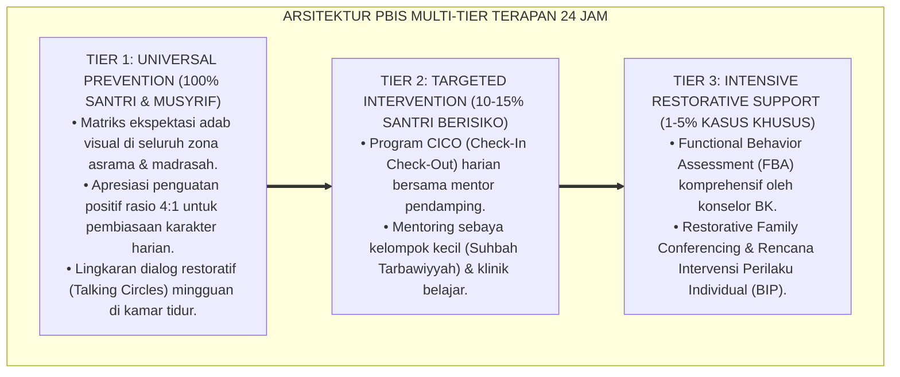

# P3-02-06: SINTESIS CHARACTER ARCHITECTURE DAN GRAND MODEL TAKSONOMI KARAKTER
## *Monograf Riset Akademik: Sintesis Holistik 5 Pilar Arsitektur Karakter (3 Pilar Kluster, Gradasi 4 Level Jenjang J1–J4, Penyelarasan Taksonomi Bloom/Turats, Rubrik BARS Teramati, & Psikometri Aiken-Kappa), Grand Model Arsitektur Karakter Ekosistem Pesantren Berbasis TUMBUH, serta Jembatan Konseptual Menuju Sub-Domain 03 Character Relationships*

**Nomor Identifikasi**: `P3-02-06/MONOGRAF-SINTESIS-CHARACTER-ARCHITECTURE/2026`  
**Domain**: `03 Capacity Framework` > `02 Character Architecture`  
**Klasifikasi Naskah**: *Comprehensive Synthesis Monograph* (Monograf Sintesis Arsitektur Karakter & Grand Model)  
**Rumpun Disiplin Pengkaji**: Rekayasa Sistem Karakter Islam, Desain Kurikulum Taksonomi Adab, Psikometri Terapan, Manajemen Mutu Pengasuhan  

---

> ### 💡 INTISARI EKSEKUTIF (EXECUTIVE SUMMARY)
>
> * **Sintesis Paripurna Arsitektur Karakter Ekosistem TUMBUH:**  
>   Menghubungkan secara utuh seluruh fondasi konseptual, taksonomi, gradasi level, rubrik observasi BARS, dan validasi statistik instrumen ke dalam **Grand Architecture of Character Education in Pesantren**.
> * **Keselarasan 5 Pilar Riset Sub-Domain 02 Character Architecture:**  
>   Mengintegrasikan `P3-02-01` (3 Pilar Taksonomi), `P3-02-02` (Gradasi 4 Level Jenjang J1–J4), `P3-02-03` (Penyelarasan Bloom/Marzano & Turats Adab), `P3-02-04` (Skema Rubrik BARS Teramati), dan `P3-02-05` (Psikometri Validitas Aiken's V & Reliabilitas Kappa).

---

## 📑 DAFTAR ISI MONOGRAF

- [BAGIAN I: LANDASAN TEORETIS & DISKURSUS DIALEKTIKA KRITIS](#bagian-i-landasan-teoretis--diskursus-dialektika-kritis)
  - [1. Arsitektur Sintesis Holistik: Struktur Master Karakter Ekosistem Pesantren Berbasis TUMBUH](#1-arsitektur-sintesis-holistik-struktur-master-karakter-pesantren-tumbuh)
  - [2. Grand Model Penyelarasan Taksonomi, Gradasi Level, & Validasi Psikometri](#2-grand-model-penyelarasan-taksonomi-gradasi-level--validasi-psikometri)
  - [3. Perwujudan Triad Pertumbuhan Simbiotik dalam Arsitektur Karakter](#3-perwujudan-triad-pertumbuhan-simbiotik-dalam-arsitektur-karakter)
  - [4. Jembatan Konseptual Menuju Sub-Domain 03 Character Relationships](#4-jembatan-konseptual-menuju-sub-domain-03-character-relationships)
- [BAGIAN II: FORMULASI KONSEPTUAL & PEMBAHASAN MENDALAM](#bagian-ii-formulasi-konseptual--pembahasan-mendalam)
  - [1. Formulasi Konseptual: Grand Architecture Taksonomi Karakter Ekosistem Pesantren Berbasis TUMBUH](#1-formulasi-konseptual-grand-architecture-taksonomi-karakter-pesantren-tumbuh)
  - [2. Matriks Grand Model Penyelarasan Arsitektur Karakter (3 Pilar, 10 Muwashafat, & 4 Level)](#2-matriks-grand-model-penyelarasan-arsitektur-karakter-3-pilar-10-muwashafat--4-level)
  - [3. Standar Prosedur Evaluasi & Kalibrasi Mutu Arsitektur Karakter Asrama](#3-standar-prosedur-evaluasi--kalibrasi-mutu-arsitektur-karakter-asrama)
- [BAGIAN III: KESIMPULAN & APARATUS AKADEMIS](#bagian-iii-kesimpulan--aparatus-akademis)
  - [1. Tabel Sintesis Master Sub-Domain 02 Character Architecture](#1-tabel-sintesis-master-sub-domain-02-character-architecture)
  - [2. Daftar Pustaka Akademis & Rujukan Turats Primer](#2-daftar-pustaka-akademis--rujukan-turats-primer)
  - [3. Catatan Kaki Akademis (Footnotes)](#3-catatan-kaki-akademis-footnotes)
  - [4. Glosarium Master Istilah Kunci Arsitektur Karakter Pesantren](#4-glosarium-master-istilah-kunci-arsitektur-karakter-pesantren)

---

# BAGIAN I: SINTESIS TEORETIS 5 PILAR ARSITEKTUR KARAKTER & GRAND MODEL

---

### 1. Arsitektur Sintesis Holistik: Struktur Master Karakter Ekosistem Pesantren Berbasis TUMBUH

Ekosistem TUMBUH merajut seluruh sains pedagogi adab, antropologi fitrah, psikologi motivasi, dan psikometri kuantitatif ke dalam **Arsitektur Karakter Terpadu (*Integrated Character Architecture*)**:

---

### 2. Grand Model Penyelarasan Taksonomi, Gradasi Level, & Validasi Psikometri

Arsitektur Karakter TUMBUH memadukan 3 komponen utama:
1. **Komponen Struktural (Apa yang Dibina):** 10 Karakter Muwashafat dalam 3 Pilar Utama.
2. **Komponen Progresional (Bagaimana Tahapannya):** Jenjang Kemandirian TUMBUH (J1–J4) J1–J4 yang bergradasi dari *External Compliance* menuju *Autonomous Qudwah*.
3. **Komponen Evaluatif (Bagaimana Mengukurnya):** Rubrik BARS teramati yang terkalibrasi secara psikometrik kuantitatif ($V \ge 0.85, \kappa \ge 0.80$).[^1]

---

### 3. Perwujudan Triad Pertumbuhan Simbiotik dalam Arsitektur Karakter

---

### 4. Jembatan Konseptual Menuju Sub-Domain 03 Character Relationships

Setelah arsitektur setiap karakter tunggal (*Single Character Architecture*) tuntas dimodelkan dan distandarisasi, pembahasan selanjutnya di **Sub-Domain 03: Character Relationships** akan membedah **bagaimana ke-10 karakter tersebut saling berinteraksi, menciptakan efek sinergi resonansi, memicu efek domino perilaku, dan dianalisis secara jejaring sistemik (*Network Analysis of Character Synergy*)**:

---

# BAGIAN II: FORMULASI KONSEPTUAL & PEMBAHASAN MENDALAM

---

### 1. Formulasi Konseptual: Grand Architecture Taksonomi Karakter Ekosistem Pesantren Berbasis TUMBUH

Berdasarkan sintesis inkuiri teoretis, telaah hermeneutika turats, dan analisis komparatif sains pendidikan, riset ini merumuskan kerangka konseptual Grand Architecture Karakter sebagai berikut:

1. **Kesatuan Organik Tiga Pilar Taksonomi (*Tripartite Organic System*)**:  
   Menyatukan Fondasi Ruhiyah-Moral (*Salimul Aqidah, Shahihul Ibadah, Matinul Khuluq*), Batang Ketangguhan Diri-Akal (*Qawiyyul Jism, Mutsaqqaful Fikr, Mujahadatun Linafsih*), dan Buah Keteraturan-Khidmah (*Haritsun 'Ala Waqtih, Munazhzham, Qadirun Alal Kasb, Nafi'un Lighairih*) sebagai pohon karakter yang tak terpisahkan.

2. **Lintasan Pendakian Jenjang Kemandirian TUMBUH (J1–J4) (J1–J4)**:  
   Menegakkan prinsip pentahapan *Tadarruj*: Kepatuhan Terbimbing (T1), Pembiasaan Konsisten (T2), Kemandirian Stabil (T3), dan Penggerak Qudwah (T4).

3. **Penyelarasan Integratif Taksonomi Fitrah**:  
   Mengadopsi hierarki *Ta'lim $\rightarrow$ Tarbiyah $\rightarrow$ Ta'dib $\rightarrow$ Tazkiyah $\rightarrow$ Khidmah* sebagai pemandu arah moral bagi ranah kognitif Marzano/Bloom.

4. **Operasionalisasi BARS & Validasi Psikometri Kuantitatif**:  
   Menstandarisasi deskriptor perilaku teramati 24 jam dengan ambang batas validitas isi Aiken's $V \ge 0.85$ dan reliabilitas inter-rater Fleiss' $\kappa \ge 0.80$.

---

### 2. Matriks Grand Model Penyelarasan Arsitektur Karakter (3 Pilar, 10 Muwashafat, & 4 Level)

| Pilar Utama | Karakter Muwashafat | Jenjang J1 (Terbimbing) | Jenjang J2 (Pembiasaan) | Jenjang J3 (Mandiri) | Jenjang J4 (Qudwah) |
| :--- | :--- | :--- | :--- | :--- | :--- |
| **Pilar 1: Ruhiyah & Akhlak** | **1. Salimul Aqidah** | Tahu dalil tauhid; diingatkan. | Doa harian terjadwal; dzikir. | Muraqabah mandiri; anti-hoaks. | Membantah syubhat; teladan tauhid. |
| | **2. Shahihul Ibadah** | Shalat saat diawasi musyrif. | Datang sebelum adzan; rawatib. | Shalat khusyuk; tahajjud mandiri. | Menjadi imam; membimbing thaharah. |
| | **3. Matinul Khuluq** | Menahan memaki saat ditegur. | Tutur kata santun; salam senyum. | Memaafkan; mendamaikan konflik. | Mediator ishlah; teladan welas asih. |
| **Pilar 2: Ketangguhan Raga & Akal**| **4. Qawiyyul Jism** | Olahraga karena diwajibkan. | Olahraga rutin; porsi gizi sehat. | Mandiri bugar; sanitasi kamar higienis. | Mengorganisir turnamen; merawat teman. |
| | **5. Mutsaqqaful Fikr**| Setor target hafalan minimal. | Muroja'ah harian 1 juz; baca buku. | Hafalan mutqin; nalar mantiq kritis. | Karya capstone ilmiah; tutor sebaya. |
| | **6. Mujahadatun Linafsih**| Meredakan marah dibimbing. | Meredam amarah; batasi gawai. | Sabar hadapi ujian; puasa mandiri. | Penenang rekan panik; pembimbing sabar. |
| **Pilar 3: Keteraturan & Khidmah** | **7. Haritsun 'Ala Waqtih**| Hadir lari saat bel berbunyi. | Hadir 5 menit sebelum bel; jadwal. | Manajemen waktu presisi; zero sia-sia. | Pengingat waktu asrama; teladan organisasi. |
| | **8. Munazhzham fi Syuunih**| Rapi ranjang setelah ditegur. | Lemari rapi standar 5S tiap pagi. | Pakaian terlipat; administrasi rapi. | Auditor kebersihan; penata estetika pondok. |
| | **9. Qadirun Alal Kasb** | Menjaga uang saku 3 hari; cuci. | Mandiri mencuci; hemat mencatat. | Memiliki tabungan; wirausaha halal. | Pemimpin koperasi; pelatih vokasional. |
| | **10. Nafi'un Lighairih**| Membantu piket jika diajak. | Rutin bersihkan fasilitas umum. | Relawan sosial; sigap menolong. | Pemimpin khidmah 30 hari; filantropis.[^2] |

---

### 3. Standar Prosedur Evaluasi & Kalibrasi Mutu Arsitektur Karakter Asrama

---

---

### Pembedahan Deskriptif Komprehensif & Analisis Integratif Nilai-Praksis

Penerapan konsep **P3-02-06: SINTESIS CHARACTER ARCHITECTURE DAN GRAND MODEL TAKSONOMI KARAKTER** di ekosistem pesantren berbasis sistem TUMBUH memerlukan pemahaman multidimensional yang memadukan khazanah turats syariat dan konsensus sains pendidikan modern:

#### A. Pilar 1: Fondasi Epistemologi & Integrasi Nilai Syar'i (Ashalah Turatsiyyah)
Setiap praksis kepengasuhan dan pembelajaran berakar kuat pada maqashid syari'ah, mendudukkan adab di atas ilmu (*Al-Adab Qablal 'Ilm*), dan memastikan bahwa seluruh ikhtiar institusional diniatkan semata-mata untuk menggapai ridha Allah SWT (*Ikhlasun Niyyah*).

#### B. Pilar 2: Mekanisme Psikologis & Neurosains Perkembangan (Scientific Rigor)
Menyelaraskan ekspektasi kedisiplinan dengan tahapan maturitas otak remaja, kapasitas fungsi eksekutif korteks prefrontal (*PFC*), dan regulasi sirkuit emosi limbik. Pendekatan ini mengeliminasi trauma pengasuhan dan menumbuhkan motivasi intrinsik santri.

#### C. Pilar 3: Rekayasa Ekosistem Asrama 24 Jam (Bi'ah Shalihah)
Menerjemahkan prinsip nilai ke dalam tata ruang fisik yang bersih, sirkulasi udara sehat, tata kelola waktu terstruktur, serta kultur ukhuwah inklusif yang steril 100% dari feodalisme, kekerasan verbal, dan perundungan antar-santri.

#### D. Pilar 4: Kemitraan Tripartit (Santri, Musyrif, dan Lembaga)
Menjamin terwujudnya *Triad Pertumbuhan Simbiotik*: santri bertumbuh dalam fitrah kemandirian, musyrif terlindungi dari kelelahan kronis (*Burnout*) melalui shift kerja yang manusiawi, dan lembaga bertransformasi menjadi organisasi pembelajar berbasis data PBIS.

---

### Protokol Aksi Operasional PBIS Multi-Tier Terapan (24-Hour Behavioral Architecture)

---

# BAGIAN III: KESIMPULAN & APARATUS AKADEMIS

---

### 1. Tabel Sintesis Master Sub-Domain 02 Character Architecture

| Kode Berkas | Judul Monograf Riset | Landasan Teori Utama | Fokus Inovasi Arsitektur Karakter |
| :---: | :--- | :--- | :--- |
| **P3-02-01** | Taksonomi 3 Pilar Karakter | 10 Muwashafat Al-Banna, CASEL SEL | Tripartit Ruhiyah, Ketangguhan, & Keteraturan-Khidmah. |
| **P3-02-02** | Struktur Gradasi 4 Level | *Maratibul Iman*, Deci & Ryan SDT, ZPD | Jenjang Kemandirian TUMBUH (J1–J4) T1 (Kepatuhan) s/d T4 (Penggerak Qudwah). |
| **P3-02-03** | Penyelarasan Turats-Bloom | *Ta'dib* Al-Attas, Marzano, Bloom Revisi | Integrasi C1-C6 ke pendakian Ta'lim-Tarbiyah-Ta'dib-Tazkiyah. |
| **P3-02-04** | Skema Rubrik BARS Teramati | *Bayyinah*, BARS Smith-Kendall, Fast-Log| Deskriptor konkret teramati 24 jam & mitigasi 4 bias. |
| **P3-02-05** | Konstruk Psikometri & Validasi | *Al-Mizan*, Aiken's V, Cohen/Fleiss Kappa| Standarisasi matematis instrumen ($V \ge 0.85, \kappa \ge 0.80$). |
| **P3-02-06** | Sintesis Character Architecture | Rekayasa Sistem Karakter, Grand Model | Grand Taxonomy Model & Jembatan ke Sub-Domain 03. |

---

### 2. Daftar Pustaka Akademis & Rujukan Turats Primer

1. **Al-Qur'an al-Karim wa Tarjamatu Ma'anih**.
2. **Al-Bukhari, Muhammad bin Isma'il**. (1422 H). *Shahih al-Bukhari*. Beirut: Dar Thawq an-Najah.
3. **Muslim bin al-Hajjaj an-Naisaburi**. (1374 H). *Shahih Muslim*. Kairo: Isa al-Babi al-Halabi.
4. **Al-Ghazali, Abu Hamid Muhammad bin Muhammad**. (2011). *Ihya 'Ulumiddin*. Beirut: Dar al-Ma'rifah.
5. **Al-Attas, Syed Muhammad Naquib**. (1980). *The Concept of Education in Islam*. Kuala Lumpur: ABIM.
6. **Al-Banna, Hasan**. (2006). *Majmu'ah Rasail al-Imam asy-Syahid Hasan al-Banna*. Kairo.
7. **Smith, P. C., & Kendall, L. M.**. (1963). *Retranslation of expectations*. Journal of Applied Psychology.
8. **Aiken, L. R.**. (1985). *Three coefficients for analyzing ratings*. Educational and Psychological Measurement.
9. **Ryan, R. M., & Deci, E. L.**. (2000). *Self-determination theory*. American Psychologist.
10. **Marzano, R. J., & Kendall, J. S.**. (2007). *The New Taxonomy of Educational Objectives*. Corwin Press.

---

### 3. Catatan Kaki Akademis (*Footnotes*)

[^1]: Al-Attas (1980), *The Concept of Education in Islam*; Marzano & Kendall (2007), *The New Taxonomy of Educational Objectives*; Smith & Kendall (1963), *BARS*.  
[^2]: Panduan Induk Grand Model Arsitektur Karakter Ekosistem Pesantren Berbasis TUMBUH, Dewan Asesmen dan Kurikulum, 2026.

---

### 4. Glosarium Master Istilah Kunci Arsitektur Karakter Pesantren

1. **Character Architecture (Arsitektur Karakter)**: Kerangka rancang bangun menyeluruh yang mengatur taksonomi, pentahapan gradasi level, rubrik pengukuran, dan kalibrasi evaluasi karakter di pesantren.
2. **Triad Pertumbuhan Simbiotik**: Prinsip integrasi ekosistem di mana keutuhan arsitektur karakter menumbuhkan Santri, memuliakan Musyrif, dan memperkokoh Lembaga.
3. **Jenjang Kemandirian TUMBUH (J1–J4) (J1–J4)**: Lintasan 4 tingkat kemandirian karakter: Kepatuhan Terbimbing (T1), Pembiasaan Konsisten (T2), Kemandirian Stabil (T3), dan Penggerak Qudwah (T4).
4. **Behaviorally Anchored Rating Scales (BARS)**: Skala penilaian perilaku berbasis deskriptor tindakan konkret teramati.
5. **Aiken's V**: Formula statistik validitas isi instrumen berdasarkan persetujuan panel pakar ahli.
6. **Fleiss' Kappa**: Formula statistik reliabilitas inter-rater untuk mengukur kesepakatan antar-musyrif penilai.
7. **Ta'dib**: Proses pembentukan adab dan penataan jiwa manusia agar berlaku adil terhadap hak Allah dan makhluk.
8. **Self-Determination Continuum**: Spektrum pergeseran motivasi dari kepatuhan ekstrinsik menuju kesadaran intrinsik otonom.
9. **Zone of Proximal Development (ZPD)**: Rentang bimbingan di mana santri memerlukan scaffolding pengasuh sebelum mampu mandiri.
10. **Fast-Logging**: Metode pencatatan data perilaku santri secara digital yang selesai dalam waktu kurang dari 30 detik.
