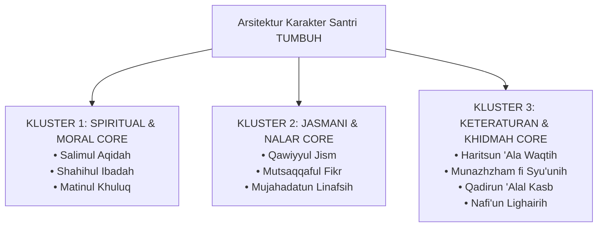
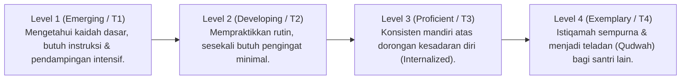

# P3-02-Arsitektur-Karakter-TUMBUH (Character Architecture Induk)

## Tujuan
Menetapkan arsitektur taksonomi karakter santri (*Character Architecture*) yang kokoh, sistematis, dan terintegrasi, memetakan 10 karakter santri (*Muwashafat*) ke dalam 3 pilar kluster besar dengan 4 tingkat gradasi kematangan perilaku.

---

## 1. Peta Arsitektur Taksonomi Karakter

---

## 2. Struktur Gradasi 4 Level Kematangan (*The 4-Tier Progression*)

Setiap karakter dalam ekosistem TUMBUH memiliki 4 tingkat kematangan perilaku:

---

## 3. Prinsip Validitas & Keterukuran Taksonomi

1. **Konkret & Observabel (*Observable Actions*)**: Setiap level karakter dirumuskan dalam bentuk tindakan fisik dan verbal yang dapat diamati langsung oleh musyrif dan guru di asrama/kelas.
2. **Bebas Kontradiksi (*Non-Contradictory*)**: 10 Karakter saling melengkapi; pencapaian *Salimul Aqidah* menopang *Matinul Khuluq*, dan *Mujahadatun Linafsih* menopang *Haritsun 'Ala Waqtih*.
3. **Selaras dengan Fitrah Insaniyah**: Memfasilitasi mekamya fitrah spiritual, kognitif, emosional, dan motorik santri secara seimbang.

---

## 4. Status Dokumen
* **Status**: 🌟 **A+ (Dokumen Induk Character Architecture)**
* **Level**: Project 3 - `03 Capacity Framework / 02 Character Architecture`
* **Langkah Berikutnya**: **`P3-02-01-Taksonomi-3-Pilar-Utama-Karakter.md`**.
