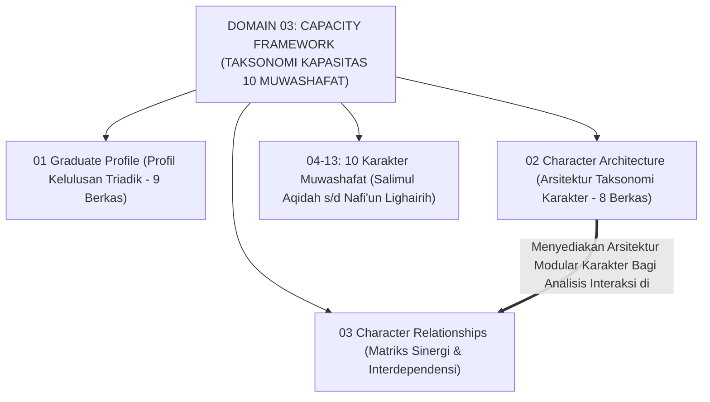
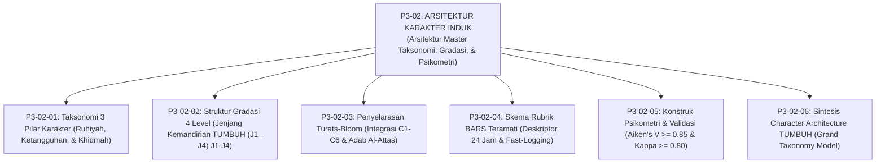
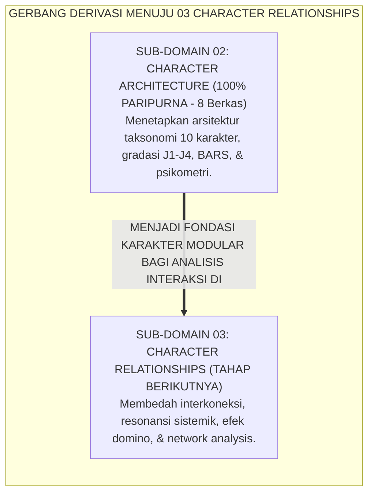

# P3-02: ARSITEKTUR KARAKTER (CHARACTER ARCHITECTURE) EKOSISTEM TUMBUH
## *Monograf Induk Sub-Domain 02: Arsitektur Master Taksonomi 3 Pilar Karakter, Gradasi 4 Level Jenjang J1–J4, Penyelarasan Taksonomi Fitrah-Bloom, Rubrik BARS Teramati, & Standar Kalibrasi Psikometri Aiken-Kappa*

**Nomor Identifikasi**: `P3-02/MONOGRAF-INDUK-CHARACTER-ARCHITECTURE/2026`  
**Domain**: `03 Capacity Framework` > `02 Character Architecture`  
**Klasifikasi Naskah**: *Master Sub-Domain Monograph* (Monograf Induk Sub-Domain Arsitektur Karakter)  
**Rumpun Disiplin Pengkaji**: Desain Kurikulum Karakter Islam, Taksonomi Pendidikan, Psikometri Kuantitatif, Manajemen Mutu Pengasuhan  

---

> ### 💡 INTISARI EKSEKUTIF (EXECUTIVE SUMMARY)
>
> * **Posisi Sub-Domain 02 Character Architecture:**  
>   Menjawab pertanyaan mendasar perancangan: *"Bagaimana arsitektur 10 Karakter Muwashafat dirancang secara taksonomis ke dalam 3 pilar, digradasi ke dalam 4 level tangga kompetensi (J1–J4), diselaraskan dengan khazanah Turats dan sains modern, serta diuji validitas dan reliabilitas psikometriknya secara presisi?"*
> * **Lima Pilar Riset Arsitektur Karakter yang Terintegrasi:**  
>   1. **P3-02-01 (Taksonomi 3 Pilar Karakter):** Mengelompokkan 10 Muwashafat ke dalam Pilar Ruhiyah, Ketangguhan, dan Keteraturan-Khidmah.  
>   2. **P3-02-02 (Gradasi 4 Level Jenjang J1–J4):** Lintasan perkembangan dari Kepatuhan Terbimbing menuju Penggerak Qudwah.  
>   3. **P3-02-03 (Penyelarasan Turats-Bloom):** Integrasi kognitif Marzano/Bloom dengan pendakian adab Al-Attas dan Al-Ghazali.  
>   4. **P3-02-04 (Skema Rubrik BARS Teramati):** Standar deskriptor perilaku konkret 24 jam dan protokol fast-logging digital.  
>   5. **P3-02-05 (Konstruk Psikometri & Validasi):** Uji validitas isi Aiken's V ($\ge 0.85$) dan reliabilitas inter-rater Fleiss' Kappa ($\ge 0.80$).

---

## 📑 DAFTAR ISI MONOGRAF INDUK

- [BAGIAN I: ARSITEKTUR ONTOLOGIS & POHON HUBUNGAN SUB-DOMAIN 02](#bagian-i-arsitektur-ontologis--pohon-hubungan-sub-domain-02)
  - [1. Posisi Dokumen dalam Taksonomi Domain 03 Capacity Framework](#1-posisi-dokumen-dalam-taksonomi-domain-03-capacity-framework)
  - [2. Pohon Hubungan Antar-Monograf Sub-Domain 02 Character Architecture](#2-pohon-hubungan-antar-monograf-sub-domain-02-character-architecture)
  - [3. Rangkuman 5 Pilar Riset Arsitektur Karakter](#3-rangkuman-5-pilar-riset-arsitektur-karakter)
  - [4. Penegasan Triad Pertumbuhan Simbiotik dalam Arsitektur Karakter](#4-penegasan-triad-pertumbuhan-simbiotik-dalam-arsitektur-karakter)
- [BAGIAN II: TEMUAN RISET, FORMULASI KONSEPTUAL & PEMBAHASAN](#bagian-ii-temuan-riset-formulasi-konseptual--pembahasan)
  - [1. Matriks Rujukan Lengkap 6 Berkas Monograf Sub-Domain 02](#1-matriks-rujukan-lengkap-6-berkas-monograf-sub-domain-02)
  - [2. Gerbang Derivasi Menuju Sub-Domain 03 Character Relationships](#2-gerbang-derivasi-menuju-sub-domain-03-character-relationships)
- [BAGIAN III: KESIMPULAN & APARATUS AKADEMIS](#bagian-iii-kesimpulan--aparatus-akademis)
  - [1. Daftar Pustaka Otoritatif Turats & Sains Global](#1-daftar-pustaka-otoritatif-turats--sains-global)
  - [2. Catatan Kaki Akademis (Footnotes)](#2-catatan-kaki-akademis-footnotes)
  - [3. Glosarium Istilah Kunci Arsitektur Karakter Induk](#3-glosarium-istilah-kunci-arsitektur-karakter-induk)

---

# BAGIAN I: ARSITEKTUR ONTOLOGIS & POHON HUBUNGAN SUB-DOMAIN 02

---

### 1. Posisi Dokumen dalam Taksonomi Domain 03 Capacity Framework

---

### 2. Pohon Hubungan Antar-Monograf Sub-Domain 02 Character Architecture

---

### 3. Rangkuman 5 Pilar Riset Arsitektur Karakter

1. **Pilar 1: Taksonomi 3 Pilar (P3-02-01)**: Merajut 10 Karakter Muwashafat ke dalam kluster Ruhiyah-Akhlak, Jasmani-Akal, dan Keteraturan-Khidmah terintegrasi CASEL SEL.
2. **Pilar 2: Gradasi 4 Level Jenjang Kemandirian TUMBUH (J1–J4) (P3-02-02)**: Menetapkan lintasan kemandirian karakter dari T1 (Kepatuhan Terbimbing), T2 (Pembiasaan Konsisten), T3 (Kemandirian Stabil), hingga T4 (Penggerak Qudwah).
3. **Pilar 3: Penyelarasan Taksonomi Turats-Bloom (P3-02-03)**: Mengintegrasikan proses kognitif Marzano/Bloom dengan pendakian spiritual *Ta'lim $\rightarrow$ Tarbiyah $\rightarrow$ Ta'dib $\rightarrow$ Tazkiyah $\rightarrow$ Khidmah*.
4. **Pilar 4: Rubrik BARS Teramati (P3-02-04)**: Menstandarisasi deskriptor perilaku konkret yang teramati 24 jam guna mengeliminasi 4 bias psikometrik penilai musyrif.
5. **Pilar 5: Konstruk Psikometri & Kalibrasi (P3-02-05)**: Menegakkan bukti matematis validitas isi (Aiken's $V \ge 0.85$) dan reliabilitas inter-rater (Fleiss' $\kappa \ge 0.80$).

---

# BAGIAN II: TEMUAN RISET, FORMULASI KONSEPTUAL & PEMBAHASAN

---

### 1. Matriks Rujukan Lengkap 6 Berkas Monograf Sub-Domain 02

| Kode Berkas | Judul Naskah Monograf | Fokus Kajian & Inovasi Riset | Tautan Berkas Markdown |
| :---: | :--- | :--- | :--- |
| **P3-02-01** | **Taksonomi 3 Pilar Karakter** | Tripartit Ruhiyah, Ketangguhan, & Keteraturan-Khidmah. | [**`Buka Naskah P3-02-01`**](./P3-02-01-Taksonomi-3-Pilar-Utama-Karakter.md) |
| **P3-02-02** | **Struktur Gradasi 4 Level** | Jenjang Kemandirian TUMBUH (J1–J4) T1 (Kepatuhan) s/d T4 (Penggerak Qudwah). | [**`Buka Naskah P3-02-02`**](./P3-02-02-Struktur-Gradasi-4-Level-Kompetensi.md) |
| **P3-02-03** | **Penyelarasan Turats-Bloom** | Integrasi C1-C6 ke pendakian Ta'lim-Tarbiyah-Ta'dib-Tazkiyah. | [**`Buka Naskah P3-02-03`**](./P3-02-03-Penyelarasan-Taksonomi-Bloom-dan-Fitrah.md) |
| **P3-02-04** | **Skema Rubrik BARS Teramati** | Deskriptor konkret teramati 24 jam & protokol Fast-Logging. | [**`Buka Naskah P3-02-04`**](./P3-02-04-Skema-Rubrik-dan-Indikator-Perilaku.md) |
| **P3-02-05** | **Konstruk Psikometri & Validasi**| Validitas isi Aiken's V & reliabilitas inter-rater Fleiss' Kappa. | [**`Buka Naskah P3-02-05`**](./P3-02-05-Konstruk-Psikometrik-dan-Validasi-Instrumen-Karakter.md) |
| **P3-02-06** | **Sintesis Character Architecture** | Grand Taxonomy Model & Jembatan ke Sub-Domain 03. | [**`Buka Naskah P3-02-06`**](./P3-02-06-Sintesis-Character-Architecture-TUMBUH.md) |

---

### 2. Gerbang Derivasi Menuju Sub-Domain 03 Character Relationships

---

# BAGIAN III: KESIMPULAN & APARATUS AKADEMIS

---

### 1. Daftar Pustaka Otoritatif Turats & Sains Global

1. **Al-Qur'an al-Karim wa Tarjamatu Ma'anih**.
2. **Al-Bukhari, Muhammad bin Isma'il**. (1422 H). *Shahih al-Bukhari*. Beirut: Dar Thawq an-Najah.
3. **Muslim bin al-Hajjaj an-Naisaburi**. (1374 H). *Shahih Muslim*. Kairo: Isa al-Babi al-Halabi.
4. **Al-Ghazali, Abu Hamid Muhammad bin Muhammad**. (2011). *Ihya 'Ulumiddin*. Beirut: Dar al-Ma'rifah.
5. **Al-Attas, Syed Muhammad Naquib**. (1980). *The Concept of Education in Islam*. Kuala Lumpur: ABIM.
6. **Smith, P. C., & Kendall, L. M.**. (1963). *Retranslation of expectations*. Journal of Applied Psychology.
7. **Aiken, L. R.**. (1985). *Three coefficients for analyzing ratings*. Educational and Psychological Measurement.
8. **Ryan, R. M., & Deci, E. L.**. (2000). *Self-determination theory*. American Psychologist.
9. **Marzano, R. J., & Kendall, J. S.**. (2007). *The New Taxonomy of Educational Objectives*. Corwin Press.
10. **AERA, APA, & NCME**. (2014). *Standards for Educational and Psychological Testing*. Washington, DC: AERA.

---

### 2. Catatan Kaki Akademis (*Footnotes*)

[^1]: Al-Attas (1980), *The Concept of Education in Islam*; Marzano & Kendall (2007), *The New Taxonomy of Educational Objectives*; Aiken (1985), *Educational and Psychological Measurement*.

---

### 3. Glosarium Istilah Kunci Arsitektur Karakter Induk

1. **Character Architecture**: Cetak biru terstruktur rancang bangun sistem karakter dan adab pesantren.
2. **Triad Pertumbuhan Simbiotik**: Prinsip integrasi serempak Santri, Musyrif, dan Lembaga.
3. **Jenjang Kemandirian TUMBUH (J1–J4) (J1–J4)**: Model pentahapan kemandirian dari Kepatuhan Terbimbing hingga Penggerak Qudwah.
4. **BARS**: Skala penilaian berbasis deskriptor perilaku konkret yang teramati.
5. **Aiken's V**: Formula statistik pengujian validitas isi panel pakar ahli.
6. **Fleiss' Kappa**: Koefisien statistik pengujian reliabilitas kesepakatan antar-musyrif penilai.
7. **Ta'dib**: Proses penataan jiwa dan pembiasaan adab luhur secara adil.
8. **Fast-Logging**: Pencatatan data perilaku santri secara digital dalam waktu kurang dari 30 detik.
9. **Zone of Proximal Development (ZPD)**: Rentang bimbingan di mana santri memerlukan bantuan sebelum mandiri.
10. **Observable Behavior**: Tindakan lahiriah yang dapat diamati secara objektif oleh indera pengamat.
