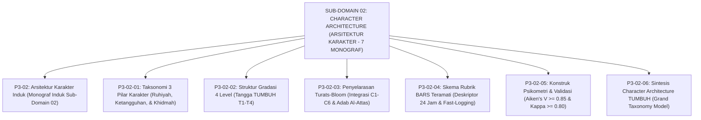

# SUB-DOMAIN 02: CHARACTER ARCHITECTURE (ARSITEKTUR TAKSONOMI KARAKTER)
## *Sitemap Induk & Navigasi Monograf Taksonomi 3 Pilar, Gradasi 4 Level Tangga T1–T4, Penyelarasan Turats-Bloom, Rubrik BARS Teramati, & Validasi Psikometri (7 Monograf Terpadu)*

**Nomor Identifikasi**: `P3-02/INDEX/2026`  
**Domain**: `03 Capacity Framework` > `02 Character Architecture`  
**Klasifikasi**: Folder Monograf Arsitektur Taksonomi Karakter, Gradasi 4 Level, & Validasi Psikometri (8 Berkas Lengkap)

---

## 🏛️ SITEMAP & NAVIGASI SELURUH BERKAS SUB-DOMAIN 02

Sub-Domain `02 Character Architecture` membedah arsitektur taksonomi 10 Karakter Muwashafat ke dalam 3 pilar kluster, menetapkan 4 tingkat gradasi kemandirian (Tangga TUMBUH T1–T4), menyelaraskan taksonomi kognitif Bloom/Marzano dengan konsepsi adab Turats, menyusun deskriptor perilaku BARS teramati 24 jam, serta menegakkan validitas psikometri kuantitatif (Aiken's V & Fleiss' Kappa):

---

## 📑 DAFTAR LENGKAP 8 BERKAS MONOGRAF TERPADU SUB-DOMAIN 02

| No | Berkas Monograf | Judul Berkas | Fokus Kajian & Rujukan Utama |
| :---: | :--- | :--- | :--- |
| **00** | [**`P3-02-Arsitektur-Karakter-TUMBUH.md`**](./P3-02-Arsitektur-Karakter-TUMBUH.md) | Monograf Induk Arsitektur Karakter | Master 5 Pilar Arsitektur Karakter, Grand Model Taksonomi Karakter, & gerbang derivasi menuju **Sub-Domain 03 Character Relationships**. |
| **01** | [**`P3-02-01-Taksonomi-3-Pilar-Utama-Karakter.md`**](./P3-02-01-Taksonomi-3-Pilar-Utama-Karakter.md) | Taksonomi 3 Pilar Utama Karakter | Tripartit Ruhiyah-Akhlak, Jasmani-Akal, & Keteraturan-Khidmah; integrasi 10 Muwashafat Hasan Al-Banna & 5 Kompetensi CASEL SEL (10 Catatan Kaki). |
| **02** | [**`P3-02-02-Struktur-Gradasi-4-Level-Kompetensi.md`**](./P3-02-02-Struktur-Gradasi-4-Level-Kompetensi.md) | Struktur Gradasi 4 Level Tangga T1–T4 | *Maratibul Iman* Turats; Teori Kontinuum Regulasi Diri Deci-Ryan; ZPD Vygotsky; progresi T1 Kepatuhan s/d T4 Penggerak Qudwah (10 Catatan Kaki). |
| **03** | [**`P3-02-03-Penyelarasan-Taksonomi-Bloom-dan-Fitrah.md`**](./P3-02-03-Penyelarasan-Taksonomi-Bloom-dan-Fitrah.md) | Penyelarasan Taksonomi Bloom & Fitrah | Dekonstruksi sekularisme Bloom; integrasi Taksonomi Kognitif Marzano & Taksonomi Adab Al-Attas (*Ta'lim-Tarbiyah-Ta'dib-Tazkiyah-Khidmah*) (10 Catatan Kaki). |
| **04** | [**`P3-02-04-Skema-Rubrik-dan-Indikator-Perilaku.md`**](./P3-02-04-Skema-Rubrik-dan-Indikator-Perilaku.md) | Skema Rubrik BARS & Indikator Teramati | Metodologi BARS Smith-Kendall; eliminasi 4 bias penilai (Halo, Central, Leniency, Contrast); protokol Fast-Logging <30 detik (10 Catatan Kaki). |
| **05** | [**`P3-02-05-Konstruk-Psikometrik-dan-Validasi-Instrumen-Karakter.md`**](./P3-02-05-Konstruk-Psikometrik-dan-Validasi-Instrumen-Karakter.md) | Konstruk Psikometrik & Validasi Instrumen | Formula statistik validitas isi Aiken's V ($\ge 0.85$), Fleiss' Kappa ($\ge 0.80$), CFA, dan SOP kalibrasi musyrif semesteran (10 Catatan Kaki). |
| **06** | [**`P3-02-06-Sintesis-Character-Architecture-TUMBUH.md`**](./P3-02-06-Sintesis-Character-Architecture-TUMBUH.md) | Sintesis Character Architecture TUMBUH | Grand Model Penyelarasan Arsitektur Karakter, siklus penjaminan mutu adab, & jembatan ke **Sub-Domain 03 Character Relationships** (10 Catatan Kaki). |
