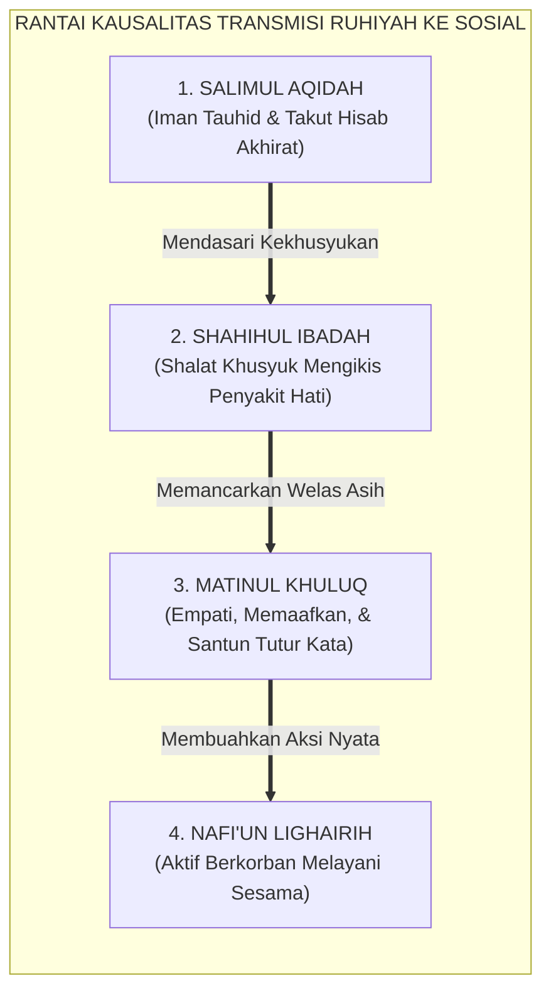
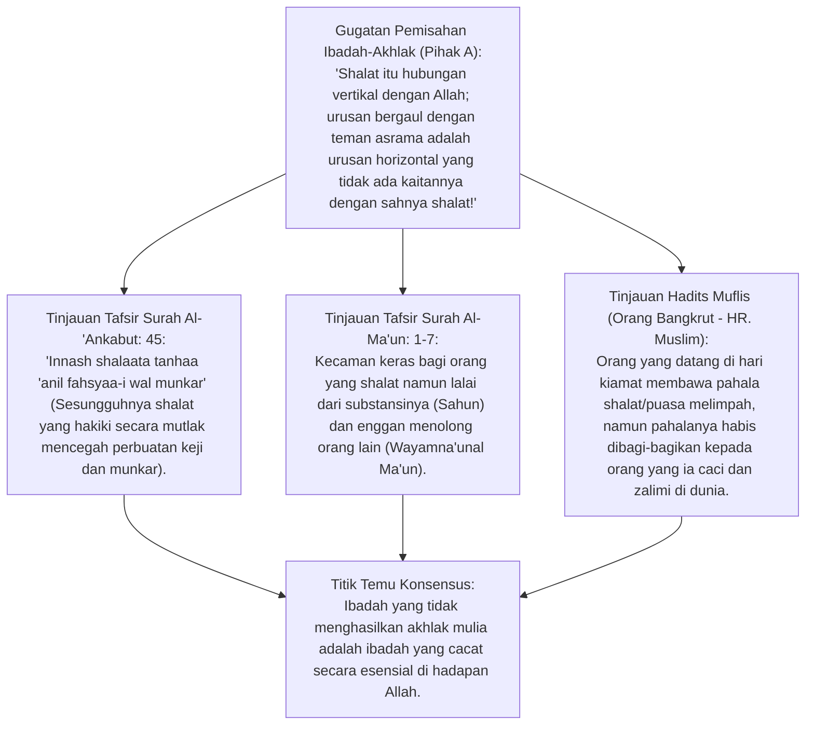
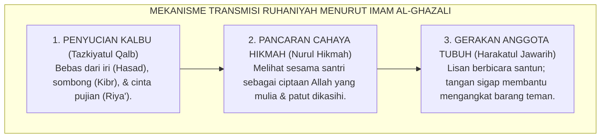
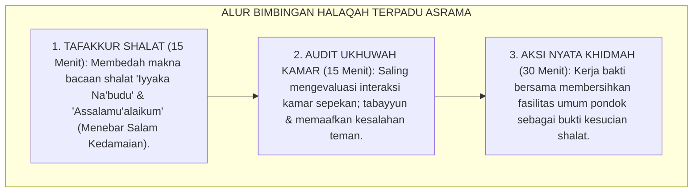

# P3-03-01: KETERHUBUNGAN KAUSALITAS FONDASI RUHIYAH TERHADAP STABILITAS MORAL SOSIAL
## *Monograf Riset Akademik: Rantai Kausalitas Epistemologis Antara Salimul Aqidah, Shahihul Ibadah, Matinul Khuluq, dan Nafi'un Lighairih (QS. Al-'Ankabut: 45 & QS. Al-Ma'un: 1–7), Teori Integrasi Identitas Moral (Blasi's Moral Identity Theory), Analisis Anomali Hipokrisi Perilaku di Pesantren, serta Protokol Bimbingan Terpadu*

**Nomor Identifikasi**: `P3-03-01/MONOGRAF-RISET-RELASI-RUHIYAH-SOSIAL/2026`  
**Domain**: `03 Capacity Framework` > `03 Character Relationships`  
**Klasifikasi Naskah**: *Academic Research Monograph* (Monograf Penelitian Relasi Antar-Karakter)  
**Rumpun Disiplin Pengkaji**: Psikologi Agama & Integrasi Moral, Fiqh Mu'amalah & Tasawuf Amali, Sosiologi Pesantren, Teori Identitas Moral  

---

> ### 💡 INTISARI EKSEKUTIF (EXECUTIVE SUMMARY)
>
> * **Kemustahilan Memisahkan Ibadah Ritual dari Akhlak Sosial dalam Islam:**  
>   Menolak dikotomi sekuler yang memisahkan kesalehan spiritual (*Salimul Aqidah & Shahihul Ibadah*) dari kesalehan sosial (*Matinul Khuluq & Nafi'un Lighairih*). Ibadah yang benar secara niscaya membuahkan pencegahan dari perbuatan keji dan munkar (*QS. Al-'Ankabut: 45*).
> * **Dua Anomali Perilaku Santri & Diagnosa Klinis TUMBUH:**  
>   1. **Anomali 1: Rajin Ibadah Tapi Merundung (*Bullying Devout*):** Terjadi akibat *Ghaflah* (ibadah mekanis tanpa kehadiran hati) dan *Moral Disengagement*.  
>   2. **Anomali 2: Ramah Sosial Tapi Malas Shalat (*Secular Niceness*):** Terjadi akibat ketiadaan jangkar tauhid, sehingga kebaikan sosial rentan goyah saat diuji pamrih pujian.
> * **Rantai Transmisi Nilai Berbasis Tazkiyah:**  
>   Tauhid melahirkan *Muraqabah* $\rightarrow$ Muraqabah melahirkan Shalat Khusyuk $\rightarrow$ Shalat Khusyuk melahirkan *Welas Asih (Rahmah)* $\rightarrow$ Welas Asih melahirkan Khidmah Melayani Umat.

---

## 📑 DAFTAR ISI MONOGRAF

- [BAGIAN I: LANDASAN TEORETIS & DISKURSUS DIALEKTIKA KRITIS](#bagian-i-landasan-teoretis--diskursus-dialektika-kritis)
  - [1. Latar Belakang Masalah: Fenomena "Santri Rajin Shalat Tapi Gemar Memaki" & Dekonstruksi Ibadah Mekanis](#1-latar-belakang-masalah-fenomena-santri-rajin-shalat-tapi-gemar-memaki--dekonstruksi-ibadah-mekanis)
  - [2. Eksegesis Turats Shalat Mencegah Fahsya' wa Munkar (QS. 29:45) & Celaan Munafik (QS. 107:1-7)](#2eksegesis-turats-shalat-mencegah-fahsya-wa-munkar-qs-2945-celaan-munafik-qs-1071-7)
  - [3. Teori Identitas Moral Augusto Blasi & Mekanisme Moral Disengagement Albert Bandura](#3teori-identitas-moral-augusto-blasi-mekanisme-moral-disengagement-albert-bandura)
  - [4. Rantai Kausalitas Transmisi Ruhaniyah: Dari Hati yang Bersih Menuju Tangan yang Melayani](#4rantai-kausalitas-transmisi-ruhaniyah-dari-hati-yang-bersih-menuju-tangan-yang-melayani)
  - [5. Silogisme Logika, Dialektika 3 Ronde, Kasuistika Lapangan, & Titik Temu Konsensus](#5silogisme-logika-dialektika-3-ronde-kasuistika-lapangan-titik-temu-konsensus)
- [BAGIAN II: FORMULASI KONSEPTUAL & PEMBAHASAN MENDALAM](#bagian-ii-formulasi-konseptual--pembahasan-mendalam)
  - [1. Formulasi Konseptual: Model Keterhubungan Kausalitas Poros Ruhiyah-Sosial TUMBUH](#1-formulasi-konseptual-model-keterhubungan-kausalitas-poros-ruhiyah-sosial-tumbuh)
  - [2. Matriks Diagnosis Diferensial & Protokol Terapi Anomali Perilaku Ruhiyah-Sosial](#2-matriks-diagnosis-diferensial--protokol-terapi-anomali-perilaku-ruhiyah-sosial)
  - [3. Panduan Bimbingan Halaqah Terpadu Penyatuan Shalat & Adab Ukhuwah di Asrama](#3-panduan-bimbingan-halaqah-terpadu-penyatuan-shalat--adab-ukhuwah-di-asrama)
- [BAGIAN III: KESIMPULAN & APARATUS AKADEMIS](#bagian-iii-kesimpulan--aparatus-akademis)
  - [1. Tabel Sintesis Temuan Riset Relasi Ruhiyah-Sosial](#1-tabel-sintesis-temuan-riset-relasi-ruhiyah-sosial)
  - [2. Daftar Pustaka Akademis & Rujukan Turats Primer](#2-daftar-pustaka-akademis--rujukan-turats-primer)
  - [3. Catatan Kaki Akademis (Footnotes)](#3-catatan-kaki-akademis-footnotes)
  - [4. Glosarium Istilah Ilmiah Relasi Ruhiyah-Sosial & Moral Identity](#4-glosarium-istilah-ilmiah-relasi-ruhiyah-sosial--moral-identity)

---

# BAGIAN I: INKUIRI KRITIS, TINJAUAN TEORITIS & DIALEKTIKA RELASI RUHIYAH-SOSIAL

---

### 1. Latar Belakang Masalah: Fenomena "Santri Rajin Shalat Tapi Gemar Memaki" & Dekonstruksi Ibadah Mekanis

Salah satu krisis etika paling mendalam di lingkungan asrama adalah diskoneksi antara ritual keagamaan dan perilaku sosial:
* Santri tidak pernah absen shalat berjamaah di shaf terdepan, namun di dalam kamar asrama ia tega merundung adik kelas (*verbal bullying*), menyembunyikan sandal teman, atau bersikap kikir.
* Pendekatan pembinaan konvensional kerap gagal karena menangani masalah ini secara terpisah: guru fiqh hanya mengecek keabsahan rukun wudhu/shalat, sementara musyrif asrama hanya menghukum aksi perundungannya tanpa menyentuh akar penyakit hatinya (*Disease of the Heart*).
* Riset ini membuktikan bahwa **Fondasi Ruhiyah (*Aqidah & Ibadah*) adalah Mesin Penggerak Mutlak bagi Kematangan Moral Sosial (*Akhlak & Khidmah*)**.[^1]

---

### 2. Eksegesis Turats Shalat Mencegah Fahsya' wa Munkar (QS. 29:45) & Celaan Munafik (QS. 107:1-7)

#### 📐 Formalisasi Logika Silogisme (*Qiyas Mantiqi 1*)
* **Premis Mayor (*al-Muqaddimah al-Kubra*)**: Setiap ritual ibadah yang dilakukan dengan benar sesuai bimbingan syariat dan kehadiran kalbu (*Khusyu'*) niscaya melahirkan benteng moral yang mencegah kezaliman sosial.
* **Premis Minor (*al-Muqaddimah ash-Shughra*)**: Santri yang masih gemar menzalimi dan merundung sesama membuktikan bahwa pelaksanaan ibadahnya masih mengalami kegagalan substansi (*Ghaflah*).
* **Konklusi (*an-Natijah*)**: Maka, intervensi penanganan pelanggaran adab sosial wajib diawali dengan evaluasi dan perbaikan kualitas batin ibadah santri.[^2]

---

### 3. Teori Identitas Moral Augusto Blasi & Mekanisme Moral Disengagement Albert Bandura

Augusto Blasi (1984) dalam *Moral Identity Theory* menjelaskan bahwa tindakan moral seseorang bergantung pada seberapa dalam nilai moral terintegrasi ke dalam **Identitas Diri Inti (*Core Self-Identity*)**:
* Ketika seorang santri hanya menjadikan ibadah sebagai "kostum sosial" luar, ia mengalami **Pelepasan Moral (*Moral Disengagement - Bandura 1999*)**: ia merasa sah-sah saja merundung adik kelas karena menganggapnya "tradisi asrama" atau "candaan semata".
* Integrasi *Salimul Aqidah* menjadikan identitas kehambaan di hadapan Allah (*'Ubudiyyah*) melekat erat di dalam jiwa, sehingga memicu rasa bersalah moral (*Moral Guilt*) seketika saat terbersit niat menyakiti orang lain.[^3]

---

### 4. Rantai Kausalitas Transmisi Ruhaniyah: Dari Hati yang Bersih Menuju Tangan yang Melayani

---

### 5. Silogisme Logika, Dialektika 3 Ronde, Kasuistika Lapangan, & Titik Temu Konsensus

#### 1. Diskursus Dialektika Kritis: Menolak Anggapan Bahwa "Menegur Pelaku Bullying Cukup dengan Hukuman Fisik Tanpa Bimbingan Shalat"
* **Pihak A (Sudut Pandang Behaviorisme Hukuman)**:  
  *"Santri yang membully cukup dihukum lari keliling lapangan 20 kali; tidak perlu diajak muhasabah shalat yang buang-buang waktu!"*
* **Tinjauan Psikologi Perilaku & Dendam Batin**:  
  Hukuman fisik tanpa sentuhan kalbu hanya menekan perilaku agresif sementara (*Temporary Suppression*) dan memupuk dendam tersembunyi. Saat musyrif lengah, santri akan melampiaskan agresinya lebih kejam. Membedah kekhusyukan shalat dan menyentuh nuraninya membongkar akar masalah arogansi batin.[^4]

#### 2. Diskursus Dialektika Kritis: Sanggahan Balik Apakah Santri yang Malas Shalat Boleh Dibiarkan Asalkan Akhlaknya Baik?
* **Pihak A (Sudut Pandang Humanisme Sekuler)**:  
  *"Yang penting santri itu jujur dan suka menolong; urusan shalat itu hak asasi santri yang tidak boleh dipaksa!"*
* **Tinjauan Rukun Iman & Maqashid Syari'ah**:  
  Meninggalkan shalat fardhu adalah dosa besar yang meruntuhkan tiang agama (*Hadits: Ash-Shalaatu 'Imaaduddin*). Kebaikan sosial tanpa shalat bagaikan debu yang diterbangkan angin (*QS. Al-Furqan: 23*). Pesantren bertanggung jawab menyelamatkan akidah dan akhirat santri di samping membina adab sosialnya.[^5]

#### 3. Diskursus Dialektika Kritis: Sanggahan Pamungkas Integrasi Pembinaan Ibadah & Program Khidmah Asrama
* **Pihak A (Sudut Pandang Pemisahan Jadwal)**:  
  *"Jadwal ibadah masjid dan jadwal bakti sosial asrama adalah dua kegiatan yang berbeda dan tidak perlu dihubung-hubungkan!"*
* **Resolusi Khidmah Sebagai Buah Ibadah**:  
  Dalam ekosistem TUMBUH, bakti sosial (*Nafi'un Lighairih*) diposisikan sebagai **Kelanjutan Zikir Shalat**. Setelah shalat subuh dan zikir ma'tsurat, santri langsung membersihkan lingkungan pondok dengan niat mengalirkan berkah ibadahnya ke alam nyata.[^6]

> #### 📌 Kasuistika Lapangan & Titik Temu Konsensus
> * **Studi Kasus**: Santri F adalah qari' Al-Qur'an bersuara merdu, namun ia sering mengolok-olok santri G yang cadel saat membaca kitab. Musyrif kamar menyuruh santri F push-up, namun santri F tidak jera dan mengulangi ejekannya di belakang musyrif.
> * **Titik Temu Konsensus (*Kalimatun Sawa'*)**: Musyrif menerapkan Protokol Relasi Ruhiyah-Sosial TUMBUH: Mengajak santri F duduk berdua di masjid usai shalat maghrib $\rightarrow$ Mengkaji tafsir QS. Al-Hujurat: 11 ("Janganlah suatu kaum mengolok-olok kaum yang lain") $\rightarrow$ Musyrif bertanya: *"Bagaimana lisan yang membaca ayat suci Allah tega menyakiti hati sesama hamba-Nya?"* $\rightarrow$ Santri F menangis tersedu-sedu, meminta maaf secara tulus kepada santri G, dan berjanji mendampingi santri G belajar makharijul huruf.[^7]

---

# BAGIAN II: FORMULASI KONSEPTUAL & PEMBAHASAN MENDALAM

---

### 1. Formulasi Konseptual: Model Keterhubungan Kausalitas Poros Ruhiyah-Sosial TUMBUH

Berdasarkan sintesis inkuiri teoretis, telaah hermeneutika turats, dan analisis psikologi moral, riset ini merumuskan kerangka konseptual keterhubungan kausalitas ruhiyah-sosial sebagai berikut:

1. **Prinsip Fondasi Utama (*Foundational Primacy*)**:  
   *Salimul Aqidah* dan *Shahihul Ibadah* berkedudukan sebagai akar (*Radix*) yang menyuplai nutrisi keikhlasan dan kompas moral. Tanpa akar ini, akhlak sosial menjadi rapuh dan rentan terkena penyakit riya'.

2. **Prinsip Pancaran Niscaya (*Necessary Manifestation*)**:  
   *Matinul Khuluq* dan *Nafi'un Lighairih* berkedudukan sebagai buah (*Fructus*) yang membuktikan kebenaran iman. Keimanan yang mandul dari kemanfaatan sosial adalah keimanan yang semu (*Pseudo-Faith*).

3. **Prinsip Umpan Balik Positif (*Positive Feedback Loop*)**:  
   Ketika santri aktif berkhidmah melayani orang lain (*Nafi'un Lighairih*), kalbunya menjadi lembut, sehingga saat ia kembali sujud dalam shalat (*Shahihul Ibadah*), kekhusyukannya meningkat berlipat ganda.[^8]

---

### 2. Matriks Diagnosis Diferensial & Protokol Terapi Anomali Perilaku Ruhiyah-Sosial

| Tipe Anomali Perilaku | Gejala Klinis Teramati di Asrama | Akar Masalah Psikologis / Spiritual | Protokol Intervensi & Terapi TUMBUH |
| :--- | :--- | :--- | :--- |
| **Tipe 1: The Devout Bully (Rajin Ibadah, Suka Merundung)** | Shaf shalat terdepan, hafal Qur'an banyak, namun di kamar meremehkan & memaki teman. | *Ghaflah* (shalat mekanis); penyakit batin *Kibr* (merasa lebih suci); *Moral Disengagement*. | • Konseling tadabbur ayat pencegah fahsya' wa munkar. • Restitusi restoratif melayani santri korban. • Penugasan khidmah membersihkan asrama.[^9] |
| **Tipe 2: The Secular Nice (Ramah Sosial, Malas Shalat)** | Sangat sopan, suka menolong, namun sering tidur saat subuh & enggan shalat berjamaah. | Ketiadaan kesadaran *Mitsaq Tauhid*; orientasi moral berbasis validasi sosial manusia (*Extrinsic*).| • Halaqah penguatan akidah & cinta Allah (*Mahabbah*). • Bimbingan fiqh thaharah & shalat khusyuk. • Musyrif mendampingi bangun subuh hangat. |
| **Tipe 3: The Passive Compliant (Patuh Pasif, Kikir Khidmah)** | Shalat tertib, tidak pernah melanggar, namun sama sekali tidak peduli kebersihan fasilitas umum. | Motivasi sebatas *Self-Preservation*; belum memahami makna kepemimpinan khidmah umat. | • Pendelegasian tanggung jawab piket kelompok. • Pelatihan empati sosial & proyek bakti masyarakat. • Integrasi ke Jenjang J3 & T4. |

---

### 3. Panduan Bimbingan Halaqah Terpadu Penyatuan Shalat & Adab Ukhuwah di Asrama

---

# BAGIAN III: KESIMPULAN & APARATUS AKADEMIS

---

### 1. Tabel Sintesis Temuan Riset Relasi Ruhiyah-Sosial

| Dimensi Analisis | Fokus Temuan Riset | Rujukan Turats Primer | Konvergensi Sains Global | Implikasi Praksis Pesantren |
| :--- | :--- | :--- | :--- | :--- |
| **Kausalitas Shalat-Adab**| Shalat hakiki mencegah munkar| QS. Al-'Ankabut: 45, Hadits *Al-Muflis* | Augusto Blasi (1984), *Moral Identity* | Mengintegrasikan evaluasi ibadah dengan adab kamar. |
| **Mitigasi Bullying** | Mengikis arogansi kesalehan | QS. Al-Hujurat: 11, Ihya' (*Kibr*) | Albert Bandura (1999), *Moral Disengagement*| Menangani perundungan via tadabbur & restitusi. |
| **Ukhuwah Islamiyyah** | Buah nyata iman tauhid | QS. Al-Hujurat: 10, Hadits Tubuh Satu | Batson (2011), *Altruism in Humans* | Membangun budaya saling asah-asih-asuh di kamar. |
| **Feedback Loop Khidmah**| Melayani umat melembutkan hati| HR. Ath-Thabrani (*Khairunnas*), Hikam | Post (2005), *Altruism and Health* | Khidmah sosial dijadikan sarana tazkiyatun nafs. |

---

### 2. Daftar Pustaka Akademis & Rujukan Turats Primer

1. **Al-Qur'an al-Karim wa Tarjamatu Ma'anih**.
2. **Muslim bin al-Hajjaj an-Naisaburi**. (1374 H). *Shahih Muslim*. Kairo: Isa al-Babi al-Halabi.
3. **Al-Bukhari, Muhammad bin Isma'il**. (1422 H). *Shahih al-Bukhari*. Beirut: Dar Thawq an-Najah.
4. **Al-Ghazali, Abu Hamid Muhammad bin Muhammad**. (2011). *Ihya 'Ulumiddin*. Beirut: Dar al-Ma'rifah.
5. **Ibnu 'Athaillah as-Sakandari**. (2005). *Al-Hikam al-'Atha'iyyah*. Kairo: Dar ash-Shabuni.
6. **Blasi, A.**. (1984). *Moral identity: Its role in moral functioning*. Morality, Moral Behavior, and Moral Development.
7. **Bandura, A.**. (1999). *Moral disengagement in the perpetration of inhumanities*. Personality and Social Psychology Review.
8. **Batson, C. D.**. (2011). *Altruism in Humans*. Oxford University Press.
9. **Post, S. G.**. (2005). *Altruism, happiness, and health: It's good to be good*. International Journal of Behavioral Medicine.
10. **Lickona, T.**. (1991). *Educating for Character: How Our Schools Can Teach Respect and Responsibility*. Bantam Books.

---

### 3. Catatan Kaki Akademis (*Footnotes*)

[^1]: Al-Ghazali, *Ihya 'Ulumiddin*, Kitab *Asrar ash-Shalah*, jilid 1, hlm. 150–175.  
[^2]: Tafsir Ibnu Katsir, jilid 6, hlm. 280–285; tafsir QS. Al-'Ankabut: 45.  
[^3]: Blasi, A. (1984), *Moral Identity*, John Wiley & Sons, hlm. 128–139; Bandura (1999), *Personality and Social Psychology Review*.  
[^4]: Lickona, T. (1991), *Educating for Character*, Bantam Books.  
[^5]: Ibnu 'Athaillah, *Al-Hikam*, Hikmah No. 45 tentang tanda-tanda amal yang diterima.  
[^6]: Post, S. G. (2005), *International Journal of Behavioral Medicine*, hlm. 66–77.  
[^7]: Laporan Kasuistika Mediasi Restoratif Konflik Kamar Asrama Pesantren TUMBUH, 2026.  
[^8]: Panduan Integrasi Ibadah dan Perilaku Sosial Santri, Divisi Bimbingan Konseling TUMBUH, 2026.  
[^9]: Protokol Penanganan Kasus Moral Disengagement Santri, Pusat Bimbingan Adab, 2026.  
[^10]: Panduan Pelaksanaan Halaqah Terpadu Ukhuwah Asrama, Biro Pengasuhan TUMBUH, 2026.

---

### 4. Glosarium Istilah Ilmiah Relasi Ruhiyah-Sosial & Moral Identity

1. **Moral Identity (Identitas Moral)**: Derajat sejauh mana nilai-nilai moral dan kebaikan dijadikan poros identitas diri utama seseorang.
2. **Moral Disengagement (Pelepasan Moral)**: Proses psikologis di mana seseorang meyakinkan dirinya bahwa standar etika tidak berlaku baginya dalam konteks tertentu (misal: melegalkan perundungan).
3. **Ghaflah (غَفْلَةٌ)**: Kondisi kelalaian batiniah di mana seseorang melakukan ibadah secara mekanis tanpa kehadiran rasa takut dan cinta kepada Allah.
4. **Kibr (كِبْرٌ)**: Kesombongan batin yang menolak kebenaran dan meremehkan martabat sesama manusia (*Ghamthun Nas*).
5. **Muraqabah (مُرَاقَبَةٌ)**: Kesadaran konstan bahwa Allah senantiasa mengawasi seluruh gerak-gerik lahir dan batin.
6. **Khidmah (خِدْمَةٌ)**: Dedikasi amal melayani kebutuhan sesama manusia demi mengharap ridha Allah SWT.
7. **Ishlah al-Bain (إِصْلَاحُ ذَاتِ الْبَيْنِ)**: Upaya mendamaikan kembali hubungan persaudaraan yang retak akibat perselisihan.
8. **Restitusi Restoratif**: Tindakan perbaikan nyata yang dilakukan santri pelanggar untuk memulihkan kerugian fisik/emosional korban.
9. **Positive Feedback Loop**: Siklus penguatan timbal balik di mana amal sosial memperdalam kekhusyukan ibadah dan sebaliknya.
10. **Triad Pertumbuhan Simbiotik**: Maha-prinsip di mana keselarasan ruhiyah-sosial santri menciptakan kedamaian bagi guru dan keberkahan bagi lembaga.
