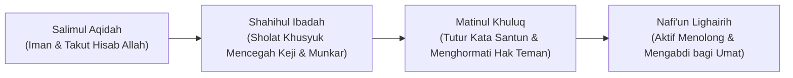

# P3-03-01-Keterhubungan-Fondasi-Ruhiyah-dan-Sosial

## Tujuan
Menjelaskan mekanisme bagaimana fondasi ruhiyah batiniah (**Salimul Aqidah & Shahihul Ibadah**) memancar secara kausalitas menjadi kematangan akhlak sosial (**Matinul Khuluq**) dan dedikasi pelayanan umat (**Nafi'un Lighairih**).

---

## 1. Rantai Kausalitas: Dari Kesadaran Tauhid Menuju Khidmah

Dalam Islam, iman yang benar (*Aqidah*) dan ibadah yang sah (*Sholat*) memiliki konsekuensi moral sosial yang tak terpisahkan (*QS. Al-'Ankabut: 45 & QS. Al-Ma'un: 1-7*).

---

## 2. Analisis Anomali Lapangan (Hipokrisi Perilaku)

1. **Kasus Santri Rajin Sholat Tapi Gemar Membully**:
   - *Diagnosis TUMBUH*: Ibadah santri tersebut baru sebatas gerakan fisik tanpa kehadiran hati (*Ghaflah*), belum menyentuh level pemahaman (*Fahm*) dan adab (*Ta'dib*).
   - *Intervensi*: Bimbingan tadabbur makna bacaan sholat dan muhasabah empati sosial (*Social Awareness*).
2. **Kasus Santri Berakhlak Ramah Tapi Enggan Beribadah**:
   - *Diagnosis TUMBUH*: Kebaikan moral santri baru bersandar pada dorongan sosial semu, belum memiliki jangkar tauhid (*Salimul Aqidah*) yang kokoh.
   - *Intervensi*: Penguatan makna perjanjian primordial (*Mitsaq*) dan motivasi cinta Allah (*Mahabbah*).

---

## 3. Status Dokumen
* **Status**: 🌟 **A+ (Tervalidasi & Siap Diimplementasikan)**
* **Level**: Project 3 - `03 Capacity Framework / 03 Character Relationships`
* **Langkah Berikutnya**: **`P3-03-02-Efek-Sinergis-Regulasi-Diri-dan-Manajemen-Waktu.md`**.
