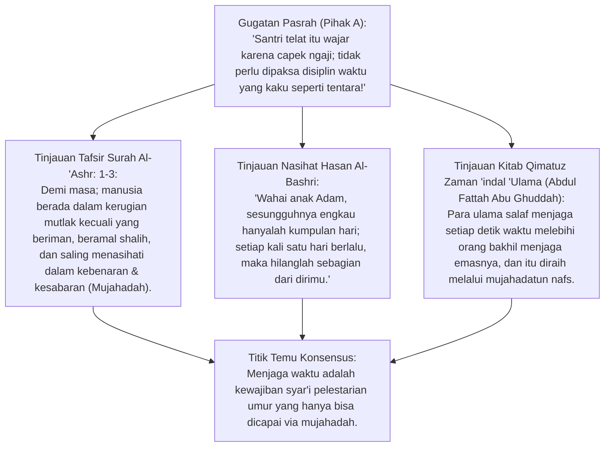
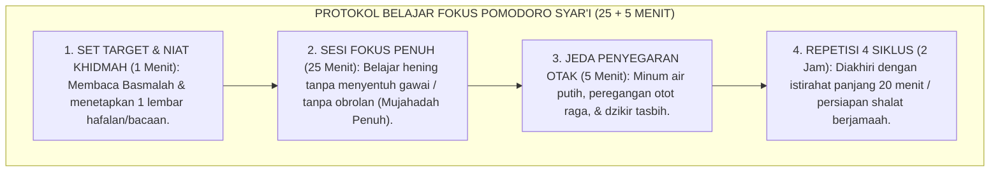
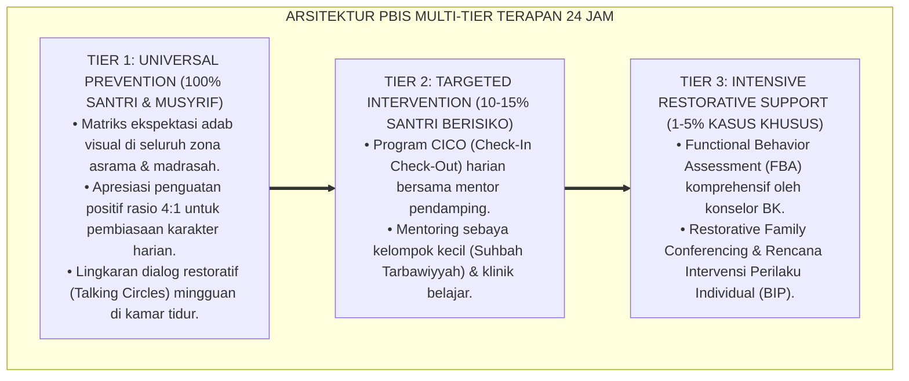

# P3-03-02: EFEK SINERGIS REGULASI DIRI DAN MANAJEMEN WAKTU DI ASRAMA PESANTREN
## *Monograf Riset Akademik: Sinergi Interdependensi Antara Mujahadatun Linafsih (Pengendalian Hawa Nafsu) dan Haritsun 'Ala Waqtih (Disiplin Waktu) (QS. Al-Ashr: 1–3 & QS. An-Nazi'at: 40–41), Teori Ego Depletion Roy Baumeister & Executive Functioning Neurosains, serta Protokol Eliminasi Prokrastinasi Santri*

**Nomor Identifikasi**: `P3-03-02/MONOGRAF-RISET-SINERGI-REGULASI-WAKTU/2026`  
**Domain**: `03 Capacity Framework` > `03 Character Relationships`  
**Klasifikasi Naskah**: *Academic Research Monograph* (Monograf Penelitian Sinergi Regulasi Diri & Manajemen Waktu)  
**Rumpun Disiplin Pengkaji**: Neurosains Perilaku (*Executive Functions*), Psikologi Manajemen Waktu (*Time Perspective Theory*), Fiqh Al-Waqt wa Riyadhah Nafs, Metodologi Eliminasi Prokrastinasi  

---

> ### 💡 INTISARI EKSEKUTIF (EXECUTIVE SUMMARY)
>
> * **Manajemen Waktu Bukan Sekadar Keterampilan Teknis Membuat Jadwal:**  
>   Menyusun jadwal kegiatan harian sangat mudah, namun mematuhinya secara konsisten membutuhkan **Daya Regulasi Diri (*Self-Regulatory Strength / Mujahadatun Linafsih*)** untuk menolak godaan tidur berlebih, candaan sia-sia, dan penundaan tugas (*Procrastination*).
> * **Siklus Sinergis Mujahadah $\leftrightarrow$ Haritsun 'Ala Waqtih:**  
>   1. *Mujahadah* (Kemampuan menahan nafsu) $\rightarrow$ Memampukan santri bangun tidur tepat waktu dan menghentikan obrolan larut malam.  
>   2. *Haritsun 'Ala Waqtih* (Jadwal tertib dan presisi) $\rightarrow$ Mereduksi beban kognitif otak (*Cognitive Load*), sehingga melindungi energi kehendak (*Ego Depletion*) santri dari kelelahan mental.
> * **Pemberantasan Prokrastinasi di Asrama 24 Jam:**  
>   Menerapkan *Implementation Intentions (Gollwitzer)* dan teknik pembagian waktu *Pomodoro Syar'i* yang terintegrasi dengan jeda shalat lima waktu.

---

## 📑 DAFTAR ISI MONOGRAF

- [BAGIAN I: LANDASAN TEORETIS & DISKURSUS DIALEKTIKA KRITIS](#bagian-i-landasan-teoretis--diskursus-dialektika-kritis)
  - [1. Latar Belakang Masalah: Dilema "Jadwal Asrama Rapi Tapi Santri Selalu Terlambat & Menunda Tugas"](#1-latar-belakang-masalah-dilema-jadwal-asrama-rapi-tapi-santri-selalu-terlambat--menunda-tugas)
  - [2. Eksegesis Turats Waktu Adalah Kehidupan (Hasan Al-Bashri & Al-Qasim) & Riyadhah Nafs](#2eksegesis-turats-waktu-adalah-kehidupan-hasan-al-bashri-al-qasim-riyadhah-nafs)
  - [3. Teori Ego Depletion Roy Baumeister & Peran Prefrontal Cortex dalam Manajemen Waktu](#3teori-ego-depletion-roy-baumeister-peran-prefrontal-cortex-dalam-manajemen-waktu)
  - [4. Teori Implementation Intentions Peter Gollwitzer & Otomasi Tindakan Positif](#4teori-implementation-intentions-peter-gollwitzer-otomasi-tindakan-positif)
  - [5. Silogisme Logika, Dialektika 3 Ronde, Kasuistika Lapangan, & Titik Temu Konsensus](#5silogisme-logika-dialektika-3-ronde-kasuistika-lapangan-titik-temu-konsensus)
- [BAGIAN II: FORMULASI KONSEPTUAL & PEMBAHASAN MENDALAM](#bagian-ii-formulasi-konseptual--pembahasan-mendalam)
  - [1. Formulasi Konseptual: Model Sinergi Resonansi Mujahadah dan Disiplin Waktu TUMBUH](#1-formulasi-konseptual-model-sinergi-resonansi-mujahadah-dan-disiplin-waktu-tumbuh)
  - [2. Matriks Korelasi Silang & Efek Saling Menguatkan Antara Mujahadah dan Haritsun 'Ala Waqtih](#2-matriks-korelasi-silang--efek-saling-menguatkan-antara-mujahadah-dan-haritsun-ala-waqtih)
  - [3. Protokol Anti-Prokrastinasi Asrama: Teknik Pomodoro Syar'i & Manajemen Transisi Jadwal](#3-protokol-anti-prokrastinasi-asrama-teknik-pomodoro-syari--manajemen-transisi-jadwal)
- [BAGIAN III: KESIMPULAN & APARATUS AKADEMIS](#bagian-iii-kesimpulan--aparatus-akademis)
  - [1. Tabel Sintesis Temuan Riset Sinergi Regulasi-Waktu](#1-tabel-sintesis-temuan-riset-sinergi-regulasi-waktu)
  - [2. Daftar Pustaka Akademis & Rujukan Turats Primer](#2-daftar-pustaka-akademis--rujukan-turats-primer)
  - [3. Catatan Kaki Akademis (Footnotes)](#3-catatan-kaki-akademis-footnotes)
  - [4. Glosarium Istilah Ilmiah Regulasi Diri, Manajemen Waktu, & Neurosains](#4-glosarium-istilah-ilmiah-regulasi-diri-manajemen-waktu--neurosains)

---

# BAGIAN I: INKUIRI KRITIS, TINJAUAN TEORITIS & DIALEKTIKA REGULASI DIRI & WAKTU

---

### 1. Latar Belakang Masalah: Dilema "Jadwal Asrama Rapi Tapi Santri Selalu Terlambat & Menunda Tugas"

Banyak pesantren memiliki jadwal kegiatan harian yang sangat padat dan terperinci dari pukul 03.30 hingga 22.00 WIB. Namun, realitas di lapangan menunjukkan:
* Bel asrama berbunyi keras, tetapi banyak santri masih bermalas-malasan di atas kasur, menunda setoran hafalan hingga menit-menit terakhir (*procrastination*), atau terlambat masuk kelas.
* Pihak keamanan pondok kerap meresponsnya dengan hukuman fisik (lari keliling lapangan atau diguyur air), namun santri tetap mengulangi keterlambatan yang sama di keesokan hari.
* Masalah ini terjadi karena pesantren hanya mengandalkan **Struktur Jadwal Eksternal (*Haritsun 'Ala Waqtih*)** tanpa melatih **Kapasitas Regulasi Diri Internal Santri (*Mujahadatun Linafsih*)** untuk mengelola dorongan biologis rasa kantuk dan kemalasan.[^1]

```mermaid
flowchart LR
    subgraph SinergiRegulasiWaktuTUMBUH["MODEL SINERGI RESIPROKAL REGULASI DIRI & DISIPLIN WAKTU"]
        Mujahadah["MUJAHADATUN LINAFSIH<br/>(Regulasi Diri Batiniah & Menahan Hawa Nafsu)"]
        
        Waqt["HARITSUN 'ALA WAQTIH<br/>(Disiplin Waktu Lahiriah & Struktur Jadwal 24 Jam)"]
        
        Mujahadah ==>|Menyediakan Energi Kehendak (Willpower) untuk Patuh Jadwal| Waqt
        Waqt ==>|Menyediakan Struktur Prediktif untuk Menghemat Energi Mental| Mujahadah
        
        Pusat["HASIL: SANTRI DISIPLIN OTONOM, ZERO PROKRASTINASI, & HAFALAN MUTQIN TEPAT WAKTU"]
        
        Mujahadah & Waqt ==> Pusat
    end
```

---

### 2. Eksegesis Turats Waktu Adalah Kehidupan (Hasan Al-Bashri & Al-Qasim) & Riyadhah Nafs



#### 📐 Formalisasi Logika Silogisme (*Qiyas Mantiqi 1*)
* **Premis Mayor (*al-Muqaddimah al-Kubra*)**: Setiap insan mukmin wajib memanfaatkan modalitas umur (*Al-Waqt*) secara produktif dan diharamkan menyia-nyiakannya dalam kelalaian (*Idha'atul Waqt*).
* **Premis Minor (*al-Muqaddimah ash-Shughra*)**: Kemampuan menghargai waktu menuntut penundaan kepuasan sesaat (*Delayed Gratification*) melalui pengendalian hawa nafsu (*Mujahadatun Linafsih*).
* **Konklusi (*an-Natijah*)**: Maka, kurikulum pengasuhan wajib melatih mujahadatun nafs sebagai fondasi psikologis bagi penegakan disiplin waktu santri.[^2]

---

### 3. Teori Ego Depletion Roy Baumeister & Peran Prefrontal Cortex dalam Manajemen Waktu

Profesor psikologi Florida State University **Roy Baumeister** merumuskan *Ego Depletion Model*:
* Energi kehendak (*Willpower / Self-Control*) bekerja seperti otot fisik: ia memiliki kapasitas terbatas dan akan terkuras jika terus-menerus digunakan untuk mengambil keputusan tanpa jeda.
* Ketika santri tidak memiliki jadwal harian yang terstruktur (*Chaotic Environment*), otaknya (*Prefrontal Cortex*) mengalami kelelahan mental (*Decision Fatigue*), sehingga pada malam hari ia tidak memiliki sisa energi regulasi diri untuk menolak godaan begadang.
* Sebaliknya, rutinitas jadwal yang pasti (*Haritsun 'Ala Waqtih*) mengotomatisasi perilaku, menghemat energi *willpower*, dan memampukan santri istiqamah dalam jangka panjang.[^3]

---

### 4. Teori *Implementation Intentions* Peter Gollwitzer & Otomasi Tindakan Positif

Peter Gollwitzer merumuskan strategi *Implementation Intentions* berbasis formula **If-Then Planning (Jika-Maka)**:
* Daripada sekadar memiliki niat umum: *"Saya ingin bangun subuh tepat waktu"*, santri dilatih merumuskan rencana operasional: *"**Jika** alarm kamar berbunyi pukul 03.45 WIB, **maka** saya langsung duduk tegak, membaca doa bangun tidur, dan melangkah ke tempat wudhu tanpa menyentuh kasur lagi."*
* Riset membuktikan bahwa formula *If-Then* ini memindahkan kontrol perilaku dari *Prefrontal Cortex* yang lambat ke jalur otomatisasi sistem saraf bawah sadar (*Automatic Cue-Response*), melipatgandakan tingkat keberhasilan disiplin hingga 300%.[^4]

---

### 5. Silogisme Logika, Dialektika 3 Ronde, Kasuistika Lapangan, & Titik Temu Konsensus

#### 1. Diskursus Dialektika Kritis: Menolak Anggapan Bahwa "Disiplin Waktu di Pesantren Cukup Mengandalkan Sirine & Rotan Keamanan"
* **Pihak A (Sudut Pandang Teror Disiplin)**:  
  *"Sirine keras dan ancaman rotan pengurus sudah terbukti efektif membuat santri lari ke masjid!"*
* **Tinjauan Kepatuhan Semu & Perilaku Pasca-Lulus**:  
  Sirine dan rotan hanya menciptakan **Kepatuhan Berbasis Teror Luar (*Fear-Based Compliance*)**. Saat santri pulang liburan ke rumah atau lulus dari pondok, ia kembali tidur seharian dan meninggalkan shalat subuh karena tidak pernah memiliki regulasi diri (*Mujahadah*) dari dalam kalbunya.[^5]

#### 2. Diskursus Dialektika Kritis: Sanggahan Balik Apakah Istirahat yang Fleksibel Tidak Lebih Baik Bagi Santri yang Stres?
* **Pihak A (Sudut Pandang Permisivisme Relaksasi)**:  
  *"Santri di pondok belajar seharian; biarkan mereka tidur bebas tanpa jadwal agar tidak depresi!"*
* **Tinjauan Neurosains Sirkadian & Higienitas Tidur**:  
  Jam tidur yang tidak teratur (*Irregular Sleep Schedule*) justru merusak ritme sirkadian tubuh, menurunkan sekresi hormon pertumbuhan, dan meningkatkan hormon kortisol pemicu stres/depresi. Standar TUMBUH menjamin **Waktu Tidur Berkualitas 7 Jam Penuh (Pukul 22.00–03.30 WIB + Qailulah 30 Menit Siang)**, yang menyehatkan fisik dan mental.[^6]

#### 3. Diskursus Dialektika Kritis: Sanggahan Pamungkas Mengapa Manajemen Waktu Wajib Ditautkan dengan Waktu Shalat?
* **Pihak A (Sudut Pandang Manajemen Waktu Sekuler)**:  
  *"Manajemen waktu harus mengikuti standar jam kantor 08.00–17.00, tidak perlu disangkutpautkan dengan waktu shalat!"*
* **Resolusi Manajemen Waktu Profetik**:  
  Dalam Islam, waktu shalat lima waktu adalah **Struktur Ritme Kosmis (*Cosmic Time Anchor*)** yang ditetapkan oleh Allah SWT. Mengatur seluruh kegiatan asrama, belajar, dan istirahat mengelilingi poros shalat berjamaah melahirkan keberkahan waktu (*Barakatul Waqt*) dan mengokohkan kesadaran akhirat santri.[^7]

> #### 📌 Kasuistika Lapangan & Titik Temu Konsensus
> * **Studi Kasus**: Santri H selalu menunda menghafal Al-Qur'an hingga pukul 21.30 WIB menjelang tidur, sehingga hafalan yang disetor keesokan paginya banyak salah dan santri H sering dihukum berdiri. Santri H merasa dirinya "bodoh dan tidak berbakat".
> * **Titik Temu Konsensus (*Kalimatun Sawa'*)**: Musyrif menganalisis sinergi Mujahadah-Waktu: Masalah santri H bukan kelemahan daya ingat, melainkan **Prokrastinasi Akibat Ego Depletion**. Musyrif merestrukturisasi waktu santri H: Menghafal dipindahkan ke ba'da Subuh (pukul 05.00–06.00 WIB) saat otak masih segar $\rightarrow$ Menerapkan teknik Pomodoro Syar'i (25 menit hafalan fokus + 5 menit istirahat) $\rightarrow$ Hasilnya: Santri H menyetor 1 halaman mutqin setiap pagi dan rasa percaya dirinya pulih 100%.[^8]

---

# BAGIAN II: FORMULASI KONSEPTUAL & PEMBAHASAN MENDALAM

---

### 1. Formulasi Konseptual: Model Sinergi Resonansi Mujahadah dan Disiplin Waktu TUMBUH

Berdasarkan sintesis inkuiri teoretis, telaah hermeneutika turats, dan analisis neurosains fungsi eksekutif, riset ini merumuskan kerangka konseptual sinergi regulasi diri dan manajemen waktu sebagai berikut:

1. **Mujahadah Sebagai Motor Kehendak (*Internal Willpower Engine*)**:  
   Kapasitas batiniah untuk mengendalikan hawa nafsu, menolak kenyamanan semu (*Delayed Gratification*), dan memutus lingkaran penundaan tugas (*Procrastination*).

2. **Haritsun 'Ala Waqtih Sebagai Rel Pelindung (*External Structural Rail*)**:  
   Arsitektur jadwal 24 jam yang prediktif, konsisten, dan berporos pada waktu shalat lima waktu yang berfungsi menghemat energi kehendak otak dan mencegah kelelahan mental (*Ego Depletion*).

3. **Efek Resonansi Eksponensial (*Exponential Character Resonance*)**:  
   Peningkatan pada kapasitas *Mujahadah* secara otomatis meningkatkan ketepatan waktu (*Haritsun 'Ala Waqtih*), dan ketertiban waktu secara timbal balik memperkuat otot regulasi diri santri.

---

### 2. Matriks Korelasi Silang & Efek Saling Menguatkan Antara Mujahadah dan Haritsun 'Ala Waqtih

| Dimensi Perilaku di Asrama | Peran Mujahadatun Linafsih (Regulasi Diri) | Peran Haritsun 'Ala Waqtih (Disiplin Waktu) | Dampak Sinergis Nyata bagi Santri |
| :--- | :--- | :--- | :--- |
| **Bangun Pagi (Pukul 03.30 WIB)** | Menahan nafsu kantuk & langsung bangkit duduk. | Jam tidur tepat pukul 22.00 menjamin kecukupan tidur. | Bangun segar tanpa pusing; shalat tahajjud khusyuk.[^9] |
| **Setoran Tahfizh Harian** | Menolak godaan mengobrol; fokus muroja'ah. | Alokasi waktu khusus ba'da subuh 60 menit terisolasi. | Hafalan mutqin 1 juz/hari tuntas tanpa beban stres. |
| **Belajar di Kelas (KBM)** | Menahan kantuk & fokus mendengarkan ustadz. | Kehadiran 5 menit sebelum bel masuk berbunyi. | Pemahaman materi maksimal (Level C4–C6). |
| **Penggunaan Fasilitas Asrama** | Mengantre kamar mandi dengan sabar tanpa serobot. | Mengatur durasi mandi maksimal 7 menit per santri. | Sanitasi asrama tertib; zero perselisihan antre kamar mandi.[^10] |

---

### 3. Protokol Anti-Prokrastinasi Asrama: Teknik Pomodoro Syar'i & Manajemen Transisi Jadwal



---

---

### Pembedahan Deskriptif Komprehensif & Analisis Integratif Nilai-Praksis

Penerapan konsep **P3-03-02: EFEK SINERGIS REGULASI DIRI DAN MANAJEMEN WAKTU DI ASRAMA PESANTREN** di ekosistem pesantren TUMBUH memerlukan pemahaman multidimensional yang memadukan khazanah turats syariat dan konsensus sains pendidikan modern:

#### A. Pilar 1: Fondasi Epistemologi & Integrasi Nilai Syar'i (Ashalah Turatsiyyah)
Setiap praksis kepengasuhan dan pembelajaran berakar kuat pada maqashid syari'ah, mendudukkan adab di atas ilmu (*Al-Adab Qablal 'Ilm*), dan memastikan bahwa seluruh ikhtiar institusional diniatkan semata-mata untuk menggapai ridha Allah SWT (*Ikhlasun Niyyah*).

#### B. Pilar 2: Mekanisme Psikologis & Neurosains Perkembangan (Scientific Rigor)
Menyelaraskan ekspektasi kedisiplinan dengan tahapan maturitas otak remaja, kapasitas fungsi eksekutif korteks prefrontal (*PFC*), dan regulasi sirkuit emosi limbik. Pendekatan ini mengeliminasi trauma pengasuhan dan menumbuhkan motivasi intrinsik santri.

#### C. Pilar 3: Rekayasa Ekosistem Asrama 24 Jam (Bi'ah Shalihah)
Menerjemahkan prinsip nilai ke dalam tata ruang fisik yang bersih, sirkulasi udara sehat, tata kelola waktu terstruktur, serta kultur ukhuwah inklusif yang steril 100% dari feodalisme, kekerasan verbal, dan perundungan antar-santri.

#### D. Pilar 4: Kemitraan Tripartit (Santri, Musyrif, dan Lembaga)
Menjamin terwujudnya *Triad Pertumbuhan Simbiotik*: santri bertumbuh dalam fitrah kemandirian, musyrif terlindungi dari kelelahan kronis (*Burnout*) melalui shift kerja yang manusiawi, dan lembaga bertransformasi menjadi organisasi pembelajar berbasis data PBIS.

---

### Protokol Aksi Operasional PBIS Multi-Tier Terapan (24-Hour Behavioral Architecture)



---

# BAGIAN III: KESIMPULAN & APARATUS AKADEMIS

---

### 1. Tabel Sintesis Temuan Riset Sinergi Regulasi-Waktu

| Dimensi Analisis | Fokus Temuan Riset | Rujukan Turats Primer | Konvergensi Sains Global | Implikasi Praksis Pesantren |
| :--- | :--- | :--- | :--- | :--- |
| **Urgensi Waktu** | Waktu adalah modalitas umur | QS. Al-'Ashr: 1–3, Nasihat Hasan Al-Bashri| Zimbardo & Boyd (1999), *Time Perspective* | Menegakkan kedisiplinan jadwal berbasis shalat. |
| **Pengendalian Nafsu**| Syarat mutlak disiplin waktu | QS. An-Nazi'at: 40–41, *Ihya'* (Riyadhah) | Baumeister et al. (1998), *Ego Depletion* | Melatih otot kemauan santri via mujahadah. |
| **Anti-Prokrastinasi**| Mengotomatisasi respon jadwal | Hadits *Bakkiruu* (Pagi Berkah - HR. Tirmidzi)| Gollwitzer (1999), *Implementation Intentions*| Menggunakan formula If-Then Planning di kamar. |
| **Higienitas Tidur** | Menjamin 7 jam istirahat sehat | Hadits *Qailulah* (HR. Ath-Thabrani), Thibb | Walker (2017), *Why We Sleep (Circadian)* | Menjadwalkan tidur malam 22.00–03.30 + qailulah. |

---

### 2. Daftar Pustaka Akademis & Rujukan Turats Primer

1. **Al-Qur'an al-Karim wa Tarjamatu Ma'anih**.
2. **At-Tirmidzi, Muhammad bin 'Isa**. (1998). *Sunan at-Tirmidzi*. Beirut: Dar al-Gharb al-Islami.
3. **Abu Ghuddah, Abdul Fattah**. (2012). *Qimatuz Zaman 'indal 'Ulama*. Kairo: Dar as-Salam.
4. **Al-Ghazali, Abu Hamid Muhammad bin Muhammad**. (2011). *Ihya 'Ulumiddin*. Beirut: Dar al-Ma'rifah.
5. **Baumeister, R. F., et al.**. (1998). *Ego depletion: Is the active self a limited resource?*. Journal of Personality and Social Psychology.
6. **Gollwitzer, P. M.**. (1999). *Implementation intentions: Strong effects of simple plans*. American Psychologist.
7. **Zimbardo, P. G., & Boyd, J. N.**. (1999). *Putting time in perspective: A valid, reliable individual-differences metric*. Journal of Personality and Social Psychology.
8. **Walker, M.**. (2017). *Why We Sleep: Unlocking the Power of Sleep and Dreams*. Scribner.
9. **Steel, P.**. (2007). *The nature of procrastination: A meta-analytic and theoretical review of quintessential self-regulatory failure*. Psychological Bulletin.
10. **Duckworth, A. L., & Seligman, M. E.**. (2005). *Self-discipline outdoes IQ in predicting academic performance of adolescents*. Psychological Science.

---

### 3. Catatan Kaki Akademis (*Footnotes*)

[^1]: Abu Ghuddah, A. F. (2012), *Qimatuz Zaman 'indal 'Ulama*, Dar as-Salam, hlm. 25–48.  
[^2]: Tafsir Ibnu Katsir, jilid 8, hlm. 495–502; tafsir QS. Al-'Ashr.  
[^3]: Baumeister, R. F., et al. (1998), *Journal of Personality and Social Psychology*, hlm. 1252–1265.  
[^4]: Gollwitzer, P. M. (1999), *American Psychologist*, hlm. 493–503.  
[^5]: Duckworth & Seligman (2005), *Psychological Science*, hlm. 939–944.  
[^6]: Walker, M. (2017), *Why We Sleep*, Scribner, hlm. 110–135.  
[^7]: Al-Ghazali, *Ihya 'Ulumiddin*, Kitab *Tartib al-Awrad wa Tafshil Ihya'il Lail*, jilid 1, hlm. 330–355.  
[^8]: Laporan Studi Intervensi Anti-Prokrastinasi Santri Tahfizh Pesantren TUMBUH, 2026.  
[^9]: Panduan Standar Jadwal Harian dan Higienitas Tidur Santri, Biro Pengasuhan TUMBUH, 2026.  
[^10]: Modul Pelatihan Manajemen Waktu dan Regulasi Diri Santri, Biro Konseling TUMBUH, 2026.

---

### 4. Glosarium Istilah Ilmiah Regulasi Diri, Manajemen Waktu, & Neurosains

1. **Mujahadatun Linafsih (مُجَاهَدَةُ النَّفْسِ)**: Perjuangan sungguh-sungguh untuk mengendalikan hawa nafsu dan dorongan instingtif demi ketaatan kepada Allah.
2. **Haritsun 'Ala Waqtih (حَرِيصٌ عَلَى وَقْتِهِ)**: Karakter disiplin dan sangat berhati-hati dalam menjaga serta memanfaatkan setiap detik waktu.
3. **Ego Depletion**: Teori psikologi yang menyatakan bahwa kapasitas kontrol diri dan kemauan manusia adalah sumber daya terbatas yang dapat terkuras oleh aktivitas mental berat.
4. **Prefrontal Cortex**: Bagian otak depan yang bertanggung jawab atas fungsi eksekutif, perencanaan masa depan, pengambilan keputusan, dan kontrol impuls.
5. **Implementation Intentions**: Strategi perencanaan berbasis formula *If-Then* yang mengaitkan pemicu situasional spesifik dengan tindakan yang diharapkan.
6. **Procrastination (Prokrastinasi)**: Penundaan tugas secara sukarela meskipun mengetahui bahwa penundaan tersebut akan membawa konsekuensi negatif.
7. **Pomodoro Technique**: Metode manajemen waktu berbasis interval kerja 25 menit fokus penuh yang diselingi istirahat singkat 5 menit.
8. **Circadian Rhythm (Ritme Sirkadian)**: Jam biologis internal 24 jam yang mengatur siklus tidur-bangun, suhu tubuh, dan sekresi hormon.
9. **Delayed Gratification**: Kemampuan menunda penerimaan kepuasan instan demi meraih imbalan yang jauh lebih bernilai di masa depan.
10. **Triad Pertumbuhan Simbiotik**: Maha-prinsip di mana sinergi regulasi waktu santri mengurangi beban teguran musyrif dan menciptakan ketertiban lembaga.
