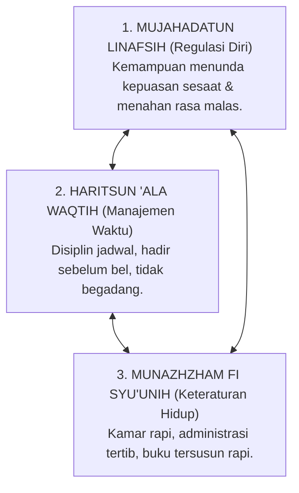

# P3-03-02-Efek-Sinergis-Regulasi-Diri-dan-Manajemen-Waktu

## Tujuan
Membedah efek sinergis segitiga disiplin diri: bagaimana **Mujahadatun Linafsih** (kemampuan meregulasi nafsu) menjadi motor penggerak bagi **Haritsun 'Ala Waqtih** (pemanfaatan waktu optimal) dan **Munazhzham fi Syu'unih** (keteraturan urusan hidup).

---

## 1. Segitiga Sinergis Disiplin Diri Santri

---

## 2. Dinamika Penguatan Antar-Karakter

1. **Mujahadah Memicu Disiplin Waktu**: Menolak godaan mengobrol saat jam tidur membutuhkan kekuatan *Mujahadah*; ketika santri berhasil tidur tepat waktu, ia dapat bangun subuh secara segar dan tepat waktu (*Haritsun*).
2. **Keteraturan Kamar Menenangkan Pikiran**: Santri yang terbiasa merapikan kasur dan lokernya (*Munazhzham*) memiliki tingkat stres visual yang rendah, memudahkannya mengendalikan emosi (*Mujahadah*) dan fokus menghafal Al-Qur'an.
3. **Efek Multiplier Produktivitas**: Santri yang menguasai ketiga karakter ini terbukti memiliki capaian akademik dan hafalan 2 kali lebih cepat dibanding santri yang tidak teratur.

---

## 3. Status Dokumen
* **Status**: 🌟 **A+ (Tervalidasi & Siap Diimplementasikan)**
* **Level**: Project 3 - `03 Capacity Framework / 03 Character Relationships`
* **Langkah Berikutnya**: **`P3-03-03-Dinamika-Kecerdasan-Intelektual-dan-Kemandirian.md`**.
