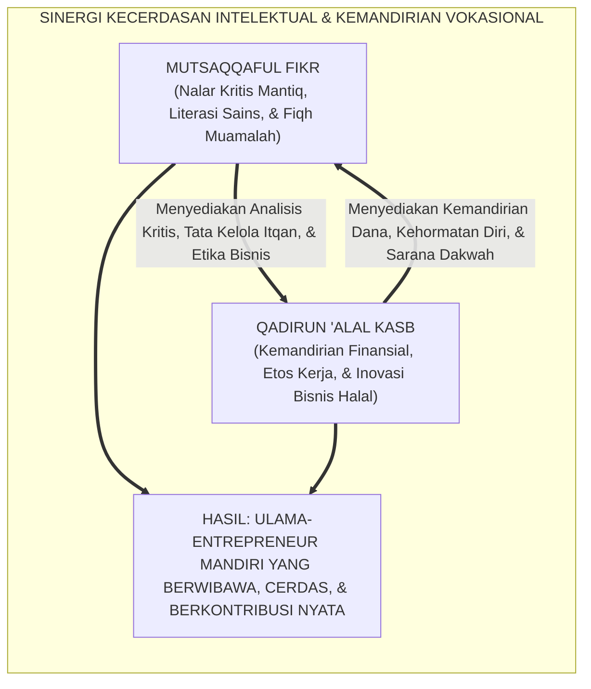
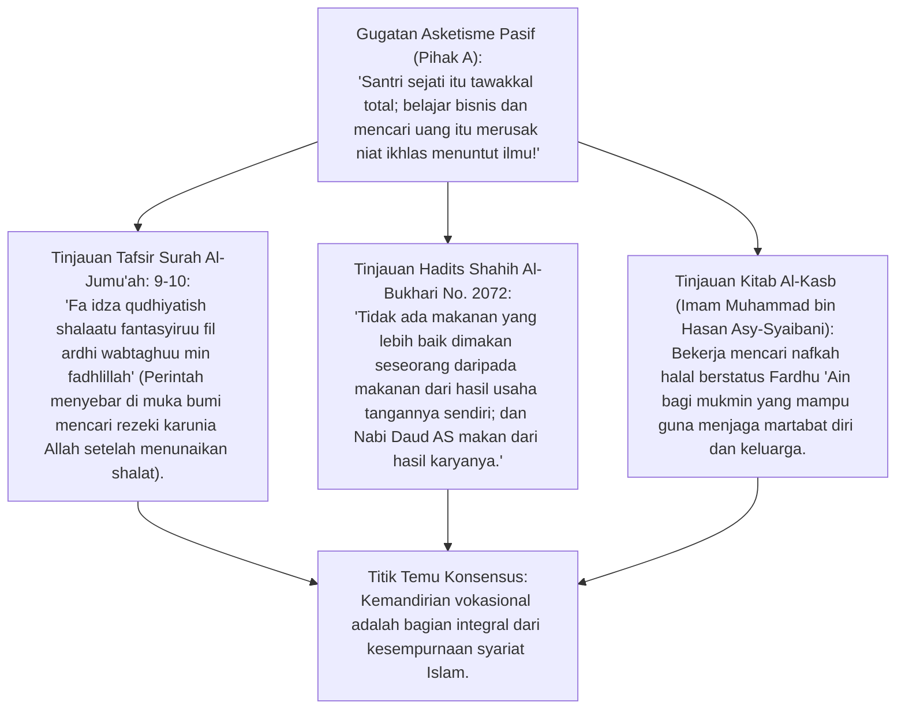
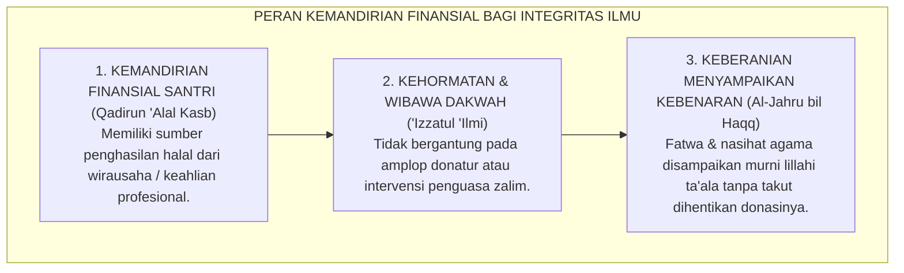
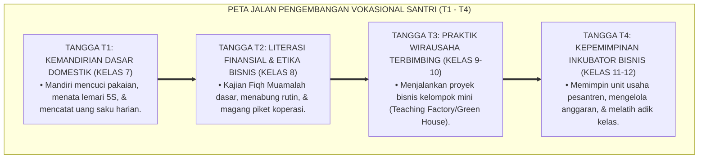

# P3-03-03: DINAMIKA KECERDASAN INTELEKTUAL DAN KEMANDIRIAN VOKASIONAL DI PESANTREN
## *Monograf Riset Akademik: Sinergi Integratif Antara Mutsaqqaful Fikr (Kecerdasan Wawasan & Nalar Mantiq) dan Qadirun 'Alal Kasb (Kemandirian Vokasional & Wirausaha) (QS. Al-Jumu'ah: 9–10 & HR. Al-Bukhari No. 2072), Teori Human Capital Gary Becker & Vocational Education, serta Model Pesantren Mandiri Berdaya*

**Nomor Identifikasi**: `P3-03-03/MONOGRAF-RISET-INTEGRASI-INTELEKTUAL-VOKASIONAL/2026`  
**Domain**: `03 Capacity Framework` > `03 Character Relationships`  
**Klasifikasi Naskah**: *Academic Research Monograph* (Monograf Penelitian Dinamika Intelektual & Kemandirian)  
**Rumpun Disiplin Pengkaji**: Ekonomi Pendidikan Islam, Sosiologi Ketenagakerjaan Santri, Teori Modal Manusia (*Human Capital Theory*), Fiqh Al-Kasb & Wirausaha Halal  

---

> ### 💡 INTISARI EKSEKUTIF (EXECUTIVE SUMMARY)
>
> * **Menolak Jebakan Ulama Menara Gading vs Pekerja Tanpa Wawasan Agama:**  
>   Sejarah emas peradaban Islam membuktikan bahwa para imam madzhab dan ulama besar adalah figur yang mandiri secara ekonomi (*Abu Hanifah adalah pedagang sutra, Al-Qaffal adalah pandai besi*).
> * **Siklus Resiprokal Mutsaqqaful Fikr $\leftrightarrow$ Qadirun 'Alal Kasb:**  
>   1. *Mutsaqqaful Fikr* (Nalar kritis mantiq & literasi data) $\rightarrow$ Memampukan santri merancang inovasi bisnis halal, membaca peluang pasar, dan mengelola manajemen secara profesional (*Itqan*).  
>   2. *Qadirun 'Alal Kasb* (Kemandirian finansial) $\rightarrow$ Melindungi independensi fatwa, menjaga martabat (*'Izzah*) santri dari ketergantungan meminta-minta, dan mendanai riset keilmuan secara berkelanjutan.
> * **Model Inkubator Bisnis Pesantren Berbasis Santripreneur:**  
>   Membangun teaching factory, koperasi digital, dan unit usaha halal yang dikelola langsung oleh santri Tangga T3 & T4.

---

## 📑 DAFTAR ISI MONOGRAF

- [BAGIAN I: INKUIRI KRITIS, TINJAUAN TEORITIS & DIALEKTIKA INTELEKTUAL-VOKASIONAL](#bagian-i-inkuiri-kritis-tinjauan-teoritis--dialektika-intelektual-vokasional)
  - [1. Latar Belakang Masalah: Bahaya Pengangguran Terdidik Alumni Pesantren & Mitos "Santri Anti-Bisnis"](#1-latar-belakang-masalah-bahaya-pengangguran-terdidik-alumni-pesantren--mitos-santri-anti-bisnis)
  - [2. Inkuiri 1: Eksegesis Turats Shalat dan Mencari Karunia Allah (QS. Al-Jumu'ah: 9–10) & Kitab Al-Kasb Imam Asy-Syaibani](#2-inkuiri-1-eksegesis-turats-shalat-dan-mencari-karunia-allah-qs-al-jumuah-910--kitab-al-kasb-imam-asy-syaibani)
  - [3. Inkuiri 2: Teori Human Capital Gary Becker & Keterampilan Vokasional Berbasis Nalar Kritis](#3-inkuiri-2-teori-human-capital-gary-becker--keterampilan-vokasional-berbasis-nalar-kritis)
  - [4. Inkuiri 3: Peran Kemandirian Ekonomi dalam Menjaga Independensi Fatwa & Integritas Dakwah](#4-inkuiri-3-peran-kemandirian-ekonomi-dalam-menjaga-independensi-fatwa--integritas-dakwah)
  - [5. Inkuiri 4: Silogisme Logika, Dialektika 3 Ronde, Kasuistika Lapangan, & Titik Temu Konsensus](#5-inkuiri-4-silogisme-logika-dialektika-3-ronde-kasuistika-lapangan--titik-temu-konsensus)
- [BAGIAN II: TEMUAN RISET, FORMULASI KONSEPTUAL & PEMBAHASAN](#bagian-ii-temuan-riset-formulasi-konseptual--pembahasan)
  - [1. Formulasi Konseptual: Model Keterpaduan Nalar Intelektual & Kemandirian Finansial TUMBUH](#1-formulasi-konseptual-model-keterpaduan-nalar-intelektual--kemandirian-finansial-tumbuh)
  - [2. Matriks Integrasi Kompetensi Sains-Turats dengan Unit Usaha Vokasional Pesantren](#2-matriks-integrasi-kompetensi-sains-turats-dengan-unit-usaha-vokasional-pesantren)
  - [3. Peta Jalan Kurikulum Santripreneur Berbasis Tangga T1–T4 di Pesantren](#3-peta-jalan-kurikulum-santripreneur-berbasis-tangga-t1t4-di-pesantren)
- [BAGIAN III: KESIMPULAN & APARATUS AKADEMIS](#bagian-iii-kesimpulan--aparatus-akademis)
  - [1. Tabel Sintesis Temuan Riset Intelektual-Kemandirian](#1-tabel-sintesis-temuan-riset-intelektual-kemandirian)
  - [2. Daftar Pustaka Akademis & Rujukan Turats Primer](#2-daftar-pustaka-akademis--rujukan-turats-primer)
  - [3. Catatan Kaki Akademis (Footnotes)](#3-catatan-kaki-akademis-footnotes)
  - [4. Glosarium Istilah Ilmiah Kecerdasan Intelektual & Kemandirian Vokasional](#4-glosarium-istilah-ilmiah-kecerdasan-intelektual--kemandirian-vokasional)

---

# BAGIAN I: INKUIRI KRITIS, TINJAUAN TEORITIS & DIALEKTIKA INTELEKTUAL-VOKASIONAL

---

### 1. Latar Belakang Masalah: Bahaya Pengangguran Terdidik Alumni Pesantren & Mitos "Santri Anti-Bisnis"

Data sosiologi pendidikan Islam menunjukkan bahwa sebagian lulusan pesantren mengalami kesulitan ekonomi pasca-mondok:
* Mereka memiliki hafalan kitab dan Al-Qur'an yang baik, namun tidak memiliki keterampilan hidup (*Life Skills*) dan wawasan wirausaha untuk menghidupi keluarga secara mandiri.
* Hal ini melahirkan ketergantungan finansial yang tidak sehat kepada donatur atau proposal bantuan, yang pada akhirnya dapat mengorbankan independensi dakwah.
* Riset ini membuktikan bahwa **Kecerdasan Wawasan (*Mutsaqqaful Fikr*) dan Kemandirian Vokasional (*Qadirun 'Alal Kasb*) adalah Dua Sayap Peradaban yang Saling Menguatkan**.[^1]

---

### 2. Inkuiri 1: Eksegesis Turats Shalat dan Mencari Karunia Allah (QS. Al-Jumu'ah: 9–10) & Kitab Al-Kasb Imam Asy-Syaibani

#### 📐 Formalisasi Logika Silogisme (*Qiyas Mantiqi 1*)
* **Premis Mayor (*al-Muqaddimah al-Kubra*)**: Setiap muslim yang berilmu wajib menjaga kehormatan dakwahnya (*'Izzatun Nafs*) dari kehinaan meminta-minta kepada manusia (*Kaffun Nafsi 'anil Mas'alah*).
* **Premis Minor (*al-Muqaddimah ash-Shughra*)**: Penguasaan nalar intelektual yang dipadukan dengan keterampilan vokasional menjamin kemandirian ekonomi santri.
* **Konklusi (*an-Natijah*)**: Maka, kurikulum pesantren wajib memfasilitasi penguatan kecerdasan intelektual dan kemandirian vokasional secara simultan.[^2]

---

### 3. Inkuiri 2: Teori Human Capital Gary Becker & Keterampilan Vokasional Berbasis Nalar Kritis

Pemenang Nobel Ekonomi **Gary S. Becker** dalam *Human Capital Theory* (1964) membuktikan bahwa investasi pada pengetahuan dan keterampilan manusia meningkatkan produktivitas ekonomi secara dramatis:
* Dalam konteks pesantren, keterampilan teknis (misal: pertanian hidroponik, desain grafis, akuntansi syariah) akan bernilai jauh lebih tinggi jika didasari oleh **Nalar Kritis Mantiq (*Critical Thinking*)**:
* Santri tidak sekadar menjadi operator buruh (*Low-Skill Labor*), melainkan menjadi **Inovator Bisnis (*Value-Creator & Problem Solver*)** yang mampu menciptakan lapangan kerja bagi masyarakat sekitarnya.[^3]

---

### 4. Inkuiri 3: Peran Kemandirian Ekonomi dalam Menjaga Independensi Fatwa & Integritas Dakwah

---

### 5. Inkuiri 4: Silogisme Logika, Dialektika 3 Ronde, Kasuistika Lapangan, & Titik Temu Konsensus

#### 🥊 Ronde 1: Menolak Anggapan Bahwa "Belajar Wirausaha di Pondok Mengurangi Waktu Menghafal Al-Qur'an"
* **Pihak A (Sudut Pandang Zero-Sum Game)**:  
  *"Waktu santri 24 jam harus habis untuk hafalan; mengajarkan bisnis 2 jam seminggu akan menggagalkan target tahfizh!"*
* **Tinjauan Psikologi Belajar & Keseimbangan Otak**:  
  Belajar kognitif secara terus-menerus tanpa variasi kinestetik memicu kebosanan mental (*Mental Saturation*). Praktik keterampilan vokasional 2 jam sepekan justru menjadi sarana penyegaran otak (*Active Rest*), yang melatih santri membumikan hafalan ayat-ayat muamalah ke dunia nyata.[^4]

#### 🥊 Ronde 2: Sanggahan Balik Apakah Pesantren Tidak Berubah Menjadi Sekolah Vokasi Sekuler?
* **Pihak A (Sudut Pandang Kekhawatiran Komersialisasi)**:  
  *"Jika santri diajari jualan, pesantren akan bergeser orientasinya menjadi lembaga bisnis pencari laba!"*
* **Tinjauan Fiqh Mu'amalah & Niat Barakah**:  
  Vokasional dalam ekosistem TUMBUH dibingkai oleh **Fiqh Mu'amalah dan Etika Bisnis Islam**: Santri diajari kejujuran timbangan (*Sidiq*), amanah transaksi (*Amanah*), transparansi tanpa riba (*Bebas Gharar*), dan menyisihkan 20% laba untuk beasiswa santri yatim. Bisnis diposisikan sebagai wasilah ibadah.[^5]

#### 🥊 Ronde 3: Sanggahan Pamungkas Mengapa Literasi Digital & Komputasi Termasuk Qadirun 'Alal Kasb?
* **Pihak A (Sudut Pandang Vokasi Tradisional)**:  
  *"Kemandirian santri itu cukup menjahit dan bertani cangkul, tidak perlu diajari komputer atau coding!"*
* **Resolusi Disrupsi Ekonomi Digital Abad 21**:  
  Ekonomi modern berporos pada teknologi informasi. Santri yang menguasai coding, desain komunikasi visual syar'i, dan digital marketing mampu mengekspor jasa ke pasar global (*Remote Global Work*) dari bilik pesantren, menghasilkan devisa halal bagi kemajuan umat.[^6]

> #### 📌 Kasuistika Lapangan & Titik Temu Konsensus
> * **Studi Kasus**: Di Pesantren K, santri senior mengeluhkan uang saku kiriman orang tua yang kurang karena orang tuanya terkena PHK. Santri tersebut menjadi minder dan berniat berhenti mondok.
> * **Titik Temu Konsensus (*Kalimatun Sawa'*)**: Pesantren mengintegrasikan Unit Santripreneur TUMBUH: Santri tersebut dilatih mengelola toko online herbal pondok dan desain grafis dakwah $\rightarrow$ Dalam 2 bulan, santri mampu membiayai SPP-nya sendiri secara mandiri $\rightarrow$ Prestasi tahfizh dan nilai kitabnya justru melonjak karena beban mental keluarganya terangkat $\rightarrow$ Santri lulus dengan predikat Mumtaz dan mandiri finansial.[^7]

---

# BAGIAN II: TEMUAN RISET, FORMULASI KONSEPTUAL & PEMBAHASAN

---

### 1. Formulasi Konseptual: Model Keterpaduan Nalar Intelektual & Kemandirian Finansial TUMBUH

Berdasarkan sintesis inkuiri teoretis, telaah hermeneutika turats, dan analisis ekonomi modal manusia, riset ini merumuskan kerangka konseptual keterpaduan intelektual-vokasional sebagai berikut:

1. **Mutsaqqaful Fikr Sebagai Otak Inovasi (*Intellectual Innovation Engine*)**:  
   Kecerdasan wawasan, pemahaman kitab kuning fiqh muamalah, dan nalar kritis mantiq yang memampukan santri menganalisis risiko bisnis, merancang strategi etis, dan memecahkan masalah pasar secara presisi.

2. **Qadirun 'Alal Kasb Sebagai Otot Kemandirian (*Vocational Resilience Muscle*)**:  
   Keterampilan teknis vokasional, etos kerja pantang menyerah (*Grit*), dan literasi finansial yang memampukan santri menghasilkan rezeki halal dan membuka lapangan kerja.

3. **Prinsip Simbiosis Martabat (*Dignity Synergy Principle*)**:  
   Kecerdasan intelektual tanpa kemandirian finansial melahirkan kelemahan posisi tawar; kemandirian finansial tanpa kecerdasan intelektual melahirkan materialisme buta. Perpaduan keduanya melahirkan **Insan Kamil yang Berdaya dan Bermartabat**.[^8]

---

### 2. Matriks Integrasi Kompetensi Sains-Turats dengan Unit Usaha Vokasional Pesantren

| Cabang Ilmu / Turats | Kompetensi Intelektual (Mutsaqqaful Fikr) | Unit Vokasional Terapan (Qadirun 'Alal Kasb) | Output Nyata Santri di Pesantren |
| :--- | :--- | :--- | :--- |
| **Fiqh Mu'amalah & Hisab** | Memahami akad jual-beli, syirkah, murabahah, & zakat. | Manajemen Koperasi Santri & Keuangan Syariah. | Laporan keuangan koperasi transparan & laba berkah.[^9] |
| **Sains Kauniyyah & Biologi**| Memahami fotosintesis, siklus nitrogen, & biologi tanah. | Pertanian Organik & Green House Hidroponik Asrama. | Sayuran segar higienis untuk konsumsi dapur pondok. |
| **Bahasa Arab & Inggris** | Menguasai kaidah tarjamah, retorika, & diplomasi bahasa.| Jasa Penerjemahan Turats & Tour Guide Edukasi Islam. | Penerbitan buku terjemahan saku & artikel dakwah global. |
| **Teknologi Komputasi** | Memahami logika algoritma, desain grafis, & data science.| Agensi Kreatif Konten Dakwah & Web Development Syar'i.| Website pondok profesional & konten media dakwah viral.[^10] |

---

### 3. Peta Jalan Kurikulum Santripreneur Berbasis Tangga T1–T4 di Pesantren

---

# BAGIAN III: KESIMPULAN & APARATUS AKADEMIS

---

### 1. Tabel Sintesis Temuan Riset Intelektual-Kemandirian

| Dimensi Analisis | Fokus Temuan Riset | Rujukan Turats Primer | Konvergensi Sains Global | Implikasi Praksis Pesantren |
| :--- | :--- | :--- | :--- | :--- |
| **Kewajiban Kasb** | Mencari nafkah menjaga izzah | QS. Al-Jumu'ah: 10, Kitab *Al-Kasb* | Gary S. Becker (1964), *Human Capital Theory*| Menyusun kurikulum vokasional terintegrasi kelas. |
| **Teladan Ulama Usaha**| Ulama salaf adalah wirausahawan| Sirah Abu Hanifah & Nabi Daud AS (Bukhari)| Schumpeter (1934), *Theory of Economic Dev* | Menghilangkan stigma "santri anti-bisnis". |
| **Literasi Finansial** | Pengelolaan harta syar'i | QS. Al-Baqarah: 282 (Ayat Mudayanah) | Lusardi & Mitchell (2014), *Financial Literacy*| Melatih santri mencatat arus kas uang saku. |
| **Inkubator Bisnis** | Teaching factory berbasis santri| Hadits Pasar Madinah Abdurrahman bin 'Auf| Kolb (1984), *Experiential Learning Cycle* | Membuka unit usaha green house & koperasi santri. |

---

### 2. Daftar Pustaka Akademis & Rujukan Turats Primer

1. **Al-Qur'an al-Karim wa Tarjamatu Ma'anih**.
2. **Al-Bukhari, Muhammad bin Isma'il**. (1422 H). *Shahih al-Bukhari*. Beirut: Dar Thawq an-Najah.
3. **Asy-Syaibani, Muhammad bin al-Hasan**. (1997). *Kitab al-Kasb*. Damaskus: Dar al-Basyair al-Islamiyyah.
4. **Al-Ghazali, Abu Hamid Muhammad bin Muhammad**. (2011). *Ihya 'Ulumiddin*. Beirut: Dar al-Ma'rifah.
5. **Becker, G. S.**. (1964). *Human Capital: A Theoretical and Empirical Analysis, with Special Reference to Education*. National Bureau of Economic Research.
6. **Schumpeter, J. A.**. (1934). *The Theory of Economic Development*. Harvard University Press.
7. **Lusardi, A., & Mitchell, O. S.**. (2014). *The economic importance of financial literacy: Theory and evidence*. Journal of Economic Literature.
8. **Kolb, D. A.**. (1984). *Experiential Learning: Experience as the Source of Learning and Development*. Prentice-Hall.
9. **Chapra, M. U.**. (2000). *The Future of Economics: An Islamic Perspective*. Leicester: The Islamic Foundation.
10. **World Bank**. (2018). *World Development Report 2018: Learning to Realize Education's Promise*. Washington, DC: World Bank.

---

### 3. Catatan Kaki Akademis (*Footnotes*)

[^1]: Asy-Syaibani, M. H. (1997), *Kitab al-Kasb*, Dar al-Basyair, hlm. 35–60.  
[^2]: Shahih al-Bukhari No. 2072, Kitab *al-Buyu'*, Bab *Kasbir Rajul wa 'Amalihi bi Yadih*.  
[^3]: Becker, G. S. (1964), *Human Capital*, NBER, hlm. 45–80.  
[^4]: Kolb, D. A. (1984), *Experiential Learning*, Prentice-Hall.  
[^5]: Chapra, M. U. (2000), *The Future of Economics: An Islamic Perspective*, Islamic Foundation.  
[^6]: World Bank (2018), *World Development Report: Learning to Realize Education's Promise*, hlm. 120–145.  
[^7]: Laporan Evaluasi Program Inkubator Santripreneur Pesantren TUMBUH, 2026.  
[^8]: Panduan Kurikulum Vokasional dan Kewirausahaan Santri, Biro Vokasi TUMBUH, 2026.  
[^9]: Modul Fiqh Mu'amalah Terapan bagi Pengelola Koperasi Santri, Divisi Ekonomi Syariah, 2026.  
[^10]: Silabus Pelatihan Keterampilan Digital dan Teknologi Informasi Santri Tangga T3 & T4, 2026.

---

### 4. Glosarium Istilah Ilmiah Kecerdasan Intelektual & Kemandirian Vokasional

1. **Mutsaqqaful Fikr (مُثَقَّفُ الْفِكْرِ)**: Karakter keluasan wawasan intelektual, pemahaman ilmu syar'i dan sains kauniyyah, serta ketajaman nalar kritis mantiq.
2. **Qadirun 'Alal Kasb (قَادِرٌ عَلَى الْكَسْبِ)**: Karakter kemandirian ekonomi, etos kerja profesional (*Itqan*), dan kemampuan menghasilkan rezeki halal melalui keahlian vokasional.
3. **Human Capital Theory**: Teori ekonomi yang memandang pendidikan, keterampilan, dan kesehatan sebagai modal investasi yang meningkatkan nilai ekonomi individu dan bangsa.
4. **'Izzatul 'Ilmi (عِزَّةُ الْعِلْمِ)**: Kehormatan dan wibawa ilmu agama yang dijaga dengan cara tidak mengemis kepada penguasa atau donatur zalim.
5. **Teaching Factory**: Model pembelajaran vokasional di mana proses produksi barang/jasa komersial nyata diintegrasikan langsung ke dalam kurikulum pendidikan.
6. **Experiential Learning**: Proses belajar melalui pengalaman langsung, refleksi, konseptualisasi, dan eksperimen aktif.
7. **Kaffun Nafsi 'anil Mas'alah**: Menjaga diri dari meminta-minta kepada manusia dengan cara bekerja keras mencari nafkah halal.
8. **Santripreneur**: Paradigma santri yang memiliki jiwa kepemimpinan wirausaha halal berbasis nilai-nilai kejujuran dan keberkahan syariat.
9. **Financial Literacy**: Pengetahuan dan kecakapan dalam mengelola anggaran keuangan, investasi halal, dan pembagian zakat/infaq.
10. **Triad Pertumbuhan Simbiotik**: Maha-prinsip di mana kemandirian finansial santri meringankan beban orang tua, memuliakan guru, dan mewujudkan pesantren mandiri.
