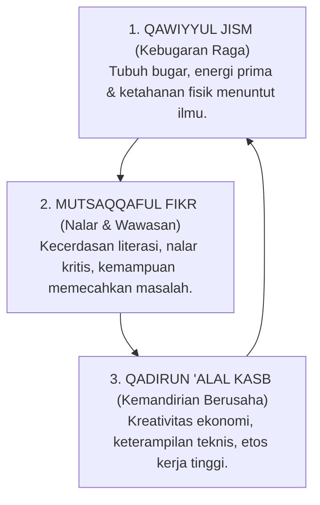

# P3-03-03-Dinamika-Kecerdasan-Intelektual-dan-Kemandirian

## Tujuan
Menjelaskan keterkaitan dinamis antara wawasan intelektual luas (**Mutsaqqaful Fikr**), kebugaran jasmani (**Qawiyyul Jism**), dan kemandirian usaha/ekonomi (**Qadirun 'Alal Kasb**) dalam membentuk santri yang tangguh, tidak berpangku tangan, dan berdaya saing.

---

## 1. Segitiga Ketangguhan Intelektual & Kemandirian

---

## 2. Analisis Integrasi di Pesantren Modern

1. **Mens Sana in Corpore Sano Islami**:
   - Fisik yang sehat dan nutrisi halal-thayyib (*Qawiyyul Jism*) memaksimalkan pasokan oksigen ke otak, meningkatkan daya serap memori hafalan dan nalar analitis (*Mutsaqqaful Fikr*).
2. **Intelektual yang Membumi (*Applied Knowledge*)**:
   - Santri tidak hanya menghafal teks Fiqh Muamalah secara teoritis, tetapi mengaplikasikannya dalam proyek kewirausahaan mini (*Qadirun 'Alal Kasb*), seperti koperasi santri, hidroponik asrama, atau literasi digital.
3. **Kemandirian Menjaga Izzah Santri**:
   - Kemampuan berusaha secara mandiri menghindarkan santri dari mentalitas pengemis atau ketergantungan semu, menjaga kehormatan (*Izzah*) para penuntut ilmu.

---

## 3. Status Dokumen
* **Status**: 🌟 **A+ (Tervalidasi & Siap Diimplementasikan)**
* **Level**: Project 3 - `03 Capacity Framework / 03 Character Relationships`
* **Langkah Berikutnya**: **`P3-03-04-Peta-Resonansi-dan-Efek-Domino-Karakter.md`**.
