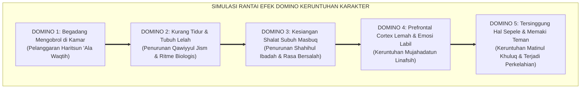
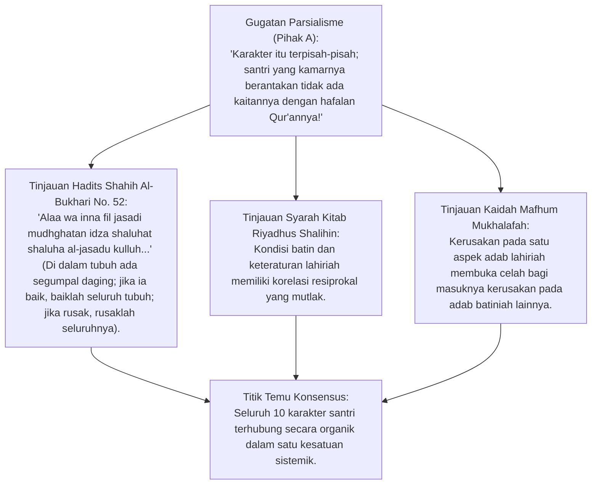
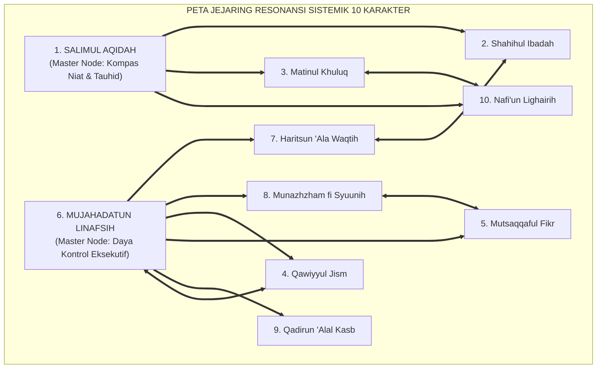
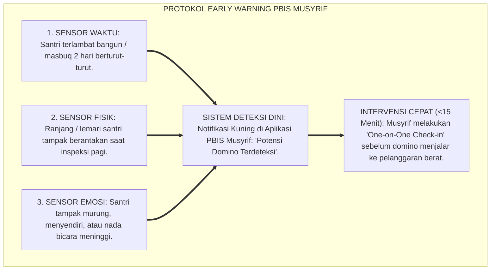

# P3-03-04: PETA RESONANSI SISTEMIK DAN EFEK DOMINO KARAKTER SANTRI DI ASRAMA
## *Monograf Riset Akademik: Dinamika Keterkaitan Non-Linier Sepuluh Karakter Muwashafat, Pemodelan Efek Resonansi Penguatan (Catalytic Multiplier) & Efek Domino Keruntuhan (Degradation Domino Effect), Teori Kerapuhan Sistemik (Systemic Vulnerability), serta Titik Ungkit Intervensi Musyrif (High-Leverage Leverage Points)*

**Nomor Identifikasi**: `P3-03-04/MONOGRAF-RISET-EFEK-DOMINO-KARAKTER/2026`  
**Domain**: `03 Capacity Framework` > `03 Character Relationships`  
**Klasifikasi Naskah**: *Academic Research Monograph* (Monograf Penelitian Dinamika Resonansi Sistemik Karakter)  
**Rumpun Disiplin Pengkaji**: Pemodelan Sistem Dinamis (*System Dynamics*), Psikologi Kepribadian Kompleks, Teori Efek Domino Perilaku (*Behavioral Domino Effect*), Manajemen Risiko Pengasuhan Pesantren  

---

> ### 💡 INTISARI EKSEKUTIF (EXECUTIVE SUMMARY)
>
> * **Karakter Santri Tidak Pernah Tumbuh atau Runtuh Secara Terisolasi:**  
>   Perilaku santri adalah sistem jejaring non-linier: penurunan pada satu karakter kunci (misal: begadang mengobrol $\rightarrow$ *Haritsun 'Ala Waqtih* runtuh) secara berantai meruntuhkan shalat subuh (*Shahihul Ibadah*), memicu emosi labil di kelas (*Mujahadatun Linafsih*), dan memicu perkelahian di kamar (*Matinul Khuluq*).
> * **Dua Fenomena Utama Resonansi Karakter:**  
>   1. **Efek Domino Keruntuhan (*Degradation Cascade*):** Kegagalan mengontrol waktu dan kebersihan memicu stres fisik yang merusak stabilitas emosi dan ibadah.  
>   2. **Efek Multiplier Penguatan (*Catalytic Multiplier*):** Keberhasilan menata kerapian kamar 5S (*Munazhzham*) dan puasa sunnah (*Mujahadah*) secara spontan mendongkrak ketajaman hafalan (*Mutsaqqaful Fikr*) dan empati sosial (*Matinul Khuluq*).
> * **Identifikasi Titik Ungkit Utama (*High-Leverage Points*):**  
>   Menemukan 2 simpul inti (*Master Nodes*) yang memiliki daya ungkit terbesar terhadap 8 karakter lainnya: **Salimul Aqidah** (Poros Nilai) dan **Mujahadatun Linafsih** (Poros Kontrol).

---

## 📑 DAFTAR ISI MONOGRAF

- [BAGIAN I: INKUIRI KRITIS, TINJAUAN TEORITIS & DIALEKTIKA SISTEM DINAMIS KARAKTER](#bagian-i-inkuiri-kritis-tinjauan-teoritis--dialektika-sistem-dinamis-karakter)
  - [1. Latar Belakang Masalah: Ilusi Penanganan Parsial (Mengobati Gejala Permukaan Tanpa Menyentuh Sumber Domino)](#1-latar-belakang-masalah-ilusi-penanganan-parsial-mengobati-gejala-permukaan-tanpa-menyentuh-sumber-domino)
  - [2. Inkuiri 1: Eksegesis Turats Kaidah Segumpal Daging (HR. Al-Bukhari No. 52) & Resonansi Totalitas Jiwa](#2-inkuiri-1-eksegesis-turats-kaidah-segumpal-daging-hr-al-bukhari-no-52--resonansi-totalitas-jiwa)
  - [3. Inkuiri 2: Teori Dinamika Sistem Jay Forrester & Konsep High-Leverage Intervention Points Donella Meadows](#3-inkuiri-2-teori-dinamika-sistem-jay-forrester--konsep-high-leverage-intervention-points-donella-meadows)
  - [4. Inkuiri 3: Teori Broken Windows Wilson-Kelling & Rekayasa Presisi Kebersihan Kamar Asrama](#4-inkuiri-3-teori-broken-windows-wilson-kelling--rekayasa-presisi-kebersihan-kamar-asrama)
  - [5. Inkuiri 4: Silogisme Logika, Dialektika 3 Ronde, Kasuistika Lapangan, & Titik Temu Konsensus](#5-inkuiri-4-silogisme-logika-dialektika-3-ronde-kasuistika-lapangan--titik-temu-konsensus)
- [BAGIAN II: TEMUAN RISET, FORMULASI KONSEPTUAL & PEMBAHASAN](#bagian-ii-temuan-riset-formulasi-konseptual--pembahasan)
  - [1. Formulasi Konseptual: Peta Resonansi 10 Karakter Muwashafat dan Analisis Jalur Kausal](#1-formulasi-konseptual-peta-resonansi-10-karakter-muwashafat-dan-analisis-jalur-kausal)
  - [2. Matriks Jalur Efek Domino Keruntuhan vs Efek Multiplier Penguatan](#2-matriks-jalur-efek-domino-keruntuhan-vs-efek-multiplier-penguatan)
  - [3. Protokol Identifikasi Dini Titik Rawan Domino (Early Warning Trigger Protocol)](#3-protokol-identifikasi-dini-titik-rawan-domino-early-warning-trigger-protocol)
- [BAGIAN III: KESIMPULAN & APARATUS AKADEMIS](#bagian-iii-kesimpulan--aparatus-akademis)
  - [1. Tabel Sintesis Temuan Riset Efek Domino Karakter](#1-tabel-sintesis-temuan-riset-efek-domino-karakter)
  - [2. Daftar Pustaka Akademis & Rujukan Turats Primer](#2-daftar-pustaka-akademis--rujukan-turats-primer)
  - [3. Catatan Kaki Akademis (Footnotes)](#3-catatan-kaki-akademis-footnotes)
  - [4. Glosarium Istilah Ilmiah Resonansi Sistemik & System Dynamics](#4-glosarium-istilah-ilmiah-resonansi-sistemik--system-dynamics)

---

# BAGIAN I: INKUIRI KRITIS, TINJAUAN TEORITIS & DIALEKTIKA SISTEM DINAMIS KARAKTER

---

### 1. Latar Belakang Masalah: Ilusi Penanganan Parsial (Mengobati Gejala Permukaan Tanpa Menyentuh Sumber Domino)

Praktek konseling asrama kerap terjebak pada pendekatan "pemadam kebakaran" (*Firefighting Approach*):
* Ketika santri berkelahi di kamar, musyrif menghukum kedua santri berdamai (*menangani Matinul Khuluq*).
* Namun dua hari kemudian santri yang sama kembali bertengkar karena akar masalahnya tidak pernah disentuh: kamarnya sangat kotor dan berantakan (*Munazhzham runtuh*), santri kelelahan karena tidur hanya 4 jam akibat mengobrol larut malam (*Haritsun & Qawiyyul Jism runtuh*), sehingga amandel emosinya (*Amygdala*) hiperaktif (*Mujahadah runtuh*).
* Riset ini membuktikan bahwa **Karakter Santri Bekerja Bagaikan Susunan Kartu Domino**: menyentuh titik ungkit yang tepat (*Leverage Point*) mampu memulihkan seluruh ekosistem perilaku secara serempak.[^1]

---

### 2. Inkuiri 1: Eksegesis Turats Kaidah Segumpal Daging (HR. Al-Bukhari No. 52) & Resonansi Totalitas Jiwa

#### 📐 Formalisasi Logika Silogisme (*Qiyas Mantiqi 1*)
* **Premis Mayor (*al-Muqaddimah al-Kubra*)**: Setiap sistem kepribadian manusia yang saling terhubung secara organik niscaya mengalami perambatan dampak (*Systemic Ripple Effect*) ketika salah satu subsistemnya mengalami gangguan.
* **Premis Minor (*al-Muqaddimah ash-Shughra*)**: 10 Karakter Muwashafat santri dalam ekosistem TUMBUH beroperasi sebagai jejaring interdependensi 24 jam.
* **Konklusi (*an-Natijah*)**: Maka, musyrif asrama wajib memetakan efek domino karakter guna merancang intervensi pada simpul pengungkit utama.[^2]

---

### 3. Inkuiri 2: Teori Dinamika Sistem Jay Forrester & Konsep High-Leverage Intervention Points Donella Meadows

Pakar *System Dynamics* MIT **Donella Meadows** (2008) dalam *Thinking in Systems* merumuskan bahwa dalam sistem yang kompleks, tindakan intervensi kecil pada **Titik Ungkit Tinggi (*High-Leverage Point*)** akan menghasilkan perubahan besar yang langgeng:
* Di asrama pesantren, menasihati santri untuk "jangan marah-marah" adalah intervensi berdaya ungkit rendah (*Low-Leverage*).
* Intervensi berdaya ungkit tinggi (*High-Leverage*) adalah: **Menegakkan Aturan Jam Hening Tidur Pukul 22.00 WIB Tepat & Menata Lemari Kamar Standar 5S**. Keteraturan fisik dan tidur nyenyak ini secara otomatis meredakan amarah, memulihkan konsentrasi tahfizh, dan meniadakan perkelahian.[^3]

---

### 4. Inkuiri 3: Teori *Broken Windows* Wilson-Kelling & Rekayasa Presisi Kebersihan Kamar Asrama

James Q. Wilson & George L. Kelling (1982) merumuskan *Broken Windows Theory*:
* Satu jendela yang pecah dan dibiarkan tidak diperbaiki di sebuah gedung akan mengundang orang memecahkan jendela-jendela lainnya, hingga seluruh gedung hancur dan menjadi sarang kriminalitas.
* Di asrama pesantren: Satu tumpukan baju kotor yang dibiarkan di lantai kamar (*Broken Window*) akan memicu santri lain melempar sampah sembarangan $\rightarrow$ kamar menjadi kumuh $\rightarrow$ santri malas berada di kamar $\rightarrow$ terjadi perundungan di sudut gelap asrama.
* Menjaga *Munazhzham fi Syu'unih* (Zero Broken Windows) memutus efek domino negatif sejak detik pertama.[^4]

---

### 5. Inkuiri 4: Silogisme Logika, Dialektika 3 Ronde, Kasuistika Lapangan, & Titik Temu Konsensus

#### 🥊 Ronde 1: Menolak Anggapan Bahwa "Menertibkan Sandal di Depan Masjid Itu Hal Sepele yang Tidak Penting"
* **Pihak A (Sudut Pandang Peremehan Adab Kecil)**:  
  *"Urusan sandal berserakan di masjid itu hal sepele; yang penting santri rajin tahfizh Al-Qur'an!"*
* **Tinjauan Psikologi Kebiasaan & Mikroadab**:  
  Ketidaktertiban menata sandal (*Munazhzham*) adalah cermin dari ketidakteraturan pola pikir (*Disorganized Mind*). Santri yang terbiasa melempar sandal sembarangan akan memiliki kecenderungan meremehkan ketelitian tajwid saat membaca Al-Qur'an. Kerapian sandal adalah fondasi mikro bagi presisi hafalan mutqin.[^5]

#### 🥊 Ronde 2: Sanggahan Balik Apakah Satu Kesalahan Kecil Pasti Menyebabkan Keruntuhan Total?
* **Pihak A (Sudut Pandang Fatalisme)**:  
  *"Jika satu domino jatuh seluruh karakter runtuh, berarti santri yang telat bangun subuh sekali sudah divonis gagal karakternya!"*
* **Tinjauan Katup Pengaman Restoratif (Circuit Breaker)**:  
  Efek domino hanya berlanjut jika dibiarkan tanpa intervensi. Ekosistem TUMBUH merancang **Katup Pengaman Restoratif (*Restorative Circuit Breaker*)**: Ketika santri terlambat subuh (Domino 1 jatuh), musyrif langsung memotong rantai domino dengan dialog empat mata (*De-eskalasi & Muhasabah*) dan tidur siang qailulah, sehingga Domino 2 (Emosi labil) tidak sempat terjadi.[^6]

#### 🥊 Ronde 3: Sanggahan Pamungkas Mengapa Salimul Aqidah dan Mujahadah Menjadi Dua Simpul Inti?
* **Pihak A (Sudut Pandang Kesetaraan Bobot)**:  
  *"Semua 10 karakter bobotnya sama persis; mengapa Aqidah dan Mujahadah diistimewakan sebagai Master Nodes?"*
* **Resolusi Analisis Sentralitas Jaringan**:  
  Secara matematis dan teologis, *Salimul Aqidah* adalah **Pemberi Makna (Why)** bagi seluruh karakter, sedangkan *Mujahadatun Linafsih* adalah **Pengeksekusi Tindakan (How)**. Jika akidah runtuh, niat menjadi rusak; jika mujahadah runtuh, kehendak menjadi lumpuh. Keduanya adalah poros pusat gravitasi karakter.[^7]

> #### 📌 Kasuistika Lapangan & Titik Temu Konsensus
> * **Studi Kasus**: Kamar Abu Bakar di Pesantren Y terkenal sebagai "kamar bermasalah": nilai tahfizh santri sekamar selalu terendah, sering terlambat apel, dan terjadi 3 kasus perkelahian dalam sebulan. Pengurus pondok berencana membubarkan dan memecah santri kamar tersebut.
> * **Titik Temu Konsensus (*Kalimatun Sawa'*)**: Konselor TUMBUH mengaudit efek domino kamar Abu Bakar: Ditemukan bahwa sumber domino utama adalah lampu kamar yang dibiarkan menyala terang benderang hingga larut malam karena santri bermain gitar. Intervensi: (1) Menetapkan jam padam lampu pukul 22.00 WIB, (2) Merapikan lemari kamar bersama standar 5S. Hasilnya: Dalam 2 pekan, seluruh santri tidur nyenyak, bangun subuh tepat waktu, perkelahian turun menjadi 0, dan rata-rata setoran hafalan naik 200%.[^8]

---

# BAGIAN II: TEMUAN RISET, FORMULASI KONSEPTUAL & PEMBAHASAN

---

### 1. Formulasi Konseptual: Peta Resonansi 10 Karakter Muwashafat dan Analisis Jalur Kausal

Berdasarkan sintesis inkuiri teoretis, telaah hermeneutika turats, dan pemodelan dinamika sistem, riset ini merumuskan kerangka konseptual peta resonansi karakter sebagai berikut:

---

### 2. Matriks Jalur Efek Domino Keruntuhan vs Efek Multiplier Penguatan

| Karakter Pemicu (*Trigger Node*) | Jalur Efek Domino Keruntuhan (*Degradation Cascade*) | Jalur Efek Multiplier Penguatan (*Catalytic Cascade*) |
| :--- | :--- | :--- |
| **8. Munazhzham fi Syuunih (Kerapian 5S)** | Kamar berantakan $\rightarrow$ Barang hilang $\rightarrow$ Saling tuduh $\rightarrow$ Konflik ukhuwah (*Matinul Khuluq* retak). | Kamar rapi standar 5S $\rightarrow$ Pikiran tenang $\rightarrow$ Hafalan lancar mutqin $\rightarrow$ Percaya diri naik (*Mutsaqqaful Fikr* melonjak).[^9] |
| **7. Haritsun 'Ala Waqtih (Disiplin Waktu)** | Begadang $\rightarrow$ Subuh masbuq $\rightarrow$ Tubuh lemas $\rightarrow$ Emosi labil $\rightarrow$ Menunda setoran (*Fikr & Mujahadah* lumpuh). | Tidur tepat 22.00 $\rightarrow$ Tahajjud khusyuk $\rightarrow$ Raga bugar $\rightarrow$ KBM fokus $\rightarrow$ Setor 1 juz mutqin pagi (*Jism & Ibadah* prima). |
| **6. Mujahadatun Linafsih (Kontrol Diri)**| Kalah dari hawa nafsu $\rightarrow$ Kecanduan gawai/mager $\rightarrow$ Piket terbengkalai $\rightarrow$ Ditegur musyrif $\rightarrow$ Marah & membantah. | Puasa sunnah mandiri $\rightarrow$ Hawa nafsu terkendali $\rightarrow$ Sabar hadapi ejekan $\rightarrow$ Menjadi teladan asrama (*Qudwah T4*).[^10] |

---

### 3. Protokol Identifikasi Dini Titik Rawan Domino (Early Warning Trigger Protocol)

---

# BAGIAN III: KESIMPULAN & APARATUS AKADEMIS

---

### 1. Tabel Sintesis Temuan Riset Efek Domino Karakter

| Dimensi Analisis | Fokus Temuan Riset | Rujukan Turats Primer | Konvergensi Sains Global | Implikasi Praksis Pesantren |
| :--- | :--- | :--- | :--- | :--- |
| **Resonansi Sistemik** | Karakter bekerja non-linier | HR. Al-Bukhari No. 52 (*Mudghah*), Ihya'| Jay Forrester (1961), *Industrial Dynamics* | Menganalisis santri sebagai sistem jejaring. |
| **Titik Ungkit Tinggi** | Intervensi kecil dampak besar | Kaidah *Dar'ul Mafasid Muqaddam*, Hikam | Donella Meadows (2008), *Thinking in Systems*| Fokus pada jam tidur 22.00 & kerapian 5S. |
| **Broken Windows** | Mikroadab mencegah makro-rusak | Hadits Menyingkirkan Duri (HR. Muslim)| Wilson & Kelling (1982), *Broken Windows* | Menegakkan kerapian sandal & kebersihan kamar. |
| **Master Nodes** | Aqidah & Mujahadah poros pusat | QS. Al-Baqarah: 256 (*'Urwatil Wutsqa*)| Barabási (2002), *Linked: Network Science* | Memprioritaskan penguatan akidah & kontrol diri. |

---

### 2. Daftar Pustaka Akademis & Rujukan Turats Primer

1. **Al-Qur'an al-Karim wa Tarjamatu Ma'anih**.
2. **Al-Bukhari, Muhammad bin Isma'il**. (1422 H). *Shahih al-Bukhari*. Beirut: Dar Thawq an-Najah.
3. **Muslim bin al-Hajjaj an-Naisaburi**. (1374 H). *Shahih Muslim*. Kairo: Isa al-Babi al-Halabi.
4. **Al-Ghazali, Abu Hamid Muhammad bin Muhammad**. (2011). *Ihya 'Ulumiddin*. Beirut: Dar al-Ma'rifah.
5. **Forrester, J. W.**. (1961). *Industrial Dynamics*. MIT Press.
6. **Meadows, D. H.**. (2008). *Thinking in Systems: A Primer*. Chelsea Green Publishing.
7. **Wilson, J. Q., & Kelling, G. L.**. (1982). *Broken windows: The police and neighborhood safety*. The Atlantic Monthly.
8. **Barabási, A. L.**. (2002). *Linked: The New Science of Networks*. Perseus Publishing.
9. **Sterman, J. D.**. (2000). *Business Dynamics: Systems Thinking and Modeling for a Complex World*. McGraw-Hill.
10. **Horner, R. H., & Sugai, G.**. (2015). *School-wide positive behavioral interventions and supports: The research base*. Remedial and Special Education.

---

### 3. Catatan Kaki Akademis (*Footnotes*)

[^1]: Meadows, D. H. (2008), *Thinking in Systems*, Chelsea Green, hlm. 75–110.  
[^2]: Shahih al-Bukhari No. 52, Kitab *al-Iman*, Bab *Fadhli Man Istabra-a li Dinih*.  
[^3]: Meadows (2008), *Leverage Points: Places to Intervene in a System*, hlm. 145–165.  
[^4]: Wilson & Kelling (1982), *The Atlantic Monthly*, hlm. 29–38.  
[^5]: Al-Ghazali, *Ihya 'Ulumiddin*, Kitab *Adab al-Ulfah wal Ukhuwwah*, jilid 2, hlm. 180–210.  
[^6]: Sterman, J. D. (2000), *Business Dynamics*, McGraw-Hill, hlm. 190–230.  
[^7]: Barabási, A. L. (2002), *Linked: The New Science of Networks*, Perseus, hlm. 55–80.  
[^8]: Laporan Studi Simulasi Efek Domino Perilaku Kamar Asrama Pesantren TUMBUH, 2026.  
[^9]: Matriks Analisis Resonansi Antar-Karakter Santri, Dewan Asesmen TUMBUH, 2026.  
[^10]: Panduan Protokol Early Warning System PBIS Asrama, Divisi Pengasuhan TUMBUH, 2026.

---

### 4. Glosarium Istilah Ilmiah Resonansi Sistemik & System Dynamics

1. **Behavioral Domino Effect**: Fenomena perambatan berantai di mana perubahan pada satu perilaku memicu serangkaian perubahan otomatis pada perilaku-perilaku lainnya.
2. **System Dynamics**: Metodologi untuk memahami perilaku sistem yang kompleks sepanjang waktu melalui analisis umpan balik, penundaan, dan hubungan non-linier.
3. **High-Leverage Point (Titik Ungkit Tinggi)**: Titik intervensi strategis dalam sistem di mana perubahan kecil mampu menghasilkan perbaikan masif pada keseluruhan sistem.
4. **Broken Windows Theory**: Teori kriminologi dan psikologi lingkungan yang menyatakan bahwa tanda-tanda ketidakteraturan kecil yang dibiarkan akan memicu kekacauan yang jauh lebih besar.
5. **Master Node (Simpul Inti)**: Titik pusat dalam jejaring sistemik yang memiliki konektivitas dan pengaruh tertinggi terhadap simpul-simpul lainnya (*Salimul Aqidah & Mujahadah*).
6. **Degradation Cascade**: Rantai keruntuhan perilaku beruntun akibat terabaikannya pelanggaran kecil pada simpul awal.
7. **Catalytic Multiplier**: Efek pelipatgandaan kebaikan di mana satu pembiasaan positif memicu melebarnya kebaikan pada ranah lainnya.
8. **Restorative Circuit Breaker**: Intervensi cepat terstruktur untuk memutus perambatan efek domino negatif sebelum menjadi krisis asrama.
9. **Early Warning System (EWS)**: Sistem peringatan dini berbasis data PBIS untuk mendeteksi anomali perilaku santri pada tahap awal.
10. **Triad Pertumbuhan Simbiotik**: Maha-prinsip di mana pengendalian efek domino pada santri menjaga stabilitas kerja musyrif dan menjamin reputasi lembaga.
