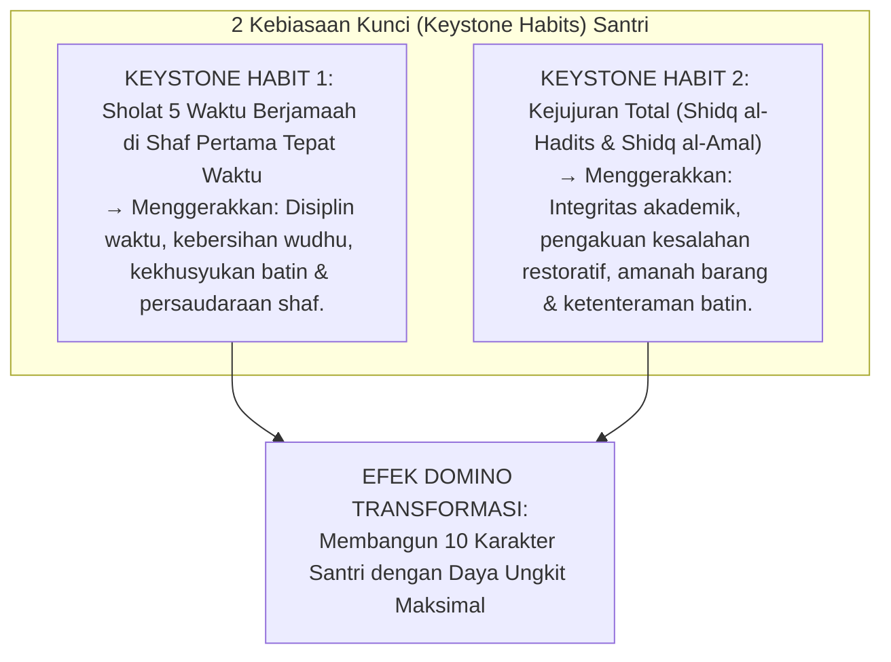

# P3-03-04-Peta-Resonansi-dan-Efek-Domino-Karakter

## Tujuan
Menerapkan konsep **Kebiasaan Kunci (*Keystone Habits - Charles Duhigg*)** dalam pembinaan karakter pesantren, mengidentifikasi 2 kebiasaan induk yang memiliki daya ungkit (*leverage power*) terbesar untuk memicu efek domino transformasi 10 karakter santri secara serempak.

---

## 1. 2 Kebiasaan Kunci Utama Pesantren TUMBUH

---

## 2. Analisis Efek Domino Lapangan

---

## 3. Strategi Pembinaan Berbasis Daya Ungkit

1. **Fokus Energi Musyrif pada Keystone Habits**:
   - Alih-alih menegur 50 jenis kesalahan kecil yang melelahkan, musyrif memusatkan 80% energi pendampingan pada kedisiplinan sholat berjamaah dan kejujuran santri.
2. **Kaidah Pengurangan Beban Intervensi**:
   - Ketika kebiasaan sholat dan kejujuran telah kokoh menjadi *Malakah*, 80% masalah pelanggaran asrama lainnya (kebersihan, keterlambatan kelas, perselisihan) akan terselesaikan secara otomatis (*Self-Correcting Ecosystem*).

---

## 4. Status Dokumen
* **Status**: 🌟 **A+ (Tervalidasi & Siap Diimplementasikan)**
* **Level**: Project 3 - `03 Capacity Framework / 03 Character Relationships`
* **Langkah Berikutnya**: **`P3-03-05-Sintesis-Character-Relationships-TUMBUH.md`**.
