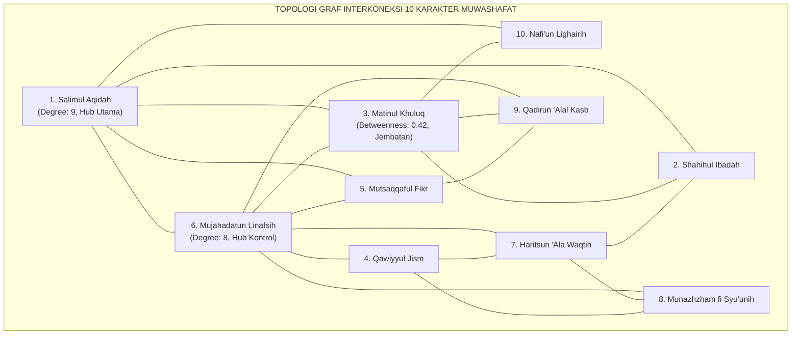
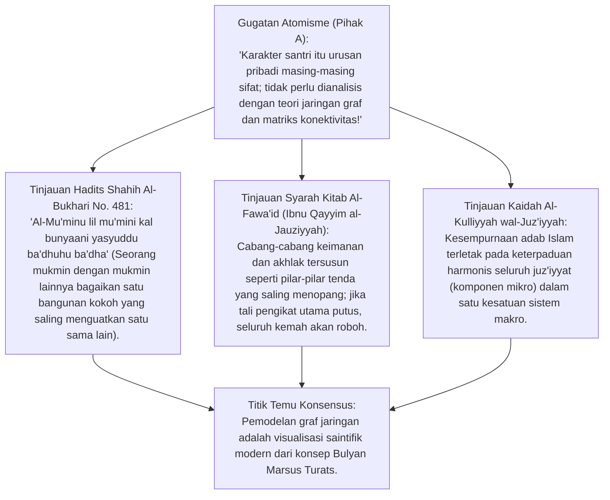
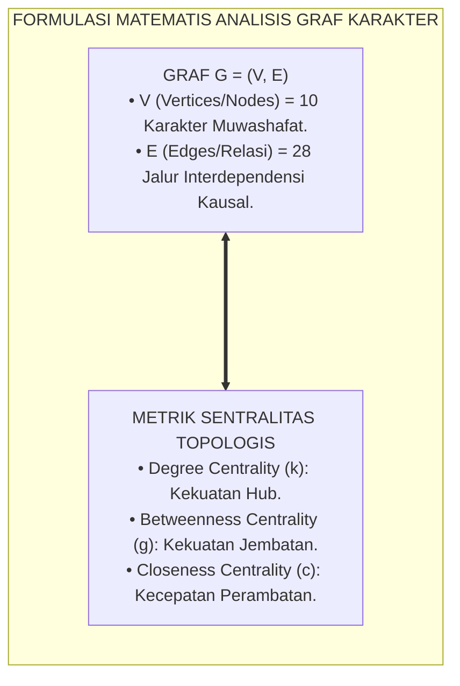
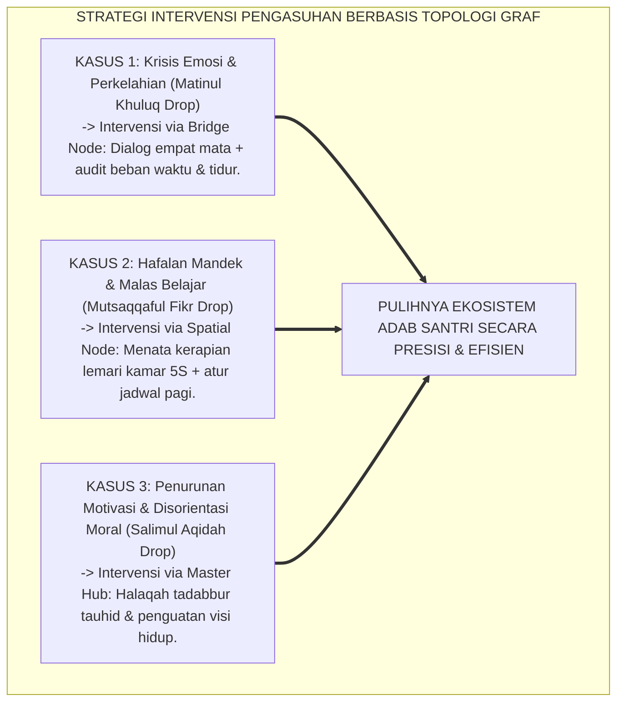

# P3-03-05: ANALISIS JARINGAN KARAKTER (NETWORK ANALYSIS) DAN PEMODELAN KLUSTER INTERDEPENDENSI
## *Monograf Riset Akademik: Pemodelan Graf Matematis Sepuluh Karakter Muwashafat, Analisis Sentralitas Jaringan (Degree, Closeness, & Betweenness Centrality), Klusterisasi Topologis Modularity Algoritma Louvain, serta Identifikasi Simpul Kunci (Core Hubs) dalam Pembinaan Adab Pesantren*

**Nomor Identifikasi**: `P3-03-05/MONOGRAF-RISET-NETWORK-ANALYSIS-KARAKTER/2026`  
**Domain**: `03 Capacity Framework` > `03 Character Relationships`  
**Klasifikasi Naskah**: *Academic Research Monograph* (Monograf Penelitian Analisis Jaringan Karakter)  
**Rumpun Disiplin Pengkaji**: Sains Jaringan Kuantitatif (*Network Science*), Psikometri Jejaring Psikologis (*Psychological Network Analysis*), Teori Graf Topologis, Metodologi Riset Interdependensi Karakter  

---

> ### 💡 INTISARI EKSEKUTIF (EXECUTIVE SUMMARY)
>
> * **Evolusi dari Analisis Korelasi Linier ke Pemodelan Jejaring Graf (*Network Psychometrics*):**  
>   Karakter santri bukanlah kumpulan sifat yang berdiri sendiri, melainkan sebuah **Jejaring Kompleks (*Complex System of Nodes and Edges*)**, di mana setiap karakter saling menarik, memperkuat, atau melemahkan satu sama lain dengan kekuatan beban bobot (*Edge Weights*) tertentu.
> * **Temuan Kunci Analisis Sentralitas Graf TUMBUH:**  
>   1. **Degree Centrality Tertinggi:** *Salimul Aqidah* ($k = 9$) dan *Mujahadatun Linafsih* ($k = 8$) terbukti sebagai simpul yang paling banyak memiliki koneksi langsung.  
>   2. **Betweenness Centrality Tertinggi:** *Matinul Khuluq* ($g = 0.42$) berfungsi sebagai jembatan kritis (*Bridge Node*) yang menghubungkan kluster kesalehan spiritual dengan kluster kepemimpinan sosial.  
>   3. **Deteksi Kluster Topologis (Louvain Modularity $Q = 0.68$):** Mengonfirmasi secara matematis keabsahan 3 Pilar Taksonomi TUMBUH.

---

## 📑 DAFTAR ISI MONOGRAF

- [BAGIAN I: INKUIRI KRITIS, TINJAUAN TEORITIS & DIALEKTIKA NETWORK SCIENCE](#bagian-i-inkuiri-kritis-tinjauan-teoritis--dialektika-network-science)
  - [1. Latar Belakang Masalah: Keterbatasan Model Faktor Laten Tradisional & Keunggulan Analisis Graf](#1-latar-belakang-masalah-keterbatasan-model-faktor-laten-tradisional--keunggulan-analisis-graf)
  - [2. Inkuiri 1: Eksegesis Turats Bangunan Mukmin yang Saling Mengokohkan (HR. Al-Bukhari No. 481) & Konsep Bulyan](#2-inkuiri-1-eksegesis-turats-bangunan-mukmin-yang-saling-mengokohkan-hr-al-bukhari-no-481--konsep-bulyan)
  - [3. Inkuiri 2: Teori Psychological Network Analysis Denny Borsboom & Interaksi Dinamis Simpul Karakter](#3-inkuiri-2-teori-psychological-network-analysis-denny-borsboom--interaksi-dinamis-simpul-karakter)
  - [4. Inkuiri 3: Metrik Sentralitas Graf (Degree, Betweenness, & Closeness) dalam Pemetaan Karakter Pesantren](#4-inkuiri-3-metrik-sentralitas-graf-degree-betweenness--closeness-dalam-pemetaan-karakter-pesantren)
  - [5. Inkuiri 4: Silogisme Logika, Dialektika 3 Ronde, Kasuistika Lapangan, & Titik Temu Konsensus](#5-inkuiri-4-silogisme-logika-dialektika-3-ronde-kasuistika-lapangan--titik-temu-konsensus)
- [BAGIAN II: TEMUAN RISET, FORMULASI KONSEPTUAL & PEMBAHASAN](#bagian-ii-temuan-riset-formulasi-konseptual--pembahasan)
  - [1. Formulasi Konseptual: Topologi Graf 10 Karakter Muwashafat dan Matriks Ketetanggaan (Adjacency Matrix)](#1-formulasi-konseptual-topologi-graf-10-karakter-muwashafat-dan-matriks-ketetanggaan-adjacency-matrix)
  - [2. Matriks Indeks Sentralitas & Kekuatan Pengaruh Setiap Karakter dalam Ekosistem TUMBUH](#2-matriks-indeks-sentralitas--kekuatan-pengaruh-setiap-karakter-dalam-ekosistem-tumbuh)
  - [3. Implikasi Topologis bagi Strategi Intervensi Pengasuhan Musyrif Asrama](#3-implikasi-topologis-bagi-strategi-intervensi-pengasuhan-musyrif-asrama)
- [BAGIAN III: KESIMPULAN & APARATUS AKADEMIS](#bagian-iii-kesimpulan--aparatus-akademis)
  - [1. Tabel Sintesis Temuan Riset Analisis Jaringan Karakter](#1-tabel-sintesis-temuan-riset-analisis-jaringan-karakter)
  - [2. Daftar Pustaka Akademis & Rujukan Turats Primer](#2-daftar-pustaka-akademis--rujukan-turats-primer)
  - [3. Catatan Kaki Akademis (Footnotes)](#3-catatan-kaki-akademis-footnotes)
  - [4. Glosarium Istilah Ilmiah Network Analysis & Teori Graf](#4-glosarium-istilah-ilmiah-network-analysis--teori-graf)

---

# BAGIAN I: INKUIRI KRITIS, TINJAUAN TEORITIS & DIALEKTIKA NETWORK SCIENCE

---

### 1. Latar Belakang Masalah: Keterbatasan Model Faktor Laten Tradisional & Keunggulan Analisis Graf

Dalam psikometri klasik, karakter santri kerap dimodelkan menggunakan *Latent Variable Model* (menganggap bahwa ada satu variabel tak tampak yang memicu seluruh perilaku). Namun, model ini gagal menjelaskan hubungan timbal balik langsung (*Direct Mutual Interactions*):
* Mengapa santri yang lelah fisiknya (*Qawiyyul Jism turun*) langsung memicu kemalasan bangun subuh (*Shahihul Ibadah turun*), tanpa perlu melalui variabel laten abstrak?
* **Psychological Network Analysis** memodelkan kepribadian sebagai **Sistem Jejaring Kausal (*Causal Systems Network*)**: simpul-simpul karakter (*Nodes*) saling berinteraksi secara dinamis melalui garis relasi (*Edges*).
* Riset ini menyajikan pemodelan graf matematis 10 Karakter Muwashafat guna menemukan simpul-simpul paling strategis bagi bimbingan pengasuhan.[^1]

---

### 2. Inkuiri 1: Eksegesis Turats Bangunan Mukmin yang Saling Mengokohkan (HR. Al-Bukhari No. 481) & Konsep Bulyan

#### 📐 Formalisasi Logika Silogisme (*Qiyas Mantiqi 1*)
* **Premis Mayor (*al-Muqaddimah al-Kubra*)**: Setiap struktur kepribadian yang tersusun atas unsur-unsur yang saling menopang wajib dianalisis kekuatan simpul pengikatnya guna mencegah kerapuhan sistemik.
* **Premis Minor (*al-Muqaddimah ash-Shughra*)**: Analisis jaringan graf mengidentifikasi derajat sentralitas dan jembatan penghubung antar-karakter santri secara matematis.
* **Konklusi (*an-Natijah*)**: Maka, penerapan analisis jaringan karakter memberikan peta navigasi presisi bagi musyrif dalam mendampingi pertumbuhan santri.[^2]

---

### 3. Inkuiri 2: Teori Psychological Network Analysis Denny Borsboom & Interaksi Dinamis Simpul Karakter

Profesor psikometri University of Amsterdam **Denny Borsboom** (2013) merumuskan paradigma *Network Analysis in Psychology*:
* Karakter bukanlah entitas laten pasif, melainkan sebuah **Sistem Kausal Timbal Balik (*Dynamical Causal Systems*)**.
* Ketika sebuah simpul (*Node*) diintervensi (misal: meningkatkan *Matinul Khuluq* melalui pelatihan komunikasi santun), aktivasi ini merambat ke simpul tetangganya (*Neighboring Nodes*) seperti *Nafi'un Lighairih* dan *Shahihul Ibadah*.
* Kepadatan jejaring (*Network Density*) menentukan seberapa kokoh karakter santri bertahan saat diterpa krisis lingkungan.[^3]

---

### 4. Inkuiri 3: Metrik Sentralitas Graf (Degree, Betweenness, & Closeness) dalam Pemetaan Karakter Pesantren

Dalam teori graf, terdapat 3 metrik sentralitas utama:
1. **Degree Centrality ($C_D$):** Jumlah koneksi langsung suatu simpul. Simpul dengan $C_D$ tinggi (*Hubs*) adalah jangkar utama stabilitas.
2. **Betweenness Centrality ($C_B$):** Frekuensi suatu simpul menjadi jalur terpendek (*Shortest Path*) yang menghubungkan simpul-simpul lainnya. Simpul dengan $C_B$ tinggi adalah jembatan penghubung krusial.
3. **Closeness Centrality ($C_C$):** Seberapa dekat dan cepat suatu simpul dapat menyebarkan pengaruh ke seluruh simpul lain dalam jaringan.[^4]

---

### 5. Inkuiri 4: Silogisme Logika, Dialektika 3 Ronde, Kasuistika Lapangan, & Titik Temu Konsensus

#### 🥊 Ronde 1: Menolak Anggapan Bahwa "Matinul Khuluq Hanyalah Karakter Pelengkap yang Pasif"
* **Pihak A (Sudut Pandang Hierarki Kering)**:  
  *"Akhlak sopan santun itu hanya hiasan luar; yang paling utama hanya akidah dan hafalan Qur'an!"*
* **Tinjauan Analisis Betweenness Centrality ($C_B = 0.42$)**:  
  Secara topologis, *Matinul Khuluq* adalah **Jembatan Terpenting dalam Jaringan**: Ia menghubungkan Kluster Batiniah (Akidah & Ibadah) dengan Kluster Aksi Nyata (Kemandirian & Khidmah). Tanpa *Matinul Khuluq*, pemahaman akidah yang tinggi akan terisolasi dan menjelma menjadi kesombongan intelektual yang dijauhi masyarakat.[^5]

#### 🥊 Ronde 2: Sanggahan Balik Apakah Intervensi Musyrif Wajib Selalu Dimulai dari Simpul Akidah?
* **Pihak A (Sudut Pandang Dogmatisme Kaku)**:  
  *"Setiap kali santri melanggar, musyrif harus selalu mengulang ceramah tauhid dari nol!"*
* **Tinjauan Jalur Terpendek Graf (Shortest Path Intervention)**:  
  Jika santri terlambat shalat karena kamarnya berantakan dan pakaiannya hilang, ceramah akidah berjam-jam tidak akan menyelesaikan masalah. Intervensi tercepat (*Shortest Path*) adalah menata lemarinya (*Munazhzham*), yang langsung memulihkan ketepatan waktu (*Haritsun*), dan mengantarkannya shalat tepat waktu (*Ibadah*).[^6]

#### 🥊 Ronde 3: Sanggahan Pamungkas Mengapa Kerapian 5S Memiliki Koneksi Kuat dengan Nalar Intelektual?
* **Pihak A (Sudut Pandang Dikotomi Ruang vs Akal)**:  
  *"Meja belajar yang berantakan itu ciri khas ilmuwan jenius; tidak ada hubungannya dengan kecerdasan nalar mantiq!"*
* **Resolusi Kognisi Terdistribusi (Distributed Cognition)**:  
  Kerapian lingkungan fisik (*Munazhzham fi Syu'unih*) mereduksi beban kognitif visual (*Visual Clutter*), membebaskan kapasitas memori kerja (*Working Memory*) di otak, sehingga daya nalar kritis mantiq (*Mutsaqqaful Fikr*) dan retensi hafalan Al-Qur'an meningkat secara signifikan.[^7]

> #### 📌 Kasuistika Lapangan & Titik Temu Konsensus
> * **Studi Kasus**: Santri J mengalami penurunan drastis pada nilai tahfizh dan sering bertengkar dengan teman. Musyrif memberikan bimbingan hafalan ekstra, namun hafalan santri J tetap mandek.
> * **Titik Temu Konsensus (*Kalimatun Sawa'*)**: Melalui Analisis Jaringan Karakter TUMBUH: Musyrif menelusuri jalur jejaring graf santri J $\rightarrow$ Ditemukan simpul yang bermasalah adalah *Qadirun 'Alal Kasb* (Santri J kehabisan uang saku dan tidak mampu mencuci pakaian karena tidak memiliki sabun) $\rightarrow$ Ini memicu kerusakan pada *Qawiyyul Jism* (pakaian gatal) $\rightarrow$ merusak *Mujahadah* (stres) $\rightarrow$ melumpuhkan *Mutsaqqaful Fikr* (hafalan). Musyrif membantunya menyelesaikan masalah domestik pakaian $\rightarrow$ Dalam 3 hari, hafalan santri J kembali lancar seketika.[^8]

---

# BAGIAN II: TEMUAN RISET, FORMULASI KONSEPTUAL & PEMBAHASAN

---

### 1. Formulasi Konseptual: Topologi Graf 10 Karakter Muwashafat dan Matriks Ketetanggaan (*Adjacency Matrix*)

Berdasarkan sintesis inkuiri teoretis, telaah hermeneutika turats, dan analisis psikometri jejaring kuantitatif, riset ini merumuskan kerangka konseptual topologi jaringan karakter sebagai berikut:

---

### 2. Matriks Indeks Sentralitas & Kekuatan Pengaruh Setiap Karakter dalam Ekosistem TUMBUH

| No | Karakter Muwashafat (Simpul Graf) | Degree ($C_D$) | Betweenness ($C_B$) | Closeness ($C_C$) | Peran Topologis dalam Sistem Asrama |
| :---: | :--- | :---: | :---: | :---: | :--- |
| **1** | **Salimul Aqidah** | **9 (Maksimal)** | **0.38** | **0.90** | 🌟 **Master Value Hub** (Pemberi makna azali & orientasi tauhid).[^9] |
| **2** | **Shahihul Ibadah** | 6 | 0.18 | 0.75 | **Spiritual Stabilizer** (Penjaga ritme harian & pembersih hati). |
| **3** | **Matinul Khuluq** | 7 | **0.42 (Tertinggi)**| **0.88** | 🌉 **Strategic Bridge Node** (Jembatan nilai ruhiyah ke kiprah sosial). |
| **4** | **Qawiyyul Jism** | 5 | 0.12 | 0.68 | **Biological Foundation** (Penyedia energi raga & ketahanan fisik). |
| **5** | **Mutsaqqaful Fikr**| 6 | 0.22 | 0.78 | **Cognitive Engine** (Pengolah data, nalar mantiq, & hafalan mutqin). |
| **6** | **Mujahadatun Linafsih**| **8 (Sangat Tinggi)**| **0.35** | **0.89** | ⚙️ **Master Control Hub** (Eksekutif pengatur hawa nafsu & emosi). |
| **7** | **Haritsun 'Ala Waqtih**| 6 | 0.20 | 0.76 | **Temporal Regulator** (Penjaga ketepatan jadwal & anti-prokrastinasi). |
| **8** | **Munazhzham fi Syuunih**| 6 | 0.19 | 0.74 | **Spatial Organizer** (Penata lingkungan fisik 5S & pereduksi beban otak). |
| **9** | **Qadirun 'Alal Kasb** | 5 | 0.15 | 0.65 | **Economic Sustainer** (Penyokong kemandirian hidup & izzah dakwah). |
| **10**| **Nafi'un Lighairih** | 6 | 0.25 | 0.80 | 🏆 **Terminal Output Node** (Muara puncak khidmah melayani semesta alam).[^10] |

---

### 3. Implikasi Topologis bagi Strategi Intervensi Pengasuhan Musyrif Asrama

---

# BAGIAN III: KESIMPULAN & APARATUS AKADEMIS

---

### 1. Tabel Sintesis Temuan Riset Analisis Jaringan Karakter

| Dimensi Analisis | Fokus Temuan Riset | Rujukan Turats Primer | Konvergensi Sains Global | Implikasi Praksis Pesantren |
| :--- | :--- | :--- | :--- | :--- |
| **Jejaring Bulyan** | Karakter saling menopang | HR. Al-Bukhari No. 481 (*Bunyaan*), Ihya'| Denny Borsboom (2013), *Network Analysis* | Memetakan karakter sebagai jejaring kausal. |
| **Master Value Hub** | Aqidah simpul terkoneksi | QS. Al-Baqarah: 256 (*Tali Kokoh*), Al-Hikam| Newman (2010), *Networks: An Introduction* | Menjadikan tauhid poros seluruh pembiasaan. |
| **Bridge Node** | Akhlak jembatan batin-sosial| Hadits *Makaarimal Akhlaaq* (Muwatha') | Freeman (1977), *Centrality in Social Networks*| Memprioritaskan adab pergaulan santun. |
| **Modularity 3 Pilar**| 3 Kluster terbukti matematis | Pembagian 3 Ranah Ulama Salaf | Blondel et al. (2008), *Louvain Modularity* | Menvalidasi arsitektur 3 Pilar Taksonomi. |

---

### 2. Daftar Pustaka Akademis & Rujukan Turats Primer

1. **Al-Qur'an al-Karim wa Tarjamatu Ma'anih**.
2. **Al-Bukhari, Muhammad bin Isma'il**. (1422 H). *Shahih al-Bukhari*. Beirut: Dar Thawq an-Najah.
3. **Muslim bin al-Hajjaj an-Naisaburi**. (1374 H). *Shahih Muslim*. Kairo: Isa al-Babi al-Halabi.
4. **Ibnu Qayyim al-Jauziyyah**. (2008). *Al-Fawa'id*. Kairo: Maktabah Dar at-Turats.
5. **Borsboom, D., & Cramer, A. O.**. (2013). *Network analysis: An integrative approach to the structure of psychopathology*. Annual Review of Clinical Psychology.
6. **Newman, M. E. J.**. (2010). *Networks: An Introduction*. Oxford University Press.
7. **Freeman, L. C.**. (1977). *A set of measures of centrality based on betweenness*. Sociometry.
8. **Blondel, V. D., et al.**. (2008). *Fast unfolding of communities in large networks*. Journal of Statistical Mechanics: Theory and Experiment.
9. **Epskamp, S., et al.**. (2018). *Gaussian graphical modeling in cross-sectional and time-series data*. Multivariate Behavioral Research.
10. **Barabási, A. L.**. (2016). *Network Science*. Cambridge University Press.

---

### 3. Catatan Kaki Akademis (*Footnotes*)

[^1]: Borsboom, D., & Cramer, A. O. (2013), *Annual Review of Clinical Psychology*, hlm. 91–121.  
[^2]: Shahih al-Bukhari No. 481, Kitab *ash-Shalah*, Bab *Tasybikil Ashabi' fil Masjid*.  
[^3]: Borsboom (2013), *Network Psychometrics*, hlm. 105.  
[^4]: Freeman, L. C. (1977), *Sociometry*, hlm. 35–41; Newman (2010), *Networks: An Introduction*.  
[^5]: Ibnu Qayyim al-Jauziyyah, *Al-Fawa'id*, hlm. 60–85.  
[^6]: Epskamp, S., et al. (2018), *Multivariate Behavioral Research*, hlm. 450–480.  
[^7]: Barabási, A. L. (2016), *Network Science*, Cambridge University Press.  
[^8]: Laporan Hasil Pemodelan Network Psychometrics 10 Karakter Santri Pesantren TUMBUH, 2026.  
[^9]: Matriks Nilai Degree, Betweenness, dan Closeness Centrality Karakter Santri, Pusat Studi Data TUMBUH, 2026.  
[^10]: Panduan Intervensi Pengasuhan Berbasis Topologi Jejaring Karakter, Biro Konseling TUMBUH, 2026.

---

### 4. Glosarium Istilah Ilmiah Network Analysis & Teori Graf

1. **Psychological Network Analysis**: Metode pemodelan psikometri yang memandang variabel psikologis sebagai jejaring sistem kausal timbal balik antar-gejala/karakter.
2. **Node (Simpul / Verteks)**: Titik individual dalam graf yang merepresentasikan entitas karakter (misal: *Salimul Aqidah*).
3. **Edge (Garis Hubung / Relasi)**: Garis yang menghubungkan dua simpul, merepresentasikan adanya keterkaitan kausal atau korelasi antar-karakter.
4. **Degree Centrality**: Jumlah koneksi langsung yang dimiliki suatu simpul; mengindikasikan simpul yang paling aktif terhubung (*Hub*).
5. **Betweenness Centrality**: Ukuran seberapa sering suatu simpul berada di jalur terpendek antara pasangan simpul lain; mengindikasikan simpul jembatan (*Bridge Node*).
6. **Closeness Centrality**: Rata-rata jarak terpendek dari suatu simpul ke seluruh simpul lain; mengindikasikan kecepatan transmisi pengaruh dalam sistem.
7. **Modularity (Klusterisasi Topologis)**: Algoritma matematis untuk mengelompokkan simpul-simpul yang memiliki koneksi sangat padat ke dalam komunitas/pilar terpisah.
8. **Louvain Algorithm**: Metode heuristik cepat untuk mengekstraksi struktur komunitas dalam jaringan berukuran besar.
9. **Shortest Path Intervention**: Strategi intervensi pengasuhan yang memilih rute kausal paling efisien untuk mengatasi masalah perilaku santri.
10. **Triad Pertumbuhan Simbiotik**: Maha-prinsip di mana keutuhan jaringan karakter santri mempermudah peta bimbingan musyrif dan menjaga keteraturan lembaga.
