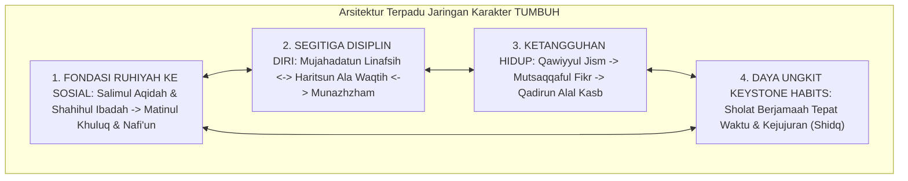

# P3-03-05-Sintesis-Character-Relationships-TUMBUH

## Tujuan
Menyintesiskan seluruh matriks keterhubungan, resonansi antar-karakter, dan efek domino kebiasaan kunci (*Character Relationships*) ke dalam satu arsitektur ekosistem karakter terpadu yang memandu kurikulum adab dan pengasuhan asrama 24 jam.

---

## 1. Arsitektur Sintesis Jaringan Karakter TUMBUH

---

## 2. Matriks Uji Konsistensi Jaringan Karakter

| Aspek Relasi | Mekanisme Kerja Lapangan | Dampak bagi Santri |
| :--- | :--- | :--- |
| **Akar ke Buah** | Tauhid & Ibadah melandasi akhlak santun & kepedulian sosial. | Santri berakhlak ikhlas, terhindar dari kesalehan semu / pencitraan. |
| **Sinergi Disiplin** | Regulasi nafsu menopang ketertiban waktu & kerapian kamar. | Santri mandiri, tenang, dan memiliki produktivitas belajar tinggi. |
| **Daya Ungkit Domino** | Menegakkan sholat jamaah & kejujuran sebagai fokus utama asrama. | 80% pelanggaran asrama menurun drastis secara alami tanpa paksaan. |

---

## 3. Status Dokumen
* **Status**: ✅ **SELESAI (Status Mutu: A+)**
* **Level**: Subproject Induk
* **Project**: `03 Capacity Framework`
* **Subproject**: `03 Character Relationships`
* **Langkah Berikutnya**: Melanjutkan ke sub-domain karakter spesifik pertama: **`04 Salimul Aqidah`**.
