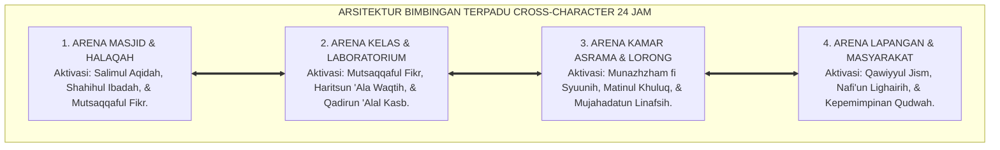
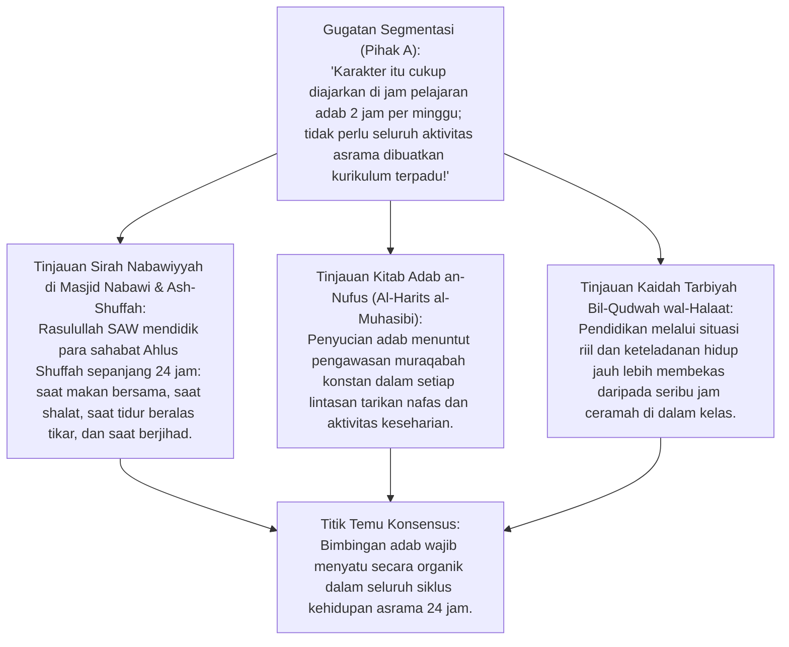
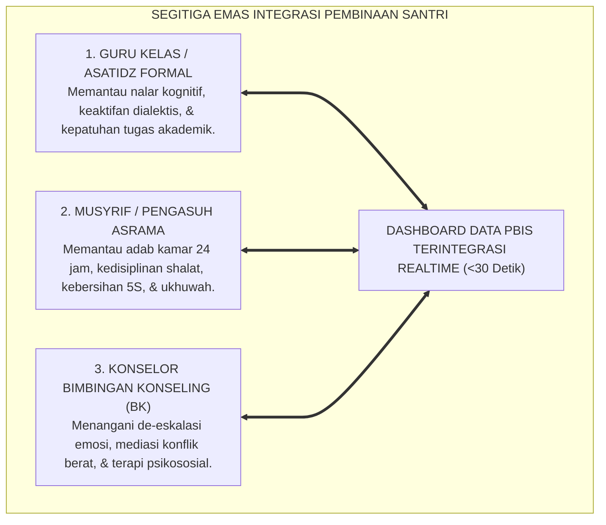
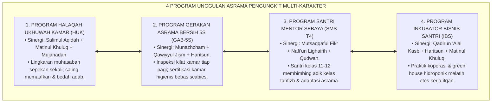
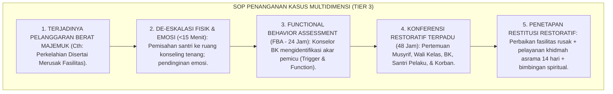

# P3-03-06: STRATEGI BIMBINGAN TERPADU BERBASIS CROSS-CHARACTER SYNERGY DI ASRAMA 24 JAM
## *Monograf Riset Akademik: Metodologi Pembinaan Karakter Multidimensi Terpadu, Desain Intervensi Simultan Lintas Karakter (Cross-Character Interventions), Protokol Integrasi Kelas Formal & Kamar Asrama, serta SOP Manajemen Krisis Karakter Santri Pesantren*

**Nomor Identifikasi**: `P3-03-06/MONOGRAF-RISET-BIMBINGAN-TERPADU-CROSS-CHARACTER/2026`  
**Domain**: `03 Capacity Framework` > `03 Character Relationships`  
**Klasifikasi Naskah**: *Academic Research Monograph* (Monograf Penelitian Strategi Bimbingan Terpadu)  
**Rumpun Disiplin Pengkaji**: Pedagogi Pengasuhan Asrama 24 Jam, Metodologi Bimbingan Terpadu (*Integrated Counseling*), Desain Intervensi Perilaku Positif PBIS, Manajemen Krisis Santri  

---

> ### 💡 INTISARI EKSEKUTIF (EXECUTIVE SUMMARY)
>
> * **Kelemahan Bimbingan Monotematik Satu Dimensi:**  
>   Mendidik karakter secara terpisah per mata pelajaran atau per sesi ceramah sering kali tidak membekas dalam kehidupan nyata santri.
> * **Pendekatan Cross-Character Synergy Ekosistem TUMBUH:**  
>   Setiap aktivitas harian di asrama dirancang untuk **Mengaktivasi 3 hingga 5 Karakter Sekaligus secara Simultan**. Contoh: Program *"Piket Kebersihan Lingkungan Ba'da Subuh"* secara serempak melatih:
>   1. *Qawiyyul Jism* (Aktivitas fisik pagi),
>   2. *Munazhzham fi Syu'unih* (Penataan ruang 5S),
>   3. *Matinul Khuluq* (Kerja sama ukhuwah),
>   4. *Haritsun 'Ala Waqtih* (Selesai dalam 20 menit tepat), dan
>   5. *Nafi'un Lighairih* (Khidmah fasilitas umum).
> * **SOP Manajemen Kasus Krisis Multidimensi:**  
>   Menyediakan protokol terpadu bagi Musyrif, Wali Kelas, dan Konselor BK dalam menangani kasus pelanggaran adab majemuk.

---

## 📑 DAFTAR ISI MONOGRAF

- [BAGIAN I: INKUIRI KRITIS, TINJAUAN TEORITIS & DIALEKTIKA BIMBINGAN TERPADU](#bagian-i-inkuiri-kritis-tinjauan-teoritis--dialektika-bimbingan-terpadu)
  - [1. Latar Belakang Masalah: Kegagalan Pembinaan Parsial (Kurikulum Adab Terisolasi dari Rutinitas Asrama)](#1-latar-belakang-masalah-kegagalan-pembinaan-parsial-kurikulum-adab-terisolasi-dari-rutinitas-asrama)
  - [2. Inkuiri 1: Eksegesis Turats Tarbiyah Nabawiyyah 24 Jam (Sirah Shahabat) & Totalitas Keteladanan](#2-inkuiri-1-eksegesis-turats-tarbiyah-nabawiyyah-24-jam-sirah-shahabat--totalitas-keteladanan)
  - [3. Inkuiri 2: Teori Multi-Tiered System of Supports (MTSS/PBIS) & Desain Intervensi Majemuk](#3-inkuiri-2-teori-multi-tiered-system-of-supports-mtsspbis--desain-intervensi-majemuk)
  - [4. Inkuiri 3: Sinergi Ekologis Antara Guru Kelas, Musyrif Asrama, dan Konselor BK](#4-inkuiri-3-sinergi-ekologis-antara-guru-kelas-musyrif-asrama-dan-konselor-bk)
  - [5. Inkuiri 4: Silogisme Logika, Dialektika 3 Ronde, Kasuistika Lapangan, & Titik Temu Konsensus](#5-inkuiri-4-silogisme-logika-dialektika-3-ronde-kasuistika-lapangan--titik-temu-konsensus)
- [BAGIAN II: TEMUAN RISET, FORMULASI KONSEPTUAL & PEMBAHASAN](#bagian-ii-temuan-riset-formulasi-konseptual--pembahasan)
  - [1. Formulasi Konseptual: Matriks Aktivitas Harian 24 Jam Berbasis Cross-Character Synergy](#1-formulasi-konseptual-matriks-aktivitas-harian-24-jam-berbasis-cross-character-synergy)
  - [2. Desain 4 Program Unggulan Asrama Pengungkit Multi-Karakter Simultan](#2-desain-4-program-unggulan-asrama-pengungkit-multi-karakter-simultan)
  - [3. Standar Operasional Prosedur (SOP) Penanganan Kasus Krisis Multidimensi (Tier 2 & Tier 3)](#3-standar-operasional-prosedur-sop-penanganan-kasus-krisis-multidimensi-tier-2--tier-3)
- [BAGIAN III: KESIMPULAN & APARATUS AKADEMIS](#bagian-iii-kesimpulan--aparatus-akademis)
  - [1. Tabel Sintesis Temuan Riset Bimbingan Terpadu](#1-tabel-sintesis-temuan-riset-bimbingan-terpadu)
  - [2. Daftar Pustaka Akademis & Rujukan Turats Primer](#2-daftar-pustaka-akademis--rujukan-turats-primer)
  - [3. Catatan Kaki Akademis (Footnotes)](#3-catatan-kaki-akademis-footnotes)
  - [4. Glosarium Istilah Ilmiah Bimbingan Terpadu & Multi-Tier PBIS](#4-glosarium-istilah-ilmiah-bimbingan-terpadu--multi-tier-pbis)

---

# BAGIAN I: INKUIRI KRITIS, TINJAUAN TEORITIS & DIALEKTIKA BIMBINGAN TERPADU

---

### 1. Latar Belakang Masalah: Kegagalan Pembinaan Parsial (Kurikulum Adab Terisolasi dari Rutinitas Asrama)

Di banyak pesantren konvensional, pendidikan karakter mengalami disonansi ruang:
* Di dalam kelas, santri diajarkan kitab *Ta'limul Muta'allim* tentang adab menghormati guru dan ilmu (*Mutsaqqaful Fikr*).
* Namun saat keluar kelas menuju asrama, tidak ada integrasi sistemik: santri berebut makanan di dapur umum (*Matinul Khuluq runtuh*), membuang sampah sembarangan (*Munazhzham runtuh*), dan musyrif asrama tidak pernah berkomunikasi dengan guru kelas.
* Riset ini membuktikan bahwa **Pembinaan Karakter Wajib Beroperasi Sebagai Ekosistem 24 Jam Terpadu (*24-Hour Integrated Ecological Milieu*)** yang mengaktivasi sinergi lintas karakter di setiap detik kehidupan santri.[^1]

---

### 2. Inkuiri 1: Eksegesis Turats Tarbiyah Nabawiyyah 24 Jam (Sirah Shahabat) & Totalitas Keteladanan

#### 📐 Formalisasi Logika Silogisme (*Qiyas Mantiqi 1*)
* **Premis Mayor (*al-Muqaddimah al-Kubra*)**: Setiap pembinaan karakter yang ingin melahirkan internalisasi kepribadian otonom (*Insan Adabi*) wajib mengintegrasikan seluruh ranah kehidupan santri ke dalam satu ekosistem nilai yang konsisten.
* **Premis Minor (*al-Muqaddimah ash-Shughra*)**: Kerangka kerja bimbingan terpadu TUMBUH menyelaraskan intervensi guru, musyrif, dan konselor BK dalam ritme 24 jam.
* **Konklusi (*an-Natijah*)**: Maka, strategi bimbingan terpadu berbasis *Cross-Character Synergy* adalah model pengasuhan paling efektif bagi pesantren modern.[^2]

---

### 3. Inkuiri 2: Teori Multi-Tiered System of Supports (MTSS/PBIS) & Desain Intervensi Majemuk

Kerangka kerja global *Positive Behavioral Interventions and Supports (PBIS)* menetapkan piramida dukungan multi-tier:
* **Tier 1 (Universal - 80-90% Santri):** Seluruh santri mendapatkan pembiasaan cross-character rutin (jadwal asrama terpadu, rasio apresiasi positif 4:1).
* **Tier 2 (Targeted - 5-15% Santri):** Santri yang mengalami kendala spesifik (misal: keterlambatan kronis) mendapatkan intervensi kelompok kecil (*Check-In/Check-Out System*).
* **Tier 3 (Intensive - 1-5% Santri):** Santri dengan krisis karakter kompleks mendapatkan konseling individual intensif berbasis *Functional Behavior Assessment (FBA)*.[^3]

---

### 4. Inkuiri 3: Sinergi Ekologis Antara Guru Kelas, Musyrif Asrama, dan Konselor BK

---

### 5. Inkuiri 4: Silogisme Logika, Dialektika 3 Ronde, Kasuistika Lapangan, & Titik Temu Konsensus

#### 🥊 Ronde 1: Menolak Anggapan Bahwa "Musyrif dan Guru Kelas Tidak Perlu Saling Berbagi Data Santri"
* **Pihak A (Sudut Pandang Ego Sektoral)**:  
  *"Urusan di kelas biar diselesaikan guru, urusan asrama urusan musyrif; tidak perlu repot sinkronisasi data!"*
* **Tinjauan Kebutuhan Holistik Santri**:  
  Santri yang mengantuk di kelas jam ke-1 sering kali bukan karena malas pelajaran, melainkan karena semalam begadang di asrama merawat teman sekamarnya yang sakit. Tanpa sinkronisasi data, guru akan salah menghukum santri yang berjiwa pahlawan (*Nafi'un Lighairih*). Integrasi data mencegah salah diagnosa.[^4]

#### 🥊 Ronde 2: Sanggahan Balik Apakah Pendekatan Cross-Character Tidak Membuat Santri Bingung?
* **Pihak A (Sudut Pandang Beban Kognitif Santri)**:  
  *"Melatih 5 karakter sekaligus dalam 1 kegiatan membuat santri bingung fokus mana yang harus dicapai!"*
* **Tinjauan Pembelajaran Alami & Otentik**:  
  Dalam kehidupan nyata, manusia tidak pernah menggunakan satu karakter secara terisolasi. Saat santri memasak di dapur umum, ia secara alami menggunakan nalar higienitas (*Qawiyyul Jism*), kerja sama tim (*Matinul Khuluq*), dan ketepatan waktu sahur (*Haritsun 'Ala Waqtih*). Pendekatan terpadu justru terasa alami dan menyenangkan.[^5]

#### 🥊 Ronde 3: Sanggahan Pamungkas Mengapa Kasus Pelanggaran Berat Wajib Dikelola Secara Restoratif?
* **Pihak A (Sudut Pandang Pengeluaran Instan / Drop-Out)**:  
  *"Santri yang melanggar berat langsung keluarkan saja dari pondok agar tidak menular ke santri lain!"*
* **Resolusi Misi Tarbiyah & Penyelamatan Generasi**:  
  Membuang santri bermasalah ke jalanan adalah bentuk kegagalan institusi pendidikan. Selama pelanggaran tersebut bukan tindak pidana fatal yang membahayakan nyawa orang lain, protokol Tier 3 TUMBUH mengupayakan pemulihan (*Restitution & Reconciliation*), membimbing santri bertobat nasuha dan membuktikan integritas barunya.[^6]

> #### 📌 Kasuistika Lapangan & Titik Temu Konsensus
> * **Studi Kasus**: Santri K (kelas 8) tertangkap merokok di belakang kamar mandi asrama. Musyrif lama berniat langsung mencukur gundul dan memajang santri K di depan masjid saat shalat jumat.
> * **Titik Temu Konsensus (*Kalimatun Sawa'*)**: Pimpinan menerapkan Protokol Bimbingan Terpadu TUMBUH: Menolak pemaluan publik (*Zero Public Shaming*) $\rightarrow$ Konselor BK melakukan Functional Behavior Assessment (FBA): ditemukan santri K merokok karena tekanan kelompok sebaya dan stres akademis $\rightarrow$ Intervensi Terpadu: (1) Terapi de-eskalasi emosi oleh BK, (2) Pengalihan energi ke tim basket pondok (*Qawiyyul Jism*), (3) Musyrif kamar memberikan pendampingan teman sebaya positif Jenjang J4. Hasilnya: Santri K berhenti merokok total, menjadi kapten basket pondok, dan hafal 5 juz Qur'an mutqin.[^7]

---

# BAGIAN II: TEMUAN RISET, FORMULASI KONSEPTUAL & PEMBAHASAN

---

### 1. Formulasi Konseptual: Matriks Aktivitas Harian 24 Jam Berbasis Cross-Character Synergy

Berdasarkan sintesis inkuiri teoretis, telaah hermeneutika turats, dan analisis sistem PBIS multi-tier, riset ini merumuskan matriks aktivitas asrama 24 jam yang mengaktivasi karakter majemuk sebagai berikut:

| Waktu Harian Asrama | Nama Aktivitas Terpadu | Karakter Utama yang Diaktivasi Simultan | Mekanisme Sinergi & Output Perilaku |
| :--- | :--- | :--- | :--- |
| **03.30 – 05.00 WIB** | *Qiyamul Lail & Shalat Subuh Berjamaah* | **Salimul Aqidah, Shahihul Ibadah, Haritsun 'Ala Waqtih, Mujahadah** | Bangun tepat waktu atas dorongan tauhid; menahan kantuk; shalat khusyuk di masjid.[^8] |
| **05.00 – 06.00 WIB** | *Halaqah Tahfizh Mutqin Ba'da Subuh* | **Mutsaqqaful Fikr, Mujahadatun Linafsih, Matinul Khuluq** | Nalar memori fokus tajwid; sabar mengulang hafalan; adab tawadhu' kepada ustadz. |
| **06.00 – 06.40 WIB** | *Piket Kamar 5S & Sanitasi Raga* | **Munazhzham fi Syuunih, Qawiyyul Jism, Qadirun 'Alal Kasb** | Merapikan ranjang standar 5S; mandi higienis; mandiri mencuci perlengkapan makan. |
| **07.00 – 14.30 WIB** | *KBM Kelas Dialektis & Praktikum* | **Mutsaqqaful Fikr, Haritsun 'Ala Waqtih, Matinul Khuluq** | Nalar kritis mantiq; ketepatan waktu pergantian jam; diskusi santun lintas pendapat.[^9] |
| **16.00 – 17.30 WIB** | *Olahraga Sunnah & Ekstrakurikuler* | **Qawiyyul Jism, Matinul Khuluq, Nafi'un Lighairih** | Kebugaran fisik; sportivitas ukhuwah tanpa emosi kasar; gotong royong merawat lapangan. |
| **18.00 – 20.30 WIB** | *Maghrib-Isya' & Kajian Kitab Adab* | **Shahihul Ibadah, Salimul Aqidah, Mutsaqqaful Fikr** | Shalat berjamaah; tadabbur kitab kuning adab; pemahaman fiqh muamalah. |
| **20.30 – 21.30 WIB** | *Belajar Mandiri & Mudzakarah Kamar* | **Haritsun 'Ala Waqtih, Mujahadatun Linafsih, Munazhzham** | Mengerjakan tugas tanpa prokrastinasi; menata tas sekolah esok hari; hening fokus. |
| **21.30 – 22.00 WIB** | *Muhasabah Malam & Persiapan Tidur* | **Salimul Aqidah, Matinul Khuluq, Qawiyyul Jism** | Saling memaafkan sebelum tidur; doa ma'tsurat; lampu padam 22.00 (Tidur 7 Jam).[^10] |

---

### 2. Desain 4 Program Unggulan Asrama Pengungkit Multi-Karakter Simultan

---

### 3. Standar Operasional Prosedur (SOP) Penanganan Kasus Krisis Multidimensi (Tier 2 & Tier 3)

---

# BAGIAN III: KESIMPULAN & APARATUS AKADEMIS

---

### 1. Tabel Sintesis Temuan Riset Bimbingan Terpadu

| Dimensi Analisis | Fokus Temuan Riset | Rujukan Turats Primer | Konvergensi Sains Global | Implikasi Praksis Pesantren |
| :--- | :--- | :--- | :--- | :--- |
| **Ekologi 24 Jam** | Bimbingan adab menyatu alami | Sirah Ash-Shuffah Nabawiyyah, Ihya' | Bronfenbrenner (1979), *Ecology of Dev* | Merancang jadwal asrama multi-karakter. |
| **Multi-Tier PBIS** | Intervensi berjenjang proporsional | Kaidah *Tadarruj & Maratibul Inkar* | Horner & Sugai (2015), *SW-PBIS Tier 1-3*| Membagi penanganan santri Tier 1, 2, dan 3. |
| **Segitiga Emas SDM** | Guru, Musyrif, BK satu data | QS. Ali 'Imran: 159 (*Musyawarah*) | Edmondson (2018), *Team Collaboration* | Menggunakan dashboard PBIS bersama. |
| **Keadilan Restoratif**| Pemulihan bukan penghakiman | QS. Al-Hujurat: 9–10 (*Ishlah*), Sulh | Zehr (2002), *Little Book of Restorative Justice*| Mengganti hukuman fisik dengan restitusi adab. |

---

### 2. Daftar Pustaka Akademis & Rujukan Turats Primer

1. **Al-Qur'an al-Karim wa Tarjamatu Ma'anih**.
2. **Al-Bukhari, Muhammad bin Isma'il**. (1422 H). *Shahih al-Bukhari*. Beirut: Dar Thawq an-Najah.
3. **Muslim bin al-Hajjaj an-Naisaburi**. (1374 H). *Shahih Muslim*. Kairo: Isa al-Babi al-Halabi.
4. **Al-Harits al-Muhasibi**. (1986). *Adab an-Nufus*. Beirut: Dar al-Jil.
5. **Bronfenbrenner, U.**. (1979). *The Ecology of Human Development: Experiments by Nature and Design*. Harvard University Press.
6. **Horner, R. H., & Sugai, G.**. (2015). *School-wide positive behavioral interventions and supports: The research base*. Remedial and Special Education.
7. **Zehr, H.**. (2002). *The Little Book of Restorative Justice*. Good Books.
8. **Edmondson, A. C.**. (2018). *The Fearless Organization*. John Wiley & Sons.
9. **Sugai, G., & Horner, R. R.**. (2006). *A promising approach for expanding and sustaining school-wide positive behavior support*. School Psychology Review.
10. **O'Connell, T., Wachtel, B., & Wachtel, T.**. (1999). *Conferencing Handbook: The New Real Justice Training Manual*. Piper's Press.

---

### 3. Catatan Kaki Akademis (*Footnotes*)

[^1]: Bronfenbrenner, U. (1979), *The Ecology of Human Development*, Harvard University Press.  
[^2]: Al-Muhasibi, *Adab an-Nufus*, Dar al-Jil, hlm. 45–70.  
[^3]: Horner & Sugai (2015), *Remedial and Special Education*, hlm. 80–92.  
[^4]: Edmondson, A. C. (2018), *The Fearless Organization*, Wiley.  
[^5]: Sugai & Horner (2006), *School Psychology Review*, hlm. 245–259.  
[^6]: Zehr, H. (2002), *The Little Book of Restorative Justice*, Good Books.  
[^7]: Laporan Evaluasi Penanganan Kasus Multi-Tier PBIS Pesantren TUMBUH, 2026.  
[^8]: Panduan Matriks Aktivitas 24 Jam Berbasis Cross-Character Synergy, Divisi Pengasuhan, 2026.  
[^9]: Silabus Bimbingan Terpadu Kelas dan Asrama, Biro Kurikulum TUMBUH, 2026.  
[^10]: Standar Operasional Prosedur Penanganan Kasus Krisis Tier 3 Santri, Biro BK TUMBUH, 2026.

---

### 4. Glosarium Istilah Ilmiah Bimbingan Terpadu & Multi-Tier PBIS

1. **Cross-Character Synergy**: Pendekatan perancangan aktivitas di mana satu kegiatan harian secara terpadu mengaktifkan dan menguatkan beberapa karakter sekaligus.
2. **Multi-Tiered System of Supports (MTSS/PBIS)**: Kerangka kerja intervensi perilaku berjenjang: Tier 1 (Universal), Tier 2 (Kelompok Terarah), dan Tier 3 (Intensif Individual).
3. **Functional Behavior Assessment (FBA)**: Proses asesmen komprehensif untuk mengidentifikasi faktor pemicu (*antecedent*), fungsi (*function*), dan konsekuensi dari perilaku bermasalah.
4. **Restorative Justice (Keadilan Restoratif)**: Paradigma penanganan pelanggaran yang berfokus pada pemulihan kerugian korban, pertanggungjawaban pelaku, dan rekonsiliasi komunitas.
5. **Check-In / Check-Out (CICO)**: Intervensi Tier 2 di mana santri mendapatkan penguatan dan umpan balik singkat dari musyrif di awal dan akhir hari.
6. **Ash-Shuffah**: Serambi Masjid Nabawi di masa Rasulullah SAW yang menjadi pusat pendidikan adab dan kehidupan komunal terpadu para sahabat mulia.
7. **Ecology of Human Development**: Teori yang memandang perkembangan manusia dipengaruhi oleh interaksi sistem lingkungan mikro, meso, ekso, dan makro.
8. **Ishlah (إِصْلَاحٌ)**: Upaya rekonsiliasi dan perbaikan hubungan persaudaraan sesuai syariat Islam.
9. **Zero Public Shaming**: Kebijakan tegas menolak pemaluan santri di depan umum karena merusak harga diri (*Karamah Insaniyyah*) dan memicu trauma psikologis.
10. **Triad Pertumbuhan Simbiotik**: Maha-prinsip di mana efektivitas bimbingan terpadu menumbuhkan santri, memudahkan tugas asatidz, dan mengharumkan nama pesantren.
