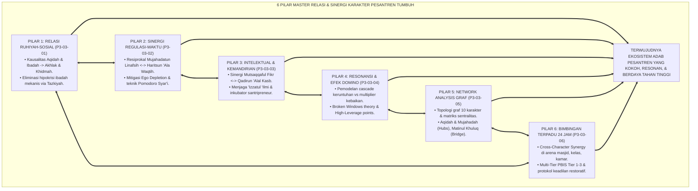
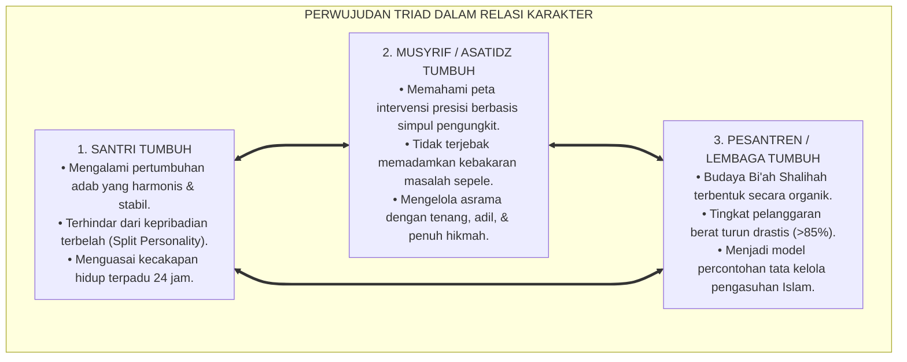
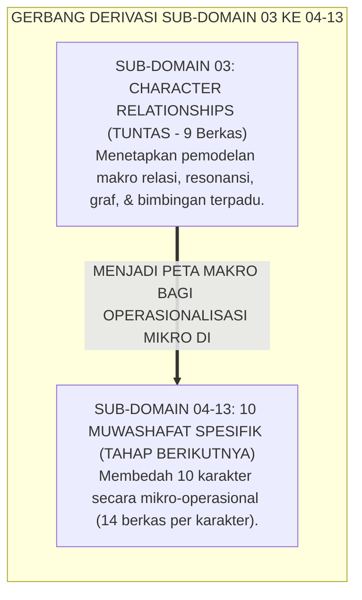
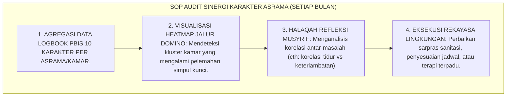
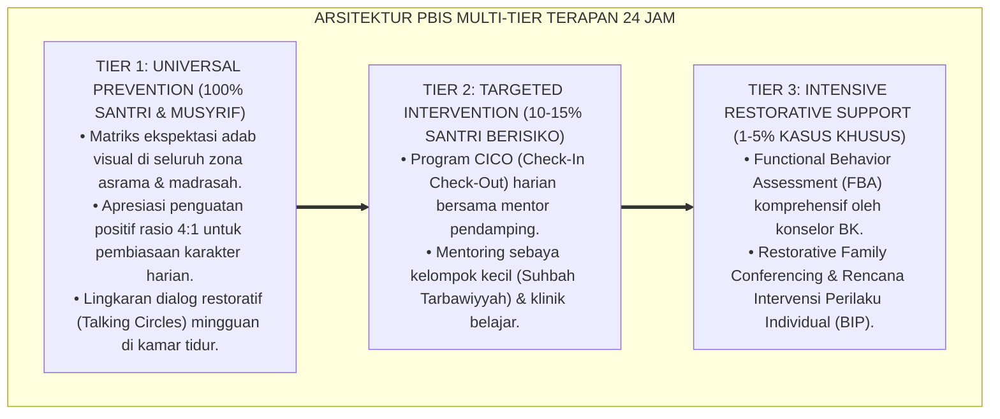

# P3-03-07: SINTESIS CHARACTER RELATIONSHIPS DAN MODEL INTEGRASI SISTEMIK
## *Monograf Riset Akademik: Sintesis Holistik 6 Pilar Relasi Karakter (Kausalitas Ruhiyah-Sosial, Sinergi Regulasi-Waktu, Dinamika Intelektual-Kemandirian, Peta Resonansi Efek Domino, Network Analysis Sentralitas Graf, & Bimbingan Terpadu 24 Jam), Matriks Integrasi Sistemik Sepuluh Karakter, serta Jembatan Konseptual Menuju Sub-Domain 04–13 Muwashafat Spesifik*

**Nomor Identifikasi**: `P3-03-07/MONOGRAF-SINTESIS-CHARACTER-RELATIONSHIPS/2026`  
**Domain**: `03 Capacity Framework` > `03 Character Relationships`  
**Klasifikasi Naskah**: *Comprehensive Synthesis Monograph* (Monograf Sintesis Relasi Antar-Karakter & Model Integrasi Sistemik)  
**Rumpun Disiplin Pengkaji**: Pemodelan Sistem Karakter Terpadu, Psikologi Jejaring Islam, Manajemen Ekosistem Pengasuhan Pesantren, Evaluasi Sinergi Karakter  

---

> ### 💡 INTISARI EKSEKUTIF (EXECUTIVE SUMMARY)
>
> * **Sintesis Paripurna Relasi Sistemik 10 Karakter Muwashafat:**  
>   Menyimpulkan seluruh dinamika keterhubungan, resonansi non-linier, analisis sentralitas graf, dan strategi intervensi terpadu ke dalam **Model Integrasi Sistemik Karakter Ekosistem Pesantren Berbasis TUMBUH**.
> * **Keselarasan 6 Pilar Riset Sub-Domain 03 Character Relationships:**  
>   Mengintegrasikan `P3-03-01` (Relasi Ruhiyah-Sosial), `P3-03-02` (Sinergi Regulasi-Waktu), `P3-03-03` (Dinamika Intelektual-Kemandirian), `P3-03-04` (Peta Resonansi & Efek Domino), `P3-03-05` (Network Analysis Sentralitas Graf), dan `P3-03-06` (Strategi Bimbingan Terpadu Cross-Character 24 Jam).
> * **Gerbang Derivasi Menuju 10 Karakter Spesifik (Sub-Domain 04 s/d 13):**  
>   Menjadi peta komprehensif sebelum membedah secara mendalam masing-masing dari 10 karakter Muwashafat secara individual.

---

## 📑 DAFTAR ISI MONOGRAF

- [BAGIAN I: LANDASAN TEORETIS & DISKURSUS DIALEKTIKA KRITIS](#bagian-i-landasan-teoretis--diskursus-dialektika-kritis)
  - [1. Arsitektur Sintesis Holistik: Ekosistem Dinamis 10 Karakter Ekosistem Pesantren Berbasis TUMBUH](#1-arsitektur-sintesis-holistik-ekosistem-dinamis-10-karakter-pesantren-tumbuh)
  - [2. Grand Model Penyelarasan Resonansi, Sentralitas Graf, & Bimbingan Terpadu](#2-grand-model-penyelarasan-resonansi-sentralitas-graf--bimbingan-terpadu)
  - [3. Perwujudan Triad Pertumbuhan Simbiotik dalam Relasi Antar-Karakter](#3-perwujudan-triad-pertumbuhan-simbiotik-dalam-relasi-antar-karakter)
  - [4. Jembatan Konseptual Menuju Sub-Domain 04–13 (Bedah 10 Karakter Spesifik)](#4-jembatan-konseptual-menuju-sub-domain-0413-bedah-10-karakter-spesifik)
- [BAGIAN II: FORMULASI KONSEPTUAL & PEMBAHASAN MENDALAM](#bagian-ii-formulasi-konseptual--pembahasan-mendalam)
  - [1. Formulasi Konseptual: Model Integrasi Sistemik Sepuluh Karakter Muwashafat TUMBUH](#1-formulasi-konseptual-model-integrasi-sistemik-sepuluh-karakter-muwashafat-tumbuh)
  - [2. Matriks Master Interdependensi 10 x 10 Karakter Muwashafat Pesantren](#2-matriks-master-interdependensi-10-x-10-karakter-muwashafat-pesantren)
  - [3. Standar Prosedur Evaluasi Sinergi Karakter Antar-Asrama & Audit Ekologis PBIS](#3-standar-prosedur-evaluasi-sinergi-karakter-antar-asrama--audit-ekologis-pbis)
- [BAGIAN III: KESIMPULAN & APARATUS AKADEMIS](#bagian-iii-kesimpulan--aparatus-akademis)
  - [1. Tabel Sintesis Master Sub-Domain 03 Character Relationships](#1-tabel-sintesis-master-sub-domain-03-character-relationships)
  - [2. Daftar Pustaka Akademis & Rujukan Turats Primer](#2-daftar-pustaka-akademis--rujukan-turats-primer)
  - [3. Catatan Kaki Akademis (Footnotes)](#3-catatan-kaki-akademis-footnotes)
  - [4. Glosarium Master Istilah Kunci Relasi & Sinergi Karakter Pesantren](#4-glosarium-master-istilah-kunci-relasi--sinergi-karakter-pesantren)

---

# BAGIAN I: SINTESIS TEORETIS 6 PILAR RELASI KARAKTER & MODEL INTEGRASI

---

### 1. Arsitektur Sintesis Holistik: Ekosistem Dinamis 10 Karakter Ekosistem Pesantren Berbasis TUMBUH

Ekosistem TUMBUH merajut seluruh sains dinamika sistem, psikologi kognitif, sosiologi asrama, dan hermeneutika turats ke dalam **Model Integrasi Relasi Karakter Terpadu (*Integrated Character Relationships Architecture*)**:

---

### 2. Grand Model Penyelarasan Resonansi, Sentralitas Graf, & Bimbingan Terpadu

Model Relasi Karakter TUMBUH mengintegrasikan:
1. **Dua Simpul Penggerak Inti (*Master Hubs*):** *Salimul Aqidah* (Menyuplai niat ikhlas) dan *Mujahadatun Linafsih* (Menyuplai kontrol eksekutif).
2. **Satu Simpul Jembatan Strategis (*Bridge Node*):** *Matinul Khuluq* (Menghubungkan ranah batin dengan ranah sosial).
3. **Tujuh Simpul Manifestasi & Penopang (*Operational Nodes*):** *Shahihul Ibadah, Qawiyyul Jism, Mutsaqqaful Fikr, Haritsun 'Ala Waqtih, Munazhzham fi Syu'unih, Qadirun 'Alal Kasb,* dan *Nafi'un Lighairih*.[^1]

---

### 3. Perwujudan Triad Pertumbuhan Simbiotik dalam Relasi Antar-Karakter

---

### 4. Jembatan Konseptual Menuju Sub-Domain 04–13 (Bedah 10 Karakter Spesifik)

Dengan tuntasnya analisis makro pada Sub-Domain 01 (Profil Lulusan), Sub-Domain 02 (Arsitektur Karakter), dan Sub-Domain 03 (Relasi Karakter), peta fondasi ekosistem telah berdiri tegak paripurna. Tahapan berikutnya di **Sub-Domain 04 s/d 13** adalah membedah secara mikro-mendalam masing-masing dari **10 Karakter Muwashafat**:
* `04 Salimul Aqidah` s/d `13 Nafi'un Lighairih` (Masing-masing berisi 14 dimensi riset operasional terpadu).

---

# BAGIAN II: FORMULASI KONSEPTUAL & PEMBAHASAN MENDALAM

---

### 1. Formulasi Konseptual: Model Integrasi Sistemik Sepuluh Karakter Muwashafat TUMBUH

Berdasarkan sintesis inkuiri teoretis, telaah hermeneutika turats, dan analisis sistem jaringan, riset ini merumuskan kerangka konseptual model integrasi sistemik sebagai berikut:

1. **Prinsip Kesatuan Sistemik Holistik (*Holistic Systemic Unity*)**:  
   Karakter santri bukanlah daftar sifat mekanistis yang terpisah, melainkan sebuah organisme hidup yang beroperasi secara serentak di mana kesehatan setiap organ mempengaruhi kesehatan seluruh tubuh (*HR. Al-Bukhari No. 52*).

2. **Prinsip Jalur Intervensi Terpendek (*Shortest Path Intervention Principle*)**:  
   Ketika santri mengalami kemunduran karakter, musyrif mendiagnosis simpul pemicu utama menggunakan peta graf dan melakukan intervensi pada titik ungkit tertinggi (*High-Leverage Node*).

3. **Prinsip Integrasi Ekologis 24 Jam (*24-Hour Ecological Integration*)**:  
   Seluruh ruang fisik dan jadwal kegiatan pesantren (masjid, kelas, kamar, dapur, lapangan) berfungsi sebagai laboratorium hidup penguatan cross-character simultan.

---

### 2. Matriks Master Interdependensi 10 x 10 Karakter Muwashafat Pesantren

```mermaid
graph TD
    subgraph MatriksInterdependensiMaster["MATRIKS KONEKTIVITAS MASTER 10 KARAKTER"]
        M1["1. Salimul Aqidah ---> Menopang: Ibadah, Akhlak, Nafi'un, & Mujahadah."]
        M2["2. Shahihul Ibadah ---> Menopang: Waktu, Akhlak, & Kebugaran Jiwa."]
        M3["3. Matinul Khuluq ---> Menopang: Ukhuwah, Khidmah, & Ketenangan Belajar."]
        M4["4. Qawiyyul Jism ---> Menopang: Ketahanan Shalat, Kerapian, & Belajar."]
        M5["5. Mutsaqqaful Fikr ---> Menopang: Nalar Mantiq, Wirausaha, & Tadabbur."]
        M6["6. Mujahadatun Linafsih ---> Menopang: Disiplin Waktu, Kerapian 5S, & Sabar."]
        M7["7. Haritsun 'Ala Waqtih ---> Menopang: Ketepatan Shalat, Belajar, & Istirahat."]
        M8["8. Munazhzham fi Syuunih ---> Menopang: Kebugaran Sanitasi, Fokus Akal, & Hemat."]
        M9["9. Qadirun 'Alal Kasb ---> Menopang: Izzah Dakwah, Kemandirian, & Dermawan."]
        M10["10. Nafi'un Lighairih ---> Menopang: Puncak Keberkahan Hidup & Qudwah."]
        
        M1 --- M2 --- M3 --- M4 --- M5 --- M6 --- M7 --- M8 --- M9 --- M10
    end
```

---

### 3. Standar Prosedur Evaluasi Sinergi Karakter Antar-Asrama & Audit Ekologis PBIS

---

---

### Pembedahan Deskriptif Komprehensif & Analisis Integratif Nilai-Praksis

Penerapan konsep **P3-03-07: SINTESIS CHARACTER RELATIONSHIPS DAN MODEL INTEGRASI SISTEMIK** di ekosistem pesantren berbasis sistem TUMBUH memerlukan pemahaman multidimensional yang memadukan khazanah turats syariat dan konsensus sains pendidikan modern:

#### A. Pilar 1: Fondasi Epistemologi & Integrasi Nilai Syar'i (Ashalah Turatsiyyah)
Setiap praksis kepengasuhan dan pembelajaran berakar kuat pada maqashid syari'ah, mendudukkan adab di atas ilmu (*Al-Adab Qablal 'Ilm*), dan memastikan bahwa seluruh ikhtiar institusional diniatkan semata-mata untuk menggapai ridha Allah SWT (*Ikhlasun Niyyah*).

#### B. Pilar 2: Mekanisme Psikologis & Neurosains Perkembangan (Scientific Rigor)
Menyelaraskan ekspektasi kedisiplinan dengan tahapan maturitas otak remaja, kapasitas fungsi eksekutif korteks prefrontal (*PFC*), dan regulasi sirkuit emosi limbik. Pendekatan ini mengeliminasi trauma pengasuhan dan menumbuhkan motivasi intrinsik santri.

#### C. Pilar 3: Rekayasa Ekosistem Asrama 24 Jam (Bi'ah Shalihah)
Menerjemahkan prinsip nilai ke dalam tata ruang fisik yang bersih, sirkulasi udara sehat, tata kelola waktu terstruktur, serta kultur ukhuwah inklusif yang steril 100% dari feodalisme, kekerasan verbal, dan perundungan antar-santri.

#### D. Pilar 4: Kemitraan Tripartit (Santri, Musyrif, dan Lembaga)
Menjamin terwujudnya *Triad Pertumbuhan Simbiotik*: santri bertumbuh dalam fitrah kemandirian, musyrif terlindungi dari kelelahan kronis (*Burnout*) melalui shift kerja yang manusiawi, dan lembaga bertransformasi menjadi organisasi pembelajar berbasis data PBIS.

---

### Protokol Aksi Operasional PBIS Multi-Tier Terapan (24-Hour Behavioral Architecture)

---

# BAGIAN III: KESIMPULAN & APARATUS AKADEMIS

---

### 1. Tabel Sintesis Master Sub-Domain 03 Character Relationships

| Kode Berkas | Judul Monograf Riset | Landasan Teori Utama | Fokus Inovasi Relasi Karakter |
| :---: | :--- | :--- | :--- |
| **P3-03-01** | Relasi Ruhiyah-Sosial | QS. 29:45, Blasi *Moral Identity*, Bandura | Kausalitas Aqidah/Ibadah terhadap Akhlak & Khidmah. |
| **P3-03-02** | Sinergi Regulasi-Waktu | QS. Al-'Ashr, Baumeister *Ego Depletion*, ZPD | Sinergi Mujahadah <-> Haritsun & Pomodoro Syar'i. |
| **P3-03-03** | Intelektual & Kemandirian | QS. 62:10, Kitab *Al-Kasb*, Becker *Human Capital*| Sinergi Mutsaqqaful Fikr <-> Qadirun Kasb & Santripreneur. |
| **P3-03-04** | Resonansi & Efek Domino | HR. Al-Bukhari No. 52, Meadows *Leverage Points*| Pemodelan cascade keruntuhan & Broken Windows asrama. |
| **P3-03-05** | Network Analysis Graf | Borsboom *Network Psychometrics*, Newman | Matriks sentralitas 10 simpul graf (Hubs & Bridge). |
| **P3-03-06** | Bimbingan Terpadu 24 Jam | Sirah Ash-Shuffah, MTSS/PBIS, Bronfenbrenner | Cross-Character Synergy di arena masjid-kelas-kamar. |
| **P3-03-07** | Sintesis Relasi Karakter | Teori Integrasi Sistemik, Grand Model | Model Integrasi Sistemik & Jembatan ke Sub-Domain 04-13. |

---

### 2. Daftar Pustaka Akademis & Rujukan Turats Primer

1. **Al-Qur'an al-Karim wa Tarjamatu Ma'anih**.
2. **Al-Bukhari, Muhammad bin Isma'il**. (1422 H). *Shahih al-Bukhari*. Beirut: Dar Thawq an-Najah.
3. **Muslim bin al-Hajjaj an-Naisaburi**. (1374 H). *Shahih Muslim*. Kairo: Isa al-Babi al-Halabi.
4. **Al-Ghazali, Abu Hamid Muhammad bin Muhammad**. (2011). *Ihya 'Ulumiddin*. Beirut: Dar al-Ma'rifah.
5. **Ibnu Qayyim al-Jauziyyah**. (2008). *Al-Fawa'id*. Kairo: Maktabah Dar at-Turats.
6. **Borsboom, D., & Cramer, A. O.**. (2013). *Network analysis: An integrative approach*. Annual Review of Clinical Psychology.
7. **Meadows, D. H.**. (2008). *Thinking in Systems: A Primer*. Chelsea Green Publishing.
8. **Baumeister, R. F., et al.**. (1998). *Ego depletion*. Journal of Personality and Social Psychology.
9. **Horner, R. H., & Sugai, G.**. (2015). *School-wide PBIS: The research base*. Remedial and Special Education.
10. **Bronfenbrenner, U.**. (1979). *The Ecology of Human Development*. Harvard University Press.

---

### 3. Catatan Kaki Akademis (*Footnotes*)

[^1]: Borsboom & Cramer (2013), *Network Analysis*, Annual Review of Clinical Psychology; Meadows (2008), *Thinking in Systems*.

---

### 4. Glosarium Master Istilah Kunci Relasi & Sinergi Karakter Pesantren

1. **Character Relationships**: Kajian komprehensif mengenai pola interkoneksi, sinergi kausal, dan saling ketergantungan antar-karakter santri.
2. **Triad Pertumbuhan Simbiotik**: Prinsip integrasi di mana pemahaman relasi karakter menumbuhkan Santri, memandu Musyrif, dan menguatkan Lembaga.
3. **Master Hub (Simpul Penggerak Inti)**: Simpul karakter dengan konektivitas tertinggi yang menjadi motor penggerak sistem (*Salimul Aqidah & Mujahadatun Linafsih*).
4. **Bridge Node (Simpul Jembatan)**: Simpul karakter yang menjadi penghubung strategis antara kluster nilai batin dengan aksi sosial (*Matinul Khuluq*).
5. **Cross-Character Synergy**: Perancangan aktivitas asrama yang secara simultan melatih dan menguatkan beberapa karakter sekaligus.
6. **Degradation Cascade**: Efek domino keruntuhan perilaku yang merambat akibat terabaikannya pelanggaran kecil pada simpul awal.
7. **Catalytic Multiplier**: Efek pelipatgandaan kebaikan di mana satu pembiasaan positif memicu terbukanya pintu-pintu kebaikan pada karakter lain.
8. **Shortest Path Intervention**: Strategi bimbingan konseling yang memilih rute kausal paling efisien untuk memecahkan krisis perilaku santri.
9. **High-Leverage Point**: Titik intervensi strategis di mana tindakan kecil mampu menghasilkan transformasi masif pada keseluruhan ekosistem.
10. **Restorative Circuit Breaker**: Mekanisme de-eskalasi dan muhasabah cepat untuk memutus perambatan efek domino negatif sebelum meluas.
