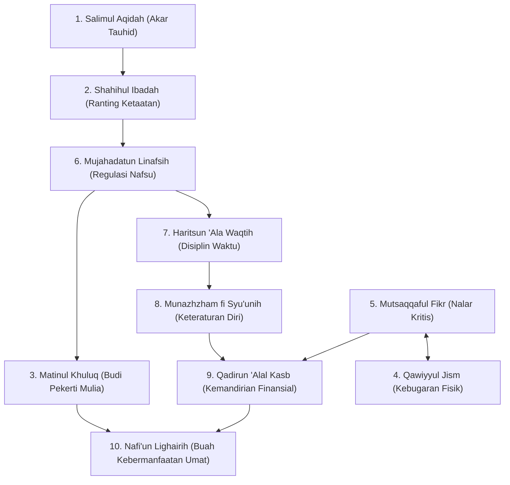

# P3-03-Matriks-Relasi-Antar-Karakter-TUMBUH (Character Relationships Induk)

## Tujuan
Menjelaskan arsitektur keterhubungan sistemik (*Systemic Interconnectedness*) di antara 10 Karakter Santri TUMBUH, membuktikan bahwa karakter bukanlah kumpulan sifat lepas yang terisolasi, melainkan satu kesatuan ekosistem kepribadian yang saling mempengaruhi (*Symbiotic Character Dynamics*).

---

## 1. Peta Jaringan Hubungan 10 Karakter Santri

---

## 2. 3 Hukum Utama Keterhubungan Karakter

1. **Hukum Akal dan Batin (*Root-to-Fruit Law*)**:
   - *Salimul Aqidah* adalah akar (batiniah), ibadah dan regulasi diri adalah batang penopang, dan *Nafi'un Lighairih* adalah buah manis kebermanfaatan sosial bagi umat.
2. **Hukum Resonansi Kebiasaan Kunci (*Keystone Habits Resonance - Charles Duhigg*)**:
   - Keberhasilan menegakkan **Sholat Berjamaah 5 Waktu Tepat Waktu** (*Shahihul Ibadah*) secara otomatis melatih *Mujahadatun Linafsih* (menahan rasa malas) dan *Haritsun 'Ala Waqtih* (manajemen waktu).
3. **Hukum Saling Melengkapi (*Mutual Reinforcement*)**:
   - Santri yang teratur lokernya (*Munazhzham*) terbukti memiliki fokus belajar yang lebih tajam (*Mutsaqqaful Fikr*) karena berkurangnya distraksi visual di kamarnya.

---

## 3. Status Dokumen
* **Status**: 🌟 **A+ (Dokumen Induk Character Relationships)**
* **Level**: Project 3 - `03 Capacity Framework / 03 Character Relationships`
* **Langkah Berikutnya**: **`P3-03-01-Keterhubungan-Fondasi-Ruhiyah-dan-Sosial.md`**.
