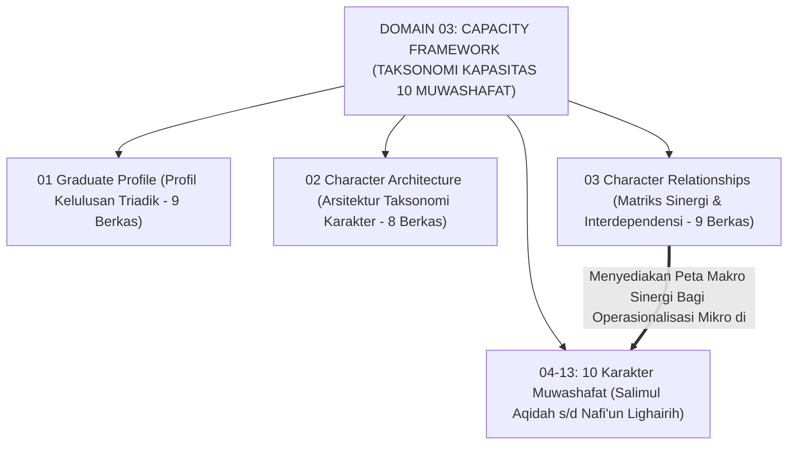
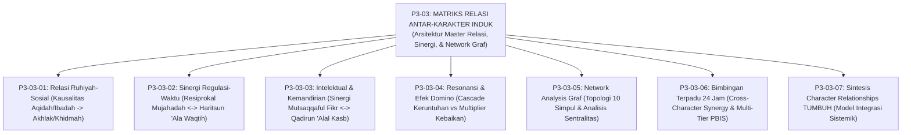
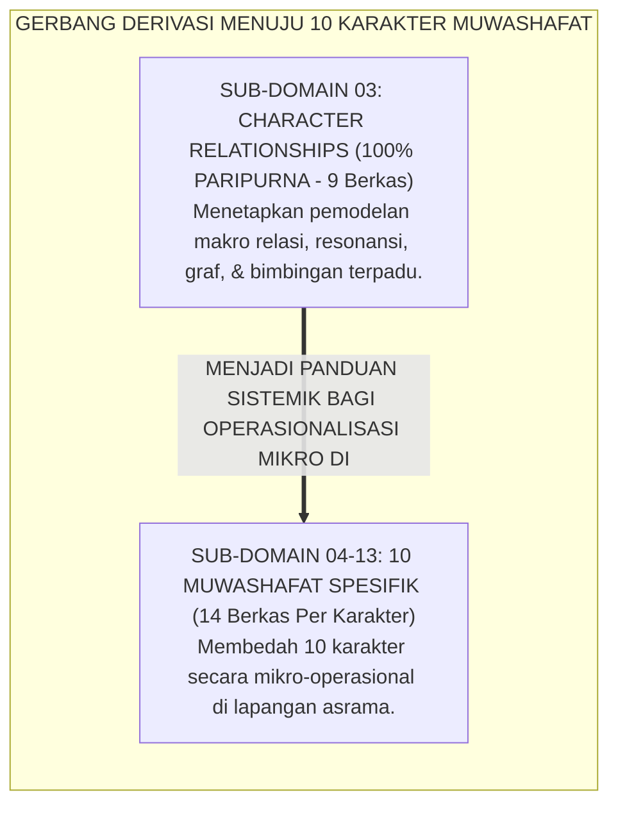

# P3-03: RELASI ANTAR-KARAKTER (CHARACTER RELATIONSHIPS) EKOSISTEM TUMBUH
## *Monograf Induk Sub-Domain 03: Arsitektur Master Relasi Sistemik 10 Karakter Muwashafat, Kausalitas Ruhiyah-Sosial, Sinergi Regulasi-Waktu, Dinamika Intelektual-Kemandirian, Peta Resonansi Efek Domino, Network Analysis Sentralitas Graf, & Bimbingan Terpadu 24 Jam*

**Nomor Identifikasi**: `P3-03/MONOGRAF-INDUK-CHARACTER-RELATIONSHIPS/2026`  
**Domain**: `03 Capacity Framework` > `03 Character Relationships`  
**Klasifikasi Naskah**: *Master Sub-Domain Monograph* (Monograf Induk Sub-Domain Relasi Antar-Karakter)  
**Rumpun Disiplin Pengkaji**: Pemodelan Sistem Dinamis, Psikometri Network Analysis, Manajemen Pengasuhan Asrama 24 Jam, Fiqh Mu'amalah & Ukhuwah  

---

> ### 💡 INTISARI EKSEKUTIF (EXECUTIVE SUMMARY)
>
> * **Posisi Sub-Domain 03 Character Relationships:**  
>   Menjawab pertanyaan mendasar interkoneksi: *"Bagaimana 10 Karakter Muwashafat saling berinteraksi, menciptakan efek resonansi penguatan (*Catalytic Multiplier*), mencegah efek domino keruntuhan (*Degradation Cascade*), dimodelkan secara matematis dalam jejaring graf sentralitas, dan diterapkan dalam bimbingan asrama terpadu 24 jam?"*
> * **Enam Pilar Riset Relasi Karakter yang Terintegrasi:**  
>   1. **P3-03-01 (Relasi Ruhiyah-Sosial):** Kausalitas Aqidah & Ibadah memancar menjadi Akhlak dan Khidmah melayani umat.  
>   2. **P3-03-02 (Sinergi Regulasi-Waktu):** Resiprokal Mujahadatun Linafsih dan Haritsun 'Ala Waqtih serta teknik Pomodoro Syar'i.  
>   3. **P3-03-03 (Intelektual & Kemandirian):** Sinergi Mutsaqqaful Fikr dan Qadirun 'Alal Kasb serta model Santripreneur.  
>   4. **P3-03-04 (Resonansi & Efek Domino):** Pemodelan jalur keruntuhan vs pelipatgandaan kebaikan serta teori *Broken Windows*.  
>   5. **P3-03-05 (Network Analysis Sentralitas Graf):** Topologi graf 10 simpul, analisis sentralitas Hubs dan Bridge Node.  
>   6. **P3-03-06 (Bimbingan Terpadu 24 Jam):** Cross-Character Synergy di arena masjid, kelas, kamar, dan protokol multi-tier PBIS.

---

## 📑 DAFTAR ISI MONOGRAF INDUK

- [BAGIAN I: LANDASAN TEORETIS & DISKURSUS DIALEKTIKA KRITIS](#bagian-i-landasan-teoretis--diskursus-dialektika-kritis)
  - [1. Posisi Dokumen dalam Taksonomi Domain 03 Capacity Framework](#1-posisi-dokumen-dalam-taksonomi-domain-03-capacity-framework)
  - [2. Pohon Hubungan Antar-Monograf Sub-Domain 03 Character Relationships](#2-pohon-hubungan-antar-monograf-sub-domain-03-character-relationships)
  - [3. Rangkuman 6 Pilar Riset Relasi Karakter](#3-rangkuman-6-pilar-riset-relasi-karakter)
  - [4. Penegasan Triad Pertumbuhan Simbiotik dalam Relasi Karakter](#4-penegasan-triad-pertumbuhan-simbiotik-dalam-relasi-karakter)
- [BAGIAN II: FORMULASI KONSEPTUAL & PEMBAHASAN MENDALAM](#bagian-ii-formulasi-konseptual--pembahasan-mendalam)
  - [1. Matriks Rujukan Lengkap 7 Berkas Monograf Sub-Domain 03](#1-matriks-rujukan-lengkap-7-berkas-monograf-sub-domain-03)
  - [2. Gerbang Derivasi Menuju Sub-Domain 04–13 Muwashafat Spesifik](#2-gerbang-derivasi-menuju-sub-domain-0413-muwashafat-spesifik)
- [BAGIAN III: KESIMPULAN & APARATUS AKADEMIS](#bagian-iii-kesimpulan--aparatus-akademis)
  - [1. Daftar Pustaka Otoritatif Turats & Sains Global](#1-daftar-pustaka-otoritatif-turats--sains-global)
  - [2. Catatan Kaki Akademis (Footnotes)](#2-catatan-kaki-akademis-footnotes)
  - [3. Glosarium Istilah Kunci Relasi Karakter Induk](#3-glosarium-istilah-kunci-relasi-karakter-induk)

---

# BAGIAN I: ARSITEKTUR ONTOLOGIS & POHON HUBUNGAN SUB-DOMAIN 03

---

### 1. Posisi Dokumen dalam Taksonomi Domain 03 Capacity Framework

---

### 2. Pohon Hubungan Antar-Monograf Sub-Domain 03 Character Relationships

---

### 3. Rangkuman 6 Pilar Riset Relasi Karakter

1. **Pilar 1: Relasi Ruhiyah-Sosial (P3-03-01)**: Membuktikan bahwa kesalehan spiritual (*Salimul Aqidah & Shahihul Ibadah*) memancar secara niscaya menjadi kematangan moral sosial (*Matinul Khuluq & Nafi'un Lighairih*).
2. **Pilar 2: Sinergi Regulasi-Waktu (P3-03-02)**: Menghubungkan pengendalian hawa nafsu (*Mujahadatun Linafsih*) dengan ketepatan jadwal (*Haritsun 'Ala Waqtih*) guna memitigasi *Ego Depletion* dan prokrastinasi.
3. **Pilar 3: Intelektual & Kemandirian (P3-03-03)**: Menyatukan nalar kritis mantiq (*Mutsaqqaful Fikr*) dengan kemandirian finansial (*Qadirun 'Alal Kasb*) demi menjaga kehormatan ilmu (*'Izzatul 'Ilmi*).
4. **Pilar 4: Resonansi & Efek Domino (P3-03-04)**: Memetakan perambatan non-linier antar-karakter berbasis teori *Broken Windows* dan *High-Leverage Points*.
5. **Pilar 5: Network Analysis Graf (P3-03-05)**: Memodelkan graf 10 karakter dengan metrik *Degree, Betweenness, dan Closeness Centrality* yang mengonfirmasi 3 pilar taksonomi.
6. **Pilar 6: Bimbingan Terpadu 24 Jam (P3-03-06)**: Merancang aktivitas harian yang mengaktivasi *Cross-Character Synergy* secara simultan di bawah payung Multi-Tier PBIS.

---

# BAGIAN II: FORMULASI KONSEPTUAL & PEMBAHASAN MENDALAM

---

### 1. Matriks Rujukan Lengkap 7 Berkas Monograf Sub-Domain 03

| Kode Berkas | Judul Naskah Monograf | Fokus Kajian & Inovasi Riset | Tautan Berkas Markdown |
| :---: | :--- | :--- | :--- |
| **P3-03-01** | **Relasi Ruhiyah-Sosial** | Kausalitas Aqidah & Ibadah $\rightarrow$ Akhlak & Khidmah. | [**`Buka Naskah P3-03-01`**](./P3-03-01-Keterhubungan-Fondasi-Ruhiyah-dan-Sosial.md) |
| **P3-03-02** | **Sinergi Regulasi-Waktu** | Resiprokal Mujahadah $\leftrightarrow$ Haritsun & Pomodoro Syar'i. | [**`Buka Naskah P3-03-02`**](./P3-03-02-Efek-Sinergis-Regulasi-Diri-dan-Manajemen-Waktu.md) |
| **P3-03-03** | **Intelektual & Kemandirian** | Sinergi Mutsaqqaful Fikr $\leftrightarrow$ Qadirun Kasb & Santripreneur. | [**`Buka Naskah P3-03-03`**](./P3-03-03-Dinamika-Kecerdasan-Intelektual-dan-Kemandirian.md) |
| **P3-03-04** | **Resonansi & Efek Domino** | Cascade keruntuhan vs multiplier kebaikan & Broken Windows. | [**`Buka Naskah P3-03-04`**](./P3-03-04-Peta-Resonansi-dan-Efek-Domino-Karakter.md) |
| **P3-03-05** | **Network Analysis Graf** | Topologi graf 10 simpul, Degree, Betweenness, & Closeness. | [**`Buka Naskah P3-03-05`**](./P3-03-05-Analisis-Jaringan-Karakter-dan-Model-Kluster.md) |
| **P3-03-06** | **Bimbingan Terpadu 24 Jam** | Cross-Character Synergy di arena masjid-kelas-kamar. | [**`Buka Naskah P3-03-06`**](./P3-03-06-Strategi-Bimbingan-Terpadu-Cross-Character.md) |
| **P3-03-07** | **Sintesis Relasi Karakter** | Model Integrasi Sistemik & Jembatan ke Sub-Domain 04–13. | [**`Buka Naskah P3-03-07`**](./P3-03-07-Sintesis-Character-Relationships-TUMBUH.md) |

---

### 2. Gerbang Derivasi Menuju Sub-Domain 04–13 Muwashafat Spesifik

---

# BAGIAN III: KESIMPULAN & APARATUS AKADEMIS

---

### 1. Daftar Pustaka Otoritatif Turats & Sains Global

1. **Al-Qur'an al-Karim wa Tarjamatu Ma'anih**.
2. **Al-Bukhari, Muhammad bin Isma'il**. (1422 H). *Shahih al-Bukhari*. Beirut: Dar Thawq an-Najah.
3. **Muslim bin al-Hajjaj an-Naisaburi**. (1374 H). *Shahih Muslim*. Kairo: Isa al-Babi al-Halabi.
4. **Al-Ghazali, Abu Hamid Muhammad bin Muhammad**. (2011). *Ihya 'Ulumiddin*. Beirut: Dar al-Ma'rifah.
5. **Ibnu Qayyim al-Jauziyyah**. (2008). *Al-Fawa'id*. Kairo: Maktabah Dar at-Turats.
6. **Borsboom, D., & Cramer, A. O.**. (2013). *Network analysis*. Annual Review of Clinical Psychology.
7. **Meadows, D. H.**. (2008). *Thinking in Systems: A Primer*. Chelsea Green Publishing.
8. **Baumeister, R. F., et al.**. (1998). *Ego depletion*. Journal of Personality and Social Psychology.
9. **Horner, R. H., & Sugai, G.**. (2015). *School-wide PBIS: The research base*. Remedial and Special Education.
10. **Bronfenbrenner, U.**. (1979). *The Ecology of Human Development*. Harvard University Press.

---

### 2. Catatan Kaki Akademis (*Footnotes*)

[^1]: Borsboom & Cramer (2013), *Network Analysis*, Annual Review of Clinical Psychology; Meadows (2008), *Thinking in Systems*; Horner & Sugai (2015), *SW-PBIS*.

---

### 3. Glosarium Istilah Kunci Relasi Karakter Induk

1. **Character Relationships**: Kajian komprehensif mengenai dinamika keterhubungan dan saling ketergantungan antar-karakter santri.
2. **Triad Pertumbuhan Simbiotik**: Prinsip integrasi di mana pemahaman relasi karakter menumbuhkan Santri, memandu Musyrif, dan menguatkan Lembaga.
3. **Master Hub**: Simpul karakter penggerak dengan konektivitas tertinggi (*Salimul Aqidah & Mujahadatun Linafsih*).
4. **Bridge Node**: Simpul karakter penghubung antara ranah nilai batin dengan aksi sosial (*Matinul Khuluq*).
5. **Cross-Character Synergy**: Aktivitas asrama yang secara simultan melatih dan menguatkan beberapa karakter sekaligus.
6. **Degradation Cascade**: Efek domino keruntuhan perilaku yang merambat akibat terabaikannya pelanggaran kecil pada simpul awal.
7. **Catalytic Multiplier**: Efek pelipatgandaan kebaikan di mana satu pembiasaan positif memicu terbukanya pintu kebaikan lainnya.
8. **Shortest Path Intervention**: Strategi bimbingan konseling yang memilih rute kausal paling efisien untuk memecahkan krisis perilaku santri.
9. **High-Leverage Point**: Titik intervensi strategis di mana tindakan kecil mampu menghasilkan transformasi masif pada keseluruhan ekosistem.
10. **Restorative Circuit Breaker**: Mekanisme de-eskalasi dan muhasabah cepat untuk memutus perambatan efek domino negatif sebelum meluas.
