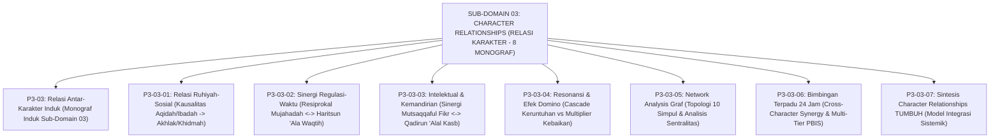

# SUB-DOMAIN 03: CHARACTER RELATIONSHIPS (MATRIKS RELASI ANTAR-KARAKTER)
## *Sitemap Induk & Navigasi Monograf Relasi Ruhiyah-Sosial, Sinergi Regulasi-Waktu, Intelektual-Kemandirian, Peta Resonansi Efek Domino, Network Analysis Sentralitas Graf, & Bimbingan Terpadu 24 Jam (8 Monograf Terpadu)*

**Nomor Identifikasi**: `P3-03/INDEX/2026`  
**Domain**: `03 Capacity Framework` > `03 Character Relationships`  
**Klasifikasi**: Folder Monograf Relasi, Sinergi Antar-Karakter, Resonansi Efek Domino, & Analisis Jaringan Graf (9 Berkas Lengkap)

---

## 🏛️ SITEMAP & NAVIGASI SELURUH BERKAS SUB-DOMAIN 03

Sub-Domain `03 Character Relationships` membedah keterkaitan kausalitas batin-sosial (*Ruhiyah-Khidmah*), sinergi resiprokal regulasi diri dan manajemen waktu, dinamika nalar intelektual dan kemandirian finansial (*Santripreneur*), pemodelan efek domino keruntuhan vs pelipatgandaan kebaikan, topologi graf 10 simpul berbasis *Network Science*, serta strategi bimbingan terpadu *Cross-Character Synergy* 24 jam:

---

## 📑 DAFTAR LENGKAP 9 BERKAS MONOGRAF TERPADU SUB-DOMAIN 03

| No | Berkas Monograf | Judul Berkas | Fokus Kajian & Rujukan Utama |
| :---: | :--- | :--- | :--- |
| **00** | [**`P3-03-Matriks-Relasi-Antar-Karakter-TUMBUH.md`**](./P3-03-Matriks-Relasi-Antar-Karakter-TUMBUH.md) | Monograf Induk Relasi Antar-Karakter | Master 6 Pilar Relasi Sistemik Karakter, Grand Model Interdependensi, & gerbang derivasi menuju **Sub-Domain 04–13 Muwashafat Spesifik**. |
| **01** | [**`P3-03-01-Keterhubungan-Fondasi-Ruhiyah-dan-Sosial.md`**](./P3-03-01-Keterhubungan-Fondasi-Ruhiyah-dan-Sosial.md) | Keterhubungan Fondasi Ruhiyah & Sosial | QS. Al-'Ankabut: 45; QS. Al-Ma'un: 1-7; Augusto Blasi (*Moral Identity Theory*); Albert Bandura (*Moral Disengagement*); terapi hipokrisi shalat (10 Catatan Kaki). |
| **02** | [**`P3-03-02-Efek-Sinergis-Regulasi-Diri-dan-Manajemen-Waktu.md`**](./P3-03-02-Efek-Sinergis-Regulasi-Diri-dan-Manajemen-Waktu.md) | Efek Sinergis Regulasi Diri & Manajemen Waktu | QS. Al-'Ashr: 1-3; Roy Baumeister (*Ego Depletion*); Peter Gollwitzer (*Implementation Intentions*); teknik Pomodoro Syar'i (10 Catatan Kaki). |
| **03** | [**`P3-03-03-Dinamika-Kecerdasan-Intelektual-dan-Kemandirian.md`**](./P3-03-03-Dinamika-Kecerdasan-Intelektual-dan-Kemandirian.md) | Dinamika Intelektual & Kemandirian Vokasional | QS. Al-Jumu'ah: 10; HR. Al-Bukhari No. 2072; Gary Becker (*Human Capital Theory*); menjaga *'Izzatul 'Ilmi*; model Santripreneur (10 Catatan Kaki). |
| **04** | [**`P3-03-04-Peta-Resonansi-dan-Efek-Domino-Karakter.md`**](./P3-03-04-Peta-Resonansi-dan-Efek-Domino-Karakter.md) | Peta Resonansi Sistemik & Efek Domino Karakter | HR. Al-Bukhari No. 52 (*Mudghah*); Donella Meadows (*System Dynamics & Leverage Points*); Wilson-Kelling (*Broken Windows Theory*) (10 Catatan Kaki). |
| **05** | [**`P3-03-05-Analisis-Jaringan-Karakter-dan-Model-Kluster.md`**](./P3-03-05-Analisis-Jaringan-Karakter-dan-Model-Kluster.md) | Analisis Jaringan Karakter (Network Analysis) | HR. Al-Bukhari No. 481 (*Bunyaan*); Denny Borsboom (*Network Psychometrics*); metrik Degree, Betweenness, & Closeness Centrality (10 Catatan Kaki). |
| **06** | [**`P3-03-06-Strategi-Bimbingan-Terpadu-Cross-Character.md`**](./P3-03-06-Strategi-Bimbingan-Terpadu-Cross-Character.md) | Bimbingan Terpadu Cross-Character 24 Jam | Sirah Ash-Shuffah Nabawiyyah; sistem Multi-Tier PBIS Tier 1-3; Urie Bronfenbrenner; protokol keadilan restoratif terpadu (10 Catatan Kaki). |
| **07** | [**`P3-03-07-Sintesis-Character-Relationships-TUMBUH.md`**](./P3-03-07-Sintesis-Character-Relationships-TUMBUH.md) | Sintesis Character Relationships TUMBUH | Model Integrasi Sistemik 10 Karakter Muwashafat, matriks konektivitas master 10x10, & jembatan ke **Sub-Domain 04–13 Muwashafat Spesifik** (10 Catatan Kaki). |
