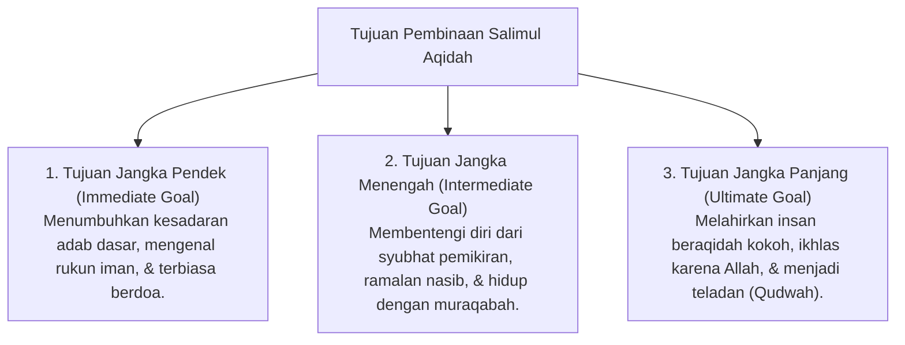

# P3-04-03-Tujuan-dan-Target-Capaian (Salimul Aqidah)

## Tujuan
Menetapkan tujuan jangka pendek, menengah, dan panjang pembinaan karakter **Salimul Aqidah** pada santri di lingkungan pesantren TUMBUH.

---

## 1. 3 Tingkatan Tujuan Pembinaan Aqidah

---

## 2. Target Capaian Kuantitatif & Kualitatif

1. **Target Kuantitatif**:
   - 100% santri hafal dalil-dalil pokok Rukun Iman dan doa dzikir *Al-Ma'tsurat*.
   - 0% insiden penggunaan jimat atau kepercayaan takhayul di asrama.
2. **Target Kualitatif**:
   - Terbentuknya *Malakah* kejujuran (*Shidq*) atas dorongan *Muraqabatullah* di ruang privat maupun publik.

---

## 3. Status Dokumen
* **Status**: 🌟 **A+ (Tervalidasi & Siap Diimplementasikan)**
* **Level**: Project 3 - `03 Capacity Framework / 04 Salimul Aqidah / 03 Purpose`
