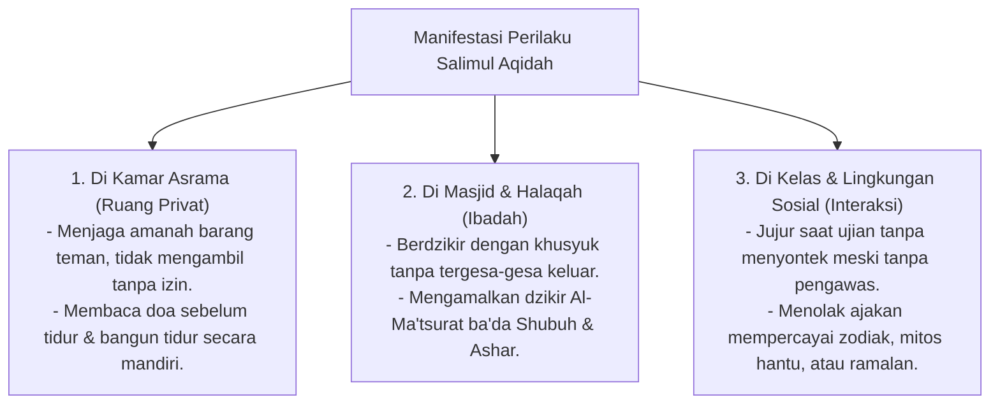

# P3-04-06-Manifestasi-Perilaku-Santri (Salimul Aqidah)

## Tujuan
Mengidentifikasi bentuk manifestasi perilaku nyata (*Behavioral Manifestations*) santri yang mencerminkan keberhasilan internalisasi karakter **Salimul Aqidah** di kehidupan pesantren.

---

## 1. Perilaku Nyata yang Tampak (*Observable Behaviors*)

---

## 2. Status Dokumen
* **Status**: 🌟 **A+ (Tervalidasi & Siap Diimplementasikan)**
* **Level**: Project 3 - `03 Capacity Framework / 04 Salimul Aqidah / 06 Behaviors`
