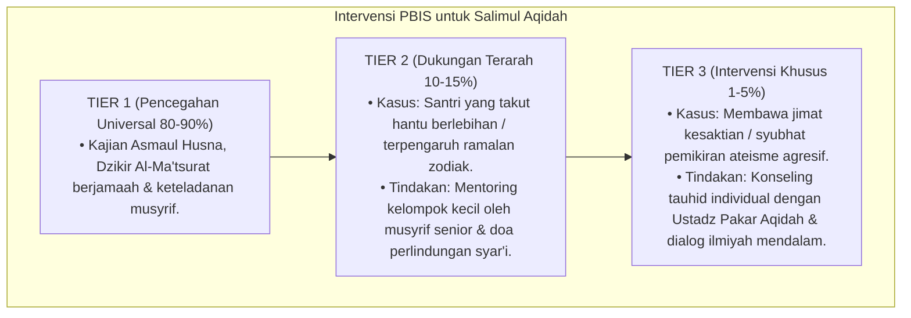

# P3-04-10-Protokol-Intervensi-dan-Pembiasaan (Salimul Aqidah)

## Tujuan
Menetapkan protokol pembiasaan harian asrama (*Habituation SOP*) dan pemetaan intervensi bertingkat (*PBIS Multi-Tier Intervention*) untuk menanamkan karakter **Salimul Aqidah** secara kokoh pada seluruh santri.

---

## 1. Protokol Pembiasaan Rutin Asrama (Tier 1: Universal 100%)

1. **Halaqah Dzikir Pagi & Petang (*Al-Ma'tsurat Kubra*)**:
   - Dilaksanakan berjamaah setelah wirid sholat Subuh dan Ashar di masjid dengan bimbingan musyrif.
2. **Sesi Tadabbur Asmaul Husna Malam Hari**:
   - Kajian singkat 5 menit sebelum tidur di kamar asrama membahas 1 nama Allah (misal: *Al-Raqib, Al-Bashir, Al-Wakil*).
3. **Kuis Cerdas Cermat Aqidah Bulanan**:
   - Ajang interaktif antarkamar untuk membedah dalil-dalil aqidah dan tauhid secara menyenangkan.

---

## 2. Pemetaan Intervensi Khusus PBIS

---

## 3. Status Dokumen
* **Status**: 🌟 **A+ (Tervalidasi & Siap Diimplementasikan)**
* **Level**: Project 3 - `03 Capacity Framework / 04 Salimul Aqidah / 10 Intervention Mapping`
* **Langkah Berikutnya**: **`14 Evidence/P3-04-14-Sintesis-dan-Validasi-Salimul-Aqidah.md`**.
