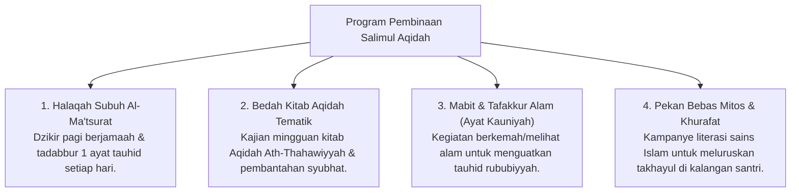

# P3-04-11-Program-Pembinaan-dan-Halaqah (Salimul Aqidah)

## Tujuan
Menetapkan daftar program pembinaan terstruktur, halaqah tematik, dan proyek penguatan karakter **Salimul Aqidah** di pesantren TUMBUH.

---

## 1. 4 Program Unggulan Pembinaan Aqidah

---

## 2. Status Dokumen
* **Status**: 🌟 **A+ (Tervalidasi & Siap Diimplementasikan)**
* **Level**: Project 3 - `03 Capacity Framework / 04 Salimul Aqidah / 11 Programs`
