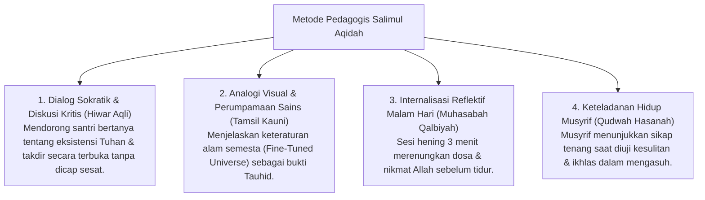

# P3-04-12-Metode-Pedagogi-dan-Didaktik-Aqidah (Salimul Aqidah)

## Tujuan
Menetapkan metode pengajaran pedagogis dan pendekatan didaktik interaktif dalam menanamkan karakter **Salimul Aqidah** kepada santri generasi digital.

---

## 1. 4 Metode Pedagogi Pengajaran Aqidah

---

## 2. Status Dokumen
* **Status**: 🌟 **A+ (Tervalidasi & Siap Diimplementasikan)**
* **Level**: Project 3 - `03 Capacity Framework / 04 Salimul Aqidah / 12 Methods`
