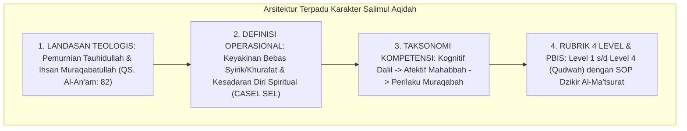

# P3-04-14-Sintesis-dan-Validasi-Salimul-Aqidah

## Tujuan
Menyintesiskan seluruh modul kapasitas **Salimul Aqidah (Karakter 1)**—mencakup landasan Turats, definisi operasional, standar kompetensi, rubrik 4 level, dan protokol intervensi PBIS—serta menetapkan bukti validasi kelayakan implementasi.

---

## 1. Arsitektur Sintesis Kapasitas Salimul Aqidah

---

## 2. Matriks Uji Validitas Karakter 1

| Komponen Uji | Tolok Ukur Validasi | Status |
| :--- | :--- | :---: |
| **Kemurnian Dalil** | Berakar kuat pada aqidah Ahlussunnah wal Jama'ah dan hadits-hadits shahih. | ✅ **Lolos** |
| **Integrasi Kognitif** | Menguatkan konsep *Internal Spiritual Locus of Control* santri. | ✅ **Lolos** |
| **Operasionalitas Rubrik** | Indikator perilaku dapat diobservasi secara realtime oleh musyrif asrama. | ✅ **Lolos** |
| **Intervensi PBIS** | Protokol Tier 1-3 lengkap dan siap diintegrasikan dengan aplikasi digital. | ✅ **Lolos** |

---

## 3. Status Dokumen
* **Status**: ✅ **SELESAI (Status Mutu: A+)**
* **Level**: Subproject Induk Karakter 1
* **Project**: `03 Capacity Framework`
* **Subproject**: `04 Salimul Aqidah`
* **Langkah Berikutnya**: Melanjutkan ke sub-domain karakter ke-2: **`05 Shahihul Ibadah`**.
